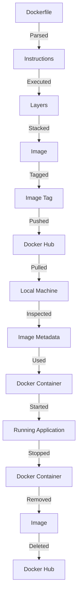

## Introduction
Docker images are a crucial component of the Docker ecosystem, allowing developers to package their applications and dependencies into a single, portable container. **Docker images** are essentially templates that contain the code, libraries, and settings required to run an application. They are the building blocks of Docker containers, which are instantiated from these images. In this study guide, we will delve into the world of Docker images, exploring how to pull, push, tag, and inspect them. We will also examine the internal mechanics of Docker images, providing a deep understanding of how they work and how to use them effectively in real-world scenarios.

## Core Concepts
To understand Docker images, it's essential to grasp the following core concepts:
- **Docker Hub**: a registry of Docker images, allowing users to push and pull images.
- **Image layers**: Docker images are composed of layers, which are stacked on top of each other to form the final image.
- **Image tags**: tags are used to identify specific versions of an image.
- **Image inspection**: the process of examining an image's contents and metadata.

> **Note:** Docker images are not the same as Docker containers. Images are templates, while containers are instantiated from these templates.

## How It Works Internally
When you create a Docker image, Docker performs the following steps:
1. **Layer creation**: Docker creates a new layer for each instruction in the Dockerfile.
2. **Layer stacking**: The layers are stacked on top of each other to form the final image.
3. **Image caching**: Docker caches the layers to improve performance and reduce storage space.
4. **Image tagging**: The image is tagged with a unique identifier.

```bash
# Create a new Docker image
docker build -t my-image .

# List all Docker images
docker images

# Inspect a Docker image
docker inspect my-image
```

## Code Examples
### Example 1: Basic Docker Image
Create a simple Docker image using a Dockerfile:
```dockerfile
# Use an official Python image as the base
FROM python:3.9-slim

# Set the working directory to /app
WORKDIR /app

# Copy the requirements file
COPY requirements.txt .

# Install the dependencies
RUN pip install -r requirements.txt

# Copy the application code
COPY . .

# Run the command to start the development server
CMD ["python", "app.py"]
```

### Example 2: Real-world Docker Image
Create a Docker image for a Flask web application:
```python
# app.py
from flask import Flask
app = Flask(__name__)

@app.route("/")
def hello():
    return "Hello, World!"

if __name__ == "__main__":
    app.run(host="0.0.0.0", port=5000)
```

```dockerfile
# Dockerfile
FROM python:3.9-slim

# Set the working directory to /app
WORKDIR /app

# Copy the requirements file
COPY requirements.txt .

# Install the dependencies
RUN pip install -r requirements.txt

# Copy the application code
COPY . .

# Expose the port
EXPOSE 5000

# Run the command to start the development server
CMD ["python", "app.py"]
```

### Example 3: Advanced Docker Image
Create a Docker image for a Node.js application with a custom base image:
```javascript
// app.js
const express = require('express');
const app = express();

app.get("/", (req, res) => {
    res.send("Hello, World!");
});

app.listen(3000, () => {
    console.log("Server started on port 3000");
});
```

```dockerfile
# Dockerfile
FROM node:14-alpine

# Set the working directory to /app
WORKDIR /app

# Copy the package.json file
COPY package*.json ./

# Install the dependencies
RUN npm install

# Copy the application code
COPY . .

# Expose the port
EXPOSE 3000

# Run the command to start the development server
CMD ["npm", "start"]
```

## Visual Diagram

The diagram illustrates the Docker image lifecycle, from creation to deletion.

## Comparison
| Approach | Time Complexity | Space Complexity | Pros | Cons | Best For |
|----------|----------------|-----------------|------|------|----------|
| Docker Images | O(1) | O(n) | Portable, efficient, scalable | Resource-intensive, complex | Production environments |
| Virtual Machines | O(n) | O(n) | Isolated, secure, flexible | Resource-intensive, slow | Development environments |
| Containerization | O(1) | O(n) | Lightweight, fast, efficient | Limited isolation, complex | Web applications |
| Serverless Computing | O(1) | O(1) | Scalable, cost-effective, simple | Limited control, vendor lock-in | Real-time data processing |

## Real-world Use Cases
1. **Netflix**: uses Docker images to deploy and manage their microservices-based architecture.
2. **Uber**: uses Docker images to build and deploy their mobile applications.
3. **Amazon**: uses Docker images to provide a scalable and efficient platform for their customers.

> **Tip:** Use Docker images to simplify your development and deployment workflow.

## Common Pitfalls
1. **Incorrect Dockerfile instructions**: can lead to slow or inefficient image builds.
2. **Insufficient image caching**: can result in slower image builds and increased storage space.
3. **Inadequate image tagging**: can lead to versioning issues and difficulties in tracking changes.
4. **Insecure image storage**: can expose sensitive data and compromise security.

```bash
# WRONG: Insecure image storage
docker build -t my-image .

# RIGHT: Secure image storage
docker build -t my-image --no-cache .
```

## Interview Tips
1. **What is the difference between a Docker image and a Docker container?**
	* Weak answer: "A Docker image is a template, and a Docker container is an instance of that template."
	* Strong answer: "A Docker image is a read-only template that contains the code, libraries, and settings required to run an application, while a Docker container is a writable instance of that template that can be started, stopped, and deleted."
2. **How do you optimize Docker image builds?**
	* Weak answer: "I use the `--no-cache` flag to prevent caching."
	* Strong answer: "I use a combination of techniques, including using a small base image, minimizing the number of layers, and leveraging image caching to reduce build time and improve efficiency."
3. **What is the purpose of Docker image tagging?**
	* Weak answer: "It's used to identify different versions of an image."
	* Strong answer: "Docker image tagging is used to track changes and versions of an image, making it easier to manage and deploy applications. It's also used to create a rollback mechanism in case of errors or issues."

## Key Takeaways
* Docker images are templates that contain the code, libraries, and settings required to run an application.
* Docker images are composed of layers, which are stacked on top of each other to form the final image.
* Image tagging is used to track changes and versions of an image.
* Image caching is used to improve performance and reduce storage space.
* Docker images can be optimized using techniques such as minimizing the number of layers and leveraging image caching.
* Docker images are used in production environments to deploy and manage microservices-based architectures.
* Docker images can be used to simplify development and deployment workflows.
* Docker images can be secured using techniques such as encryption and access control.