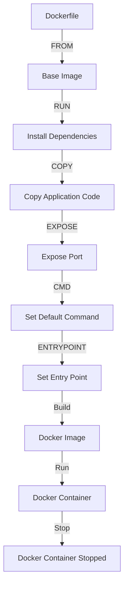

## Introduction
A **Dockerfile** is a text file that contains instructions for building a Docker image. It is a crucial component of the Docker ecosystem, as it allows developers to define the environment, dependencies, and configuration required to run an application. The Dockerfile is used to create a Docker image, which can then be used to create containers. In this section, we will explore the importance of Dockerfiles, their real-world relevance, and why every engineer needs to know about them.

Dockerfiles are essential in the DevOps world, as they provide a way to define and reproduce the environment required to run an application. This ensures that the application runs consistently across different environments, such as development, testing, and production. By using Dockerfiles, developers can ensure that their application is packaged with all the necessary dependencies, configurations, and settings, making it easier to deploy and manage.

> **Note:** Dockerfiles are not just limited to application development. They can also be used to create images for databases, web servers, and other services.

## Core Concepts
In this section, we will explore the core concepts of Dockerfiles, including the instructions used to build an image.

* **FROM**: This instruction is used to specify the base image for the new image. The base image can be a Docker official image or a custom image created by another Dockerfile.
* **RUN**: This instruction is used to execute a command during the build process. It can be used to install dependencies, configure the environment, or perform other setup tasks.
* **COPY**: This instruction is used to copy files from the build context into the image.
* **ADD**: This instruction is similar to **COPY**, but it can also be used to download files from a URL.
* **ENV**: This instruction is used to set environment variables in the image.
* **EXPOSE**: This instruction is used to expose a port from the container to the host machine.
* **CMD**: This instruction is used to set the default command to run when the container is started.
* **ENTRYPOINT**: This instruction is used to set the entry point of the container.

> **Tip:** It's a good practice to use **ENV** to set environment variables instead of hardcoding them in the Dockerfile.

## How It Works Internally
When a Dockerfile is built, Docker creates a temporary container from the base image specified in the **FROM** instruction. Then, it executes each instruction in the Dockerfile, creating a new layer for each instruction. The resulting layers are stacked on top of each other to form the new image.

Here's a step-by-step breakdown of how it works:

1. Docker creates a temporary container from the base image.
2. Docker executes the **RUN** instructions, installing dependencies and configuring the environment.
3. Docker executes the **COPY** and **ADD** instructions, copying files into the image.
4. Docker executes the **ENV** instruction, setting environment variables.
5. Docker executes the **EXPOSE** instruction, exposing ports from the container.
6. Docker executes the **CMD** and **ENTRYPOINT** instructions, setting the default command and entry point.
7. Docker creates a new layer for each instruction, stacking them on top of each other to form the new image.

> **Warning:** Be careful when using **RUN** instructions, as they can create large layers that increase the size of the image.

## Code Examples
Here are three examples of Dockerfiles, ranging from basic to advanced:

### Example 1: Basic Dockerfile
```dockerfile
# Use the official Python image as the base
FROM python:3.9-slim

# Set the working directory to /app
WORKDIR /app

# Copy the requirements file into the image
COPY requirements.txt .

# Install the dependencies
RUN pip install -r requirements.txt

# Copy the application code into the image
COPY . .

# Expose port 8000 from the container
EXPOSE 8000

# Set the default command to run when the container is started
CMD ["python", "app.py"]
```
This Dockerfile creates an image for a Python application, installing dependencies and copying the application code into the image.

### Example 2: Real-world Dockerfile
```dockerfile
# Use the official Node.js image as the base
FROM node:14

# Set the working directory to /app
WORKDIR /app

# Copy the package.json file into the image
COPY package*.json ./

# Install the dependencies
RUN npm install

# Copy the application code into the image
COPY . .

# Expose port 3000 from the container
EXPOSE 3000

# Set the default command to run when the container is started
CMD ["npm", "start"]
```
This Dockerfile creates an image for a Node.js application, installing dependencies and copying the application code into the image.

### Example 3: Advanced Dockerfile
```dockerfile
# Use the official Java image as the base
FROM openjdk:8-jdk-alpine

# Set the working directory to /app
WORKDIR /app

# Copy the pom.xml file into the image
COPY pom.xml .

# Install the dependencies
RUN mvn dependency:go-offline

# Copy the application code into the image
COPY . .

# Expose port 8080 from the container
EXPOSE 8080

# Set the default command to run when the container is started
CMD ["mvn", "spring-boot:run"]
```
This Dockerfile creates an image for a Java application, installing dependencies and copying the application code into the image.

## Visual Diagram

This diagram illustrates the process of building a Docker image from a Dockerfile and running a container from the image.

> **Tip:** Use the `docker build` command with the `-t` flag to specify the name of the image.

## Comparison
| Instruction | Description | Time Complexity | Space Complexity |
| --- | --- | --- | --- |
| FROM | Specify the base image | O(1) | O(1) |
| RUN | Execute a command during build | O(n) | O(n) |
| COPY | Copy files into the image | O(n) | O(n) |
| ADD | Copy files into the image or download from URL | O(n) | O(n) |
| ENV | Set environment variables | O(1) | O(1) |
| EXPOSE | Expose a port from the container | O(1) | O(1) |
| CMD | Set the default command to run | O(1) | O(1) |
| ENTRYPOINT | Set the entry point of the container | O(1) | O(1) |

> **Note:** The time and space complexity of each instruction can vary depending on the specific use case.

## Real-world Use Cases
Here are three real-world examples of using Dockerfiles:

* **Netflix**: Netflix uses Dockerfiles to create images for their microservices, ensuring consistency and reproducibility across different environments.
* **Uber**: Uber uses Dockerfiles to create images for their web applications, allowing them to quickly deploy and scale their services.
* **Airbnb**: Airbnb uses Dockerfiles to create images for their data science applications, providing a consistent and reproducible environment for data analysis and machine learning.

> **Interview:** Can you explain the difference between **CMD** and **ENTRYPOINT** in a Dockerfile?

## Common Pitfalls
Here are four common mistakes to avoid when using Dockerfiles:

* **Inconsistent base image**: Using an inconsistent base image can lead to unexpected behavior and issues during deployment.
* **Unused dependencies**: Leaving unused dependencies in the Dockerfile can increase the size of the image and lead to security vulnerabilities.
* **Incorrect port exposure**: Exposing the wrong port or not exposing a port at all can prevent the application from working as expected.
* **Insufficient environment variables**: Not setting environment variables or setting them incorrectly can lead to issues during deployment and runtime.

> **Warning:** Be careful when using **ADD** instructions, as they can download files from a URL and potentially introduce security vulnerabilities.

## Interview Tips
Here are three common interview questions related to Dockerfiles:

* **What is the difference between **CMD** and **ENTRYPOINT** in a Dockerfile?**
	+ Weak answer: "They are both used to set the default command to run when the container is started."
	+ Strong answer: "**CMD** sets the default command to run when the container is started, while **ENTRYPOINT** sets the entry point of the container. **CMD** can be overridden by the user, while **ENTRYPOINT** cannot."
* **How do you optimize the size of a Docker image?**
	+ Weak answer: "You can use the `docker prune` command to remove unused images and containers."
	+ Strong answer: "You can optimize the size of a Docker image by using a smaller base image, removing unused dependencies, and minimizing the number of layers in the image."
* **What is the purpose of the **FROM** instruction in a Dockerfile?**
	+ Weak answer: "It is used to specify the base image for the new image."
	+ Strong answer: "The **FROM** instruction is used to specify the base image for the new image, allowing you to build upon an existing image and inherit its dependencies and configurations."

## Key Takeaways
Here are ten key takeaways to remember when working with Dockerfiles:

* **Use a consistent base image** to ensure reproducibility and consistency across different environments.
* **Minimize the number of layers** in the image to reduce its size and improve performance.
* **Use **ENV** to set environment variables** instead of hardcoding them in the Dockerfile.
* **Exposure ports correctly** to ensure that the application can be accessed from outside the container.
* **Use **CMD** and **ENTRYPOINT** correctly** to set the default command and entry point of the container.
* **Optimize the size of the image** by using a smaller base image and removing unused dependencies.
* **Use **ADD** instructions carefully** to avoid introducing security vulnerabilities.
* **Test and validate the Dockerfile** to ensure that it works as expected.
* **Use Dockerfiles to create images for databases and web servers** to ensure consistency and reproducibility.
* **Continuously monitor and improve the Dockerfile** to ensure that it remains up-to-date and optimized for performance.