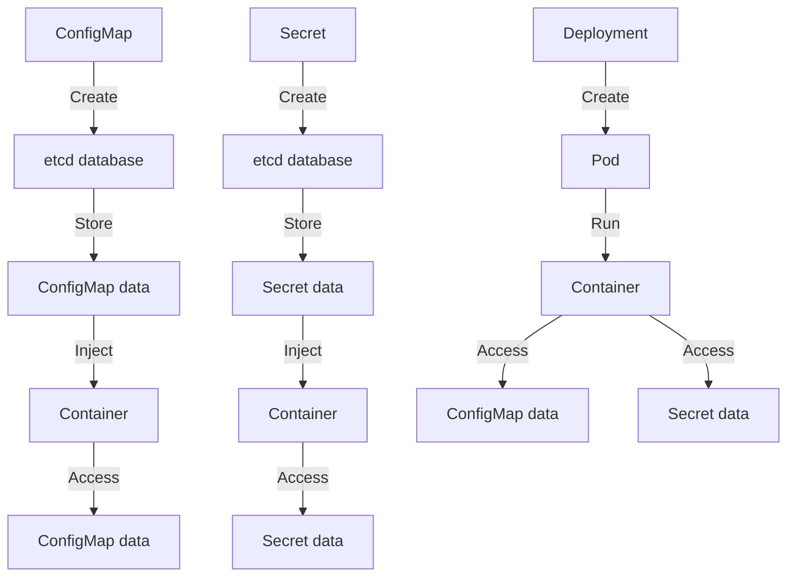

## Introduction
**ConfigMaps** and **Secrets** are two essential resources in Kubernetes that help you manage and deploy applications efficiently. They provide a way to decouple configuration and sensitive data from the application code, making it easier to manage and maintain. In this section, we will explore what ConfigMaps and Secrets are, why they matter, and their real-world relevance.

ConfigMaps and Secrets are used to store and manage configuration data and sensitive information, respectively. They are essential components of a Kubernetes deployment and are used by many companies, including **Netflix**, **Airbnb**, and **Uber**. By using ConfigMaps and Secrets, you can ensure that your application is scalable, maintainable, and secure.

> **Note:** ConfigMaps and Secrets are not replacements for environment variables or configuration files. Instead, they provide a more robust and scalable way to manage configuration and sensitive data.

## Core Concepts
To understand ConfigMaps and Secrets, you need to know the following core concepts:

* **ConfigMap**: A ConfigMap is a Kubernetes resource that stores configuration data as key-value pairs. It can be used to store configuration files, environment variables, and other data that needs to be injected into a container.
* **Secret**: A Secret is a Kubernetes resource that stores sensitive data, such as database credentials, API keys, and certificates. It provides a secure way to manage sensitive data and inject it into a container.
* **Key-value pair**: A key-value pair is a way to store data in a ConfigMap or Secret. The key is a unique identifier, and the value is the data associated with the key.

> **Tip:** When using ConfigMaps and Secrets, it's essential to follow best practices, such as using secure protocols for storing and transmitting sensitive data.

## How It Works Internally
To understand how ConfigMaps and Secrets work internally, let's take a look at the following steps:

1. **Creation**: A ConfigMap or Secret is created using the `kubectl create` command.
2. **Storage**: The ConfigMap or Secret is stored in the Kubernetes etcd database.
3. **Injection**: The ConfigMap or Secret is injected into a container using a volume or environment variable.
4. **Access**: The container can access the ConfigMap or Secret data using the injected volume or environment variable.

> **Warning:** When using ConfigMaps and Secrets, it's essential to ensure that the data is properly secured and transmitted. Failure to do so can result in sensitive data being exposed.

## Code Examples
Here are three complete and runnable code examples that demonstrate how to use ConfigMaps and Secrets:

### Example 1: Basic ConfigMap
```yml
# configmap.yaml
apiVersion: v1
kind: ConfigMap
metadata:
  name: my-config
data:
  foo: bar
  baz: qux
```

```bash
# Create the ConfigMap
kubectl create -f configmap.yaml

# Create a pod that uses the ConfigMap
kubectl run -i --rm --image=busybox --restart=Never -- env=foo --env=baz
```

### Example 2: Secret
```yml
# secret.yaml
apiVersion: v1
kind: Secret
metadata:
  name: my-secret
type: Opaque
data:
  username: YWRtaW4=
  password: MWYyZDFlMmU2N2Rm
```

```bash
# Create the Secret
kubectl create -f secret.yaml

# Create a pod that uses the Secret
kubectl run -i --rm --image=busybox --restart=Never --env=USERNAME --env=PASSWORD
```

### Example 3: Advanced ConfigMap and Secret
```yml
# configmap.yaml
apiVersion: v1
kind: ConfigMap
metadata:
  name: my-config
data:
  foo: bar
  baz: qux

# secret.yaml
apiVersion: v1
kind: Secret
metadata:
  name: my-secret
type: Opaque
data:
  username: YWRtaW4=
  password: MWYyZDFlMmU2N2Rm

# deployment.yaml
apiVersion: apps/v1
kind: Deployment
metadata:
  name: my-deployment
spec:
  selector:
    matchLabels:
      app: my-app
  template:
    metadata:
      labels:
        app: my-app
    spec:
      containers:
      - name: my-container
        image: busybox
        env:
        - name: foo
          valueFrom:
            configMapKeyRef:
              name: my-config
              key: foo
        - name: baz
          valueFrom:
            configMapKeyRef:
              name: my-config
              key: baz
        - name: username
          valueFrom:
            secretKeyRef:
              name: my-secret
              key: username
        - name: password
          valueFrom:
            secretKeyRef:
              name: my-secret
              key: password
```

```bash
# Create the ConfigMap, Secret, and Deployment
kubectl create -f configmap.yaml
kubectl create -f secret.yaml
kubectl create -f deployment.yaml
```

## Visual Diagram


The diagram illustrates the creation, storage, injection, and access of ConfigMaps and Secrets in a Kubernetes deployment.

## Comparison
| Approach | Time Complexity | Space Complexity | Pros | Cons | Best For |
|----------|----------------|-----------------|------|------|----------|
| ConfigMap | O(1) | O(n) | Easy to use, flexible | Limited security | Small to medium-sized applications |
| Secret | O(1) | O(n) | Secure, scalable | Steeper learning curve | Large-scale applications, sensitive data |
| Environment Variables | O(1) | O(1) | Simple, easy to use | Limited flexibility, security concerns | Small applications, development environments |
| Configuration Files | O(n) | O(n) | Flexible, scalable | Complex, error-prone | Large-scale applications, complex configurations |

## Real-world Use Cases
Here are three real-world use cases for ConfigMaps and Secrets:

* **Netflix**: Netflix uses ConfigMaps and Secrets to manage configuration data and sensitive information for their microservices-based architecture.
* **Airbnb**: Airbnb uses ConfigMaps to manage configuration data for their application, and Secrets to manage sensitive information such as database credentials.
* **Uber**: Uber uses Secrets to manage sensitive information such as API keys and certificates, and ConfigMaps to manage configuration data for their microservices-based architecture.

## Common Pitfalls
Here are four common pitfalls to watch out for when using ConfigMaps and Secrets:

* **Insecure data transmission**: Failing to use secure protocols for transmitting sensitive data can result in data exposure.
* **Incorrect key-value pairs**: Using incorrect key-value pairs can result in application errors or data corruption.
* **Insufficient access control**: Failing to implement proper access control can result in unauthorized access to sensitive data.
* **Outdated or missing data**: Failing to update or manage ConfigMaps and Secrets can result in outdated or missing data, leading to application errors or data corruption.

> **Interview:** Can you describe a scenario where you would use a ConfigMap versus a Secret? How would you implement access control for sensitive data in a Kubernetes deployment?

## Interview Tips
Here are three common interview questions related to ConfigMaps and Secrets, along with weak and strong answers:

* **Question 1:** What is the difference between a ConfigMap and a Secret?
	+ Weak answer: A ConfigMap is used for configuration data, and a Secret is used for sensitive information.
	+ Strong answer: A ConfigMap is used to store configuration data as key-value pairs, while a Secret is used to store sensitive data such as database credentials or API keys. ConfigMaps are typically used for non-sensitive data, while Secrets are used for sensitive data that requires additional security measures.
* **Question 2:** How do you implement access control for sensitive data in a Kubernetes deployment?
	+ Weak answer: You can use environment variables or configuration files to store sensitive data.
	+ Strong answer: You can use Secrets to store sensitive data, and implement access control using Kubernetes role-based access control (RBAC) or network policies. This ensures that only authorized components or users can access the sensitive data.
* **Question 3:** Can you describe a scenario where you would use a ConfigMap versus a Secret?
	+ Weak answer: You would use a ConfigMap for configuration data and a Secret for sensitive information.
	+ Strong answer: You would use a ConfigMap for non-sensitive configuration data that needs to be injected into a container, such as database connection strings or API endpoints. You would use a Secret for sensitive data that requires additional security measures, such as database credentials or API keys.

## Key Takeaways
Here are six key takeaways to remember when working with ConfigMaps and Secrets:

* **Use ConfigMaps for non-sensitive data**: ConfigMaps are suitable for storing non-sensitive configuration data, such as database connection strings or API endpoints.
* **Use Secrets for sensitive data**: Secrets are suitable for storing sensitive data, such as database credentials or API keys.
* **Implement access control**: Implement access control using Kubernetes RBAC or network policies to ensure that only authorized components or users can access sensitive data.
* **Use secure protocols**: Use secure protocols, such as HTTPS or TLS, to transmit sensitive data.
* **Monitor and audit**: Monitor and audit ConfigMaps and Secrets to ensure that they are up-to-date and secure.
* **Follow best practices**: Follow best practices, such as using secure protocols and implementing access control, to ensure the security and integrity of ConfigMaps and Secrets.

> **Tip:** When working with ConfigMaps and Secrets, it's essential to follow best practices and implement proper access control to ensure the security and integrity of sensitive data.