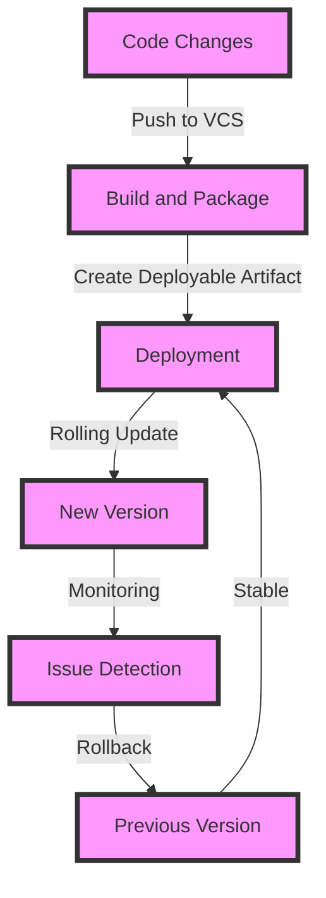

## Introduction
Deployments are a crucial aspect of software development, and rolling updates and rollbacks are essential concepts in ensuring the smooth operation of applications. **Rolling updates** refer to the process of gradually replacing old versions of an application with new ones, while **rollbacks** involve reverting to a previous version in case of issues. In this section, we will explore the importance of deployments, rolling updates, and rollbacks, and their relevance in real-world scenarios.

> **Note:** Deployments are not just about pushing code changes to production; they also involve ensuring that the application remains stable and performant during the update process.

In real-world scenarios, deployments are critical in ensuring that applications remain up-to-date and secure. For example, in a **microservices architecture**, multiple services need to be updated and deployed independently, making rolling updates and rollbacks essential for maintaining system stability.

## Core Concepts
To understand deployments, rolling updates, and rollbacks, it's essential to grasp the following core concepts:

* **Deployment**: The process of pushing code changes to a production environment.
* **Rolling update**: The process of gradually replacing old versions of an application with new ones.
* **Rollback**: The process of reverting to a previous version of an application in case of issues.
* **Canary release**: A technique where a new version of an application is released to a small subset of users to test its stability and performance.

> **Tip:** Using canary releases can help identify issues early on and reduce the risk of rolling out a faulty update to the entire user base.

Key terminology includes **deployment strategies**, such as **blue-green deployment**, **canary release**, and **rolling update**, each with its own advantages and disadvantages.

## How It Works Internally
To understand how deployments, rolling updates, and rollbacks work internally, let's break down the process step-by-step:

1. **Code changes**: Developers make changes to the application code and push them to a version control system.
2. **Build and package**: The code is built and packaged into a deployable artifact, such as a Docker image.
3. **Deployment**: The deployable artifact is pushed to a production environment, such as a Kubernetes cluster.
4. **Rolling update**: The new version of the application is gradually rolled out to the production environment, replacing the old version.
5. **Monitoring**: The application is monitored for issues and performance degradation.
6. **Rollback**: If issues are detected, the application is rolled back to a previous version.

> **Warning:** Rolling back to a previous version can be complex and may involve manual intervention, highlighting the importance of automated testing and monitoring.

## Code Examples
Here are three complete and runnable code examples demonstrating deployments, rolling updates, and rollbacks:

### Example 1: Basic Deployment
```python
import os
from kubernetes import client, config

# Load Kubernetes configuration
config.load_kube_config()

# Create a deployment object
deployment = client.AppsV1Api().create_namespaced_deployment(
    body={
        "apiVersion": "apps/v1",
        "kind": "Deployment",
        "metadata": {"name": "example-deployment"},
        "spec": {
            "replicas": 3,
            "selector": {"matchLabels": {"app": "example"}},
            "template": {
                "metadata": {"labels": {"app": "example"}},
                "spec": {
                    "containers": [
                        {
                            "name": "example-container",
                            "image": "example-image:latest",
                            "ports": [{"containerPort": 80}],
                        }
                    ]
                },
            },
        },
    },
    namespace="default",
)

print("Deployment created:", deployment.metadata.name)
```

### Example 2: Rolling Update
```python
import os
from kubernetes import client, config

# Load Kubernetes configuration
config.load_kube_config()

# Create a deployment object
deployment = client.AppsV1Api().create_namespaced_deployment(
    body={
        "apiVersion": "apps/v1",
        "kind": "Deployment",
        "metadata": {"name": "example-deployment"},
        "spec": {
            "replicas": 3,
            "selector": {"matchLabels": {"app": "example"}},
            "template": {
                "metadata": {"labels": {"app": "example"}},
                "spec": {
                    "containers": [
                        {
                            "name": "example-container",
                            "image": "example-image:latest",
                            "ports": [{"containerPort": 80}],
                        }
                    ]
                },
            },
        },
    },
    namespace="default",
)

# Update the deployment with a new image
client.AppsV1Api().patch_namespaced_deployment(
    name="example-deployment",
    namespace="default",
    body={
        "spec": {
            "template": {
                "spec": {
                    "containers": [
                        {
                            "name": "example-container",
                            "image": "example-image:new-version",
                            "ports": [{"containerPort": 80}],
                        }
                    ]
                }
            }
        }
    },
)

print("Deployment updated:", deployment.metadata.name)
```

### Example 3: Rollback
```python
import os
from kubernetes import client, config

# Load Kubernetes configuration
config.load_kube_config()

# Create a deployment object
deployment = client.AppsV1Api().create_namespaced_deployment(
    body={
        "apiVersion": "apps/v1",
        "kind": "Deployment",
        "metadata": {"name": "example-deployment"},
        "spec": {
            "replicas": 3,
            "selector": {"matchLabels": {"app": "example"}},
            "template": {
                "metadata": {"labels": {"app": "example"}},
                "spec": {
                    "containers": [
                        {
                            "name": "example-container",
                            "image": "example-image:latest",
                            "ports": [{"containerPort": 80}],
                        }
                    ]
                },
            },
        },
    },
    namespace="default",
)

# Roll back to a previous version
client.AppsV1Api().patch_namespaced_deployment(
    name="example-deployment",
    namespace="default",
    body={
        "spec": {
            "template": {
                "spec": {
                    "containers": [
                        {
                            "name": "example-container",
                            "image": "example-image:previous-version",
                            "ports": [{"containerPort": 80}],
                        }
                    ]
                }
            }
        }
    },
)

print("Deployment rolled back:", deployment.metadata.name)
```

## Visual Diagram

The diagram illustrates the deployment process, from code changes to rolling updates and rollbacks.

## Comparison
| Approach | Time Complexity | Space Complexity | Pros | Cons | Best For |
| --- | --- | --- | --- | --- | --- |
| Blue-Green Deployment | O(n) | O(n) | Easy to implement, low risk | Requires double the resources | Small to medium-sized applications |
| Canary Release | O(log n) | O(log n) | Low risk, easy to implement | Requires careful planning | Large-scale applications |
| Rolling Update | O(n) | O(n) | Easy to implement, low risk | May cause downtime | Small to medium-sized applications |

> **Interview:** Can you explain the differences between blue-green deployment, canary release, and rolling update? How would you choose the best approach for a given application?

## Real-world Use Cases
1. **Netflix**: Uses canary releases to roll out new versions of their application to a small subset of users before rolling it out to the entire user base.
2. **Google**: Uses blue-green deployments to roll out new versions of their application, ensuring minimal downtime and low risk.
3. **Amazon**: Uses rolling updates to roll out new versions of their application, ensuring easy implementation and low risk.

## Common Pitfalls
1. **Insufficient testing**: Failing to test the application thoroughly before rolling out a new version can lead to issues and downtime.
2. **Inadequate monitoring**: Failing to monitor the application during the rollout process can lead to issues going undetected.
3. **Incorrect rollback**: Rolling back to a previous version without proper planning can lead to data loss and downtime.
4. **Insufficient resources**: Failing to allocate sufficient resources for the deployment process can lead to downtime and issues.

> **Warning:** Insufficient testing and monitoring can lead to catastrophic consequences, including data loss and downtime.

## Interview Tips
1. **Be prepared to explain deployment strategies**: Be prepared to explain the differences between blue-green deployment, canary release, and rolling update, and how to choose the best approach for a given application.
2. **Emphasize the importance of testing and monitoring**: Emphasize the importance of thorough testing and monitoring during the deployment process to ensure minimal downtime and low risk.
3. **Highlight the importance of resource allocation**: Highlight the importance of allocating sufficient resources for the deployment process to ensure minimal downtime and low risk.

## Key Takeaways
* Deployments, rolling updates, and rollbacks are essential concepts in ensuring the smooth operation of applications.
* Blue-green deployment, canary release, and rolling update are different deployment strategies, each with its own advantages and disadvantages.
* Thorough testing and monitoring are crucial during the deployment process to ensure minimal downtime and low risk.
* Allocating sufficient resources for the deployment process is essential to ensure minimal downtime and low risk.
* Choosing the best deployment strategy for a given application depends on factors such as application size, complexity, and risk tolerance.
* Insufficient testing, inadequate monitoring, incorrect rollback, and insufficient resources are common pitfalls to avoid during the deployment process.