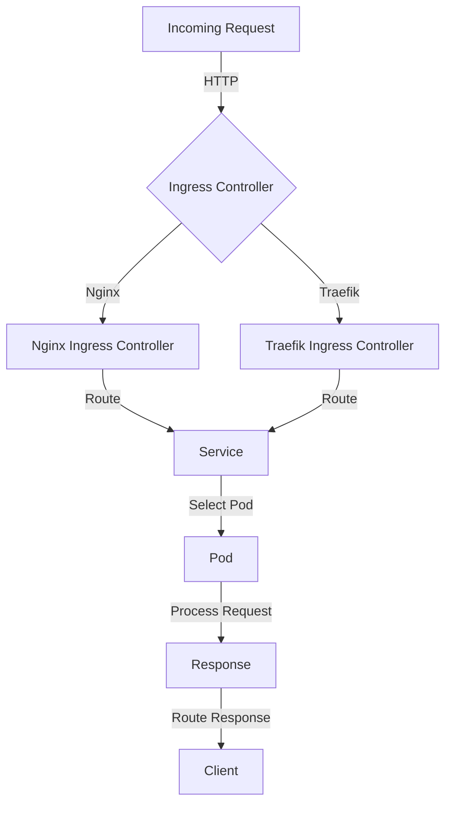

## Introduction
Ingress and Ingress Controllers are crucial components in Kubernetes, enabling the management of incoming HTTP requests and routing them to the correct services within a cluster. **Ingress** is a Kubernetes resource that defines a set of rules for incoming HTTP requests, while an **Ingress Controller** is a component that implements these rules and routes the requests to the corresponding services. In this section, we will explore the importance of Ingress and Ingress Controllers, their real-world relevance, and why every engineer needs to understand these concepts.

Ingress and Ingress Controllers are essential in production environments, as they provide a single entry point for incoming traffic and enable the management of multiple services behind a single IP address. This simplifies the process of scaling, securing, and managing microservices-based applications. For example, companies like Netflix, Airbnb, and Uber use Kubernetes and Ingress Controllers to manage their large-scale, distributed systems.

> **Note:** Ingress and Ingress Controllers are not exclusive to Kubernetes, but they are an integral part of the Kubernetes ecosystem.

## Core Concepts
To understand Ingress and Ingress Controllers, it is essential to grasp the following core concepts:

* **Ingress Resource**: An Ingress resource is a Kubernetes object that defines a set of rules for incoming HTTP requests. These rules specify the host, path, and backend service for each incoming request.
* **Ingress Controller**: An Ingress Controller is a component that implements the Ingress resource and routes incoming requests to the corresponding services. Popular Ingress Controllers include Nginx, Traefik, and HAProxy.
* **Service**: A Service is a Kubernetes object that defines a set of pods and a policy for accessing them. Ingress Controllers use Services to route incoming requests to the correct pods.
* **Endpoint**: An Endpoint is a Kubernetes object that represents a set of network endpoints (e.g., IP addresses and ports) that are exposed by a Service.

> **Warning:** Ingress Controllers can be complex to configure and manage, especially in large-scale environments. It is crucial to understand the underlying mechanics and potential pitfalls to avoid common mistakes.

## How It Works Internally
Here is a step-by-step overview of how Ingress and Ingress Controllers work internally:

1. **Ingress Resource Creation**: A user creates an Ingress resource, defining the rules for incoming HTTP requests.
2. **Ingress Controller Deployment**: An Ingress Controller is deployed, which watches for changes to the Ingress resource.
3. **Ingress Controller Configuration**: The Ingress Controller configures itself based on the Ingress resource, creating the necessary routing rules.
4. **Incoming Request**: An incoming HTTP request is received by the Ingress Controller.
5. **Request Routing**: The Ingress Controller routes the request to the corresponding Service, based on the rules defined in the Ingress resource.
6. **Service Selection**: The Service selects the correct pod to handle the request, based on the endpoint configuration.
7. **Request Processing**: The pod processes the request and returns a response to the Ingress Controller.
8. **Response Routing**: The Ingress Controller routes the response back to the client.

> **Tip:** Understanding the internal mechanics of Ingress and Ingress Controllers can help you optimize and troubleshoot your Kubernetes environment.

## Code Examples
Here are three complete and runnable code examples, demonstrating the use of Ingress and Ingress Controllers:

**Example 1: Basic Ingress Resource**
```yml
apiVersion: networking.k8s.io/v1
kind: Ingress
metadata:
  name: example-ingress
spec:
  rules:
  - host: example.com
    http:
      paths:
      - path: /
        pathType: Prefix
        backend:
          service:
            name: example-service
            port:
              number: 80
```
This example defines a basic Ingress resource, routing incoming requests to the `example-service` Service.

**Example 2: Nginx Ingress Controller**
```yml
apiVersion: apps/v1
kind: Deployment
metadata:
  name: nginx-ingress-controller
spec:
  replicas: 1
  selector:
    matchLabels:
      app: nginx-ingress
  template:
    metadata:
      labels:
        app: nginx-ingress
    spec:
      containers:
      - name: nginx-ingress-controller
        image: quay.io/kubernetes-ingress-controller/nginx-ingress-controller:0.26.1
        args:
        - /nginx-ingress-controller
        - --default-backend-service=example-service
        - --election-id=ingress-controller-leader
        - --ingress-class=nginx
```
This example deploys an Nginx Ingress Controller, which implements the Ingress resource and routes incoming requests to the `example-service` Service.

**Example 3: Traefik Ingress Controller**
```yml
apiVersion: apps/v1
kind: Deployment
metadata:
  name: traefik-ingress-controller
spec:
  replicas: 1
  selector:
    matchLabels:
      app: traefik-ingress
  template:
    metadata:
      labels:
        app: traefik-ingress
    spec:
      containers:
      - name: traefik-ingress-controller
        image: traefik:v2.2.1
        args:
        - --log.level=DEBUG
        - --api.insecure=true
        - --providers.kubernetesCRD=true
        - --providers.kubernetes-ingress=true
```
This example deploys a Traefik Ingress Controller, which implements the Ingress resource and routes incoming requests to the `example-service` Service.

## Visual Diagram

This diagram illustrates the flow of incoming requests through the Ingress Controller and routing to the correct Service and pod.

> **Interview:** Can you explain the difference between an Ingress resource and an Ingress Controller? How do they work together to route incoming requests?

## Comparison
The following table compares the most popular Ingress Controllers:

| Ingress Controller | Time Complexity | Space Complexity | Pros | Cons | Best For |
| --- | --- | --- | --- | --- | --- |
| Nginx | O(1) | O(n) | High performance, flexible configuration | Complex setup, resource-intensive | Large-scale environments |
| Traefik | O(1) | O(n) | Easy setup, automatic SSL termination | Limited customization options | Small- to medium-scale environments |
| HAProxy | O(1) | O(n) | High performance, robust security features | Complex setup, resource-intensive | Large-scale environments with high security requirements |
| Istio | O(1) | O(n) | Automatic service discovery, robust security features | Complex setup, resource-intensive | Large-scale environments with complex service discovery requirements |

> **Warning:** Choosing the wrong Ingress Controller can lead to performance issues and security vulnerabilities. It is crucial to evaluate the pros and cons of each option and select the best fit for your environment.

## Real-world Use Cases
Here are three real-world use cases for Ingress and Ingress Controllers:

1. **Netflix**: Netflix uses Kubernetes and Nginx Ingress Controllers to manage their large-scale, distributed system.
2. **Airbnb**: Airbnb uses Kubernetes and Traefik Ingress Controllers to manage their small- to medium-scale environment.
3. **Uber**: Uber uses Kubernetes and HAProxy Ingress Controllers to manage their large-scale environment with high security requirements.

> **Tip:** When selecting an Ingress Controller, consider the size and complexity of your environment, as well as the specific requirements for performance, security, and customization.

## Common Pitfalls
Here are four common pitfalls to avoid when using Ingress and Ingress Controllers:

1. **Incorrect Ingress Resource Configuration**: Incorrectly configuring the Ingress resource can lead to routing errors and downtime.
```yml
# Incorrect Ingress Resource Configuration
apiVersion: networking.k8s.io/v1
kind: Ingress
metadata:
  name: example-ingress
spec:
  rules:
  - host: example.com
    http:
      paths:
      - path: /
        pathType: Prefix
        backend:
          service:
            name: non-existent-service
            port:
              number: 80
```
2. **Insufficient Ingress Controller Resources**: Insufficient resources allocated to the Ingress Controller can lead to performance issues and downtime.
```yml
# Insufficient Ingress Controller Resources
apiVersion: apps/v1
kind: Deployment
metadata:
  name: nginx-ingress-controller
spec:
  replicas: 1
  selector:
    matchLabels:
      app: nginx-ingress
  template:
    metadata:
      labels:
        app: nginx-ingress
    spec:
      containers:
      - name: nginx-ingress-controller
        image: quay.io/kubernetes-ingress-controller/nginx-ingress-controller:0.26.1
        resources:
          requests:
            cpu: 10m
            memory: 20Mi
```
3. **Incorrect Service Configuration**: Incorrectly configuring the Service can lead to routing errors and downtime.
```yml
# Incorrect Service Configuration
apiVersion: v1
kind: Service
metadata:
  name: example-service
spec:
  selector:
    app: example-app
  ports:
  - name: http
    port: 8080
    targetPort: 8080
  type: ClusterIP
```
4. **Inadequate Monitoring and Logging**: Inadequate monitoring and logging can lead to difficulties in troubleshooting and debugging issues.
```yml
# Inadequate Monitoring and Logging
apiVersion: apps/v1
kind: Deployment
metadata:
  name: nginx-ingress-controller
spec:
  replicas: 1
  selector:
    matchLabels:
      app: nginx-ingress
  template:
    metadata:
      labels:
        app: nginx-ingress
    spec:
      containers:
      - name: nginx-ingress-controller
        image: quay.io/kubernetes-ingress-controller/nginx-ingress-controller:0.26.1
        args:
        - --log.level=ERROR
```
> **Note:** It is essential to carefully evaluate and configure Ingress and Ingress Controllers to avoid common pitfalls and ensure a stable and performant environment.

## Interview Tips
Here are three common interview questions related to Ingress and Ingress Controllers, along with weak and strong answers:

1. **What is the difference between an Ingress resource and an Ingress Controller?**
Weak answer: "An Ingress resource is a Kubernetes object that defines a set of rules for incoming HTTP requests, while an Ingress Controller is a component that implements these rules."
Strong answer: "An Ingress resource is a Kubernetes object that defines a set of rules for incoming HTTP requests, while an Ingress Controller is a component that implements these rules and routes the requests to the corresponding services. The Ingress Controller is responsible for configuring the underlying load balancer or proxy server to direct traffic to the correct pods."
2. **How do you configure an Ingress Controller to route traffic to multiple services?**
Weak answer: "You can configure an Ingress Controller to route traffic to multiple services by creating multiple Ingress resources."
Strong answer: "You can configure an Ingress Controller to route traffic to multiple services by creating a single Ingress resource with multiple rules, each specifying a different host, path, or backend service. The Ingress Controller will then route traffic to the correct service based on the rules defined in the Ingress resource."
3. **What are some common pitfalls to avoid when using Ingress and Ingress Controllers?**
Weak answer: "Some common pitfalls to avoid include incorrectly configuring the Ingress resource or Ingress Controller."
Strong answer: "Some common pitfalls to avoid include incorrectly configuring the Ingress resource or Ingress Controller, insufficient resources allocated to the Ingress Controller, incorrect Service configuration, and inadequate monitoring and logging. It is essential to carefully evaluate and configure Ingress and Ingress Controllers to avoid these common pitfalls and ensure a stable and performant environment."

> **Tip:** When answering interview questions related to Ingress and Ingress Controllers, be sure to provide specific examples and explanations of the underlying mechanics and potential pitfalls.

## Key Takeaways
Here are ten key takeaways to remember when working with Ingress and Ingress Controllers:

* **Ingress resources define rules for incoming HTTP requests**: Ingress resources specify the host, path, and backend service for each incoming request.
* **Ingress Controllers implement Ingress resources**: Ingress Controllers configure the underlying load balancer or proxy server to direct traffic to the correct pods.
* **Nginx, Traefik, and HAProxy are popular Ingress Controllers**: Each Ingress Controller has its own strengths and weaknesses, and the choice of which to use depends on the specific requirements of the environment.
* **Ingress Controllers can be complex to configure and manage**: Ingress Controllers require careful evaluation and configuration to avoid common pitfalls and ensure a stable and performant environment.
* **Monitoring and logging are essential for troubleshooting and debugging**: Inadequate monitoring and logging can lead to difficulties in troubleshooting and debugging issues.
* **Ingress Controllers can route traffic to multiple services**: Ingress Controllers can be configured to route traffic to multiple services using a single Ingress resource with multiple rules.
* **Ingress resources can be used with multiple Ingress Controllers**: Ingress resources can be used with multiple Ingress Controllers, allowing for flexibility and customization in the routing of incoming traffic.
* **Ingress Controllers can be used with other Kubernetes components**: Ingress Controllers can be used with other Kubernetes components, such as Services and Pods, to create a complete and scalable environment.
* **Ingress Controllers require sufficient resources to operate effectively**: Ingress Controllers require sufficient resources, such as CPU and memory, to operate effectively and handle incoming traffic.
* **Ingress Controllers can be used to implement security features**: Ingress Controllers can be used to implement security features, such as SSL termination and authentication, to protect the environment and ensure the security of incoming traffic.