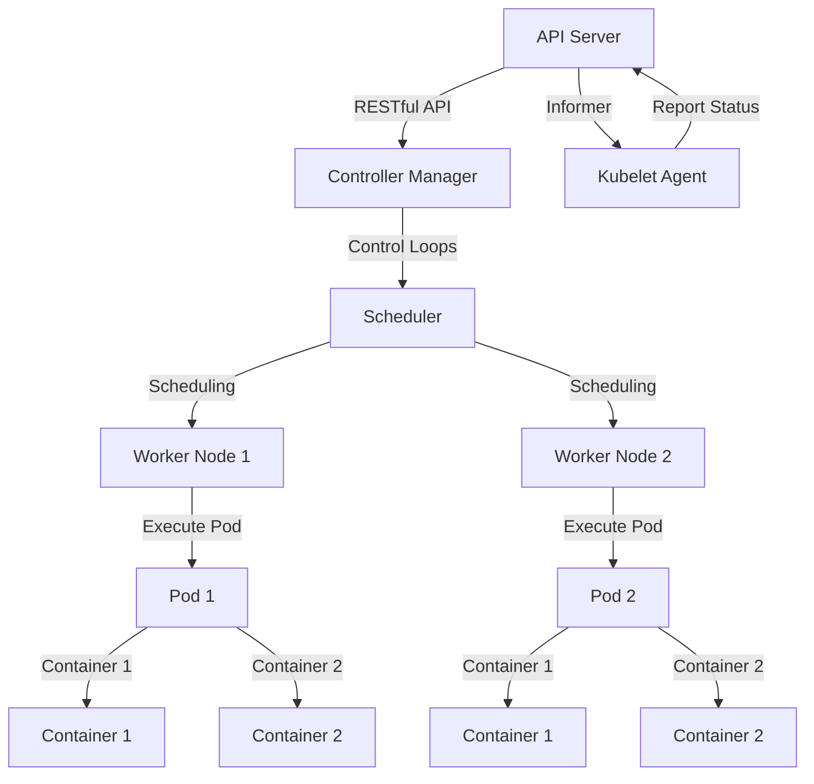

## Introduction
Kubernetes is an open-source container orchestration system that automates the deployment, scaling, and management of containerized applications. At its core, Kubernetes provides a **control plane** that manages the lifecycle of containers and a set of **worker nodes** that run the containers. In this study guide, we will delve into the architecture of Kubernetes, exploring the control plane, worker nodes, and the interactions between them. We will also examine real-world use cases, common pitfalls, and interview tips to help you prepare for a career in DevOps.

> **Note:** Kubernetes is a complex system, and understanding its architecture is crucial for designing and deploying scalable, fault-tolerant applications.

## Core Concepts
Before we dive into the architecture of Kubernetes, let's define some key terms:

* **Control Plane**: The control plane is the central management component of Kubernetes, responsible for maintaining the desired state of the cluster. It includes components such as the **API Server**, **Controller Manager**, and **Scheduler**.
* **Worker Nodes**: Worker nodes are the machines that run the containers. They are responsible for executing the tasks assigned to them by the control plane.
* **Pods**: Pods are the basic execution unit in Kubernetes, comprising one or more containers that share the same network namespace and resources.
* **Deployments**: Deployments are a way to manage the rollout of new versions of an application, ensuring that the desired state is achieved without downtime.

## How It Works Internally
The control plane and worker nodes interact through the **API Server**, which provides a RESTful API for managing the cluster. Here's a step-by-step overview of how it works:

1. The **API Server** receives requests from the user or other components, such as the **Controller Manager** or **Scheduler**.
2. The **Controller Manager** runs control loops that monitor the cluster's state and make adjustments as needed.
3. The **Scheduler** is responsible for assigning pods to worker nodes based on their resource requirements and availability.
4. The worker nodes execute the pods, which may include multiple containers.
5. The **Kubelet** agent on each worker node communicates with the **API Server** to report the node's status and receive updates.

> **Warning:** If the control plane is not properly configured or becomes unavailable, the cluster may become unstable or unable to recover.

## Code Examples
Here are three complete, runnable examples to illustrate the concepts:

### Example 1: Basic Deployment
```python
import os
from kubernetes import client, config

# Load the configuration
config.load_kube_config()

# Create a deployment
api = client.AppsV1Api()
deployment = client.V1Deployment(
    metadata=client.V1ObjectMeta(name="example"),
    spec=client.V1DeploymentSpec(
        replicas=3,
        selector=client.V1LabelSelector(match_labels={"app": "example"}),
        template=client.V1PodTemplateSpec(
            metadata=client.V1ObjectMeta(labels={"app": "example"}),
            spec=client.V1PodSpec(
                containers=[client.V1Container(
                    name="example",
                    image="nginx:latest"
                )]
            )
        )
    )
)

# Apply the deployment
api.create_namespaced_deployment(namespace="default", body=deployment)
```

### Example 2: Rolling Update
```python
import os
from kubernetes import client, config

# Load the configuration
config.load_kube_config()

# Create a deployment with a rolling update strategy
api = client.AppsV1Api()
deployment = client.V1Deployment(
    metadata=client.V1ObjectMeta(name="example"),
    spec=client.V1DeploymentSpec(
        replicas=3,
        selector=client.V1LabelSelector(match_labels={"app": "example"}),
        template=client.V1PodTemplateSpec(
            metadata=client.V1ObjectMeta(labels={"app": "example"}),
            spec=client.V1PodSpec(
                containers=[client.V1Container(
                    name="example",
                    image="nginx:latest"
                )]
            )
        ),
        strategy=client.V1DeploymentStrategy(
            type="RollingUpdate",
            rolling_update=client.V1RollingUpdateDeployment(
                max_unavailable=1,
                max_surge=1
            )
        )
    )
)

# Apply the deployment
api.create_namespaced_deployment(namespace="default", body=deployment)
```

### Example 3: Custom Scheduler
```go
package main

import (
    "fmt"
    "github.com/kubernetes/client-go/informers"
    "github.com/kubernetes/client-go/kubernetes"
    "github.com/kubernetes/client-go/tools/cache"
)

func main() {
    // Create a Kubernetes client
    clientset, err := kubernetes.NewForConfig(nil)
    if err != nil {
        panic(err.Error())
    }

    // Create a shared informer factory
    factory := informers.NewSharedInformerFactory(clientset, 0)

    // Create a custom scheduler
    scheduler := &CustomScheduler{
        clientset: clientset,
        informer: factory.Core().V1().Pods().Informer(),
    }

    // Start the informer
    stopper := make(chan struct{})
    go factory.Start(stopper)

    // Run the scheduler
    scheduler.Run()
}

type CustomScheduler struct {
    clientset *kubernetes.Clientset
    informer  cache.SharedInformer
}

func (s *CustomScheduler) Run() {
    // Implement the custom scheduling logic
    for {
        // Get the next pod to schedule
        pod, err := s.informer.GetStore().GetByKey("default/example")
        if err != nil {
            continue
        }

        // Schedule the pod
        // ...
    }
}
```

## Visual Diagram

The diagram illustrates the control plane and worker nodes, showing how the **API Server**, **Controller Manager**, and **Scheduler** interact with the **Worker Nodes** and **Kubelet Agent**.

## Comparison
| Approach | Time Complexity | Space Complexity | Pros | Cons | Best For |
| --- | --- | --- | --- | --- | --- |
| **Kubernetes** | O(1) | O(n) | Scalable, flexible, and extensible | Complex, steep learning curve | Large-scale deployments |
| **Docker Swarm** | O(1) | O(n) | Simple, easy to use, and lightweight | Limited scalability, no built-in load balancing | Small-scale deployments |
| **Apache Mesos** | O(log n) | O(n) | Scalable, flexible, and fault-tolerant | Complex, requires additional components | Distributed systems |
| **Nomad** | O(1) | O(n) | Scalable, flexible, and easy to use | Limited support for certain features | Multi-cloud deployments |

> **Tip:** When choosing an orchestration tool, consider the size and complexity of your deployment, as well as your team's expertise and resources.

## Real-world Use Cases
Here are three production examples of Kubernetes in action:

* **Google**: Google uses Kubernetes to manage its massive infrastructure, including search, ads, and cloud services.
* **Netflix**: Netflix uses Kubernetes to deploy and manage its microservices-based architecture, ensuring high availability and scalability.
* **Red Hat**: Red Hat uses Kubernetes to manage its containerized applications, including its OpenShift platform.

## Common Pitfalls
Here are four common mistakes to avoid when working with Kubernetes:

* **Insufficient node resources**: Failing to provide sufficient resources (e.g., CPU, memory) to worker nodes can lead to performance issues and failures.
* **Inadequate monitoring and logging**: Not monitoring and logging the cluster and applications can make it difficult to detect and diagnose issues.
* **Insecure configuration**: Failing to secure the cluster and applications can lead to security breaches and data loss.
* **Inadequate testing**: Not testing the deployment and applications thoroughly can lead to issues and failures in production.

> **Warning:** Inadequate testing and monitoring can lead to catastrophic failures and downtime.

## Interview Tips
Here are three common interview questions and tips for answering them:

* **What is the difference between a pod and a container?**: A pod is the basic execution unit in Kubernetes, comprising one or more containers that share the same network namespace and resources. A container is a lightweight and standalone executable package of software.
* **How do you handle node failures in a Kubernetes cluster?**: You can handle node failures by using **PodDisruptionBudgets** to ensure that a minimum number of pods are available at all times, and by using **Persistent Volumes** to store data that needs to be preserved across node failures.
* **What is the role of the **API Server** in Kubernetes?**: The **API Server** provides a RESTful API for managing the cluster, including creating, updating, and deleting resources such as pods, services, and deployments.

> **Interview:** Be prepared to explain the architecture and components of Kubernetes, as well as common use cases and best practices.

## Key Takeaways
Here are ten key takeaways to remember:

* **Kubernetes is a complex system**: Understanding its architecture and components is crucial for designing and deploying scalable, fault-tolerant applications.
* **Control plane and worker nodes are separate components**: The control plane manages the cluster, while worker nodes execute the pods.
* **Pods are the basic execution unit**: Pods comprise one or more containers that share the same network namespace and resources.
* **Deployments are a way to manage rollout**: Deployments ensure that the desired state is achieved without downtime.
* **API Server provides a RESTful API**: The **API Server** provides a RESTful API for managing the cluster.
* **Controller Manager runs control loops**: The **Controller Manager** runs control loops that monitor the cluster's state and make adjustments as needed.
* **Scheduler assigns pods to worker nodes**: The **Scheduler** assigns pods to worker nodes based on their resource requirements and availability.
* **Kubelet agent communicates with API Server**: The **Kubelet** agent on each worker node communicates with the **API Server** to report the node's status and receive updates.
* **Monitoring and logging are essential**: Monitoring and logging the cluster and applications are crucial for detecting and diagnosing issues.
* **Security is critical**: Securing the cluster and applications is essential for preventing security breaches and data loss.

> **Note:** Understanding the architecture and components of Kubernetes is essential for designing and deploying scalable, fault-tolerant applications.