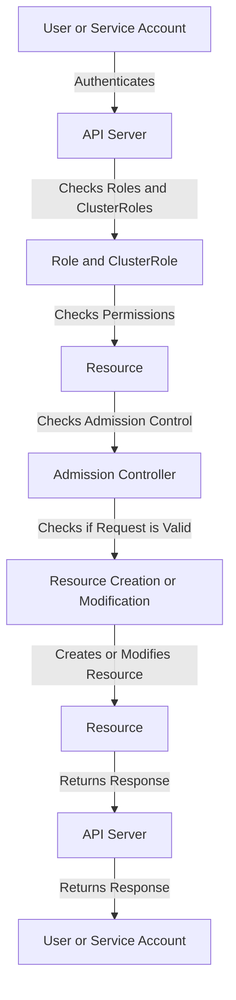

## Introduction
**Namespaces** and **Role-Based Access Control (RBAC)** are fundamental concepts in Kubernetes, allowing for efficient management and security of resources within a cluster. In a real-world scenario, a company like Netflix might use namespaces to separate different applications or environments, such as development, staging, and production, while RBAC ensures that only authorized personnel can access and modify resources. Every engineer working with Kubernetes needs to understand these concepts to ensure secure and efficient cluster management.

## Core Concepts
- **Namespace**: A namespace is a way to divide cluster resources between multiple applications or environments. It provides a scope for names, allowing for multiple resources with the same name to exist in different namespaces.
- **Role-Based Access Control (RBAC)**: RBAC is a method of regulating access to computer or network resources based on the roles of individual users within an organization. In Kubernetes, RBAC is used to control access to resources such as pods, services, and persistent volumes.
- **Role**: A role is a set of permissions that define what actions can be performed on a resource. Roles can be bound to users or service accounts, allowing them to perform actions on resources.
- **ClusterRole**: A ClusterRole is similar to a Role, but it is cluster-scoped, meaning it applies to all namespaces in the cluster.

## How It Works Internally
When a user or service account attempts to access a resource, the Kubernetes API server checks the user's or service account's roles and cluster roles to determine if they have permission to perform the requested action. The check is done in the following steps:
1. **Authentication**: The user or service account is authenticated using an authentication plugin.
2. **Authorization**: The authenticated user's or service account's roles and cluster roles are checked to determine if they have permission to perform the requested action.
3. **Admission Control**: If the user or service account has permission, the admission controller checks if the request is valid and if the resource can be created or modified.

## Code Examples
### Example 1: Creating a Namespace
```bash
# Create a namespace
kubectl create namespace my-namespace

# Get the namespace
kubectl get namespace my-namespace
```
> **Tip:** You can also create a namespace using a YAML file: `kubectl create -f namespace.yaml`

### Example 2: Creating a Role and RoleBinding
```yaml
# role.yaml
apiVersion: rbac.authorization.k8s.io/v1
kind: Role
metadata:
  name: my-role
rules:
- apiGroups: ["*"]
  resources: ["pods"]
  verbs: ["get", "list", "create", "update", "delete"]
---
apiVersion: rbac.authorization.k8s.io/v1
kind: RoleBinding
metadata:
  name: my-rolebinding
roleRef:
  name: my-role
  kind: Role
subjects:
- name: my-user
  kind: User
```
```bash
# Apply the YAML file
kubectl apply -f role.yaml
```
> **Warning:** Be careful when granting permissions to users or service accounts, as it can lead to security vulnerabilities.

### Example 3: Creating a ClusterRole and ClusterRoleBinding
```yaml
# clusterrole.yaml
apiVersion: rbac.authorization.k8s.io/v1
kind: ClusterRole
metadata:
  name: my-clusterrole
rules:
- apiGroups: ["*"]
  resources: ["nodes"]
  verbs: ["get", "list", "create", "update", "delete"]
---
apiVersion: rbac.authorization.k8s.io/v1
kind: ClusterRoleBinding
metadata:
  name: my-clusterrolebinding
roleRef:
  name: my-clusterrole
  kind: ClusterRole
subjects:
- name: my-user
  kind: User
```
```bash
# Apply the YAML file
kubectl apply -f clusterrole.yaml
```
> **Interview:** What is the difference between a Role and a ClusterRole? A Role is namespace-scoped, while a ClusterRole is cluster-scoped.

## Visual Diagram

This diagram shows the flow of authentication, authorization, and admission control in Kubernetes.

## Comparison
| Approach | Time Complexity | Space Complexity | Pros | Cons | Best For |
|----------|----------------|-----------------|------|------|----------|
| Role-Based Access Control (RBAC) | O(1) | O(n) | Fine-grained control, easy to manage | Can be complex to set up | Large-scale clusters with many users and resources |
| Attribute-Based Access Control (ABAC) | O(n) | O(n) | Fine-grained control, easy to manage | Can be complex to set up | Large-scale clusters with many users and resources |
| Mandatory Access Control (MAC) | O(1) | O(n) | Fine-grained control, easy to manage | Can be complex to set up | Large-scale clusters with many users and resources |
| Discretionary Access Control (DAC) | O(1) | O(n) | Fine-grained control, easy to manage | Can be complex to set up | Small-scale clusters with few users and resources |

## Real-world Use Cases
1. **Netflix**: Netflix uses Kubernetes to manage its large-scale cluster, and uses RBAC to control access to resources.
2. **Google**: Google uses Kubernetes to manage its large-scale cluster, and uses RBAC to control access to resources.
3. **Amazon**: Amazon uses Kubernetes to manage its large-scale cluster, and uses RBAC to control access to resources.

## Common Pitfalls
1. **Insufficient Permissions**: Not granting sufficient permissions to users or service accounts can lead to errors and failures.
```bash
# Wrong way: Insufficient permissions
kubectl create role my-role --verb=get --resource=pods
```
```bash
# Right way: Sufficient permissions
kubectl create role my-role --verb=get,create,update,delete --resource=pods
```
> **Warning:** Be careful when granting permissions to users or service accounts, as it can lead to security vulnerabilities.
2. **Overly Permissive Roles**: Creating overly permissive roles can lead to security vulnerabilities.
```bash
# Wrong way: Overly permissive role
kubectl create clusterrole my-clusterrole --verb=* --resource=*
```
```bash
# Right way: Fine-grained role
kubectl create clusterrole my-clusterrole --verb=get,create,update,delete --resource=pods
```
> **Tip:** Use fine-grained roles to control access to resources.

## Interview Tips
1. **What is the difference between a Role and a ClusterRole?**: A Role is namespace-scoped, while a ClusterRole is cluster-scoped.
2. **How do you create a Role and RoleBinding?**: You can create a Role and RoleBinding using a YAML file.
3. **What is the purpose of RBAC in Kubernetes?**: RBAC is used to control access to resources in a Kubernetes cluster.

## Key Takeaways
* **Namespaces** are used to divide cluster resources between multiple applications or environments.
* **Role-Based Access Control (RBAC)** is used to control access to resources in a Kubernetes cluster.
* **Roles** and **ClusterRoles** are used to define permissions for users and service accounts.
* **RoleBindings** and **ClusterRoleBindings** are used to bind roles and cluster roles to users and service accounts.
* **Fine-grained roles** should be used to control access to resources.
* **Overly permissive roles** should be avoided to prevent security vulnerabilities.
* **RBAC** is used to control access to resources in a Kubernetes cluster.
* **Namespaces** and **RBAC** are used together to manage access to resources in a Kubernetes cluster.