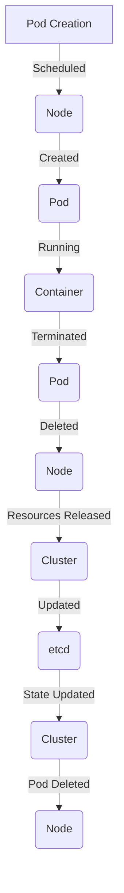

## Introduction
Kubernetes Pods are the basic execution unit in a Kubernetes cluster. They represent a logical host for one or more containers. Pods are ephemeral and can be created, scaled, and deleted as needed. In this section, we will explore the lifecycle of Pods, multi-container Pods, and init containers. **Pods are a crucial concept in Kubernetes**, as they provide a way to manage and orchestrate containers in a distributed environment. 
> **Note:** Pods are not a replacement for containers, but rather a way to manage and orchestrate them.

## Core Concepts
To understand Pods, we need to define some key terms:
- **Pod**: A logical host for one or more containers.
- **Container**: A runtime environment for an application.
- **Init Container**: A special type of container that runs before the main container.
- **Multi-container Pod**: A Pod that contains more than one container.
- **Lifecycle**: The stages a Pod goes through from creation to deletion.
The mental model for Pods is to think of them as a **logical host** for containers. This means that Pods provide a way to manage and orchestrate containers, rather than replacing them.
> **Tip:** When designing a Kubernetes application, it's essential to consider the Pod lifecycle and how it will affect the behavior of your application.

## How It Works Internally
When a Pod is created, Kubernetes performs the following steps:
1. **Scheduling**: The Pod is scheduled to run on a Node in the cluster.
2. **Creation**: The Pod is created on the Node, and the containers are started.
3. **Running**: The containers are running, and the Pod is in a **Running** state.
4. **Termination**: The Pod is terminated, and the containers are stopped.
5. **Deletion**: The Pod is deleted, and all resources are released.
The under-the-hood mechanics of Pods involve the use of **etcd**, a distributed key-value store, to manage the state of the cluster. This includes the state of Pods, Nodes, and other resources.
> **Warning:** When working with Pods, it's essential to consider the **networking** and **storage** requirements of your application. Pods can be configured to use different networking and storage models, but this requires careful planning and configuration.

## Code Examples
### Example 1: Basic Pod Creation
```yml
apiVersion: v1
kind: Pod
metadata:
  name: basic-pod
spec:
  containers:
  - name: basic-container
    image: busybox
    command: ["sleep", "3600"]
```
This example creates a basic Pod with a single container running the **busybox** image.
### Example 2: Multi-container Pod
```yml
apiVersion: v1
kind: Pod
metadata:
  name: multi-container-pod
spec:
  containers:
  - name: container1
    image: busybox
    command: ["sleep", "3600"]
  - name: container2
    image: nginx
    ports:
    - containerPort: 80
```
This example creates a multi-container Pod with two containers: one running **busybox** and the other running **nginx**.
### Example 3: Init Container
```yml
apiVersion: v1
kind: Pod
metadata:
  name: init-container-pod
spec:
  initContainers:
  - name: init-container
    image: busybox
    command: ["echo", "Initializing..."]
  containers:
  - name: main-container
    image: busybox
    command: ["sleep", "3600"]
```
This example creates a Pod with an init container that runs before the main container.
> **Interview:** Can you explain the difference between a Pod and a container? How do you configure a Pod to use multiple containers?

## Visual Diagram

This diagram illustrates the lifecycle of a Pod, from creation to deletion.

## Comparison
| Approach | Time Complexity | Space Complexity | Pros | Cons | Best For |
|----------|----------------|-----------------|------|------|----------|
| Single-container Pod | O(1) | O(1) | Simple, easy to manage | Limited flexibility | Small applications |
| Multi-container Pod | O(n) | O(n) | Flexible, scalable | Complex, harder to manage | Large applications |
| Init Container | O(1) | O(1) | Provides initialization logic | Limited functionality | Applications with initialization logic |
| Job | O(n) | O(n) | Provides batch processing | Limited control over execution | Batch processing applications |

## Real-world Use Cases
1. **Netflix**: Uses Kubernetes to manage and orchestrate containers for its streaming service.
2. **Google**: Uses Kubernetes to manage and orchestrate containers for its search engine and other services.
3. **Red Hat**: Uses Kubernetes to manage and orchestrate containers for its OpenShift platform.
In each of these cases, Kubernetes provides a way to manage and orchestrate containers at scale, allowing for efficient and effective deployment of applications.
> **Tip:** When designing a Kubernetes application, it's essential to consider the real-world use cases and how they will affect the behavior of your application.

## Common Pitfalls
1. **Insufficient resources**: Failing to provide sufficient resources (e.g., CPU, memory) for a Pod can lead to performance issues.
2. **Incorrect networking configuration**: Incorrectly configuring networking for a Pod can lead to connectivity issues.
3. **Inadequate monitoring and logging**: Failing to provide adequate monitoring and logging for a Pod can make it difficult to diagnose issues.
4. **Insecure configuration**: Failing to configure a Pod securely can lead to security vulnerabilities.
To avoid these pitfalls, it's essential to carefully plan and configure your Kubernetes application.
> **Warning:** When working with Kubernetes, it's essential to consider the security implications of your configuration. Insecure configurations can lead to security vulnerabilities and other issues.

## Interview Tips
1. **What is the difference between a Pod and a container?**: A Pod is a logical host for one or more containers, while a container is a runtime environment for an application.
2. **How do you configure a Pod to use multiple containers?**: You can configure a Pod to use multiple containers by specifying multiple containers in the Pod specification.
3. **What is an init container, and how do you use it?**: An init container is a special type of container that runs before the main container. You can use an init container to provide initialization logic for your application.
> **Interview:** Can you explain the concept of a Pod and how it relates to containers? How do you configure a Pod to use multiple containers?

## Key Takeaways
* **Pods are logical hosts for containers**: Pods provide a way to manage and orchestrate containers in a distributed environment.
* **Multi-container Pods provide flexibility**: Multi-container Pods allow for the deployment of multiple containers in a single Pod.
* **Init containers provide initialization logic**: Init containers provide a way to run initialization logic before the main container.
* **Kubernetes provides a way to manage and orchestrate containers at scale**: Kubernetes provides a way to efficiently and effectively deploy applications in a distributed environment.
* **Careful planning and configuration are essential**: Careful planning and configuration are essential to avoid common pitfalls and ensure the effective deployment of a Kubernetes application.
* **Security implications must be considered**: Security implications must be considered when configuring a Kubernetes application to avoid security vulnerabilities and other issues.