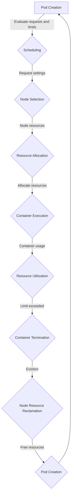

## Introduction
**Resource requests and limits** are essential concepts in Kubernetes that enable efficient resource allocation and utilization in containerized environments. These settings help ensure that pods receive the necessary resources to run smoothly while preventing them from consuming excessive resources that could impact other pods or the entire cluster. In this section, we will delve into the world of resource requests and limits, exploring their importance, real-world relevance, and why every engineer should understand these concepts.

> **Note:** Resource requests and limits are critical in production environments, as they directly impact the performance, scalability, and reliability of applications. Misconfigured resource settings can lead to issues such as pod evictions, resource starvation, and decreased overall system efficiency.

## Core Concepts
To grasp resource requests and limits, it's essential to understand the following key concepts:

* **Requests:** The amount of resources (e.g., CPU, memory) that a container is guaranteed to receive. Requests are used for scheduling and allocating resources to pods.
* **Limits:** The maximum amount of resources that a container can use. Limits prevent containers from consuming excessive resources and impacting other pods or the cluster.
* **Resource types:** Kubernetes supports various resource types, including CPU, memory, and storage. Each resource type has its own set of request and limit settings.
* **Pod QoS (Quality of Service):** Pods are classified into three QoS categories based on their request and limit settings: BestEffort, Burstable, and Guaranteed. Each QoS category has different scheduling and eviction behaviors.

> **Tip:** Understanding the differences between requests and limits is crucial. Requests determine the minimum amount of resources allocated to a container, while limits set the maximum amount of resources that can be used.

## How It Works Internally
Here's a step-by-step breakdown of how resource requests and limits work internally:

1. **Pod creation:** When a pod is created, Kubernetes evaluates its request and limit settings.
2. **Scheduling:** The scheduler uses the request settings to determine which node can accommodate the pod's resource requirements.
3. **Resource allocation:** Once the pod is scheduled, Kubernetes allocates the requested resources to the pod.
4. **Resource utilization:** The pod's containers use the allocated resources. If a container exceeds its limit, Kubernetes will terminate the container.
5. **Eviction:** If a node runs low on resources, Kubernetes may evict pods to free up resources. The eviction order is determined by the pod's QoS category and resource usage.

> **Warning:** Misconfigured resource requests and limits can lead to pod evictions, resource starvation, and decreased system efficiency. It's essential to monitor and adjust resource settings based on application requirements and performance metrics.

## Code Examples
### Example 1: Basic Resource Request and Limit
```yml
apiVersion: v1
kind: Pod
metadata:
  name: example-pod
spec:
  containers:
  - name: example-container
    image: busybox
    resources:
      requests:
        cpu: 100m
        memory: 128Mi
      limits:
        cpu: 200m
        memory: 256Mi
```
This example demonstrates a basic pod with a single container that requests 100m CPU and 128Mi memory, with limits set to 200m CPU and 256Mi memory.

### Example 2: Advanced Resource Request and Limit with Multiple Containers
```yml
apiVersion: v1
kind: Pod
metadata:
  name: example-pod
spec:
  containers:
  - name: example-container-1
    image: busybox
    resources:
      requests:
        cpu: 100m
        memory: 128Mi
      limits:
        cpu: 200m
        memory: 256Mi
  - name: example-container-2
    image: nginx
    resources:
      requests:
        cpu: 50m
        memory: 64Mi
      limits:
        cpu: 100m
        memory: 128Mi
```
This example shows a pod with multiple containers, each with its own resource request and limit settings.

### Example 3: Resource Request and Limit with QoS
```yml
apiVersion: v1
kind: Pod
metadata:
  name: example-pod
spec:
  containers:
  - name: example-container
    image: busybox
    resources:
      requests:
        cpu: 100m
        memory: 128Mi
      limits:
        cpu: 200m
        memory: 256Mi
  qosClass: Guaranteed
```
This example demonstrates a pod with a Guaranteed QoS class, which requires that the pod's requests and limits are equal.

## Visual Diagram

This diagram illustrates the flow of resource requests and limits in Kubernetes, from pod creation to resource utilization and potential eviction.

## Comparison
| Resource Type | Request | Limit | QoS Class | Description |
| --- | --- | --- | --- | --- |
| CPU | 100m | 200m | Guaranteed | Guaranteed QoS class with equal requests and limits |
| Memory | 128Mi | 256Mi | Guaranteed | Guaranteed QoS class with equal requests and limits |
| Storage | 1Gi | 2Gi | Burstable | Burstable QoS class with requests less than limits |
| Network | 100Mbps | 500Mbps | BestEffort | BestEffort QoS class with no guarantees |

## Real-world Use Cases
1. **Google Kubernetes Engine (GKE):** GKE uses resource requests and limits to manage resource allocation and utilization in containerized environments.
2. **Amazon Elastic Container Service for Kubernetes (EKS):** EKS provides resource requests and limits to ensure efficient resource utilization and prevent resource starvation.
3. **Red Hat OpenShift:** OpenShift uses resource requests and limits to manage resource allocation and utilization in containerized environments.

> **Interview:** What are the differences between requests and limits in Kubernetes? How do you configure resource requests and limits for a pod?

## Common Pitfalls
1. **Insufficient resource requests:** Failing to provide sufficient resource requests can lead to pod evictions and decreased system efficiency.
2. **Excessive resource limits:** Setting excessive resource limits can lead to resource waste and decreased system efficiency.
3. **Incorrect QoS class:** Misconfiguring the QoS class can lead to incorrect scheduling and eviction behaviors.
4. **Lack of monitoring:** Failing to monitor resource utilization and adjust resource settings can lead to decreased system efficiency and performance issues.

> **Tip:** Regularly monitor resource utilization and adjust resource settings based on application requirements and performance metrics to ensure optimal system efficiency.

## Interview Tips
1. **What are the differences between requests and limits in Kubernetes?** A strong answer should explain the differences between requests and limits, including their impact on scheduling and resource allocation.
2. **How do you configure resource requests and limits for a pod?** A strong answer should provide a step-by-step explanation of configuring resource requests and limits for a pod, including the use of QoS classes.
3. **What are the benefits of using Guaranteed QoS class?** A strong answer should explain the benefits of using Guaranteed QoS class, including guaranteed resource allocation and improved system efficiency.

> **Warning:** Failing to understand the differences between requests and limits can lead to incorrect configuration and decreased system efficiency.

## Key Takeaways
* Resource requests and limits are essential concepts in Kubernetes that enable efficient resource allocation and utilization.
* Requests determine the minimum amount of resources allocated to a container, while limits set the maximum amount of resources that can be used.
* QoS classes (Guaranteed, Burstable, and BestEffort) determine scheduling and eviction behaviors based on resource requests and limits.
* Monitoring resource utilization and adjusting resource settings is crucial for optimal system efficiency.
* Understanding the differences between requests and limits is critical for correct configuration and optimal system efficiency.
* Using Guaranteed QoS class can provide guaranteed resource allocation and improved system efficiency.
* Failing to provide sufficient resource requests can lead to pod evictions and decreased system efficiency.
* Setting excessive resource limits can lead to resource waste and decreased system efficiency.