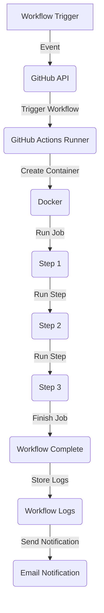

## Introduction
**GitHub Actions** is a Continuous Integration/Continuous Deployment (CI/CD) platform that allows you to automate your build, test, and deployment pipeline. It's a powerful tool that enables you to create custom workflows, jobs, steps, and actions to streamline your development process. With GitHub Actions, you can automate tasks such as building and testing your code, deploying to production, and even creating custom workflows for specific use cases. In this article, we'll dive deep into the world of GitHub Actions and explore its core concepts, internal mechanics, and provide examples of how to use it in real-world scenarios.

> **Note:** GitHub Actions is a relatively new platform, but it has quickly gained popularity among developers due to its ease of use, flexibility, and seamless integration with GitHub repositories.

## Core Concepts
To understand GitHub Actions, you need to familiarize yourself with its core concepts:

* **Workflows**: A workflow is a custom automated process that you can create to perform a specific task or set of tasks. Workflows are defined in a YAML file and can be triggered by various events, such as push, pull request, or schedule.
* **Jobs**: A job is a set of steps that run in a specific environment. Jobs can run in parallel or sequentially, depending on the workflow configuration.
* **Steps**: A step is a single task that runs within a job. Steps can be used to run scripts, commands, or actions.
* **Actions**: An action is a reusable piece of code that can be used to perform a specific task. Actions can be created by you or by others and can be shared across multiple workflows.

> **Tip:** When creating workflows, it's essential to keep them simple and focused on a specific task. This will make it easier to maintain and debug your workflows.

## How It Works Internally
When you create a workflow, GitHub Actions uses a combination of **GitHub API**, **GitHub Actions Runner**, and **Docker** to execute the workflow. Here's a high-level overview of the process:

1. **Workflow Trigger**: The workflow is triggered by an event, such as a push or pull request.
2. **GitHub API**: The GitHub API receives the event and triggers the workflow.
3. **GitHub Actions Runner**: The GitHub Actions Runner is a service that runs the workflow. It uses Docker to create a container for each job.
4. **Docker**: Docker creates a container for each job, and the GitHub Actions Runner executes the steps within the container.
5. **Step Execution**: Each step is executed within the container, and the output is captured and stored in the workflow logs.

> **Warning:** Be careful when using Docker containers, as they can consume a significant amount of resources if not properly configured.

## Code Examples
Here are three complete and runnable examples of GitHub Actions workflows:

### Example 1: Basic Workflow
```yml
name: Basic Workflow
on:
  push:
    branches:
      - main
jobs:
  build:
    runs-on: ubuntu-latest
    steps:
      - name: Checkout code
        uses: actions/checkout@v2
      - name: Run script
        run: |
          echo "Hello World!"
```
This workflow triggers on push events to the main branch and runs a simple script that prints "Hello World!".

### Example 2: Real-world Workflow
```yml
name: Build and Deploy
on:
  push:
    branches:
      - main
jobs:
  build-and-deploy:
    runs-on: ubuntu-latest
    steps:
      - name: Checkout code
        uses: actions/checkout@v2
      - name: Build and package
        run: |
          npm install
          npm run build
      - name: Deploy to production
        uses: appleboy/scp-action@v1
        with:
          host: ${{ secrets.HOST }}
          username: ${{ secrets.USERNAME }}
          password: ${{ secrets.PASSWORD }}
          source: "dist/"
          target: "/var/www/html/"
```
This workflow triggers on push events to the main branch, builds and packages the code using npm, and deploys the package to a production server using SCP.

### Example 3: Advanced Workflow
```yml
name: Advanced Workflow
on:
  push:
    branches:
      - main
jobs:
  build-and-deploy:
    runs-on: ubuntu-latest
    steps:
      - name: Checkout code
        uses: actions/checkout@v2
      - name: Build and package
        run: |
          npm install
          npm run build
      - name: Run tests
        run: |
          npm run test
      - name: Deploy to production
        uses: appleboy/scp-action@v1
        with:
          host: ${{ secrets.HOST }}
          username: ${{ secrets.USERNAME }}
          password: ${{ secrets.PASSWORD }}
          source: "dist/"
          target: "/var/www/html/"
      - name: Send notification
        uses: peter-evans/send-email@v2
        with:
          to: ${{ secrets.EMAIL }}
          subject: "Deployment successful!"
          body: "The deployment was successful!"
```
This workflow triggers on push events to the main branch, builds and packages the code, runs tests, deploys the package to a production server, and sends a notification email using a custom action.

## Visual Diagram

This diagram illustrates the workflow execution process, from the initial trigger event to the final notification email.

## Comparison
| Approach | Time Complexity | Space Complexity | Pros | Cons | Best For |
| --- | --- | --- | --- | --- | --- |
| GitHub Actions | O(n) | O(n) | Easy to use, seamless integration with GitHub, customizable workflows | Limited free minutes, requires GitHub repository | Small to medium-sized projects, CI/CD pipelines |
| Jenkins | O(n) | O(n) | Highly customizable, large community support, supports multiple platforms | Steep learning curve, requires manual setup and maintenance | Large-scale projects, complex CI/CD pipelines |
| CircleCI | O(n) | O(n) | Fast and reliable, supports multiple platforms, easy to use | Limited free minutes, requires GitHub repository | Small to medium-sized projects, CI/CD pipelines |
| Travis CI | O(n) | O(n) | Easy to use, supports multiple platforms, free for open-source projects | Limited free minutes, requires GitHub repository | Small to medium-sized projects, open-source projects |

> **Interview:** When asked about CI/CD pipelines, be prepared to explain the differences between various tools and platforms, such as GitHub Actions, Jenkins, CircleCI, and Travis CI.

## Real-world Use Cases
Here are three real-world examples of GitHub Actions in production:

* **Microsoft**: Microsoft uses GitHub Actions to automate their build and deployment process for their Azure DevOps platform.
* **Netflix**: Netflix uses GitHub Actions to automate their build and deployment process for their streaming service.
* **GitHub**: GitHub uses GitHub Actions to automate their own build and deployment process for their platform.

> **Tip:** When implementing GitHub Actions in production, make sure to monitor and optimize your workflows regularly to ensure they are running efficiently and effectively.

## Common Pitfalls
Here are four common mistakes to avoid when using GitHub Actions:

* **Incorrect workflow configuration**: Make sure to configure your workflow correctly, including the trigger event, job, and steps.
* **Insufficient logging**: Make sure to log important events and output to troubleshoot issues and optimize your workflow.
* **Insecure secrets**: Make sure to store sensitive information, such as API keys and passwords, securely using GitHub Secrets.
* **Inefficient resource usage**: Make sure to optimize your workflow to use resources efficiently, including CPU, memory, and storage.

> **Warning:** Be careful when using GitHub Actions, as incorrect configuration or insecure secrets can lead to security vulnerabilities and data breaches.

## Interview Tips
Here are three common interview questions related to GitHub Actions:

* **What is GitHub Actions, and how does it work?**: Be prepared to explain the core concepts of GitHub Actions, including workflows, jobs, steps, and actions.
* **How do you optimize GitHub Actions workflows for performance?**: Be prepared to explain how to optimize workflows for performance, including using efficient resources, minimizing dependencies, and optimizing step execution.
* **How do you troubleshoot issues with GitHub Actions workflows?**: Be prepared to explain how to troubleshoot issues with GitHub Actions workflows, including checking logs, using debug mode, and optimizing step execution.

> **Note:** When answering interview questions, make sure to provide specific examples and use cases to demonstrate your expertise and experience with GitHub Actions.

## Key Takeaways
Here are ten key takeaways to remember when using GitHub Actions:

* **GitHub Actions is a powerful CI/CD platform**: GitHub Actions is a flexible and customizable platform that can automate your build, test, and deployment process.
* **Workflows are the core of GitHub Actions**: Workflows are the foundation of GitHub Actions, and understanding how to create and configure them is essential.
* **Jobs and steps are essential components of workflows**: Jobs and steps are used to execute tasks within a workflow, and understanding how to use them is critical.
* **Actions are reusable pieces of code**: Actions are reusable pieces of code that can be used to perform specific tasks within a workflow.
* **GitHub Actions has a large community support**: GitHub Actions has a large and active community, with many pre-built actions and workflows available.
* **GitHub Actions is free for public repositories**: GitHub Actions is free for public repositories, making it an excellent choice for open-source projects.
* **GitHub Actions has a limited number of free minutes**: GitHub Actions has a limited number of free minutes, making it essential to optimize your workflows for performance.
* **GitHub Actions supports multiple platforms**: GitHub Actions supports multiple platforms, including Windows, macOS, and Linux.
* **GitHub Actions has a user-friendly interface**: GitHub Actions has a user-friendly interface that makes it easy to create and manage workflows.
* **GitHub Actions is highly customizable**: GitHub Actions is highly customizable, allowing you to create complex workflows and automate your build, test, and deployment process.