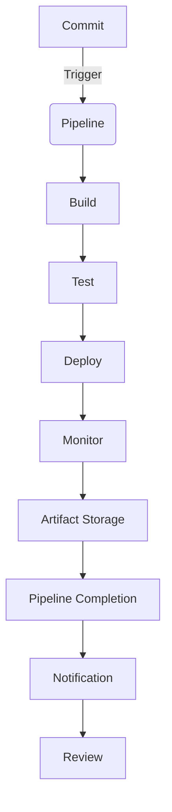

## Introduction
**GitLab CI/CD** is a powerful tool for automating the build, test, and deployment of software applications. It is an integral part of the **DevOps** workflow, enabling teams to deliver high-quality software faster and more reliably. In this section, we will explore the importance of GitLab CI/CD, its real-world relevance, and why every engineer should understand its concepts.

> **Note:** GitLab CI/CD is a key component of the GitLab platform, which offers a comprehensive set of tools for software development, version control, and collaboration.

GitLab CI/CD solves the problem of manual deployment and testing, which can be time-consuming and prone to errors. By automating these processes, teams can focus on writing code and delivering value to their customers. With GitLab CI/CD, you can define a pipeline that automates the build, test, and deployment of your application, ensuring that it is delivered quickly and reliably.

## Core Concepts
To understand GitLab CI/CD, you need to grasp the following core concepts:

* **Pipeline**: A pipeline is a series of tasks that are executed in a specific order. It defines the workflow for building, testing, and deploying an application.
* **Job**: A job is a single task that is executed within a pipeline. It can be a build, test, or deployment task.
* **Stage**: A stage is a group of jobs that are executed in parallel. It defines a logical grouping of tasks that need to be executed together.
* **Artifact**: An artifact is a file or directory that is produced by a job and can be used as input for another job.

> **Tip:** Understanding the core concepts of GitLab CI/CD is essential for defining efficient and effective pipelines.

## How It Works Internally
GitLab CI/CD works by defining a pipeline in a `.gitlab-ci.yml` file. This file specifies the jobs, stages, and artifacts that are used to build, test, and deploy an application. When a pipeline is triggered, GitLab CI/CD executes the jobs in the defined order, using the specified artifacts as input.

Here is a high-level overview of the process:

1. **Pipeline Trigger**: A pipeline is triggered by a commit, merge request, or scheduled job.
2. **Job Execution**: GitLab CI/CD executes the jobs in the pipeline, using the specified artifacts as input.
3. **Artifact Storage**: GitLab CI/CD stores the artifacts produced by each job, so that they can be used as input for other jobs.
4. **Stage Execution**: GitLab CI/CD executes the stages in the pipeline, grouping jobs that need to be executed together.
5. **Pipeline Completion**: The pipeline is completed when all jobs have been executed successfully.

> **Warning:** Understanding the internal workflow of GitLab CI/CD is crucial for troubleshooting and optimizing pipelines.

## Code Examples
Here are three complete and runnable examples of GitLab CI/CD pipelines:

### Example 1: Basic Pipeline
```yml
stages:
  - build
  - test
  - deploy

build:
  stage: build
  script:
    - echo "Building application..."
    - mkdir build
    - touch build/app.jar

test:
  stage: test
  script:
    - echo "Testing application..."
    - mkdir test
    - touch test/results.txt

deploy:
  stage: deploy
  script:
    - echo "Deploying application..."
    - mkdir deploy
    - touch deploy/app.jar
```
This pipeline defines three stages: build, test, and deploy. Each stage has a single job that executes a script.

### Example 2: Real-World Pipeline
```yml
stages:
  - build
  - test
  - deploy

variables:
  BUILD_DIR: build
  TEST_DIR: test
  DEPLOY_DIR: deploy

build:
  stage: build
  script:
    - echo "Building application..."
    - mkdir $BUILD_DIR
    - touch $BUILD_DIR/app.jar
  artifacts:
    paths:
      - $BUILD_DIR/app.jar

test:
  stage: test
  script:
    - echo "Testing application..."
    - mkdir $TEST_DIR
    - touch $TEST_DIR/results.txt
  dependencies:
    - build

deploy:
  stage: deploy
  script:
    - echo "Deploying application..."
    - mkdir $DEPLOY_DIR
    - touch $DEPLOY_DIR/app.jar
  dependencies:
    - test
```
This pipeline defines three stages: build, test, and deploy. Each stage has a single job that executes a script, using artifacts from previous stages as input.

### Example 3: Advanced Pipeline
```yml
stages:
  - build
  - test
  - deploy
  - monitor

variables:
  BUILD_DIR: build
  TEST_DIR: test
  DEPLOY_DIR: deploy
  MONITOR_DIR: monitor

build:
  stage: build
  script:
    - echo "Building application..."
    - mkdir $BUILD_DIR
    - touch $BUILD_DIR/app.jar
  artifacts:
    paths:
      - $BUILD_DIR/app.jar

test:
  stage: test
  script:
    - echo "Testing application..."
    - mkdir $TEST_DIR
    - touch $TEST_DIR/results.txt
  dependencies:
    - build

deploy:
  stage: deploy
  script:
    - echo "Deploying application..."
    - mkdir $DEPLOY_DIR
    - touch $DEPLOY_DIR/app.jar
  dependencies:
    - test

monitor:
  stage: monitor
  script:
    - echo "Monitoring application..."
    - mkdir $MONITOR_DIR
    - touch $MONITOR_DIR/logs.txt
  dependencies:
    - deploy
```
This pipeline defines four stages: build, test, deploy, and monitor. Each stage has a single job that executes a script, using artifacts from previous stages as input.

> **Interview:** Can you explain the difference between a job and a stage in GitLab CI/CD? How do you define a pipeline in a `.gitlab-ci.yml` file?

## Visual Diagram

This diagram illustrates the workflow of a GitLab CI/CD pipeline, from commit to pipeline completion.

> **Tip:** Understanding the visual workflow of a pipeline can help you identify bottlenecks and optimize the process.

## Comparison
| Approach | Time Complexity | Space Complexity | Pros | Cons | Best For |
| --- | --- | --- | --- | --- | --- |
| GitLab CI/CD | O(n) | O(n) | Automated deployment, testing, and monitoring | Steep learning curve | Large-scale applications |
| Jenkins | O(n) | O(n) | Flexible and customizable | Resource-intensive | Small-scale applications |
| Travis CI | O(n) | O(n) | Easy to use and integrate | Limited features | Open-source projects |
| CircleCI | O(n) | O(n) | Fast and reliable | Expensive | Enterprise applications |

> **Warning:** Choosing the wrong CI/CD tool can lead to inefficient pipelines and decreased productivity.

## Real-world Use Cases
Here are three real-world examples of companies using GitLab CI/CD:

* **GitLab**: GitLab uses its own CI/CD tool to automate the deployment of its application, ensuring that it is delivered quickly and reliably.
* **Microsoft**: Microsoft uses GitLab CI/CD to automate the deployment of its Azure DevOps platform, ensuring that it is delivered quickly and reliably.
* **IBM**: IBM uses GitLab CI/CD to automate the deployment of its cloud-based applications, ensuring that they are delivered quickly and reliably.

> **Note:** GitLab CI/CD is widely used in the industry, and its adoption is growing rapidly.

## Common Pitfalls
Here are four common mistakes that engineers make when using GitLab CI/CD:

* **Incorrect pipeline definition**: Defining a pipeline with incorrect stages or jobs can lead to inefficient pipelines and decreased productivity.
* **Insufficient artifact storage**: Failing to store artifacts correctly can lead to lost data and decreased productivity.
* **Inadequate testing**: Failing to test applications thoroughly can lead to bugs and decreased quality.
* **Inefficient deployment**: Failing to deploy applications efficiently can lead to decreased productivity and increased downtime.

> **Tip:** Understanding common pitfalls can help you avoid mistakes and optimize your pipelines.

## Interview Tips
Here are three common interview questions related to GitLab CI/CD:

* **What is the difference between a job and a stage in GitLab CI/CD?**: A job is a single task that is executed within a pipeline, while a stage is a group of jobs that are executed in parallel.
* **How do you define a pipeline in a `.gitlab-ci.yml` file?**: A pipeline is defined by specifying the jobs, stages, and artifacts that are used to build, test, and deploy an application.
* **What are the benefits of using GitLab CI/CD?**: The benefits of using GitLab CI/CD include automated deployment, testing, and monitoring, as well as increased productivity and decreased downtime.

> **Interview:** Can you explain the concept of a pipeline in GitLab CI/CD? How do you optimize a pipeline for performance?

## Key Takeaways
Here are ten key takeaways from this section:

* **GitLab CI/CD is a powerful tool for automating the build, test, and deployment of software applications**.
* **A pipeline is a series of tasks that are executed in a specific order**.
* **A job is a single task that is executed within a pipeline**.
* **A stage is a group of jobs that are executed in parallel**.
* **Artifacts are files or directories that are produced by a job and can be used as input for another job**.
* **GitLab CI/CD works by defining a pipeline in a `.gitlab-ci.yml` file**.
* **The pipeline is triggered by a commit, merge request, or scheduled job**.
* **GitLab CI/CD executes the jobs in the pipeline, using the specified artifacts as input**.
* **The pipeline is completed when all jobs have been executed successfully**.
* **Understanding the core concepts of GitLab CI/CD is essential for defining efficient and effective pipelines**.

> **Note:** Mastering GitLab CI/CD requires a deep understanding of its core concepts and how it works internally.