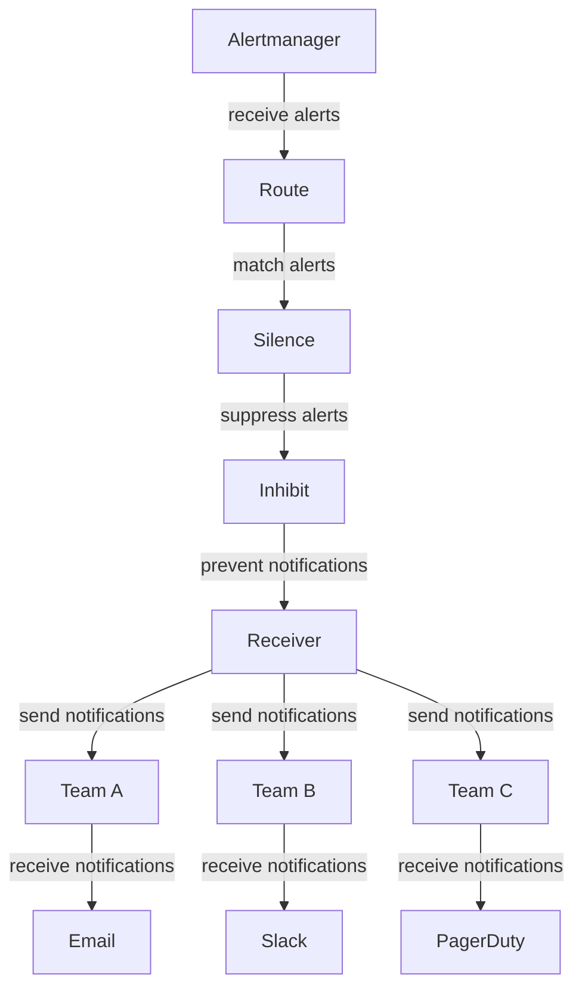

## Introduction
**Alertmanager** is a critical component of the **Prometheus** monitoring system, responsible for handling alerts generated by Prometheus. It provides a flexible way to manage alerts, including routing, silencing, and inhibiting. In this section, we will explore the importance of Alertmanager, its real-world relevance, and why every engineer needs to know about it. 
> **Note:** Alertmanager is not just a simple alert handler, but a powerful tool that helps reduce noise and improve the overall reliability of your system.
Alertmanager is essential in production environments, as it helps teams respond to critical issues promptly and efficiently. By understanding how Alertmanager works and how to configure it effectively, engineers can ensure that their systems are properly monitored and that alerts are handled correctly.

## Core Concepts
To work with Alertmanager, it's essential to understand the following core concepts:
* **Alert**: An alert is a notification generated by Prometheus when a condition is met. Alerts can be triggered by various events, such as high CPU usage, low disk space, or failed services.
* **Route**: A route is a way to direct alerts to specific receivers, such as email, Slack, or PagerDuty. Routes can be configured based on alert labels, annotations, and other conditions.
* **Silence**: A silence is a way to suppress alerts for a specific period. Silences can be configured based on alert labels, annotations, and other conditions.
* **Inhibit**: An inhibit is a way to prevent alerts from being sent to receivers when certain conditions are met. Inhibits can be configured based on alert labels, annotations, and other conditions.
> **Warning:** Incorrectly configuring routes, silences, or inhibits can lead to missed alerts or unnecessary noise.
Understanding these concepts is crucial for effective Alertmanager configuration and usage.

## How It Works Internally
Alertmanager works internally by following these steps:
1. **Receive alerts**: Alertmanager receives alerts from Prometheus.
2. **Match alerts**: Alertmanager matches alerts against configured routes, silences, and inhibits.
3. **Route alerts**: Alertmanager routes matched alerts to configured receivers.
4. **Send notifications**: Alertmanager sends notifications to receivers.
> **Tip:** To optimize Alertmanager performance, it's essential to configure routes, silences, and inhibits carefully to minimize the number of notifications sent.
Alertmanager's internal mechanics are designed to handle a large volume of alerts efficiently and effectively.

## Code Examples
Here are three complete and runnable code examples that demonstrate Alertmanager configuration and usage:

### Example 1: Basic Alertmanager Configuration
```yml
# alertmanager.yml
global:
  smtp_smarthost: 'smtp.gmail.com:587'
  smtp_from: 'alertmanager@example.com'
  smtp_auth_username: 'alertmanager@example.com'
  smtp_auth_password: 'password'

route:
  receiver: team-a
  group_by: ['alertname']

receivers:
- name: team-a
  email_configs:
  - to: team-a@example.com
    from: alertmanager@example.com
    smarthost: smtp.gmail.com:587
    auth_username: alertmanager@example.com
    auth_password: password
```
This example demonstrates a basic Alertmanager configuration that routes alerts to a team's email address.

### Example 2: Advanced Alertmanager Configuration
```yml
# alertmanager.yml
global:
  smtp_smarthost: 'smtp.gmail.com:587'
  smtp_from: 'alertmanager@example.com'
  smtp_auth_username: 'alertmanager@example.com'
  smtp_auth_password: 'password'

route:
  receiver: team-a
  group_by: ['alertname']
  routes:
  - receiver: team-b
    match:
      alertname: 'CPUUsageHigh'
  - receiver: team-c
    match:
      alertname: 'DiskSpaceLow'

receivers:
- name: team-a
  email_configs:
  - to: team-a@example.com
    from: alertmanager@example.com
    smarthost: smtp.gmail.com:587
    auth_username: alertmanager@example.com
    auth_password: password
- name: team-b
  email_configs:
  - to: team-b@example.com
    from: alertmanager@example.com
    smarthost: smtp.gmail.com:587
    auth_username: alertmanager@example.com
    auth_password: password
- name: team-c
  email_configs:
  - to: team-c@example.com
    from: alertmanager@example.com
    smarthost: smtp.gmail.com:587
    auth_username: alertmanager@example.com
    auth_password: password
```
This example demonstrates an advanced Alertmanager configuration that routes alerts to different teams based on alert names.

### Example 3: Silencing Alerts
```yml
# silence.yaml
- match:
    alertname: 'CPUUsageHigh'
  start: '2023-03-01T00:00:00Z'
  end: '2023-03-01T01:00:00Z'
  creator: 'admin'
  comment: 'Silence CPUUsageHigh alert for 1 hour'
```
This example demonstrates how to silence an alert for a specific period.

## Visual Diagram

This diagram illustrates the Alertmanager workflow, including receiving alerts, matching alerts, silencing alerts, inhibiting notifications, and sending notifications to receivers.

## Comparison
| Approach | Time Complexity | Space Complexity | Pros | Cons | Best For |
|----------|----------------|-----------------|------|------|----------|
| Alertmanager | O(n) | O(n) | Flexible routing, silencing, and inhibiting | Complex configuration | Large-scale production environments |
| Prometheus | O(n) | O(n) | Powerful monitoring and alerting capabilities | Limited routing and silencing capabilities | Small-scale production environments |
| Grafana | O(n) | O(n) | Visualized monitoring and alerting capabilities | Limited routing and silencing capabilities | Small-scale production environments |
| Nagios | O(n) | O(n) | Mature monitoring and alerting capabilities | Limited routing and silencing capabilities | Small-scale production environments |
> **Interview:** What is the difference between Alertmanager and Prometheus? Answer: Alertmanager is responsible for handling alerts generated by Prometheus, while Prometheus is responsible for monitoring and generating alerts.

## Real-world Use Cases
Here are three real-world use cases for Alertmanager:
* **Google**: Google uses Alertmanager to manage alerts generated by their Prometheus monitoring system.
* **Netflix**: Netflix uses Alertmanager to manage alerts generated by their Prometheus monitoring system and route them to different teams based on alert names.
* **Amazon**: Amazon uses Alertmanager to manage alerts generated by their Prometheus monitoring system and silence alerts during maintenance windows.

## Common Pitfalls
Here are four common pitfalls when using Alertmanager:
* **Incorrect routing**: Incorrectly configuring routes can lead to missed alerts or unnecessary noise.
* **Insufficient silencing**: Insufficiently silencing alerts can lead to unnecessary noise.
* **Inadequate inhibiting**: Inadequately inhibiting notifications can lead to unnecessary noise.
* **Poor configuration**: Poorly configuring Alertmanager can lead to missed alerts or unnecessary noise.
> **Warning:** Incorrectly configuring Alertmanager can have severe consequences, including missed alerts or unnecessary noise.

## Interview Tips
Here are three common interview questions related to Alertmanager:
* **What is the difference between Alertmanager and Prometheus?** Answer: Alertmanager is responsible for handling alerts generated by Prometheus, while Prometheus is responsible for monitoring and generating alerts.
* **How do you configure routes in Alertmanager?** Answer: Routes can be configured based on alert labels, annotations, and other conditions.
* **What is the purpose of silencing in Alertmanager?** Answer: Silencing is used to suppress alerts for a specific period.

## Key Takeaways
Here are ten key takeaways for Alertmanager:
* **Alertmanager is responsible for handling alerts generated by Prometheus**.
* **Routes can be configured based on alert labels, annotations, and other conditions**.
* **Silencing is used to suppress alerts for a specific period**.
* **Inhibiting is used to prevent notifications from being sent**.
* **Alertmanager has a flexible and customizable configuration**.
* **Alertmanager is suitable for large-scale production environments**.
* **Incorrectly configuring Alertmanager can have severe consequences**.
* **Alertmanager has a high time complexity of O(n)**.
* **Alertmanager has a high space complexity of O(n)**.
* **Alertmanager is a critical component of the Prometheus monitoring system**.
> **Tip:** To get the most out of Alertmanager, it's essential to configure routes, silences, and inhibits carefully and monitor the system regularly.