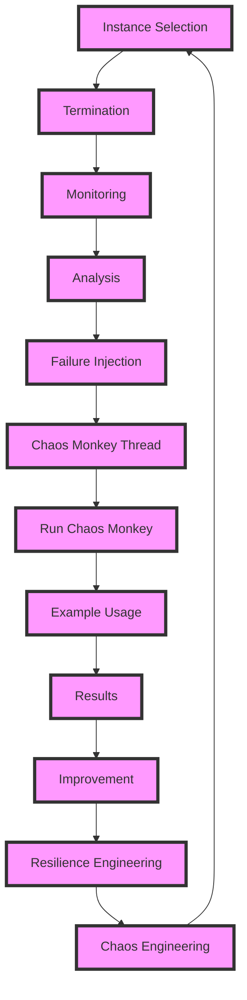

## Introduction
**Chaos Engineering** is the practice of intentionally introducing failures into a system to test its resilience and fault tolerance. One popular tool for chaos engineering is **Chaos Monkey**, a software that randomly terminates instances in a distributed system to simulate real-world failures. In this section, we will explore the concept of chaos engineering, its importance, and its relevance in real-world systems.

> **Note:** Chaos engineering is not just about breaking things, but about understanding how a system responds to failures and improving its overall resilience.

Chaos engineering is crucial in ensuring the reliability and availability of complex systems, especially in cloud computing and distributed systems. By simulating failures, developers can identify potential weaknesses and design more robust systems. In real-world scenarios, companies like Netflix, Amazon, and Google use chaos engineering to test their systems and improve their overall performance.

## Core Concepts
**Chaos engineering** involves intentionally introducing failures into a system to test its resilience. The goal is to identify potential weaknesses and improve the system's overall fault tolerance. Key concepts in chaos engineering include:

* **Fault injection**: introducing failures into a system to test its response
* **Resilience**: the ability of a system to recover from failures
* **Fault tolerance**: the ability of a system to continue operating despite failures

> **Warning:** Chaos engineering should be done in a controlled environment, as it can cause unintended consequences if not properly managed.

Mental models for chaos engineering include thinking about the system as a whole, understanding the dependencies between components, and identifying potential failure points. Key terminology includes **Chaos Monkey**, **failure injection**, and **resilience engineering**.

## How It Works Internally
Chaos Monkey works by randomly terminating instances in a distributed system. The process involves the following steps:

1. **Instance selection**: Chaos Monkey selects an instance to terminate based on a set of predefined rules.
2. **Termination**: Chaos Monkey terminates the selected instance, simulating a real-world failure.
3. **Monitoring**: The system is monitored to observe its response to the failure.
4. **Analysis**: The results are analyzed to identify potential weaknesses and improve the system's resilience.

> **Tip:** Chaos Monkey can be configured to terminate instances based on specific criteria, such as instance type or location.

The internal mechanics of Chaos Monkey involve using APIs to interact with the distributed system and terminate instances. The tool uses a combination of algorithms and heuristics to select instances and simulate failures.

## Code Examples
### Example 1: Basic Chaos Monkey Configuration
```python
import os
import random
import time

# Define the instance selection criteria
def select_instance(instances):
    return random.choice(instances)

# Define the termination function
def terminate_instance(instance):
    # Simulate instance termination
    print(f"Terminating instance {instance}")

# Define the monitoring function
def monitor_system():
    # Simulate system monitoring
    print("Monitoring system")

# Define the analysis function
def analyze_results():
    # Simulate results analysis
    print("Analyzing results")

# Run the chaos monkey
def run_chaos_monkey(instances):
    instance = select_instance(instances)
    terminate_instance(instance)
    monitor_system()
    analyze_results()

# Example usage
instances = ["instance1", "instance2", "instance3"]
run_chaos_monkey(instances)
```

### Example 2: Advanced Chaos Monkey Configuration
```python
import os
import random
import time
import threading

# Define the instance selection criteria
def select_instance(instances):
    return random.choice(instances)

# Define the termination function
def terminate_instance(instance):
    # Simulate instance termination
    print(f"Terminating instance {instance}")

# Define the monitoring function
def monitor_system():
    # Simulate system monitoring
    print("Monitoring system")

# Define the analysis function
def analyze_results():
    # Simulate results analysis
    print("Analyzing results")

# Define the chaos monkey thread
class ChaosMonkeyThread(threading.Thread):
    def __init__(self, instances):
        threading.Thread.__init__(self)
        self.instances = instances

    def run(self):
        instance = select_instance(self.instances)
        terminate_instance(instance)
        monitor_system()
        analyze_results()

# Run the chaos monkey
def run_chaos_monkey(instances):
    thread = ChaosMonkeyThread(instances)
    thread.start()

# Example usage
instances = ["instance1", "instance2", "instance3"]
run_chaos_monkey(instances)
```

### Example 3: Chaos Monkey with Failure Injection
```python
import os
import random
import time
import threading

# Define the instance selection criteria
def select_instance(instances):
    return random.choice(instances)

# Define the termination function
def terminate_instance(instance):
    # Simulate instance termination
    print(f"Terminating instance {instance}")

# Define the monitoring function
def monitor_system():
    # Simulate system monitoring
    print("Monitoring system")

# Define the analysis function
def analyze_results():
    # Simulate results analysis
    print("Analyzing results")

# Define the failure injection function
def inject_failure(instance):
    # Simulate failure injection
    print(f"Injecting failure into instance {instance}")

# Define the chaos monkey thread
class ChaosMonkeyThread(threading.Thread):
    def __init__(self, instances):
        threading.Thread.__init__(self)
        self.instances = instances

    def run(self):
        instance = select_instance(self.instances)
        terminate_instance(instance)
        inject_failure(instance)
        monitor_system()
        analyze_results()

# Run the chaos monkey
def run_chaos_monkey(instances):
    thread = ChaosMonkeyThread(instances)
    thread.start()

# Example usage
instances = ["instance1", "instance2", "instance3"]
run_chaos_monkey(instances)
```

## Visual Diagram

The diagram illustrates the chaos monkey workflow, from instance selection to resilience engineering. Each node represents a step in the process, and the arrows indicate the flow of the workflow.

> **Tip:** The diagram can be customized to show different aspects of the chaos monkey workflow.

## Comparison
| Approach | Time Complexity | Space Complexity | Pros | Cons | Best For |
| --- | --- | --- | --- | --- | --- |
| Chaos Monkey | O(n) | O(1) | Simulates real-world failures, improves resilience | Can be resource-intensive, requires careful configuration | Distributed systems, cloud computing |
| Failure Injection | O(1) | O(1) | Simulates specific failures, easy to implement | Limited scope, may not simulate real-world failures | Small-scale systems, testing |
| Resilience Engineering | O(n) | O(n) | Improves overall resilience, comprehensive approach | Requires significant resources, complex to implement | Large-scale systems, mission-critical applications |
| Fault Tolerance | O(1) | O(1) | Ensures system availability, easy to implement | May not improve resilience, limited scope | Small-scale systems, non-critical applications |

## Real-world Use Cases
* **Netflix**: Uses chaos monkey to test the resilience of its distributed system.
* **Amazon**: Uses failure injection to simulate failures in its cloud computing platform.
* **Google**: Uses resilience engineering to improve the overall resilience of its large-scale systems.

> **Note:** These companies use chaos engineering to improve the reliability and availability of their systems.

## Common Pitfalls
* **Insufficient testing**: Failing to test the system thoroughly before deploying chaos monkey.
* **Inadequate monitoring**: Failing to monitor the system properly during chaos monkey runs.
* **Inconsistent configuration**: Failing to configure chaos monkey consistently across different environments.
* **Lack of analysis**: Failing to analyze the results of chaos monkey runs.

> **Warning:** These pitfalls can lead to unintended consequences, such as system downtime or data loss.

## Interview Tips
* **What is chaos engineering?**: Define chaos engineering and its importance in ensuring system resilience.
* **How does chaos monkey work?**: Explain the internal mechanics of chaos monkey and its workflow.
* **What are some common pitfalls in chaos engineering?**: Discuss common mistakes and how to avoid them.

> **Interview:** Be prepared to answer questions about chaos engineering, chaos monkey, and resilience engineering.

## Key Takeaways
* Chaos engineering is essential for ensuring system resilience and fault tolerance.
* Chaos monkey is a popular tool for simulating real-world failures in distributed systems.
* Failure injection and resilience engineering are also important approaches in chaos engineering.
* Monitoring and analysis are critical components of chaos engineering.
* Common pitfalls include insufficient testing, inadequate monitoring, inconsistent configuration, and lack of analysis.
* Chaos engineering is a complex and multidisciplinary field that requires careful planning and execution.
* The time complexity of chaos monkey is O(n), and the space complexity is O(1).
* The best approach for chaos engineering depends on the specific use case and system requirements.