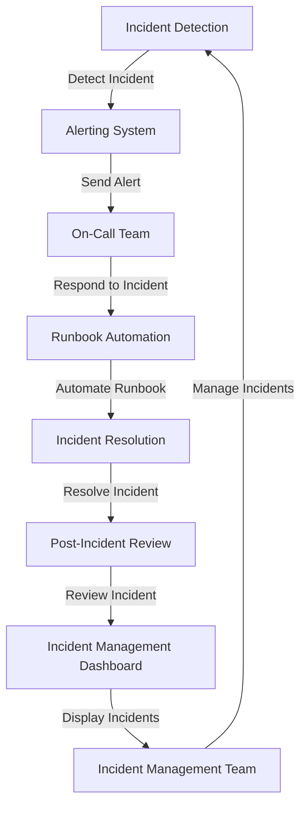

## Introduction
On-call and incident management is a critical aspect of ensuring the reliability and uptime of complex systems. It involves having a team of engineers on standby to respond to and resolve incidents, such as outages or errors, in a timely and efficient manner. This approach is essential in today's fast-paced, always-on digital landscape, where downtime can result in significant financial losses and damage to a company's reputation. Every engineer needs to understand the principles of on-call and incident management to ensure that their systems are designed with reliability and maintainability in mind.

> **Note:** Incident management is not just about responding to incidents, but also about preventing them from occurring in the first place. This can be achieved through proactive monitoring, testing, and maintenance of systems.

## Core Concepts
On-call and incident management involves several key concepts, including:
* **Incident**: an unplanned interruption to a service or a reduction in the quality of a service.
* **On-call**: a team of engineers who are available to respond to incidents outside of regular working hours.
* **Incident management process**: a set of procedures and protocols that are followed to respond to and resolve incidents.
* **Runbook**: a set of predefined procedures and checklists that are used to troubleshoot and resolve common incidents.

> **Warning:** Failing to have a well-defined incident management process can lead to delays in responding to incidents, which can result in longer downtime and increased financial losses.

## How It Works Internally
The incident management process typically involves the following steps:
1. **Detection**: the incident is detected through monitoring tools or user reports.
2. **Alerting**: the on-call team is alerted to the incident through notification systems, such as pager duty or slack.
3. **Triage**: the incident is assessed to determine its severity and impact.
4. **Response**: the on-call team responds to the incident by following the runbook and incident management process.
5. **Resolution**: the incident is resolved, and the system is restored to its normal operating state.
6. **Post-incident review**: the incident is reviewed to identify the root cause and areas for improvement.

## Code Examples
### Example 1: Basic On-Call Alerting System
```python
import requests
import json

# Define the alerting system API endpoint
alert_endpoint = "https://api.example.com/alert"

# Define the on-call team's notification channel
notification_channel = "https://slack.example.com/alert"

# Define the incident detection function
def detect_incident():
    # Simulate incident detection
    return True

# Define the alerting function
def send_alert(incident):
    # Create the alert payload
    payload = {
        "incident": incident,
        "notification_channel": notification_channel
    }

    # Send the alert to the on-call team
    response = requests.post(alert_endpoint, json=payload)

    # Check if the alert was sent successfully
    if response.status_code == 200:
        print("Alert sent successfully")
    else:
        print("Error sending alert")

# Detect and alert on incident
if detect_incident():
    send_alert("Example Incident")
```

### Example 2: Runbook Automation
```python
import os
import subprocess

# Define the runbook directory
runbook_dir = "/path/to/runbook"

# Define the incident type
incident_type = "example_incident"

# Define the runbook automation function
def automate_runbook(incident_type):
    # Get the runbook file for the incident type
    runbook_file = os.path.join(runbook_dir, f"{incident_type}.sh")

    # Check if the runbook file exists
    if os.path.exists(runbook_file):
        # Run the runbook file
        subprocess.run([runbook_file])
    else:
        print(f"Runbook file not found for incident type {incident_type}")

# Automate the runbook for the example incident
automate_runbook(incident_type)
```

### Example 3: Incident Management Dashboard
```javascript
import React, { useState, useEffect } from "react";
import axios from "axios";

// Define the incident management API endpoint
incident_endpoint = "https://api.example.com/incident";

// Define the incident management dashboard component
function IncidentDashboard() {
    const [incidents, setIncidents] = useState([]);

    // Define the function to fetch incidents
    useEffect(() => {
        axios.get(incident_endpoint)
            .then(response => {
                setIncidents(response.data);
            })
            .catch(error => {
                console.error(error);
            });
    }, []);

    // Render the incidents table
    return (
        <table>
            <thead>
                <tr>
                    <th>Incident ID</th>
                    <th>Incident Type</th>
                    <th>Status</th>
                </tr>
            </thead>
            <tbody>
                {incidents.map(incident => (
                    <tr key={incident.id}>
                        <td>{incident.id}</td>
                        <td>{incident.type}</td>
                        <td>{incident.status}</td>
                    </tr>
                ))}
            </tbody>
        </table>
    );
}

export default IncidentDashboard;
```

## Visual Diagram

The diagram illustrates the incident management process, from detection to resolution, and highlights the key components involved.

## Comparison
| Approach | Time Complexity | Space Complexity | Pros | Cons | Best For |
| --- | --- | --- | --- | --- | --- |
| Manual Incident Management | O(1) | O(1) | Simple to implement, low overhead | Error-prone, slow response times | Small teams, simple systems |
| Automated Incident Management | O(n) | O(n) | Fast response times, reduced errors | Complex to implement, high overhead | Large teams, complex systems |
| Hybrid Incident Management | O(n) | O(n) | Balances simplicity and automation | Requires careful planning, may be slow | Medium-sized teams, moderate complexity systems |
| AI-Powered Incident Management | O(n log n) | O(n log n) | Fast response times, high accuracy | Requires large amounts of data, may be expensive | Large teams, complex systems with large amounts of data |

## Real-world Use Cases
1. **Netflix**: uses a combination of automated and manual incident management to ensure the reliability of its streaming service.
2. **Amazon Web Services**: uses a hybrid approach to incident management, combining automation with human intervention to ensure the reliability of its cloud services.
3. **Google**: uses AI-powered incident management to detect and respond to incidents in its vast network of services.

## Common Pitfalls
1. **Insufficient Alerting**: failing to set up adequate alerting systems can lead to delayed responses to incidents.
2. **Inadequate Runbook Automation**: failing to automate runbooks can lead to slow response times and increased errors.
3. **Poor Incident Management Process**: failing to define a clear incident management process can lead to confusion and delays in responding to incidents.
4. **Inadequate Training**: failing to provide adequate training to on-call teams can lead to mistakes and delays in responding to incidents.

## Interview Tips
1. **What is your experience with incident management?**: be prepared to discuss your experience with incident management, including your role in responding to incidents and your understanding of the incident management process.
2. **How do you stay up-to-date with incident management best practices?**: be prepared to discuss your approach to staying current with incident management best practices, including your participation in training and conferences.
3. **How do you handle a complex incident?**: be prepared to walk the interviewer through your approach to handling a complex incident, including your use of runbooks and automation.

## Key Takeaways
* Incident management is a critical aspect of ensuring the reliability and uptime of complex systems.
* A well-defined incident management process is essential for responding to incidents in a timely and efficient manner.
* Automation and AI can be used to improve incident management, but require careful planning and implementation.
* On-call teams require adequate training and support to respond to incidents effectively.
* Incident management is not just about responding to incidents, but also about preventing them from occurring in the first place.
* A hybrid approach to incident management can balance simplicity and automation, but requires careful planning.
* AI-powered incident management can provide fast response times and high accuracy, but requires large amounts of data and may be expensive.