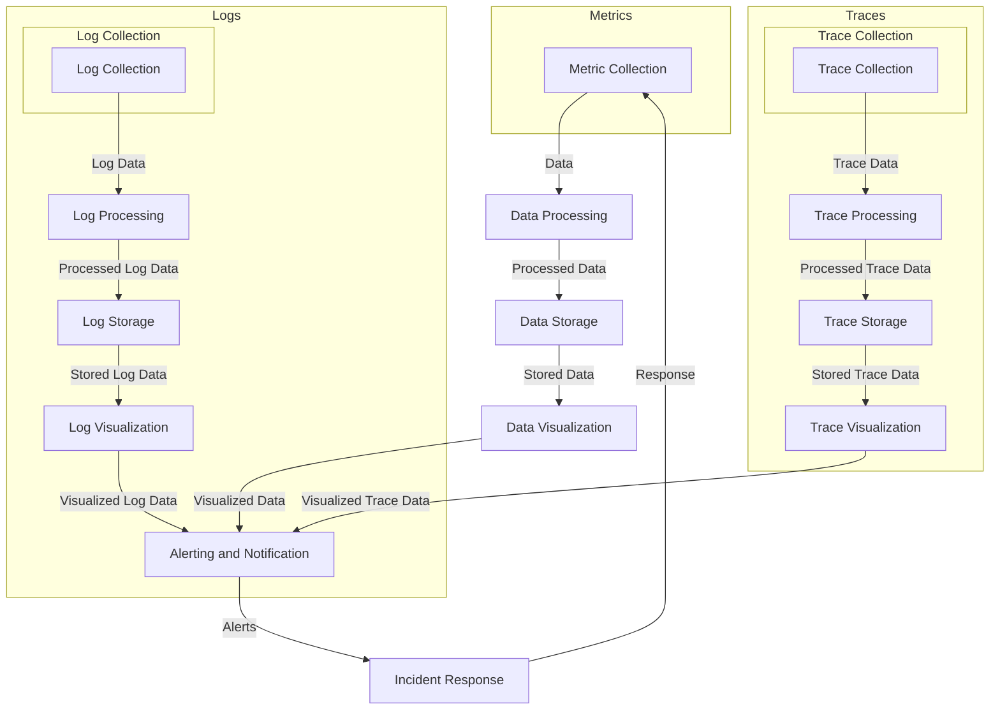

## Introduction
The three pillars of observability, **Metrics**, **Logs**, and **Traces**, are the foundation of a robust monitoring and observability strategy. These pillars provide a comprehensive understanding of a system's performance, behavior, and issues, enabling engineers to identify and resolve problems quickly. In this section, we will explore why these pillars matter, their real-world relevance, and why every engineer should understand them.

> **Note:** Observability is not just about monitoring; it's about understanding the internal state of a system and being able to ask questions about its behavior.

The three pillars are interconnected and provide a complete picture of a system's health. **Metrics** provide quantitative data about a system's performance, such as CPU usage, memory usage, and request latency. **Logs** provide qualitative data about a system's behavior, such as error messages, user interactions, and system events. **Traces** provide a detailed view of a system's workflow, showing the flow of requests and responses between services.

## Core Concepts
To understand the three pillars, it's essential to define some key terms:

* **Metrics**: Quantitative data about a system's performance, such as CPU usage, memory usage, and request latency.
* **Logs**: Qualitative data about a system's behavior, such as error messages, user interactions, and system events.
* **Traces**: A detailed view of a system's workflow, showing the flow of requests and responses between services.
* **Observability**: The ability to understand the internal state of a system and ask questions about its behavior.

> **Warning:** Don't confuse monitoring with observability. Monitoring is about detecting issues, while observability is about understanding the system's behavior and identifying the root cause of issues.

## How It Works Internally
The three pillars work together to provide a comprehensive understanding of a system. Here's a step-by-step breakdown of how they work internally:

1. **Data Collection**: Metrics, logs, and traces are collected from various sources, such as application code, infrastructure, and services.
2. **Data Processing**: The collected data is processed and transformed into a usable format.
3. **Data Storage**: The processed data is stored in a database or a data warehouse.
4. **Data Visualization**: The stored data is visualized using dashboards, charts, and graphs.
5. **Alerting and Notification**: Alerts and notifications are triggered based on predefined rules and thresholds.

> **Tip:** Use a centralized logging solution to collect and process logs from multiple sources.

## Code Examples
Here are three complete and runnable code examples that demonstrate the three pillars:

### Example 1: Basic Metrics Collection
```python
import prometheus_client

# Create a Prometheus metric
metric = prometheus_client.Counter('my_metric', 'My metric description')

# Increment the metric
metric.inc()

# Print the metric value
print(metric.value())
```
This example demonstrates how to collect metrics using the Prometheus client library.

### Example 2: Log Collection and Processing
```java
import java.util.logging.Logger;
import java.util.logging.Handler;
import java.util.logging.Formatter;

// Create a logger
Logger logger = Logger.getLogger("my_logger");

// Create a handler
Handler handler = new Handler() {
    @Override
    public void publish(LogRecord record) {
        System.out.println(record.getMessage());
    }

    @Override
    public void flush() {
    }

    @Override
    public void close() throws SecurityException {
    }
};

// Add the handler to the logger
logger.addHandler(handler);

// Log a message
logger.info("Hello, world!");
```
This example demonstrates how to collect and process logs using the Java logging API.

### Example 3: Distributed Tracing
```go
package main

import (
    "context"
    "fmt"
    "log"

    "go.opentelemetry.io/otel"
    "go.opentelemetry.io/otel/exporters/otlp/otlptrace"
    "go.opentelemetry.io/otel/sdk/resource"
    tracelib "go.opentelemetry.io/otel/trace"
)

func main() {
    // Create a tracer
    tracer := tracelib.NewTracerProvider(
        tracelib.WithSampler(tracelib.AlwaysSample()),
        tracelib.WithBatcher(otlptrace.New()),
    )

    // Create a span
    ctx := context.Background()
    span := tracer.Tracer("my_service").StartSpan("my_span")

    // Log a message
    log.Println("Hello, world!")

    // End the span
    span.End()
}
```
This example demonstrates how to use distributed tracing using the OpenTelemetry library.

## Visual Diagram

This diagram illustrates the flow of data between the three pillars and the various components involved in the observability pipeline.

## Comparison
| Approach | Time Complexity | Space Complexity | Pros | Cons | Best For |
| --- | --- | --- | --- | --- | --- |
| Metrics | O(1) | O(n) | Quantitative data, easy to collect | Limited context, may not capture complex issues | Real-time monitoring, alerting |
| Logs | O(n) | O(n) | Qualitative data, provides context | May be verbose, require processing | Debugging, troubleshooting |
| Traces | O(n) | O(n) | Detailed view of workflow, provides context | May be complex to implement, require significant resources | Distributed systems, microservices |

> **Interview:** What are the trade-offs between using metrics, logs, and traces for monitoring and observability? How would you choose the best approach for a given use case?

## Real-world Use Cases
Here are three production examples of the three pillars in use:

1. **Netflix**: Netflix uses a combination of metrics, logs, and traces to monitor its distributed system. The company uses metrics to monitor performance, logs to debug issues, and traces to understand the workflow of its services.
2. **Google**: Google uses a centralized logging solution to collect and process logs from its services. The company also uses metrics and traces to monitor performance and understand the workflow of its services.
3. **Amazon**: Amazon uses a combination of metrics, logs, and traces to monitor its e-commerce platform. The company uses metrics to monitor performance, logs to debug issues, and traces to understand the workflow of its services.

## Common Pitfalls
Here are four common mistakes to avoid when implementing the three pillars:

1. **Insufficient data collection**: Not collecting enough data from the system, leading to gaps in understanding and potential issues going undetected.
2. **Inadequate data processing**: Not processing the collected data correctly, leading to incorrect or incomplete insights.
3. **Inadequate data storage**: Not storing the processed data correctly, leading to data loss or corruption.
4. **Inadequate alerting and notification**: Not setting up adequate alerting and notification mechanisms, leading to delayed or missed responses to issues.

> **Warning:** Don't underestimate the importance of data quality and accuracy when implementing the three pillars.

## Interview Tips
Here are three common interview questions related to the three pillars, along with weak and strong answers:

1. **What is the difference between metrics, logs, and traces?**
	* Weak answer: "Metrics are for monitoring, logs are for debugging, and traces are for... um... something else."
	* Strong answer: "Metrics provide quantitative data about a system's performance, logs provide qualitative data about a system's behavior, and traces provide a detailed view of a system's workflow. Each pillar has its own strengths and weaknesses, and a comprehensive observability strategy should include all three."
2. **How would you implement a metrics collection system?**
	* Weak answer: "I would just use a library like Prometheus and collect some metrics."
	* Strong answer: "I would start by identifying the key performance indicators for the system, then design a metrics collection system that can handle the required data volume and velocity. I would use a library like Prometheus or a custom solution, depending on the specific requirements. I would also ensure that the metrics are properly labeled and annotated for easy querying and analysis."
3. **What is the importance of distributed tracing in a microservices architecture?**
	* Weak answer: "Distributed tracing is important because... um... it helps with debugging, I think."
	* Strong answer: "Distributed tracing is crucial in a microservices architecture because it provides a detailed view of the workflow between services. This allows developers to understand how requests are flowing through the system, identify bottlenecks and issues, and optimize the system for better performance and reliability."

## Key Takeaways
Here are ten key takeaways from this discussion of the three pillars:

* **Metrics provide quantitative data about a system's performance**.
* **Logs provide qualitative data about a system's behavior**.
* **Traces provide a detailed view of a system's workflow**.
* **A comprehensive observability strategy should include all three pillars**.
* **Data quality and accuracy are critical when implementing the three pillars**.
* **Insufficient data collection, inadequate data processing, and inadequate data storage can all lead to issues**.
* **Distributed tracing is essential in a microservices architecture**.
* **The three pillars should be used in conjunction with each other to provide a complete picture of a system's health**.
* **A well-designed observability system can help reduce mean time to detect (MTTD) and mean time to resolve (MTTR)**.
* **The three pillars are not a one-time implementation, but rather an ongoing process that requires continuous monitoring and improvement**.