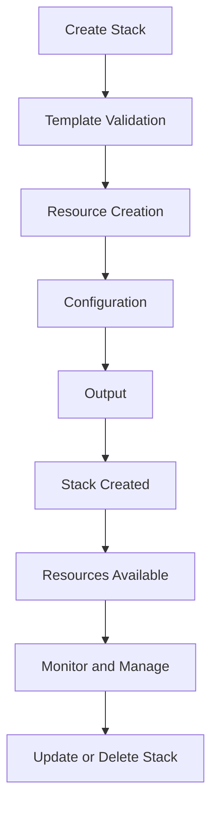

## Introduction
**AWS CloudFormation** is a service that helps you model and set up your AWS resources so that you can spend less time managing those resources and more time focusing on your applications. It provides a common language for you to describe and provision all the infrastructure resources such as Amazon EC2 instances, Amazon RDS databases, and Amazon S3 buckets in a predictable and repeatable manner. With CloudFormation, you can create templates that define the resources you want to create and the configuration values for those resources. You can then use these templates to create and manage your AWS resources in a version-controlled and automated manner.

> **Note:** CloudFormation is a key component of **Infrastructure as Code (IaC)**, which allows you to define and manage your infrastructure using code and version control systems.

CloudFormation is widely used in production environments due to its ability to provide a consistent and repeatable way of deploying infrastructure resources. Companies like **Netflix**, **Airbnb**, and **Uber** use CloudFormation to manage their AWS resources.

## Core Concepts
- **Stack**: A stack is a collection of AWS resources that you can manage as a single unit. You can create, update, and delete a stack using CloudFormation.
- **Template**: A template is a JSON or YAML file that defines the resources you want to create and the configuration values for those resources.
- **Resource**: A resource is an AWS service or component that you can create and manage using CloudFormation.
- **Parameter**: A parameter is a value that you can pass to a template when you create a stack.
- **Output**: An output is a value that is returned by a stack after it is created.

> **Tip:** Use **CloudFormation Designer** to create and edit your templates visually.

## How It Works Internally
When you create a stack using CloudFormation, the following steps occur:
1. **Template Validation**: CloudFormation validates the template to ensure that it is syntactically correct and that the resources defined in the template are valid.
2. **Resource Creation**: CloudFormation creates the resources defined in the template.
3. **Configuration**: CloudFormation configures the resources based on the configuration values defined in the template.
4. **Output**: CloudFormation returns the output values defined in the template.

> **Warning:** Be careful when using **cloudformation delete-stack** command as it will delete all the resources associated with the stack.

## Code Examples
### Example 1: Basic CloudFormation Template
```yml
AWSTemplateFormatVersion: '2010-09-09'
Resources:
  MyEC2Instance:
    Type: 'AWS::EC2::Instance'
    Properties:
      ImageId: 'ami-0c94855ba95c71c99'
      InstanceType: 't2.micro'
```
This template creates an EC2 instance with a specific image ID and instance type.

### Example 2: CloudFormation Template with Parameters
```yml
AWSTemplateFormatVersion: '2010-09-09'
Parameters:
  InstanceType:
    Type: String
    Default: 't2.micro'
Resources:
  MyEC2Instance:
    Type: 'AWS::EC2::Instance'
    Properties:
      ImageId: 'ami-0c94855ba95c71c99'
      InstanceType: !Ref InstanceType
```
This template creates an EC2 instance with a specific image ID and instance type, which can be overridden using a parameter.

### Example 3: CloudFormation Template with Outputs
```yml
AWSTemplateFormatVersion: '2010-09-09'
Resources:
  MyEC2Instance:
    Type: 'AWS::EC2::Instance'
    Properties:
      ImageId: 'ami-0c94855ba95c71c99'
      InstanceType: 't2.micro'
Outputs:
  InstanceId:
    Value: !Ref MyEC2Instance
    Description: The ID of the EC2 instance
```
This template creates an EC2 instance and returns the instance ID as an output.

## Visual Diagram

This diagram illustrates the steps involved in creating a stack using CloudFormation.

> **Interview:** Be prepared to explain the benefits of using CloudFormation, such as **version control**, **repeatability**, and **consistency**.

## Comparison
| Approach | Time Complexity | Space Complexity | Pros | Cons | Best For |
| --- | --- | --- | --- | --- | --- |
| CloudFormation | O(1) | O(1) | Version control, repeatability, consistency | Steep learning curve, limited support for certain resources | Large-scale AWS deployments |
| Terraform | O(n) | O(n) | Multi-cloud support, large community | Complex configuration, state management | Multi-cloud deployments |
| AWS CLI | O(1) | O(1) | Simple, easy to use | Limited functionality, no version control | Small-scale AWS deployments |
| Ansible | O(n) | O(n) | Multi-cloud support, large community | Complex configuration, state management | Multi-cloud deployments |

## Real-world Use Cases
- **Netflix** uses CloudFormation to manage its AWS resources, including EC2 instances, RDS databases, and S3 buckets.
- **Airbnb** uses CloudFormation to create and manage its AWS resources, including EC2 instances, RDS databases, and S3 buckets.
- **Uber** uses CloudFormation to manage its AWS resources, including EC2 instances, RDS databases, and S3 buckets.

> **Tip:** Use CloudFormation to create a **golden image** for your EC2 instances, which can be used to create new instances with a consistent configuration.

## Common Pitfalls
- **Not using version control**: CloudFormation templates should be stored in a version control system to track changes and maintain a history of updates.
- **Not testing templates**: CloudFormation templates should be tested thoroughly before deploying them to production.
- **Not using parameters**: CloudFormation templates should use parameters to make them more flexible and reusable.
- **Not monitoring resources**: CloudFormation resources should be monitored regularly to ensure they are running as expected.

## Interview Tips
- **What is CloudFormation?**: Be prepared to explain what CloudFormation is, how it works, and its benefits.
- **How do you create a CloudFormation template?**: Be prepared to explain the steps involved in creating a CloudFormation template, including defining resources, parameters, and outputs.
- **What are the benefits of using CloudFormation?**: Be prepared to explain the benefits of using CloudFormation, including version control, repeatability, and consistency.

## Key Takeaways
- **CloudFormation is a service that helps you model and set up your AWS resources**.
- **CloudFormation templates define the resources you want to create and the configuration values for those resources**.
- **CloudFormation provides a common language for you to describe and provision all the infrastructure resources**.
- **CloudFormation is widely used in production environments due to its ability to provide a consistent and repeatable way of deploying infrastructure resources**.
- **CloudFormation templates should be stored in a version control system to track changes and maintain a history of updates**.
- **CloudFormation templates should be tested thoroughly before deploying them to production**.
- **CloudFormation resources should be monitored regularly to ensure they are running as expected**.
- **CloudFormation provides a **drift detection** feature that helps you detect configuration changes**.
- **CloudFormation provides a **change sets** feature that helps you preview changes before applying them**.