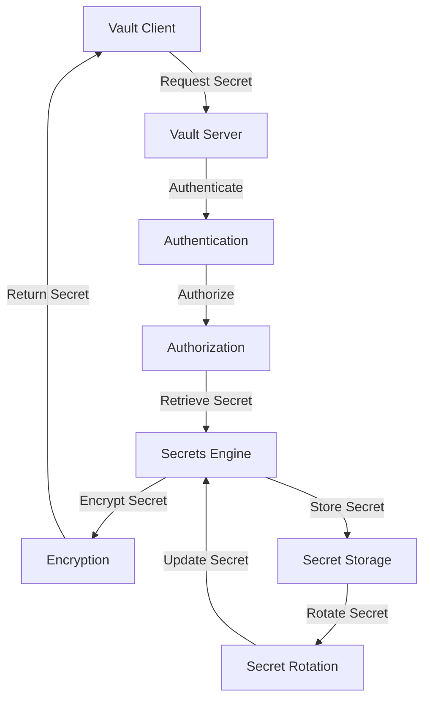

## Introduction
**HashiCorp Vault** is a secrets management tool that helps organizations manage sensitive data, such as passwords, API keys, and certificates, in a secure and scalable manner. It provides a centralized platform for storing, managing, and rotating secrets, making it an essential tool for **DevOps** and **Infrastructure as Code (IaC)** practices. In real-world scenarios, Vault is used by companies like **Netflix**, **Dropbox**, and **Airbnb** to manage their secrets and ensure the security and integrity of their systems.

> **Note:** Secrets management is a critical aspect of security, as it helps prevent unauthorized access to sensitive data and reduces the risk of data breaches.

## Core Concepts
**Vault** uses a variety of core concepts to manage secrets, including:
* **Secrets Engines**: These are the components that store and manage secrets. Vault provides several built-in secrets engines, such as the **KV (Key-Value) engine** and the **AWS IAM engine**.
* **Mounts**: These are the points at which secrets engines are attached to the Vault instance. Mounts can be thought of as namespaces for secrets engines.
* **Policies**: These are used to control access to secrets and other Vault resources. Policies can be used to grant or deny access to specific secrets or secrets engines.
* **Tokens**: These are used to authenticate and authorize access to Vault. Tokens can be generated using various methods, such as user authentication or service accounts.

> **Tip:** When designing a secrets management system, it's essential to consider the trade-offs between security, usability, and scalability.

## How It Works Internally
When a client requests a secret from Vault, the following steps occur:
1. **Authentication**: The client authenticates with Vault using a token or other authentication method.
2. **Authorization**: Vault checks the client's token against the relevant policies to determine if they have access to the requested secret.
3. **Secret Retrieval**: If the client is authorized, Vault retrieves the secret from the relevant secrets engine.
4. **Secret Encryption**: Vault encrypts the secret using a symmetric key, which is stored securely.
5. **Secret Return**: Vault returns the encrypted secret to the client.

> **Warning:** If not implemented correctly, secrets management can introduce additional security risks. For example, if Vault is not properly configured, an attacker could gain access to sensitive secrets.

## Code Examples
### Example 1: Basic Secret Storage and Retrieval
```python
import hvac

# Initialize the Vault client
client = hvac.Client(url="https://vault.example.com", token="your_token")

# Store a secret
client.secrets.kv.v2.create_or_update_secret(
    path="your_secret_path",
    secret=dict(key="your_secret_key", value="your_secret_value")
)

# Retrieve a secret
response = client.secrets.kv.v2.read_secret_version(
    path="your_secret_path"
)
print(response.data.data.decode("utf-8"))
```
### Example 2: Using Vault with AWS IAM
```python
import hvac
import boto3

# Initialize the Vault client
client = hvac.Client(url="https://vault.example.com", token="your_token")

# Generate an AWS IAM credential
response = client.secrets.aws.access_credentials(
    name="your_aws_iam_role",
    mount_point="aws"
)
aws_access_key_id = response.data.access_key
aws_secret_access_key = response.data.secret_key

# Use the AWS IAM credential to access AWS services
session = boto3.Session(aws_access_key_id=aws_access_key_id, aws_secret_access_key=aws_secret_access_key)
```
### Example 3: Rotating Secrets using Vault
```python
import hvac
import schedule
import time

# Initialize the Vault client
client = hvac.Client(url="https://vault.example.com", token="your_token")

# Define a function to rotate secrets
def rotate_secrets():
    # Rotate the secret
    client.secrets.kv.v2.create_or_update_secret(
        path="your_secret_path",
        secret=dict(key="your_secret_key", value="your_new_secret_value")
    )

# Schedule the secret rotation
schedule.every(1).day.at("00:00").do(rotate_secrets)

while True:
    schedule.run_pending()
    time.sleep(1)
```
> **Interview:** Can you explain how Vault handles secret rotation and what benefits it provides?

## Visual Diagram

This diagram illustrates the Vault workflow, from client request to secret retrieval and storage.

## Comparison
| Approach | Time Complexity | Space Complexity | Pros | Cons | Best For |
| --- | --- | --- | --- | --- | --- |
| HashiCorp Vault | O(1) | O(n) | Centralized secrets management, secure, scalable | Steep learning curve, resource-intensive | Large-scale enterprises, DevOps teams |
| AWS Secrets Manager | O(1) | O(n) | Tight integration with AWS services, secure | Limited customization, AWS-only | AWS-centric organizations |
| Google Cloud Secret Manager | O(1) | O(n) | Seamless integration with GCP services, secure | Limited customization, GCP-only | GCP-centric organizations |
| Kubernetes Secrets | O(1) | O(n) | Native integration with Kubernetes, secure | Limited scalability, Kubernetes-only | Kubernetes-centric organizations |

## Real-world Use Cases
* **Netflix**: Uses Vault to manage secrets and credentials for their microservices architecture.
* **Dropbox**: Utilizes Vault to store and rotate secrets for their cloud-based file storage system.
* **Airbnb**: Employs Vault to manage secrets and credentials for their web and mobile applications.

## Common Pitfalls
* **Insufficient access controls**: Failing to restrict access to secrets and Vault resources can lead to security breaches.
* **Inadequate secret rotation**: Not rotating secrets regularly can lead to compromised credentials and security risks.
* **Poorly configured Vault instance**: Incorrectly configuring Vault can lead to performance issues and security vulnerabilities.
* **Inadequate monitoring and logging**: Not monitoring and logging Vault activity can make it difficult to detect security incidents.

> **Warning:** Inadequate secrets management can have severe consequences, including data breaches and security incidents.

## Interview Tips
* **What is Vault and how does it work?**: A strong answer should explain the basics of Vault, including secrets engines, mounts, policies, and tokens.
* **How do you manage secrets in a cloud-native environment?**: A strong answer should discuss the importance of secrets management in cloud-native environments and how Vault can be used to manage secrets.
* **What are some best practices for using Vault?**: A strong answer should discuss best practices for using Vault, including proper access controls, secret rotation, and monitoring and logging.

## Key Takeaways
* **Vault provides a centralized platform for secrets management**: Vault offers a secure and scalable way to manage secrets and credentials.
* **Secrets engines are the core of Vault**: Secrets engines store and manage secrets, and can be customized to meet specific use cases.
* **Policies and tokens are essential for access control**: Policies and tokens are used to control access to Vault resources and secrets.
* **Secret rotation is critical for security**: Regularly rotating secrets can help prevent security breaches and compromised credentials.
* **Monitoring and logging are essential for security**: Monitoring and logging Vault activity can help detect security incidents and prevent data breaches.
* **Vault can be used in a variety of environments**: Vault can be used in cloud-native, on-premises, and hybrid environments.
* **Best practices are essential for secure Vault usage**: Following best practices, such as proper access controls and secret rotation, can help ensure the security and integrity of Vault.