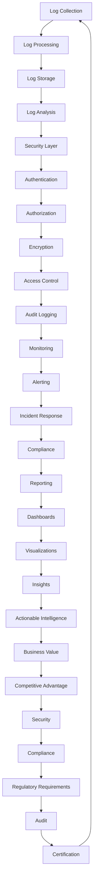

## Introduction
The ELK stack (Elasticsearch, Logstash, Kibana) is a popular log analysis solution used in many production environments. As the volume and complexity of logs increase, securing the ELK stack becomes crucial to prevent unauthorized access and ensure the integrity of log data. In this section, we will explore the importance of securing ELK log analysis at scale and why it matters in real-world scenarios. **Note:** A single vulnerability in the ELK stack can compromise the entire logging infrastructure, making it essential to implement robust security measures.

## Core Concepts
To secure the ELK stack, it's essential to understand the core concepts and terminology. Here are some key definitions:
* **Authentication**: The process of verifying the identity of users or systems accessing the ELK stack.
* **Authorization**: The process of granting or denying access to specific resources within the ELK stack based on user roles or permissions.
* **Encryption**: The process of converting plaintext log data into unreadable ciphertext to prevent unauthorized access.
* **X-Pack**: A commercial plugin for Elasticsearch that provides advanced security features, including authentication, authorization, and encryption.

## How It Works Internally
The ELK stack uses a combination of open-source and commercial components to provide log analysis capabilities. Here's a step-by-step breakdown of how the ELK stack works internally:
1. **Log Collection**: Logstash collects log data from various sources, such as servers, applications, and network devices.
2. **Log Processing**: Logstash processes the collected log data, parsing and transforming it into a standardized format.
3. **Log Storage**: The processed log data is stored in Elasticsearch, a distributed search and analytics engine.
4. **Log Analysis**: Kibana provides a user-friendly interface for searching, visualizing, and analyzing the log data stored in Elasticsearch.
**Tip:** Implementing a robust logging infrastructure requires careful planning and configuration of the ELK stack components.

## Code Examples
Here are three complete and runnable code examples demonstrating advanced patterns for securing ELK log analysis at scale:
### Example 1: Basic Authentication with X-Pack
```python
from elasticsearch import Elasticsearch

# Create an Elasticsearch client with basic authentication
es = Elasticsearch(
    hosts=['localhost:9200'],
    http_auth=('username', 'password')
)

# Index a sample document
es.index(index='myindex', body={'name': 'John Doe', 'age': 30})
```
### Example 2: Role-Based Access Control with X-Pack
```java
import io.searchbox.client.JestClient;
import io.searchbox.client.JestClientFactory;
import io.searchbox.core.Search;
import io.searchbox.core.SearchResult;

// Create a Jest client with role-based access control
JestClientFactory factory = new JestClientFactory();
factory.setHttpClientConfig(new HttpClientConfig.Builder('http://localhost:9200')
    .defaultCredentials('username', 'password')
    .build());
JestClient client = factory.getObject();

// Search for documents with the 'admin' role
Search search = new Search.Builder("{\"query\":{\"match_all\":{}}}")
    .addIndex('myindex')
    .addType('mytype')
    .build();
SearchResult result = client.execute(search);
```
### Example 3: Encryption with TLS
```bash
# Generate a self-signed certificate and private key
openssl req -x509 -newkey rsa:2048 -nodes -keyout tls.key -out tls.crt -days 365 -subj "/C=US/ST=State/L=Locality/O=Organization/CN=localhost"

# Configure Elasticsearch to use TLS
echo "xpack.security.transport.ssl.enabled: true" >> elasticsearch.yml
echo "xpack.security.transport.ssl.keystore.path: tls.key" >> elasticsearch.yml
echo "xpack.security.transport.ssl.keystore.password: password" >> elasticsearch.yml

# Restart Elasticsearch with TLS enabled
systemctl restart elasticsearch
```
**Warning:** Using self-signed certificates can pose a security risk in production environments. It's recommended to use trusted certificates from a reputable certificate authority.

## Visual Diagram

This diagram illustrates the various components and processes involved in securing ELK log analysis at scale.

## Comparison
Here's a comparison of different approaches to securing ELK log analysis:
| Approach | Time Complexity | Space Complexity | Pros | Cons | Best For |
| --- | --- | --- | --- | --- | --- |
| X-Pack | O(1) | O(n) | Advanced security features, easy to use | Commercial license required, additional overhead | Large-scale production environments |
| Open-Source Plugins | O(n) | O(n) | Free and open-source, customizable | Limited features, requires development expertise | Small-scale development environments |
| Custom Implementation | O(n^2) | O(n^2) | Highly customizable, no additional overhead | Requires significant development expertise, time-consuming | Highly customized or specialized environments |
| Cloud-Based Solutions | O(1) | O(n) | Scalable, secure, and managed | Limited control, additional costs | Cloud-based production environments |
**Tip:** Choosing the right approach depends on the specific requirements and constraints of the environment.

## Real-world Use Cases
Here are three real-world examples of securing ELK log analysis at scale:
1. **Netflix**: Netflix uses a combination of X-Pack and custom implementation to secure their ELK stack, which handles millions of logs per day.
2. **Uber**: Uber uses a cloud-based solution to secure their ELK stack, which provides scalable and managed security features.
3. **Airbnb**: Airbnb uses open-source plugins to secure their ELK stack, which provides customizable and cost-effective security features.
**Interview:** Can you describe a real-world scenario where you had to secure an ELK stack at scale? What approach did you take, and what were the challenges and benefits?

## Common Pitfalls
Here are four common mistakes to avoid when securing ELK log analysis at scale:
1. **Insufficient authentication**: Failing to implement robust authentication mechanisms can compromise the security of the ELK stack.
2. **Inadequate authorization**: Failing to implement role-based access control can lead to unauthorized access to sensitive log data.
3. **Insecure encryption**: Using weak or outdated encryption protocols can compromise the security of log data in transit and at rest.
4. **Inadequate monitoring**: Failing to monitor the ELK stack for security-related issues can lead to delayed detection and response to security incidents.
**Warning:** Insecure ELK stacks can lead to significant security breaches and compliance issues.

## Interview Tips
Here are three common interview questions related to securing ELK log analysis at scale:
1. **What is your experience with X-Pack, and how have you used it to secure an ELK stack?**
	* Weak answer: I've heard of X-Pack, but I've never used it.
	* Strong answer: I've used X-Pack to secure an ELK stack in a production environment, and I can describe the benefits and challenges of implementation.
2. **How do you ensure the security of log data in transit and at rest?**
	* Weak answer: I'm not sure, but I think it's handled by the ELK stack itself.
	* Strong answer: I ensure the security of log data by implementing robust encryption protocols, such as TLS, and secure storage mechanisms, such as encrypted indices.
3. **Can you describe a scenario where you had to troubleshoot a security-related issue in an ELK stack?**
	* Weak answer: I've never encountered a security-related issue in an ELK stack.
	* Strong answer: I can describe a scenario where I had to troubleshoot a security-related issue, such as a compromised authentication mechanism, and how I resolved it using various tools and techniques.
**Tip:** Be prepared to provide specific examples and scenarios to demonstrate your expertise in securing ELK log analysis at scale.

## Key Takeaways
Here are six key takeaways to remember when securing ELK log analysis at scale:
* **Implement robust authentication mechanisms**, such as X-Pack or custom implementation.
* **Use role-based access control** to ensure authorized access to sensitive log data.
* **Implement robust encryption protocols**, such as TLS, to secure log data in transit and at rest.
* **Monitor the ELK stack** for security-related issues, such as authentication failures or unauthorized access.
* **Use secure storage mechanisms**, such as encrypted indices, to protect log data at rest.
* **Stay up-to-date** with the latest security patches and updates for the ELK stack and its components.
**Note:** Securing ELK log analysis at scale requires a comprehensive approach that includes authentication, authorization, encryption, monitoring, and secure storage mechanisms.