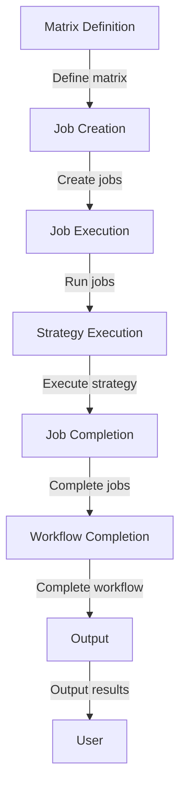

## Introduction
**GitHub Actions matrices** are a powerful feature in GitHub Actions that allow you to run multiple jobs with different combinations of inputs, enabling you to test your code against various environments, versions, and configurations. This feature is crucial in ensuring the reliability and stability of your software, as it helps you catch bugs and inconsistencies early in the development process. In real-world scenarios, GitHub Actions matrices are used by companies like **Microsoft**, **Amazon**, and **Google** to automate their testing and deployment pipelines. As a developer, understanding how to effectively use GitHub Actions matrices is essential for delivering high-quality software.

## Core Concepts
To work with GitHub Actions matrices, you need to understand the following core concepts:
- **Matrix**: A matrix is a set of jobs that are run with different combinations of inputs. You can define a matrix in your GitHub Actions workflow file using the `matrix` keyword.
- **Job**: A job is a set of steps that are run in a single environment. You can define multiple jobs in a matrix, each with its own set of steps.
- **Strategy**: A strategy defines how the jobs in a matrix are run. You can choose from two strategies: `fail-fast` and `max-parallel`.
- **Input**: An input is a value that is passed to a job. You can define inputs in your matrix using the `include` keyword.

> **Note:** Understanding the concepts of matrices, jobs, strategies, and inputs is crucial for effectively using GitHub Actions matrices.

## How It Works Internally
When you define a matrix in your GitHub Actions workflow file, GitHub Actions creates a set of jobs based on the inputs you provide. Each job is run in a separate environment, and the steps in each job are executed in sequence. The strategy you choose determines how the jobs are run. For example, if you choose the `fail-fast` strategy, GitHub Actions will cancel all jobs in the matrix if one job fails.

Here is a high-level overview of how GitHub Actions matrices work:
1. **Matrix definition**: You define a matrix in your GitHub Actions workflow file using the `matrix` keyword.
2. **Job creation**: GitHub Actions creates a set of jobs based on the inputs you provide.
3. **Job execution**: Each job is run in a separate environment, and the steps in each job are executed in sequence.
4. **Strategy execution**: The strategy you choose determines how the jobs are run.

## Code Examples
Here are three complete and runnable examples of using GitHub Actions matrices:
### Example 1: Basic Matrix
```yml
name: Basic Matrix

on:
  push:
    branches:
      - main

jobs:
  build:
    runs-on: ubuntu-latest
    strategy:
      matrix:
        node: [12, 14, 16]
    steps:
      - name: Checkout code
        uses: actions/checkout@v3
      - name: Install dependencies
        run: npm install
      - name: Build and test
        run: npm run build && npm run test
```
This example defines a basic matrix that runs three jobs with different versions of Node.js.

### Example 2: Matrix with Multiple Inputs
```yml
name: Matrix with Multiple Inputs

on:
  push:
    branches:
      - main

jobs:
  build:
    runs-on: ubuntu-latest
    strategy:
      matrix:
        node: [12, 14, 16]
        os: [ubuntu-latest, windows-latest]
    steps:
      - name: Checkout code
        uses: actions/checkout@v3
      - name: Install dependencies
        run: npm install
      - name: Build and test
        run: npm run build && npm run test
```
This example defines a matrix that runs six jobs with different combinations of Node.js versions and operating systems.

### Example 3: Matrix with Custom Inputs
```yml
name: Matrix with Custom Inputs

on:
  push:
    branches:
      - main

jobs:
  build:
    runs-on: ubuntu-latest
    strategy:
      matrix:
        include:
          - node: 12
            os: ubuntu-latest
            env: dev
          - node: 14
            os: windows-latest
            env: prod
          - node: 16
            os: ubuntu-latest
            env: staging
    steps:
      - name: Checkout code
        uses: actions/checkout@v3
      - name: Install dependencies
        run: npm install
      - name: Build and test
        run: npm run build && npm run test
```
This example defines a matrix that runs three jobs with custom inputs for Node.js version, operating system, and environment.

## Visual Diagram

This diagram illustrates the workflow of GitHub Actions matrices, from defining the matrix to completing the jobs and outputting the results.

## Comparison
Here is a comparison of different strategies for running GitHub Actions matrices:
| Strategy | Time Complexity | Space Complexity | Pros | Cons | Best For |
| --- | --- | --- | --- | --- | --- |
| Fail-Fast | O(n) | O(n) | Fast failure detection, reduced resource usage | Jobs are canceled if one fails | Small to medium-sized matrices |
| Max-Parallel | O(n) | O(n) | Fast execution, high throughput | Resource-intensive, may cause failures | Large matrices with many jobs |
| Sequential | O(n) | O(1) | Simple, easy to understand | Slow execution, low throughput | Small matrices with few jobs |
| Custom | O(n) | O(n) | Flexible, customizable | Complex, may require additional resources | Large matrices with complex requirements |

> **Tip:** Choose the strategy that best fits your needs, considering factors such as job size, resource usage, and failure detection.

## Real-world Use Cases
Here are three real-world use cases for GitHub Actions matrices:
1. **Microsoft**: Microsoft uses GitHub Actions matrices to test their Azure SDKs against different versions of Node.js and .NET.
2. **Amazon**: Amazon uses GitHub Actions matrices to test their AWS SDKs against different versions of Java and Python.
3. **Google**: Google uses GitHub Actions matrices to test their Google Cloud SDKs against different versions of Node.js and Go.

> **Warning:** Failing to properly configure your GitHub Actions matrices can lead to slow execution, high resource usage, and reduced reliability.

## Common Pitfalls
Here are four common pitfalls to avoid when working with GitHub Actions matrices:
1. **Insufficient testing**: Failing to test your matrix against different inputs and environments can lead to bugs and inconsistencies.
2. **Inadequate resource allocation**: Failing to allocate sufficient resources to your jobs can lead to slow execution and reduced reliability.
3. **Inconsistent job definitions**: Failing to define consistent job definitions can lead to confusion and errors.
4. **Lack of monitoring and logging**: Failing to monitor and log your jobs can lead to reduced visibility and difficulty in debugging issues.

> **Interview:** What are some common pitfalls to avoid when working with GitHub Actions matrices? What strategies can you use to mitigate these pitfalls?

## Interview Tips
Here are three common interview questions related to GitHub Actions matrices, along with weak and strong answer examples:
1. **What is a GitHub Actions matrix?**
	* Weak answer: A GitHub Actions matrix is a way to run multiple jobs.
	* Strong answer: A GitHub Actions matrix is a feature in GitHub Actions that allows you to run multiple jobs with different combinations of inputs, enabling you to test your code against various environments, versions, and configurations.
2. **How do you configure a GitHub Actions matrix?**
	* Weak answer: You configure a GitHub Actions matrix by defining a matrix in your workflow file.
	* Strong answer: You configure a GitHub Actions matrix by defining a matrix in your workflow file, specifying the inputs and jobs, and choosing a strategy for running the jobs.
3. **What are some common use cases for GitHub Actions matrices?**
	* Weak answer: GitHub Actions matrices are used for testing and deployment.
	* Strong answer: GitHub Actions matrices are used for testing and deployment, as well as for automating complex workflows, such as building and testing software against different environments and versions.

## Key Takeaways
Here are six key takeaways to remember when working with GitHub Actions matrices:
* **Define a clear matrix**: Define a clear matrix with specific inputs and jobs.
* **Choose the right strategy**: Choose the right strategy for running your jobs, considering factors such as job size, resource usage, and failure detection.
* **Test thoroughly**: Test your matrix thoroughly against different inputs and environments.
* **Monitor and log**: Monitor and log your jobs to ensure visibility and ease of debugging.
* **Optimize resource allocation**: Optimize resource allocation to ensure efficient execution and reduce costs.
* **Use custom inputs**: Use custom inputs to define specific requirements for your jobs.

> **Note:** By following these key takeaways, you can effectively use GitHub Actions matrices to automate your testing and deployment workflows.