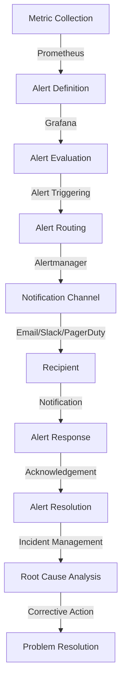

## Introduction
**Infrastructure-as-Code (IaC)** systems have revolutionized the way we manage and deploy infrastructure. By defining infrastructure configuration in code, we can version, test, and automate deployments with ease. One crucial aspect of IaC systems is **monitoring and alerting**. This is where **Grafana** comes in – a popular open-source platform for building dashboards and alerts. In this article, we'll dive into designing IaC systems with Grafana alerts routing. We'll explore the core concepts, internal mechanics, and provide code examples to get you started.

> **Note:** Grafana is widely used in production environments, including companies like **Netflix**, **Uber**, and **Airbnb**. Its flexibility and customization capabilities make it an ideal choice for building complex monitoring systems.

## Core Concepts
To design an effective IaC system with Grafana alerts routing, we need to understand the following core concepts:

* **Metrics**: These are the key performance indicators (KPIs) we want to monitor, such as CPU usage, memory usage, or request latency.
* **Alerts**: These are the notifications triggered when a metric exceeds a certain threshold or meets a specific condition.
* **Grafana**: This is the platform we'll use to build dashboards and configure alerts.
* **Prometheus**: This is a popular open-source monitoring system that provides metric data to Grafana.
* **Alertmanager**: This is a component of Prometheus that handles alert routing and notification.

> **Tip:** When designing an IaC system, it's essential to consider the **Separation of Concerns (SoC)** principle. This means separating the configuration of infrastructure, monitoring, and alerting into distinct components.

## How It Works Internally
Here's a step-by-step breakdown of how Grafana alerts routing works internally:

1. **Metric collection**: Prometheus collects metric data from various sources, such as application logs, system metrics, or custom metrics.
2. **Alert definition**: We define alerts in Grafana using **PromQL** (Prometheus Query Language) queries.
3. **Alert evaluation**: Grafana evaluates the alert queries against the metric data collected by Prometheus.
4. **Alert triggering**: When an alert condition is met, Grafana triggers an alert and sends it to the Alertmanager.
5. **Alert routing**: The Alertmanager routes the alert to the designated notification channel, such as email, Slack, or PagerDuty.

> **Warning:** Failing to properly configure alert routing can lead to **alert fatigue** or **notification storms**. This can result in critical alerts being ignored or lost in the noise.

## Code Examples
Here are three complete and runnable code examples to demonstrate Grafana alerts routing:

### Example 1: Basic Alert Configuration
```yml
# config.yml
alerting:
  enabled: true
  routes:
  - receiver: 'team-a'
    group_by: ['alertname']
  receivers:
  - name: 'team-a'
    email_configs:
    - to: 'team-a@example.com'
      from: 'grafana@example.com'
      smarthost: 'smtp.example.com:25'
      auth_username: 'grafana'
      auth_password: 'password'
```
This example configures a basic alerting system with a single receiver group and email notification.

### Example 2: Advanced Alert Configuration with Multiple Receivers
```yml
# config.yml
alerting:
  enabled: true
  routes:
  - receiver: 'team-a'
    group_by: ['alertname']
  - receiver: 'team-b'
    group_by: ['alertname']
  receivers:
  - name: 'team-a'
    email_configs:
    - to: 'team-a@example.com'
      from: 'grafana@example.com'
      smarthost: 'smtp.example.com:25'
      auth_username: 'grafana'
      auth_password: 'password'
  - name: 'team-b'
    slack_configs:
    - api_url: 'https://slack.example.com'
      channel: '#team-b'
      username: 'Grafana'
```
This example demonstrates an advanced alert configuration with multiple receiver groups and notification channels (email and Slack).

### Example 3: Custom Alert Script with Python
```python
# alert_script.py
import requests

def send_alert(alert):
    # Send alert to custom notification channel
    url = 'https://example.com/alert'
    payload = {'alert': alert}
    response = requests.post(url, json=payload)
    if response.status_code != 200:
        print('Error sending alert:', response.text)

def main():
    # Define alert condition
    alert_condition = 'cpu_usage > 80'
    # Evaluate alert condition
    if evaluate_alert_condition(alert_condition):
        # Trigger alert
        alert = {'alertname': 'CPU Usage High', 'message': 'CPU usage is high'}
        send_alert(alert)

if __name__ == '__main__':
    main()
```
This example shows a custom alert script written in Python that evaluates an alert condition and sends a notification to a custom channel.

## Visual Diagram

This diagram illustrates the entire alerting workflow, from metric collection to problem resolution.

## Comparison
| Approach | Time Complexity | Space Complexity | Pros | Cons | Best For |
| --- | --- | --- | --- | --- | --- |
| Prometheus + Grafana | O(1) | O(n) | Scalable, flexible, and customizable | Steep learning curve, requires expertise | Large-scale monitoring systems |
| Nagios + Grafana | O(n) | O(n) | Mature, widely adopted, and well-documented | Limited scalability, outdated architecture | Small to medium-sized monitoring systems |
| New Relic + Grafana | O(1) | O(n) | Cloud-native, automated, and user-friendly | Limited customization, expensive | Cloud-based monitoring systems |
| Zabbix + Grafana | O(n) | O(n) | Feature-rich, customizable, and affordable | Steep learning curve, resource-intensive | Medium to large-sized monitoring systems |

## Real-world Use Cases
Here are three real-world use cases for Grafana alerts routing:

* **Netflix**: Uses Grafana and Prometheus to monitor and alert on streaming service performance.
* **Uber**: Utilizes Grafana and Alertmanager to route alerts to specific teams based on incident type.
* **Airbnb**: Employs Grafana and custom alert scripts to notify teams of critical issues, such as payment processing errors.

## Common Pitfalls
Here are four common pitfalls to watch out for when designing an IaC system with Grafana alerts routing:

* **Insufficient alert routing configuration**: Failing to properly configure alert routing can lead to alert fatigue or notification storms.
* **Inadequate metric collection**: Not collecting relevant metrics can result in incomplete or inaccurate alerting.
* **Inconsistent alert definition**: Defining alerts inconsistently can lead to confusion and alert fatigue.
* **Lack of alert testing**: Failing to test alerts can result in undetected issues and false positives.

> **Interview:** When asked about Grafana alerts routing in an interview, be prepared to discuss the importance of proper alert routing configuration, the role of Alertmanager, and the need for consistent alert definition.

## Key Takeaways
Here are the key takeaways from this article:

* Grafana alerts routing is a critical component of IaC systems.
* Proper alert routing configuration is essential to prevent alert fatigue and notification storms.
* Consistent alert definition is crucial for effective alerting.
* Metric collection and alert evaluation are critical components of the alerting workflow.
* Grafana and Prometheus provide a scalable and flexible monitoring solution.
* Custom alert scripts can be used to extend alerting capabilities.
* Alert testing is essential to ensure accurate and reliable alerting.
* Separation of Concerns (SoC) is essential when designing an IaC system.