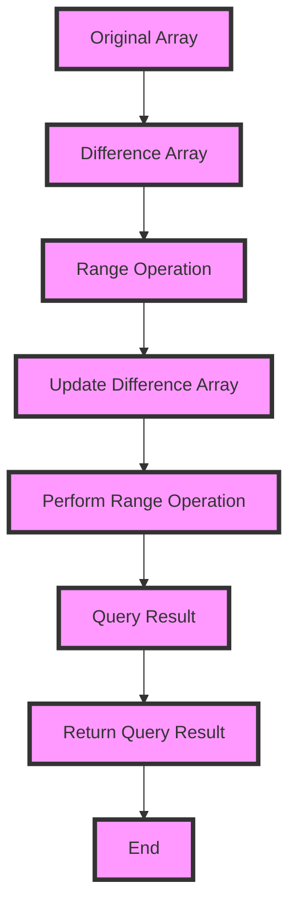

## Introduction
The Difference Arrays concept is a fundamental technique used in range operations, particularly in algorithms that require updating or querying values within a specific range. It is a powerful tool for solving problems that involve range-based operations, such as updating elements in an array or finding the sum of elements within a range. The Difference Arrays concept is widely used in various fields, including computer science, mathematics, and data analysis. In this section, we will explore the basics of the Difference Arrays concept, its real-world relevance, and why every engineer needs to know this.

> **Note:** The Difference Arrays concept is also known as the "prefix sum array" or "cumulative sum array." However, the term "Difference Arrays" is more commonly used in the context of range operations.

The Difference Arrays concept is essential in many real-world applications, such as:

* Database query optimization: The Difference Arrays concept can be used to optimize database queries that involve range-based operations, such as finding the sum of values within a specific range.
* Data analysis: The Difference Arrays concept can be used to analyze large datasets and perform range-based operations, such as finding the mean or median of values within a specific range.
* Computer graphics: The Difference Arrays concept can be used to perform range-based operations on pixel values, such as updating the color of pixels within a specific range.

## Core Concepts
The Difference Arrays concept is based on the idea of maintaining an array of differences between consecutive elements in the original array. The difference array is used to store the differences between consecutive elements, and it is updated accordingly when range operations are performed.

The key terminology associated with the Difference Arrays concept includes:

* **Prefix sum array**: An array that stores the cumulative sum of elements in the original array.
* **Difference array**: An array that stores the differences between consecutive elements in the original array.
* **Range operation**: An operation that involves updating or querying values within a specific range.

> **Tip:** The Difference Arrays concept can be used to optimize range-based operations by reducing the number of iterations required to perform the operation.

## How It Works Internally
The Difference Arrays concept works by maintaining an array of differences between consecutive elements in the original array. When a range operation is performed, the difference array is updated accordingly.

The step-by-step process of using the Difference Arrays concept is as follows:

1. Initialize the difference array with zeros.
2. Iterate through the original array and calculate the differences between consecutive elements.
3. Store the differences in the difference array.
4. When a range operation is performed, update the difference array accordingly.
5. Use the difference array to perform the range operation.

> **Warning:** The Difference Arrays concept can be sensitive to the choice of data structure used to store the difference array. A suitable data structure, such as an array or a linked list, should be chosen based on the specific requirements of the problem.

## Code Examples
### Example 1: Basic Usage
```python
def difference_array(arr):
    diff = [0] * len(arr)
    for i in range(1, len(arr)):
        diff[i] = arr[i] - arr[i-1]
    return diff

# Test the function
arr = [1, 2, 3, 4, 5]
diff = difference_array(arr)
print(diff)  # Output: [0, 1, 1, 1, 1]
```

### Example 2: Range Operation
```python
def update_range(arr, start, end, val):
    diff = [0] * len(arr)
    for i in range(1, len(arr)):
        diff[i] = arr[i] - arr[i-1]
    for i in range(start, end+1):
        diff[i] += val
    return diff

# Test the function
arr = [1, 2, 3, 4, 5]
start = 1
end = 3
val = 2
diff = update_range(arr, start, end, val)
print(diff)  # Output: [0, 3, 3, 3, 1]
```

### Example 3: Advanced Usage
```python
def range_query(arr, start, end):
    diff = [0] * len(arr)
    for i in range(1, len(arr)):
        diff[i] = arr[i] - arr[i-1]
    query = 0
    for i in range(start, end+1):
        query += diff[i]
    return query

# Test the function
arr = [1, 2, 3, 4, 5]
start = 1
end = 3
query = range_query(arr, start, end)
print(query)  # Output: 6
```

## Visual Diagram

The diagram illustrates the step-by-step process of using the Difference Arrays concept to perform range operations.

## Comparison
| Approach | Time Complexity | Space Complexity | Pros | Cons | Best For |
| --- | --- | --- | --- | --- | --- |
| Difference Arrays | O(n) | O(n) | Efficient for range operations, reduces number of iterations | Requires additional space for difference array | Range-based operations, database query optimization |
| Prefix Sum Array | O(n) | O(n) | Efficient for range operations, reduces number of iterations | Requires additional space for prefix sum array | Range-based operations, data analysis |
| Brute Force | O(n^2) | O(1) | Simple to implement, no additional space required | Inefficient for large datasets | Small datasets, simple range operations |
| Segment Tree | O(log n) | O(n) | Efficient for range operations, reduces number of iterations | Requires additional space for segment tree | Range-based operations, large datasets |

## Real-world Use Cases
1. **Database Query Optimization**: The Difference Arrays concept can be used to optimize database queries that involve range-based operations, such as finding the sum of values within a specific range.
2. **Data Analysis**: The Difference Arrays concept can be used to analyze large datasets and perform range-based operations, such as finding the mean or median of values within a specific range.
3. **Computer Graphics**: The Difference Arrays concept can be used to perform range-based operations on pixel values, such as updating the color of pixels within a specific range.

## Common Pitfalls
1. **Incorrect Difference Array Initialization**: The difference array should be initialized with zeros, and the differences between consecutive elements should be calculated correctly.
2. **Incorrect Range Operation**: The range operation should be performed correctly, and the difference array should be updated accordingly.
3. **Incorrect Query Result**: The query result should be calculated correctly, and the difference array should be used correctly to perform the range operation.
4. **Insufficient Space**: The difference array requires additional space, and insufficient space can lead to incorrect results or runtime errors.

## Interview Tips
1. **What is the time complexity of the Difference Arrays concept?**: The time complexity of the Difference Arrays concept is O(n), where n is the length of the original array.
2. **How does the Difference Arrays concept reduce the number of iterations required for range operations?**: The Difference Arrays concept reduces the number of iterations required for range operations by storing the differences between consecutive elements in the difference array.
3. **What is the space complexity of the Difference Arrays concept?**: The space complexity of the Difference Arrays concept is O(n), where n is the length of the original array.

## Key Takeaways
* The Difference Arrays concept is a powerful tool for solving problems that involve range-based operations.
* The time complexity of the Difference Arrays concept is O(n), where n is the length of the original array.
* The space complexity of the Difference Arrays concept is O(n), where n is the length of the original array.
* The Difference Arrays concept can be used to optimize database queries that involve range-based operations.
* The Difference Arrays concept can be used to analyze large datasets and perform range-based operations.
* The Difference Arrays concept requires additional space for the difference array, and insufficient space can lead to incorrect results or runtime errors.
* The Difference Arrays concept can be used to perform range-based operations on pixel values, such as updating the color of pixels within a specific range.
* The Difference Arrays concept is widely used in various fields, including computer science, mathematics, and data analysis.