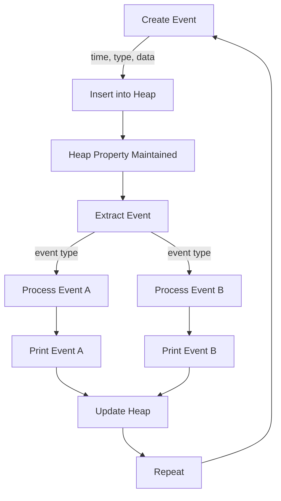

## Introduction
Discrete event-driven simulations (DEDS) are a type of simulation that models the behavior of complex systems by representing them as a sequence of discrete events. Heaps play a crucial role in DEDS, as they enable efficient event scheduling and management. In this section, we will introduce the concept of heaps in DEDS, their importance, and real-world relevance. 
> **Note:** Heaps are a fundamental data structure in computer science, and their application in DEDS is a key aspect of simulation modeling.

Heaps are specialized tree-based data structures that satisfy the heap property: the parent node is either greater than (or less than) its child nodes. This property allows for efficient insertion, deletion, and extraction of elements from the heap. In the context of DEDS, heaps are used to manage events, which are represented as nodes in the heap. The heap property ensures that the event with the earliest scheduled time is always at the root of the heap, making it easy to extract and process events in the correct order.

## Core Concepts
To understand how heaps work in DEDS, it is essential to grasp the following core concepts:
* **Heap property:** The parent node is either greater than (or less than) its child nodes.
* **Event:** A discrete occurrence in the simulation, represented as a node in the heap.
* **Event time:** The scheduled time of an event, which determines its position in the heap.
* **Heap operations:** Insertion, deletion, and extraction of events from the heap.

A mental model for understanding heaps in DEDS is to think of a heap as a priority queue, where events are ordered based on their scheduled time. The heap property ensures that the event with the earliest scheduled time is always at the root of the heap, making it easy to extract and process events in the correct order.

## How It Works Internally
The internal mechanics of a heap in DEDS can be broken down into the following steps:
1. **Event insertion:** When a new event is created, it is inserted into the heap based on its scheduled time. The heap property is maintained by ensuring that the parent node is either greater than (or less than) its child nodes.
2. **Event extraction:** The event with the earliest scheduled time is extracted from the heap and processed. The heap property is maintained by ensuring that the parent node is either greater than (or less than) its child nodes.
3. **Heap update:** After an event is processed, the heap is updated to reflect any changes in the event schedule.

The time complexity of heap operations in DEDS is as follows:
* **Insertion:** O(log n), where n is the number of events in the heap.
* **Extraction:** O(log n), where n is the number of events in the heap.
* **Update:** O(log n), where n is the number of events in the heap.

The space complexity of a heap in DEDS is O(n), where n is the number of events in the heap.

## Code Examples
### Example 1: Basic Heap Implementation
```python
import heapq

class Event:
    def __init__(self, time, type):
        self.time = time
        self.type = type

    def __lt__(self, other):
        return self.time < other.time

class Heap:
    def __init__(self):
        self.events = []

    def insert(self, event):
        heapq.heappush(self.events, event)

    def extract(self):
        return heapq.heappop(self.events)

# Create a heap and insert events
heap = Heap()
heap.insert(Event(1, "A"))
heap.insert(Event(3, "B"))
heap.insert(Event(2, "C"))

# Extract events from the heap
while heap.events:
    event = heap.extract()
    print(f"Event {event.type} at time {event.time}")
```
This example demonstrates a basic heap implementation using the `heapq` module in Python. The `Event` class represents an event with a scheduled time and type, and the `Heap` class provides methods for inserting and extracting events from the heap.

### Example 2: Real-World Pattern
```python
import heapq
import time

class Simulator:
    def __init__(self):
        self.heap = []

    def schedule_event(self, time, callback):
        heapq.heappush(self.heap, (time, callback))

    def run(self):
        while self.heap:
            time, callback = heapq.heappop(self.heap)
            time.sleep(time)
            callback()

# Create a simulator and schedule events
simulator = Simulator()
simulator.schedule_event(1, lambda: print("Event 1"))
simulator.schedule_event(3, lambda: print("Event 2"))
simulator.schedule_event(2, lambda: print("Event 3"))

# Run the simulator
simulator.run()
```
This example demonstrates a real-world pattern for using a heap in a discrete event-driven simulation. The `Simulator` class provides methods for scheduling events and running the simulation. The `schedule_event` method inserts an event into the heap based on its scheduled time, and the `run` method extracts and processes events from the heap in the correct order.

### Example 3: Advanced Usage
```python
import heapq
import time

class Event:
    def __init__(self, time, type, data):
        self.time = time
        self.type = type
        self.data = data

    def __lt__(self, other):
        return self.time < other.time

class Simulator:
    def __init__(self):
        self.heap = []

    def schedule_event(self, event):
        heapq.heappush(self.heap, event)

    def run(self):
        while self.heap:
            event = heapq.heappop(self.heap)
            time.sleep(event.time)
            if event.type == "A":
                print(f"Event A with data {event.data}")
            elif event.type == "B":
                print(f"Event B with data {event.data}")

# Create a simulator and schedule events
simulator = Simulator()
simulator.schedule_event(Event(1, "A", "Hello"))
simulator.schedule_event(Event(3, "B", "World"))
simulator.schedule_event(Event(2, "A", " Foo"))

# Run the simulator
simulator.run()
```
This example demonstrates an advanced usage of a heap in a discrete event-driven simulation. The `Event` class represents an event with a scheduled time, type, and data, and the `Simulator` class provides methods for scheduling events and running the simulation. The `schedule_event` method inserts an event into the heap based on its scheduled time, and the `run` method extracts and processes events from the heap in the correct order.

## Visual Diagram

This diagram illustrates the internal mechanics of a heap in a discrete event-driven simulation. The diagram shows the creation of an event, insertion into the heap, maintenance of the heap property, extraction of an event, and processing of the event based on its type.

## Comparison
| Approach | Time Complexity | Space Complexity | Pros | Cons | Best For |
| --- | --- | --- | --- | --- | --- |
| Binary Heap | O(log n) | O(n) | Efficient event scheduling, easy to implement | Limited scalability | Small-scale simulations |
| Fibonacci Heap | O(log n) | O(n) | Efficient event scheduling, good scalability | Complex implementation | Large-scale simulations |
| Priority Queue | O(log n) | O(n) | Efficient event scheduling, easy to implement | Limited scalability | Small-scale simulations |
| Sorted Array | O(n) | O(n) | Simple implementation, easy to understand | Inefficient event scheduling | Educational purposes |

## Real-world Use Cases
1. **Network simulation:** Heaps are used in network simulation to model the behavior of network protocols and simulate the transmission of packets. For example, the `ns-3` network simulator uses a heap to manage events and simulate network traffic.
2. **Financial modeling:** Heaps are used in financial modeling to simulate the behavior of financial systems and predict the outcome of investment strategies. For example, the `QuantLib` library uses a heap to manage events and simulate financial transactions.
3. **Traffic simulation:** Heaps are used in traffic simulation to model the behavior of traffic flow and simulate the movement of vehicles. For example, the `SUMO` traffic simulator uses a heap to manage events and simulate traffic flow.

## Common Pitfalls
1. **Incorrect heap property maintenance:** Failing to maintain the heap property can lead to incorrect event scheduling and simulation results.
```python
# Incorrect heap property maintenance
class Heap:
    def __init__(self):
        self.events = []

    def insert(self, event):
        self.events.append(event)

    def extract(self):
        return self.events.pop(0)
```
2. **Inefficient event scheduling:** Using an inefficient event scheduling algorithm can lead to slow simulation performance and incorrect results.
```python
# Inefficient event scheduling
class Simulator:
    def __init__(self):
        self.events = []

    def schedule_event(self, event):
        self.events.append(event)

    def run(self):
        while self.events:
            event = self.events.pop(0)
            time.sleep(event.time)
            # Process event
```
3. **Insufficient heap size:** Using a heap that is too small can lead to event overflow and simulation crashes.
```python
# Insufficient heap size
class Heap:
    def __init__(self):
        self.events = [None] * 10

    def insert(self, event):
        for i in range(len(self.events)):
            if self.events[i] is None:
                self.events[i] = event
                break
        else:
            raise Exception("Heap overflow")
```
4. **Incorrect event type handling:** Failing to handle event types correctly can lead to incorrect simulation results and crashes.
```python
# Incorrect event type handling
class Simulator:
    def __init__(self):
        self.events = []

    def schedule_event(self, event):
        self.events.append(event)

    def run(self):
        while self.events:
            event = self.events.pop(0)
            if event.type == "A":
                # Process event A
            elif event.type == "B":
                # Process event B
            else:
                raise Exception("Unknown event type")
```
> **Warning:** Incorrect heap property maintenance, inefficient event scheduling, insufficient heap size, and incorrect event type handling can lead to simulation crashes and incorrect results.

## Interview Tips
1. **What is a heap, and how does it work?**
> **Interview:** A heap is a specialized tree-based data structure that satisfies the heap property. It is used in discrete event-driven simulations to manage events and simulate the behavior of complex systems.
2. **How do you implement a heap in a discrete event-driven simulation?**
> **Interview:** A heap can be implemented in a discrete event-driven simulation using a binary heap or a Fibonacci heap. The implementation should maintain the heap property and provide efficient event scheduling and extraction.
3. **What are the advantages and disadvantages of using a heap in a discrete event-driven simulation?**
> **Interview:** The advantages of using a heap in a discrete event-driven simulation include efficient event scheduling and extraction, easy implementation, and good scalability. The disadvantages include limited scalability, complex implementation, and potential for incorrect heap property maintenance.

## Key Takeaways
* Heaps are a fundamental data structure in discrete event-driven simulations, used to manage events and simulate the behavior of complex systems.
* The heap property is essential for efficient event scheduling and extraction.
* Binary heaps and Fibonacci heaps are common implementations of heaps in discrete event-driven simulations.
* Heaps have a time complexity of O(log n) and a space complexity of O(n).
* Incorrect heap property maintenance, inefficient event scheduling, insufficient heap size, and incorrect event type handling can lead to simulation crashes and incorrect results.
* Heaps are used in various real-world applications, including network simulation, financial modeling, and traffic simulation.
* When implementing a heap in a discrete event-driven simulation, it is essential to maintain the heap property, provide efficient event scheduling and extraction, and handle event types correctly.
> **Tip:** When working with heaps in discrete event-driven simulations, it is crucial to understand the heap property, implement efficient event scheduling and extraction, and handle event types correctly to ensure accurate simulation results.