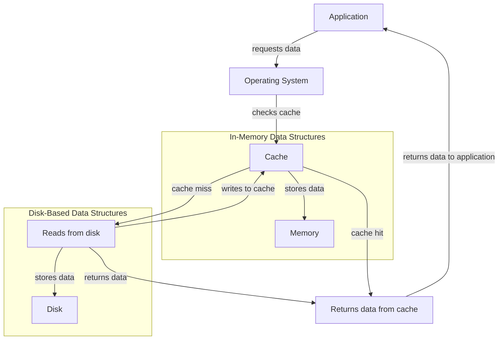

## Introduction
In the realm of computer science, data structures are the backbone of efficient programming. The choice between in-memory and disk-based data structures is crucial, as it significantly impacts the performance, scalability, and reliability of an application. **In-memory data structures** store data in the random access memory (RAM), whereas **disk-based data structures** store data on secondary storage devices such as hard drives or solid-state drives. In this study, we will delve into the world of in-memory and disk-based data structures, exploring their core concepts, internal workings, and real-world applications.

> **Note:** Understanding the trade-offs between in-memory and disk-based data structures is essential for designing efficient and scalable systems.

## Core Concepts
To grasp the differences between in-memory and disk-based data structures, it's essential to understand the following key concepts:
* **Memory Hierarchy**: The memory hierarchy refers to the organization of memory in a computer system, ranging from the fastest (cache) to the slowest (disk).
* **Cache**: A cache is a small, fast memory that stores frequently accessed data to reduce the time it takes to access main memory.
* **Block**: A block is a contiguous sequence of bytes on disk, used to store and retrieve data.
* **Buffer**: A buffer is a region of memory that temporarily stores data being transferred between devices.

> **Warning:** Failing to consider the memory hierarchy and cache behavior can lead to significant performance degradation.

## How It Works Internally
Let's dive into the internal workings of in-memory and disk-based data structures:
1. **In-Memory Data Structures**: When data is stored in memory, it can be accessed directly using the memory address. The operating system manages memory allocation and deallocation using techniques like **paging** and **segmentation**.
2. **Disk-Based Data Structures**: When data is stored on disk, it's divided into blocks, and each block is assigned a unique identifier. The disk controller manages block allocation and deallocation, and the operating system provides a file system abstraction to access the data.

> **Tip:** Understanding how the operating system manages memory and disk storage is crucial for optimizing system performance.

## Code Examples
Here are three complete and runnable examples to illustrate the differences between in-memory and disk-based data structures:

### Example 1: Basic In-Memory Array
```java
public class InMemoryArray {
    private int[] array;

    public InMemoryArray(int size) {
        array = new int[size];
    }

    public void set(int index, int value) {
        array[index] = value;
    }

    public int get(int index) {
        return array[index];
    }

    public static void main(String[] args) {
        InMemoryArray array = new InMemoryArray(10);
        array.set(5, 10);
        System.out.println(array.get(5)); // prints 10
    }
}
```

### Example 2: Disk-Based File System
```python
import os

class DiskBasedFileSystem:
    def __init__(self, filename):
        self.filename = filename

    def write(self, data):
        with open(self.filename, 'w') as file:
            file.write(data)

    def read(self):
        with open(self.filename, 'r') as file:
            return file.read()

# create a disk-based file system
file_system = DiskBasedFileSystem('example.txt')

# write data to the file
file_system.write('Hello, World!')

# read data from the file
print(file_system.read())  # prints 'Hello, World!'
```

### Example 3: Hybrid Approach using Cache
```cpp
#include <iostream>
#include <unordered_map>
#include <string>

class HybridCache {
private:
    std::unordered_map<std::string, std::string> cache;
    std::string filename;

public:
    HybridCache(const std::string& filename) : filename(filename) {}

    std::string get(const std::string& key) {
        // check if key is in cache
        if (cache.find(key) != cache.end()) {
            return cache[key];
        }

        // read from file if not in cache
        std::ifstream file(filename);
        std::string value;
        file >> value;
        cache[key] = value;
        return value;
    }

    void set(const std::string& key, const std::string& value) {
        cache[key] = value;
        // write to file
        std::ofstream file(filename);
        file << value;
    }
};

int main() {
    HybridCache cache("example.txt");
    cache.set("key", "value");
    std::cout << cache.get("key") << std::endl;  // prints 'value'
    return 0;
}
```

## Visual Diagram

This diagram illustrates the flow of data between the application, operating system, cache, and disk.

> **Interview:** Can you explain the trade-offs between in-memory and disk-based data structures? How would you design a system to optimize performance and scalability?

## Comparison
Here's a comparison of in-memory and disk-based data structures:
| Approach | Time Complexity | Space Complexity | Pros | Cons | Best For |
| --- | --- | --- | --- | --- | --- |
| In-Memory | O(1) | O(n) | Fast access, low latency | Limited capacity, volatile | Real-time systems, caching |
| Disk-Based | O(log n) | O(n) | High capacity, persistent | Slow access, high latency | Large-scale data storage, file systems |
| Hybrid | O(1) - O(log n) | O(n) | Balances performance and capacity | Complex implementation, cache thrashing | Database systems, web applications |

## Real-world Use Cases
Here are three production examples of in-memory and disk-based data structures:
1. **Redis**: An in-memory data store that uses a combination of memory and disk storage to provide high-performance caching and data storage.
2. **HDFS**: A disk-based file system designed for large-scale data storage and processing, used in big data analytics and machine learning applications.
3. **MySQL**: A relational database management system that uses a hybrid approach, storing data in memory and on disk to balance performance and capacity.

> **Tip:** Understanding the use cases and requirements of a system is crucial for choosing the right data structure.

## Common Pitfalls
Here are four common mistakes to avoid when working with in-memory and disk-based data structures:
1. **Inconsistent caching**: Failing to update the cache when data is modified, leading to stale data and performance issues.
2. **Insufficient disk space**: Failing to allocate sufficient disk space, leading to data loss and system crashes.
3. **Inadequate error handling**: Failing to handle errors and exceptions properly, leading to system instability and data corruption.
4. **Inefficient data retrieval**: Using inefficient data retrieval algorithms, leading to slow performance and high latency.

> **Warning:** Failing to address these pitfalls can lead to significant performance degradation, data loss, and system instability.

## Interview Tips
Here are three common interview questions on this topic, along with weak and strong answers:
1. **What are the trade-offs between in-memory and disk-based data structures?**
	* Weak answer: "In-memory is faster, but disk-based is more scalable."
	* Strong answer: "In-memory data structures offer fast access and low latency, but are limited by memory capacity and volatility. Disk-based data structures provide high capacity and persistence, but are slower and more prone to latency. The choice depends on the specific use case and requirements."
2. **How would you optimize a system for high-performance data retrieval?**
	* Weak answer: "Use a faster disk or more memory."
	* Strong answer: "I would analyze the system's workload and identify bottlenecks. Then, I would consider optimizing the data retrieval algorithm, using caching or indexing, and tuning the system's configuration for optimal performance."
3. **What are some common pitfalls when working with in-memory and disk-based data structures?**
	* Weak answer: "I'm not sure."
	* Strong answer: "Some common pitfalls include inconsistent caching, insufficient disk space, inadequate error handling, and inefficient data retrieval. To avoid these pitfalls, it's essential to carefully design and implement the system, considering factors like data consistency, scalability, and performance."

## Key Takeaways
Here are ten key takeaways to remember:
* In-memory data structures offer fast access and low latency, but are limited by memory capacity and volatility.
* Disk-based data structures provide high capacity and persistence, but are slower and more prone to latency.
* The choice between in-memory and disk-based data structures depends on the specific use case and requirements.
* Caching and indexing can significantly improve data retrieval performance.
* Inconsistent caching and insufficient disk space can lead to significant performance degradation and data loss.
* Error handling and exception handling are crucial for maintaining system stability and data integrity.
* Data retrieval algorithms can significantly impact system performance and latency.
* System configuration and tuning can significantly impact performance and scalability.
* Understanding the memory hierarchy and cache behavior is essential for optimizing system performance.
* Careful design and implementation are essential for avoiding common pitfalls and ensuring system reliability and performance.