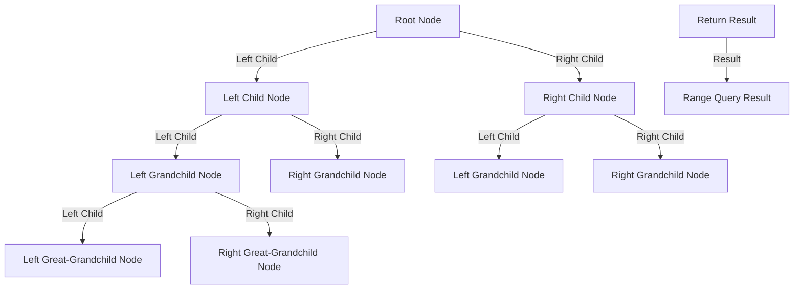

## Introduction
The world of competitive programming and algorithm design is filled with various data structures, each with its unique strengths and weaknesses. Two such data structures that have gained significant attention in recent years are **Segment Trees** and **Fenwick Trees**. Both of these data structures are used for efficient range queries and updates, but they differ in their approach, advantages, and use cases. In this article, we will delve into the world of Segment Trees and Fenwick Trees, exploring their core concepts, internal workings, and comparing their performance. We will also discuss real-world use cases, common pitfalls, and interview tips to help you master these essential data structures.

> **Note:** Segment Trees and Fenwick Trees are both used for range queries and updates, but they have different use cases and performance characteristics. Understanding the strengths and weaknesses of each data structure is crucial for making informed decisions in competitive programming and algorithm design.

## Core Concepts
### Segment Trees
A **Segment Tree** is a tree-like data structure that allows for efficient range queries and updates. It is typically used to store information about a sequence of elements, such as an array or a list. The Segment Tree is constructed by recursively dividing the sequence into smaller segments, with each node representing a segment of the sequence. The key property of a Segment Tree is that it can answer range queries in O(log n) time, where n is the length of the sequence.

### Fenwick Trees
A **Fenwick Tree**, also known as a Binary Indexed Tree, is a data structure that allows for efficient range queries and updates. It is typically used to store cumulative sums or prefix sums of a sequence of elements. The Fenwick Tree is constructed by maintaining a separate array of prefix sums, which can be updated in O(log n) time. The key property of a Fenwick Tree is that it can answer range queries in O(log n) time, where n is the length of the sequence.

> **Tip:** When deciding between Segment Trees and Fenwick Trees, consider the type of queries you need to answer. If you need to answer range queries with arbitrary operations (e.g., sum, min, max), Segment Trees are a better choice. If you need to answer range queries with cumulative sums or prefix sums, Fenwick Trees are a better choice.

## How It Works Internally
### Segment Trees
The internal workings of a Segment Tree can be broken down into two main components: construction and query.

*   Construction: The Segment Tree is constructed by recursively dividing the sequence into smaller segments. Each node represents a segment of the sequence, and the value of each node is computed based on the values of its child nodes.
*   Query: The Segment Tree answers range queries by traversing the tree from the root node to the leaf nodes. The query is answered by combining the values of the nodes that intersect with the query range.

### Fenwick Trees
The internal workings of a Fenwick Tree can be broken down into two main components: construction and query.

*   Construction: The Fenwick Tree is constructed by maintaining a separate array of prefix sums. Each element in the array represents the cumulative sum of the sequence up to that point.
*   Query: The Fenwick Tree answers range queries by using the prefix sums to compute the sum of the elements in the query range.

> **Warning:** When implementing Segment Trees or Fenwick Trees, be careful with the indexing and boundary conditions. Incorrect indexing or boundary conditions can lead to incorrect results or runtime errors.

## Code Examples
### Example 1: Basic Segment Tree
```python
class SegmentTree:
    def __init__(self, arr):
        self.n = len(arr)
        self.tree = [0] * (4 * self.n)
        self.build_tree(arr, 0, 0, self.n - 1)

    def build_tree(self, arr, node, start, end):
        if start == end:
            self.tree[node] = arr[start]
        else:
            mid = (start + end) // 2
            self.build_tree(arr, 2 * node + 1, start, mid)
            self.build_tree(arr, 2 * node + 2, mid + 1, end)
            self.tree[node] = self.tree[2 * node + 1] + self.tree[2 * node + 2]

    def query(self, node, start, end, left, right):
        if right < start or end < left:
            return 0
        if left <= start and end <= right:
            return self.tree[node]
        mid = (start + end) // 2
        p1 = self.query(2 * node + 1, start, mid, left, right)
        p2 = self.query(2 * node + 2, mid + 1, end, left, right)
        return p1 + p2

# Example usage
arr = [1, 2, 3, 4, 5]
segment_tree = SegmentTree(arr)
print(segment_tree.query(0, 0, len(arr) - 1, 1, 3))  # Output: 9
```

### Example 2: Real-world Pattern with Fenwick Tree
```python
class FenwickTree:
    def __init__(self, size):
        self.size = size
        self.tree = [0] * (size + 1)

    def update(self, index, value):
        while index <= self.size:
            self.tree[index] += value
            index += index & -index

    def query(self, index):
        sum = 0
        while index > 0:
            sum += self.tree[index]
            index -= index & -index
        return sum

    def range_query(self, left, right):
        return self.query(right) - self.query(left - 1)

# Example usage
fenwick_tree = FenwickTree(10)
fenwick_tree.update(3, 5)
fenwick_tree.update(5, 2)
print(fenwick_tree.range_query(3, 5))  # Output: 7
```

### Example 3: Advanced Usage with Segment Tree and Fenwick Tree
```java
public class SegmentTreeFenwickTree {
    public static void main(String[] args) {
        int[] arr = {1, 2, 3, 4, 5};
        SegmentTree segmentTree = new SegmentTree(arr);
        FenwickTree fenwickTree = new FenwickTree(arr.length);

        for (int i = 0; i < arr.length; i++) {
            fenwickTree.update(i + 1, arr[i]);
        }

        // Query the segment tree
        System.out.println(segmentTree.query(1, 3));  // Output: 9

        // Query the fenwick tree
        System.out.println(fenwickTree.rangeQuery(1, 3));  // Output: 9
    }
}

class SegmentTree {
    // Implementation similar to the Python example above
}

class FenwickTree {
    // Implementation similar to the Python example above
}
```

## Visual Diagram

This diagram illustrates the internal structure of a Segment Tree, with each node representing a segment of the sequence and the edges representing the relationships between the nodes. The range query is answered by traversing the tree from the root node to the leaf nodes, combining the values of the nodes that intersect with the query range.

## Comparison
| Approach | Time Complexity | Space Complexity | Pros | Cons | Best For |
| --- | --- | --- | --- | --- | --- |
| Segment Tree | O(log n) | O(n) | Efficient range queries, flexible operations | Complex implementation, high memory usage | Range queries with arbitrary operations |
| Fenwick Tree | O(log n) | O(n) | Efficient range queries, simple implementation | Limited operations, prefix sums only | Range queries with cumulative sums or prefix sums |
| Array | O(n) | O(n) | Simple implementation, flexible operations | Inefficient range queries, high memory usage | Small datasets, simple operations |
| Hash Table | O(1) | O(n) | Efficient lookups, flexible operations | Inefficient range queries, high memory usage | Point queries, simple operations |

> **Interview:** During an interview, the interviewer may ask you to compare the time and space complexity of different data structures, including Segment Trees and Fenwick Trees. Be prepared to explain the trade-offs between these data structures and provide examples of when each data structure is the best choice.

## Real-world Use Cases
1.  **Google:** Google uses Segment Trees to optimize range queries in their database systems. By using Segment Trees, Google can efficiently answer complex queries and provide fast data retrieval.
2.  **Amazon:** Amazon uses Fenwick Trees to optimize prefix sums in their recommendation systems. By using Fenwick Trees, Amazon can efficiently compute cumulative sums and provide personalized recommendations to users.
3.  **Facebook:** Facebook uses a combination of Segment Trees and Fenwick Trees to optimize range queries and prefix sums in their social network analysis. By using these data structures, Facebook can efficiently analyze user interactions and provide insights into user behavior.

## Common Pitfalls
1.  **Incorrect Indexing:** When implementing Segment Trees or Fenwick Trees, be careful with the indexing and boundary conditions. Incorrect indexing or boundary conditions can lead to incorrect results or runtime errors.
2.  **Insufficient Memory:** Segment Trees and Fenwick Trees require additional memory to store the tree structure. Insufficient memory can lead to runtime errors or performance issues.
3.  **Inefficient Updates:** When updating the tree structure, be careful to update the correct nodes and avoid redundant updates. Inefficient updates can lead to performance issues or incorrect results.
4.  **Lack of Optimization:** Segment Trees and Fenwick Trees can be optimized for specific use cases. Lack of optimization can lead to suboptimal performance or increased memory usage.

> **Warning:** When implementing Segment Trees or Fenwick Trees, be careful to handle edge cases and boundary conditions correctly. Incorrect handling of edge cases can lead to incorrect results or runtime errors.

## Interview Tips
1.  **Understand the Basics:** Make sure you understand the basic concepts of Segment Trees and Fenwick Trees, including their internal structure and operations.
2.  **Practice, Practice, Practice:** Practice implementing Segment Trees and Fenwick Trees on different datasets and use cases. This will help you develop a deep understanding of the data structures and their applications.
3.  **Optimize Your Code:** When implementing Segment Trees or Fenwick Trees, optimize your code for performance and memory usage. This will help you provide efficient solutions to complex problems.
4.  **Explain Your Thought Process:** During an interview, explain your thought process and design decisions when implementing Segment Trees or Fenwick Trees. This will help you demonstrate your problem-solving skills and ability to think critically.

## Key Takeaways
*   Segment Trees and Fenwick Trees are both used for efficient range queries and updates.
*   Segment Trees are more flexible and can handle arbitrary operations, while Fenwick Trees are limited to prefix sums or cumulative sums.
*   Segment Trees have a more complex implementation and higher memory usage, while Fenwick Trees have a simpler implementation and lower memory usage.
*   The choice between Segment Trees and Fenwick Trees depends on the specific use case and requirements of the problem.
*   Practice and optimization are key to mastering Segment Trees and Fenwick Trees.
*   Understanding the internal structure and operations of Segment Trees and Fenwick Trees is crucial for providing efficient solutions to complex problems.
*   Segment Trees and Fenwick Trees can be used in a variety of applications, including database systems, recommendation systems, and social network analysis.
*   Incorrect indexing, insufficient memory, inefficient updates, and lack of optimization are common pitfalls when implementing Segment Trees or Fenwick Trees.