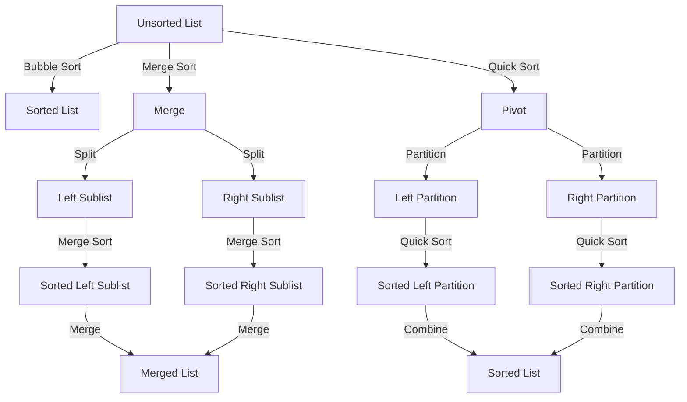

## Introduction
Sorting algorithms are a fundamental concept in computer science, and they play a crucial role in many applications, including databases, file systems, and web search engines. In this section, we will explore the world of sorting algorithms, including their types, time and space complexities, and real-world relevance. **Sorting algorithms** are used to arrange a list of elements in a specific order, either ascending or descending. This is a critical operation in many scenarios, such as when searching for a specific element in a large dataset or when optimizing the performance of a database query.

> **Note:** Sorting algorithms are not only used for sorting data but also for solving other problems, such as finding the median or the kth smallest element in an array.

In real-world scenarios, sorting algorithms are used in many applications, including:

* Database query optimization
* File system organization
* Web search engines
* Data analysis and visualization

## Core Concepts
There are several types of sorting algorithms, each with its own strengths and weaknesses. Some of the most common types of sorting algorithms include:

* **Bubble sort**: a simple sorting algorithm that works by repeatedly iterating through the list and swapping adjacent elements if they are in the wrong order.
* **Selection sort**: a sorting algorithm that works by selecting the smallest element from the unsorted part of the list and moving it to the beginning of the unsorted part.
* **Insertion sort**: a sorting algorithm that works by iterating through the list one element at a time and inserting each element into its proper position in the sorted part of the list.
* **Merge sort**: a divide-and-conquer sorting algorithm that works by splitting the list into smaller sublists, sorting each sublist, and then merging the sorted sublists back together.
* **Quick sort**: a divide-and-conquer sorting algorithm that works by selecting a pivot element, partitioning the list around the pivot, and then recursively sorting the sublists.
* **Heap sort**: a comparison-based sorting algorithm that works by building a heap and then repeatedly removing the largest element from the heap and placing it at the end of the sorted list.
* **Counting sort**: a non-comparison sorting algorithm that works by counting the number of occurrences of each element in the list and then using this information to sort the list.
* **Radix sort**: a non-comparison sorting algorithm that works by sorting the list based on the digits of the elements.

> **Warning:** Some sorting algorithms, such as bubble sort and insertion sort, have poor performance for large datasets and should be avoided in production environments.

## How It Works Internally
Let's take a closer look at how some of these sorting algorithms work internally:

* **Bubble sort**: the algorithm starts at the beginning of the list and iterates through the list, comparing each pair of adjacent elements. If the elements are in the wrong order, the algorithm swaps them. This process is repeated until the list is sorted.
* **Merge sort**: the algorithm splits the list into smaller sublists, sorts each sublist, and then merges the sorted sublists back together. The merging process involves comparing elements from each sublist and placing the smaller element in the merged list.
* **Quick sort**: the algorithm selects a pivot element, partitions the list around the pivot, and then recursively sorts the sublists. The partitioning process involves swapping elements that are smaller than the pivot with elements that are larger than the pivot.

## Code Examples
Here are three complete and runnable code examples for sorting algorithms:

### Example 1: Bubble Sort
```python
def bubble_sort(arr):
    n = len(arr)
    for i in range(n-1):
        for j in range(n-i-1):
            if arr[j] > arr[j+1]:
                arr[j], arr[j+1] = arr[j+1], arr[j]
    return arr

print(bubble_sort([5, 2, 8, 3, 1, 6, 4]))
```

### Example 2: Merge Sort
```python
def merge_sort(arr):
    if len(arr) <= 1:
        return arr
    mid = len(arr) // 2
    left = merge_sort(arr[:mid])
    right = merge_sort(arr[mid:])
    return merge(left, right)

def merge(left, right):
    result = []
    while len(left) > 0 and len(right) > 0:
        if left[0] <= right[0]:
            result.append(left.pop(0))
        else:
            result.append(right.pop(0))
    result.extend(left)
    result.extend(right)
    return result

print(merge_sort([5, 2, 8, 3, 1, 6, 4]))
```

### Example 3: Quick Sort
```python
def quick_sort(arr):
    if len(arr) <= 1:
        return arr
    pivot = arr[len(arr) // 2]
    left = [x for x in arr if x < pivot]
    middle = [x for x in arr if x == pivot]
    right = [x for x in arr if x > pivot]
    return quick_sort(left) + middle + quick_sort(right)

print(quick_sort([5, 2, 8, 3, 1, 6, 4]))
```

> **Tip:** When implementing sorting algorithms, it's essential to consider the time and space complexities of each algorithm. For example, bubble sort has a time complexity of O(n^2), while merge sort has a time complexity of O(n log n).

## Visual Diagram

This diagram illustrates the basic steps involved in each sorting algorithm.

## Comparison
Here is a comparison of the time and space complexities of each sorting algorithm:

| Algorithm | Time Complexity | Space Complexity | Pros | Cons |
| --- | --- | --- | --- | --- |
| Bubble Sort | O(n^2) | O(1) | Simple to implement | Poor performance for large datasets |
| Merge Sort | O(n log n) | O(n) | Stable, efficient | Requires extra memory for merging |
| Quick Sort | O(n log n) | O(log n) | Fast, efficient | Can be unstable, requires pivot selection |
| Heap Sort | O(n log n) | O(1) | Simple to implement, efficient | Can be slow for small datasets |
| Counting Sort | O(n + k) | O(n + k) | Fast, efficient | Limited to integers, requires extra memory |
| Radix Sort | O(nk) | O(n + k) | Fast, efficient | Limited to integers, requires extra memory |

> **Interview:** When asked about sorting algorithms in an interview, be prepared to discuss the trade-offs between different algorithms and explain how to choose the best algorithm for a given problem.

## Real-world Use Cases
Here are three real-world examples of sorting algorithms in use:

* **Database query optimization**: Many databases use sorting algorithms to optimize query performance. For example, a database might use merge sort to sort a large dataset and then use the sorted data to answer queries.
* **File system organization**: Many file systems use sorting algorithms to organize files and directories. For example, a file system might use quick sort to sort a list of files by name or size.
* **Web search engines**: Web search engines use sorting algorithms to rank search results. For example, a search engine might use heap sort to sort a list of search results by relevance.

## Common Pitfalls
Here are four common pitfalls to watch out for when implementing sorting algorithms:

* **Incorrect pivot selection**: When implementing quick sort, it's essential to choose a good pivot element. A poor pivot can lead to poor performance.
* **Inefficient merging**: When implementing merge sort, it's essential to merge the sorted sublists efficiently. A poor merge can lead to poor performance.
* **Incorrect sorting**: When implementing a sorting algorithm, it's essential to ensure that the algorithm produces the correct sorted output. A poor implementation can lead to incorrect results.
* **Inadequate testing**: When implementing a sorting algorithm, it's essential to test the algorithm thoroughly. A poor test suite can lead to bugs and incorrect results.

> **Warning:** When implementing sorting algorithms, it's essential to consider the time and space complexities of each algorithm. A poor implementation can lead to poor performance and incorrect results.

## Interview Tips
Here are three common interview questions related to sorting algorithms:

* **What is the time complexity of bubble sort?**: A good answer should include a discussion of the algorithm's time complexity and how it compares to other sorting algorithms.
* **How does merge sort work?**: A good answer should include a discussion of the algorithm's basic steps and how it merges the sorted sublists.
* **What is the advantage of using quick sort?**: A good answer should include a discussion of the algorithm's advantages, such as its fast average-case performance and its ability to sort large datasets.

## Key Takeaways
Here are ten key takeaways to remember when working with sorting algorithms:

* **Sorting algorithms are used to arrange a list of elements in a specific order**.
* **There are many different types of sorting algorithms, each with its own strengths and weaknesses**.
* **Bubble sort has a time complexity of O(n^2)**.
* **Merge sort has a time complexity of O(n log n)**.
* **Quick sort has a time complexity of O(n log n)**.
* **Heap sort has a time complexity of O(n log n)**.
* **Counting sort has a time complexity of O(n + k)**.
* **Radix sort has a time complexity of O(nk)**.
* **When implementing a sorting algorithm, it's essential to consider the time and space complexities of each algorithm**.
* **When implementing a sorting algorithm, it's essential to test the algorithm thoroughly to ensure that it produces the correct sorted output**.