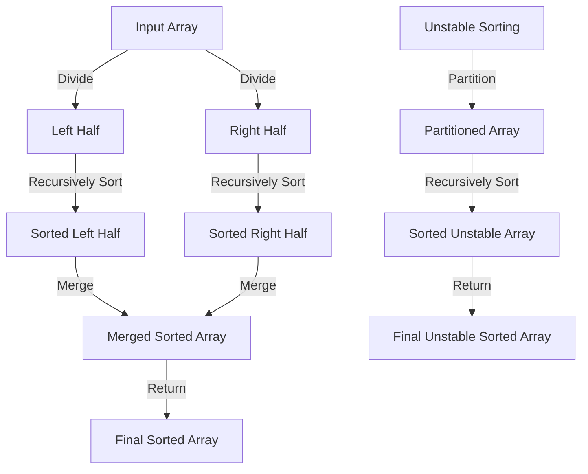

## Introduction
**Sorting algorithms** are a fundamental component of computer science, and understanding the differences between **stable** and **unstable** sorting is crucial for any software engineer. In this section, we will delve into the world of sorting algorithms, exploring the definitions, core concepts, and internal workings of stable and unstable sorting. We will also examine real-world use cases, common pitfalls, and interview tips to help you master this essential topic.

> **Note:** Sorting algorithms are used in various applications, such as database query optimization, file system organization, and data analysis. Understanding the trade-offs between stable and unstable sorting is essential for optimizing performance and ensuring data integrity.

## Core Concepts
A **stable sorting algorithm** is one that maintains the relative order of equal elements after sorting. In other words, if two elements have the same key, their original order is preserved. On the other hand, an **unstable sorting algorithm** does not guarantee the preservation of equal elements' order. This difference has significant implications for certain applications, such as sorting data by multiple criteria.

> **Warning:** Using an unstable sorting algorithm when stability is required can lead to incorrect results or unexpected behavior.

Key terminology includes:

* **Stable sorting**: maintains the relative order of equal elements
* **Unstable sorting**: does not guarantee the preservation of equal elements' order
* **Comparison-based sorting**: uses comparisons to determine the order of elements
* **Non-comparison-based sorting**: uses other methods, such as counting or bucketing, to determine the order of elements

## How It Works Internally
The internal workings of stable and unstable sorting algorithms differ significantly. Stable sorting algorithms, such as **Merge Sort** and **Insertion Sort**, use a combination of comparisons and swaps to maintain the relative order of equal elements. Unstable sorting algorithms, such as **Quick Sort** and **Heap Sort**, use a different approach, often relying on partitioning and recursion to sort the data.

> **Tip:** Understanding the internal workings of sorting algorithms is essential for optimizing performance and identifying potential pitfalls.

Here is a step-by-step breakdown of the **Merge Sort** algorithm, a stable sorting algorithm:

1. Divide the input array into two halves
2. Recursively sort each half
3. Merge the two sorted halves, maintaining the relative order of equal elements

## Code Examples
### Example 1: Basic Merge Sort (Stable)
```python
def merge_sort(arr):
    if len(arr) <= 1:
        return arr
    mid = len(arr) // 2
    left = merge_sort(arr[:mid])
    right = merge_sort(arr[mid:])
    return merge(left, right)

def merge(left, right):
    result = []
    while left and right:
        if left[0] <= right[0]:
            result.append(left.pop(0))
        else:
            result.append(right.pop(0))
    result.extend(left)
    result.extend(right)
    return result

# Test the implementation
arr = [5, 2, 8, 3, 1, 6, 4]
print(merge_sort(arr))  # [1, 2, 3, 4, 5, 6, 8]
```
### Example 2: Real-World Quick Sort (Unstable)
```java
public class QuickSort {
    public static void quickSort(int[] arr) {
        quickSort(arr, 0, arr.length - 1);
    }

    private static void quickSort(int[] arr, int low, int high) {
        if (low < high) {
            int pivot = partition(arr, low, high);
            quickSort(arr, low, pivot - 1);
            quickSort(arr, pivot + 1, high);
        }
    }

    private static int partition(int[] arr, int low, int high) {
        int pivot = arr[high];
        int i = low - 1;
        for (int j = low; j < high; j++) {
            if (arr[j] <= pivot) {
                i++;
                int temp = arr[i];
                arr[i] = arr[j];
                arr[j] = temp;
            }
        }
        int temp = arr[i + 1];
        arr[i + 1] = arr[high];
        arr[high] = temp;
        return i + 1;
    }

    public static void main(String[] args) {
        int[] arr = {5, 2, 8, 3, 1, 6, 4};
        quickSort(arr);
        for (int num : arr) {
            System.out.print(num + " ");
        }
    }
}
```
### Example 3: Advanced Hybrid Sorting (Stable)
```typescript
function hybridSort(arr: number[]): number[] {
    if (arr.length <= 10) {
        return insertionSort(arr);
    } else {
        return mergeSort(arr);
    }
}

function insertionSort(arr: number[]): number[] {
    for (let i = 1; i < arr.length; i++) {
        let key = arr[i];
        let j = i - 1;
        while (j >= 0 && arr[j] > key) {
            arr[j + 1] = arr[j];
            j--;
        }
        arr[j + 1] = key;
    }
    return arr;
}

function mergeSort(arr: number[]): number[] {
    if (arr.length <= 1) {
        return arr;
    }
    const mid = Math.floor(arr.length / 2);
    const left = mergeSort(arr.slice(0, mid));
    const right = mergeSort(arr.slice(mid));
    return merge(left, right);
}

function merge(left: number[], right: number[]): number[] {
    const result: number[] = [];
    while (left.length > 0 && right.length > 0) {
        if (left[0] <= right[0]) {
            result.push(left.shift() as number);
        } else {
            result.push(right.shift() as number);
        }
    }
    return result.concat(left).concat(right);
}

console.log(hybridSort([5, 2, 8, 3, 1, 6, 4]));
```
## Visual Diagram

This diagram illustrates the basic steps involved in stable and unstable sorting algorithms. The stable sorting algorithm (left side) uses a divide-and-conquer approach to sort the input array, while the unstable sorting algorithm (right side) uses a partition-based approach.

> **Interview:** Can you explain the difference between stable and unstable sorting algorithms? How would you implement a stable sorting algorithm in a real-world application?

## Comparison
| Approach | Time Complexity | Space Complexity | Pros | Cons | Best For |
| --- | --- | --- | --- | --- | --- |
| Merge Sort (Stable) | O(n log n) | O(n) | Stable, efficient, and scalable | Higher memory requirements | Large datasets, databases, and file systems |
| Quick Sort (Unstable) | O(n log n) on average, O(n^2) in worst case | O(log n) | Fast, efficient, and simple to implement | Unstable, may have poor performance for certain inputs | Small to medium-sized datasets, embedded systems, and real-time applications |
| Insertion Sort (Stable) | O(n^2) | O(1) | Simple, stable, and efficient for small datasets | Slow for large datasets | Small datasets, educational purposes, and simple applications |
| Hybrid Sorting (Stable) | O(n log n) | O(n) | Combines the benefits of stable and efficient sorting algorithms | More complex to implement | Large datasets, databases, and file systems that require both stability and efficiency |

## Real-world Use Cases
1. **Database Query Optimization**: Many databases use stable sorting algorithms to optimize query performance and ensure data consistency.
2. **File System Organization**: File systems often use stable sorting algorithms to organize and manage files and directories.
3. **Data Analysis**: Data analysis tools and libraries, such as pandas and NumPy, use stable sorting algorithms to sort and manipulate large datasets.

## Common Pitfalls
1. **Using Unstable Sorting for Stable Data**: Using an unstable sorting algorithm when stability is required can lead to incorrect results or unexpected behavior.
2. **Ignoring Time and Space Complexity**: Ignoring the time and space complexity of sorting algorithms can result in poor performance and inefficient use of resources.
3. **Not Considering Edge Cases**: Not considering edge cases, such as duplicate elements or empty arrays, can lead to bugs and errors in sorting algorithms.
4. **Implementing Sorting Algorithms Incorrectly**: Implementing sorting algorithms incorrectly can result in incorrect results, poor performance, or crashes.

> **Warning:** Always consider the trade-offs between stability, efficiency, and complexity when choosing a sorting algorithm for a real-world application.

## Interview Tips
1. **Be Prepared to Explain Stable and Unstable Sorting**: Be prepared to explain the difference between stable and unstable sorting algorithms, including their advantages and disadvantages.
2. **Understand Time and Space Complexity**: Understand the time and space complexity of common sorting algorithms, including Merge Sort, Quick Sort, and Insertion Sort.
3. **Practice Implementing Sorting Algorithms**: Practice implementing sorting algorithms, including stable and unstable algorithms, to improve your coding skills and problem-solving abilities.

> **Tip:** Always consider the requirements of the problem and the characteristics of the input data when choosing a sorting algorithm.

## Key Takeaways
* **Stable sorting algorithms** maintain the relative order of equal elements, while **unstable sorting algorithms** do not guarantee this property.
* **Merge Sort** is a stable sorting algorithm with a time complexity of O(n log n) and a space complexity of O(n).
* **Quick Sort** is an unstable sorting algorithm with an average time complexity of O(n log n) and a worst-case time complexity of O(n^2).
* **Insertion Sort** is a stable sorting algorithm with a time complexity of O(n^2) and a space complexity of O(1).
* **Hybrid sorting algorithms** combine the benefits of stable and efficient sorting algorithms, such as Merge Sort and Insertion Sort.
* **Time and space complexity** are essential considerations when choosing a sorting algorithm for a real-world application.
* **Edge cases**, such as duplicate elements or empty arrays, must be considered when implementing sorting algorithms.
* **Correct implementation** of sorting algorithms is critical to ensure accurate results and efficient performance.