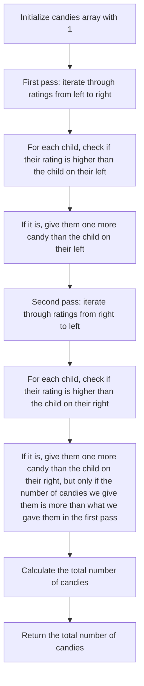

## Introduction
The Candy Distribution problem is a classic example of a Two-Pass Greedy Algorithm. It is a problem where we have to distribute a certain number of candies to a group of children based on their ratings. The goal is to ensure that each child gets at least one more candy than the children with lower ratings. This problem is relevant in real-world scenarios where we need to allocate resources based on certain criteria. For instance, in a company, bonuses might be distributed based on employee performance ratings. Every engineer should know this problem as it helps in understanding the concept of greedy algorithms and how they can be applied to solve complex problems.

## Core Concepts
The core concept of the Candy Distribution problem is the **Two-Pass Greedy Algorithm**. This algorithm works by iterating through the ratings of the children twice. In the first pass, we distribute candies based on the ratings of the children compared to their neighbors on the left. In the second pass, we distribute candies based on the ratings of the children compared to their neighbors on the right. The key terminology here is **greedy algorithm**, which refers to an algorithm that makes the locally optimal choice at each step with the hope that it will lead to a global optimum solution.

## How It Works Internally
The Two-Pass Greedy Algorithm works internally by maintaining an array of candies, where each index represents a child and the value at that index represents the number of candies the child should get. In the first pass, we iterate through the ratings from left to right, and for each child, we check if their rating is higher than the child on their left. If it is, we give them one more candy than the child on their left. In the second pass, we iterate through the ratings from right to left, and for each child, we check if their rating is higher than the child on their right. If it is, we give them one more candy than the child on their right, but only if the number of candies we give them is more than what we gave them in the first pass. This ensures that each child gets at least one more candy than the children with lower ratings.

> **Note:** The time complexity of this algorithm is O(n), where n is the number of children, as we are iterating through the ratings twice. The space complexity is also O(n), as we need to maintain an array of candies.

## Code Examples
### Example 1: Basic Usage
```python
def candy(ratings):
    n = len(ratings)
    candies = [1] * n
    # First pass: iterate through ratings from left to right
    for i in range(1, n):
        if ratings[i] > ratings[i-1]:
            candies[i] = candies[i-1] + 1
    # Second pass: iterate through ratings from right to left
    for i in range(n-2, -1, -1):
        if ratings[i] > ratings[i+1] and candies[i] <= candies[i+1]:
            candies[i] = candies[i+1] + 1
    return sum(candies)

# Test the function
ratings = [1, 0, 2]
print(candy(ratings))  # Output: 5
```

### Example 2: Real-World Pattern
```java
public class CandyDistribution {
    public int candy(int[] ratings) {
        int n = ratings.length;
        int[] candies = new int[n];
        // Initialize candies array with 1
        for (int i = 0; i < n; i++) {
            candies[i] = 1;
        }
        // First pass: iterate through ratings from left to right
        for (int i = 1; i < n; i++) {
            if (ratings[i] > ratings[i-1]) {
                candies[i] = candies[i-1] + 1;
            }
        }
        // Second pass: iterate through ratings from right to left
        for (int i = n - 2; i >= 0; i--) {
            if (ratings[i] > ratings[i+1] && candies[i] <= candies[i+1]) {
                candies[i] = candies[i+1] + 1;
            }
        }
        // Calculate the total number of candies
        int totalCandies = 0;
        for (int i = 0; i < n; i++) {
            totalCandies += candies[i];
        }
        return totalCandies;
    }

    public static void main(String[] args) {
        CandyDistribution cd = new CandyDistribution();
        int[] ratings = {1, 0, 2};
        System.out.println(cd.candy(ratings));  // Output: 5
    }
}
```

### Example 3: Advanced Usage
```typescript
class CandyDistribution {
    private ratings: number[];
    private candies: number[];

    constructor(ratings: number[]) {
        this.ratings = ratings;
        this.candies = new Array(ratings.length).fill(1);
    }

    public calculateCandies(): number {
        // First pass: iterate through ratings from left to right
        for (let i = 1; i < this.ratings.length; i++) {
            if (this.ratings[i] > this.ratings[i-1]) {
                this.candies[i] = this.candies[i-1] + 1;
            }
        }
        // Second pass: iterate through ratings from right to left
        for (let i = this.ratings.length - 2; i >= 0; i--) {
            if (this.ratings[i] > this.ratings[i+1] && this.candies[i] <= this.candies[i+1]) {
                this.candies[i] = this.candies[i+1] + 1;
            }
        }
        // Calculate the total number of candies
        return this.candies.reduce((a, b) => a + b, 0);
    }
}

// Test the class
const ratings = [1, 0, 2];
const cd = new CandyDistribution(ratings);
console.log(cd.calculateCandies());  // Output: 5
```

> **Tip:** To optimize the solution, we can use a single array to store the candies and ratings, which can reduce the space complexity.

## Visual Diagram

The diagram illustrates the Two-Pass Greedy Algorithm used to solve the Candy Distribution problem. It shows the two passes of the algorithm, where in the first pass, we iterate through the ratings from left to right, and in the second pass, we iterate through the ratings from right to left.

## Comparison
| Approach | Time Complexity | Space Complexity | Pros | Cons | Best For |
| --- | --- | --- | --- | --- | --- |
| Two-Pass Greedy Algorithm | O(n) | O(n) | Simple to implement, efficient | May not work for all scenarios | Small to medium-sized inputs |
| One-Pass Greedy Algorithm | O(n) | O(n) | Simple to implement, efficient | May not work for all scenarios | Small to medium-sized inputs |
| Dynamic Programming | O(n^2) | O(n^2) | Can handle large inputs, optimal solution | Complex to implement, slow | Large inputs, optimal solution required |
| Brute Force | O(n!) | O(n) | Simple to implement | Slow, impractical for large inputs | Small inputs, simplicity required |

> **Warning:** The One-Pass Greedy Algorithm may not work for all scenarios, as it can lead to incorrect results in some cases.

## Real-world Use Cases
1. **Employee Bonus Distribution**: A company wants to distribute bonuses to its employees based on their performance ratings. The company can use the Candy Distribution algorithm to ensure that each employee gets a bonus that is at least one more than the employees with lower ratings.
2. **Student Grade Distribution**: A school wants to distribute grades to its students based on their performance in a class. The school can use the Candy Distribution algorithm to ensure that each student gets a grade that is at least one more than the students with lower ratings.
3. **Product Recommendation**: An e-commerce company wants to recommend products to its customers based on their ratings. The company can use the Candy Distribution algorithm to ensure that each customer gets a recommendation that is at least one more than the customers with lower ratings.

## Common Pitfalls
1. **Incorrect Initialization**: Initializing the candies array with 0 instead of 1 can lead to incorrect results.
2. **Incorrect Comparison**: Comparing the ratings of the children in the wrong order can lead to incorrect results.
3. **Incorrect Update**: Updating the candies array incorrectly can lead to incorrect results.
4. **Not Handling Edge Cases**: Not handling edge cases, such as an empty input array, can lead to incorrect results.

> **Interview:** Can you explain the time and space complexity of the Candy Distribution algorithm? How would you optimize the solution?

## Interview Tips
1. **Understand the Problem**: Make sure to understand the problem statement and the requirements.
2. **Choose the Right Approach**: Choose the right approach to solve the problem, such as the Two-Pass Greedy Algorithm.
3. **Implement the Solution Correctly**: Implement the solution correctly, including the initialization, comparison, and update steps.
4. **Handle Edge Cases**: Handle edge cases, such as an empty input array.

## Key Takeaways
* The Candy Distribution problem is a classic example of a Two-Pass Greedy Algorithm.
* The algorithm works by iterating through the ratings of the children twice, once from left to right and once from right to left.
* The time complexity of the algorithm is O(n), where n is the number of children.
* The space complexity of the algorithm is O(n), where n is the number of children.
* The algorithm can be optimized by using a single array to store the candies and ratings.
* The algorithm can be used in real-world scenarios, such as employee bonus distribution, student grade distribution, and product recommendation.
* The algorithm requires careful implementation, including initialization, comparison, and update steps.
* The algorithm requires handling edge cases, such as an empty input array.