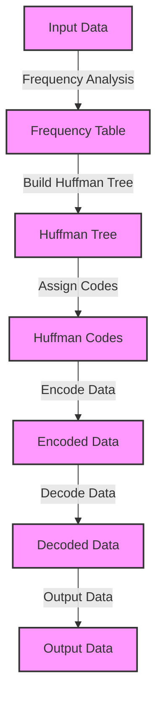

## Introduction
Huffman coding is a **lossless data compression** technique that assigns variable-length codes to input characters based on their frequencies. It is a **prefix-free code**, meaning that no code is a prefix of another code. This property allows for efficient decoding of the compressed data. Huffman coding is widely used in various applications, including text compression, image compression, and data transmission. Every engineer should understand Huffman coding because it is a fundamental concept in **data compression** and **information theory**.

> **Note:** Huffman coding is named after David A. Huffman, who developed this technique in the 1950s.

## Core Concepts
The core concepts of Huffman coding include:

* **Frequency analysis**: The process of calculating the frequency of each character in the input data.
* **Prefix-free code**: A code where no code is a prefix of another code.
* **Variable-length code**: A code where the length of the code varies depending on the frequency of the character.
* **Huffman tree**: A binary tree used to construct the Huffman codes.

> **Tip:** To understand Huffman coding, it is essential to have a solid grasp of **binary trees** and **graph theory**.

## How It Works Internally
The Huffman coding algorithm works as follows:

1. **Frequency analysis**: Calculate the frequency of each character in the input data.
2. **Build the Huffman tree**: Construct a binary tree where each node represents a character and its frequency.
3. **Assign codes**: Assign variable-length codes to each character based on their frequency and position in the Huffman tree.
4. **Encode data**: Replace each character in the input data with its corresponding Huffman code.

> **Warning:** Huffman coding can be computationally expensive for large datasets, as it requires building and traversing the Huffman tree.

## Code Examples
### Example 1: Basic Huffman Coding
```python
import heapq
from collections import defaultdict

def huffman_coding(input_data):
    # Frequency analysis
    frequency = defaultdict(int)
    for char in input_data:
        frequency[char] += 1

    # Build the Huffman tree
    heap = [[weight, [char, ""]] for char, weight in frequency.items()]
    heapq.heapify(heap)
    while len(heap) > 1:
        lo = heapq.heappop(heap)
        hi = heapq.heappop(heap)
        for pair in lo[1:]:
            pair[1] = '0' + pair[1]
        for pair in hi[1:]:
            pair[1] = '1' + pair[1]
        heapq.heappush(heap, [lo[0] + hi[0]] + lo[1:] + hi[1:])

    # Assign codes
    huffman_codes = sorted(heap[0][1:], key=lambda p: (len(p[-1]), p))

    # Encode data
    encoded_data = ''
    for char in input_data:
        for p in huffman_codes:
            if p[0] == char:
                encoded_data += p[1]

    return encoded_data, huffman_codes

input_data = "this is an example for huffman encoding"
encoded_data, huffman_codes = huffman_coding(input_data)
print("Encoded data:", encoded_data)
print("Huffman codes:", huffman_codes)
```

### Example 2: Real-World Pattern
```python
import os
import pickle

def compress_file(input_file):
    with open(input_file, 'rb') as f:
        input_data = f.read()

    # Huffman coding
    encoded_data, huffman_codes = huffman_coding(input_data)

    # Save compressed data and Huffman codes
    with open(input_file + '.huff', 'wb') as f:
        pickle.dump((encoded_data, huffman_codes), f)

def decompress_file(input_file):
    with open(input_file, 'rb') as f:
        encoded_data, huffman_codes = pickle.load(f)

    # Reverse Huffman codes
    reverse_huffman_codes = {}
    for p in huffman_codes:
        reverse_huffman_codes[p[1]] = p[0]

    # Decode data
    decoded_data = ''
    temp = ''
    for bit in encoded_data:
        temp += bit
        if temp in reverse_huffman_codes:
            decoded_data += reverse_huffman_codes[temp]
            temp = ''

    # Save decompressed data
    with open(input_file[:-5] + '.decomp', 'wb') as f:
        f.write(decoded_data)

# Compress a file
compress_file('example.txt')

# Decompress a file
decompress_file('example.txt.huff')
```

### Example 3: Advanced Usage
```java
import java.util.*;

public class HuffmanCoding {
    public static void main(String[] args) {
        String input = "Lorem ipsum dolor sit amet, consectetur adipiscing elit. Sed do eiusmod tempor incididunt ut labore et dolore magna aliqua.";
        Map<Character, Integer> frequency = new HashMap<>();

        // Frequency analysis
        for (char c : input.toCharArray()) {
            frequency.put(c, frequency.getOrDefault(c, 0) + 1);
        }

        // Build the Huffman tree
        PriorityQueue<Node> queue = new PriorityQueue<>();
        for (Map.Entry<Character, Integer> entry : frequency.entrySet()) {
            queue.add(new Node(entry.getKey(), entry.getValue()));
        }

        while (queue.size() > 1) {
            Node lo = queue.poll();
            Node hi = queue.poll();
            Node newNode = new Node(lo, hi);
            queue.add(newNode);
        }

        // Assign codes
        Node root = queue.poll();
        Map<Character, String> huffmanCodes = new HashMap<>();
        assignCodes(root, "", huffmanCodes);

        // Encode data
        String encoded = encode(input, huffmanCodes);
        System.out.println("Encoded data: " + encoded);
    }

    private static void assignCodes(Node node, String code, Map<Character, String> huffmanCodes) {
        if (node.isLeaf()) {
            huffmanCodes.put(node.getChar(), code);
        } else {
            assignCodes(node.getLo(), code + "0", huffmanCodes);
            assignCodes(node.getHi(), code + "1", huffmanCodes);
        }
    }

    private static String encode(String input, Map<Character, String> huffmanCodes) {
        StringBuilder encoded = new StringBuilder();
        for (char c : input.toCharArray()) {
            encoded.append(huffmanCodes.get(c));
        }
        return encoded.toString();
    }

    private static class Node implements Comparable<Node> {
        private char char_;
        private int frequency;
        private Node lo;
        private Node hi;

        public Node(char char_, int frequency) {
            this.char_ = char_;
            this.frequency = frequency;
        }

        public Node(Node lo, Node hi) {
            this.lo = lo;
            this.hi = hi;
            this.frequency = lo.frequency + hi.frequency;
        }

        public char getChar() {
            return char_;
        }

        public int getFrequency() {
            return frequency;
        }

        public Node getLo() {
            return lo;
        }

        public Node getHi() {
            return hi;
        }

        public boolean isLeaf() {
            return lo == null && hi == null;
        }

        @Override
        public int compareTo(Node other) {
            return Integer.compare(this.frequency, other.frequency);
        }
    }
}
```

## Visual Diagram

The diagram illustrates the Huffman coding process, from frequency analysis to encoding and decoding.

## Comparison
| Approach | Time Complexity | Space Complexity | Pros | Cons | Best For |
| --- | --- | --- | --- | --- | --- |
| Huffman Coding | O(n log n) | O(n) | Efficient compression, fast encoding and decoding | Complex implementation, not suitable for small datasets | Large datasets, text compression |
| Run-Length Encoding (RLE) | O(n) | O(n) | Simple implementation, fast encoding and decoding | Limited compression ratio, not suitable for text compression | Image compression, small datasets |
| Lempel-Ziv-Welch (LZW) | O(n) | O(n) | Efficient compression, simple implementation | Limited compression ratio, not suitable for text compression | Image compression, small datasets |
| Arithmetic Coding | O(n) | O(n) | Efficient compression, flexible probability distribution | Complex implementation, slow encoding and decoding | Text compression, large datasets |

> **Interview:** What is the time complexity of Huffman coding? Answer: O(n log n), where n is the number of unique characters in the input data.

## Real-world Use Cases
1. **Text Compression**: Huffman coding is widely used in text compression, such as in the gzip and bzip2 algorithms.
2. **Image Compression**: Huffman coding is used in image compression, such as in the JPEG algorithm.
3. **Data Transmission**: Huffman coding is used in data transmission, such as in the TCP/IP protocol.

> **Tip:** Huffman coding can be used in combination with other compression techniques, such as Run-Length Encoding (RLE) and Lempel-Ziv-Welch (LZW), to achieve better compression ratios.

## Common Pitfalls
1. **Incorrect Frequency Analysis**: Incorrect frequency analysis can lead to inefficient compression and incorrect decoding.
2. **Incorrect Huffman Tree Construction**: Incorrect Huffman tree construction can lead to inefficient compression and incorrect decoding.
3. **Incorrect Code Assignment**: Incorrect code assignment can lead to incorrect decoding and data corruption.
4. **Insufficient Buffer Size**: Insufficient buffer size can lead to data corruption and incorrect decoding.

> **Warning:** Huffman coding can be computationally expensive for large datasets, as it requires building and traversing the Huffman tree.

## Interview Tips
1. **What is Huffman coding?**: Answer: Huffman coding is a lossless data compression technique that assigns variable-length codes to input characters based on their frequencies.
2. **How does Huffman coding work?**: Answer: Huffman coding works by building a Huffman tree based on the frequency of each character in the input data, and then assigning variable-length codes to each character based on their position in the tree.
3. **What are the advantages and disadvantages of Huffman coding?**: Answer: The advantages of Huffman coding include efficient compression and fast encoding and decoding, while the disadvantages include complex implementation and limited compression ratio for small datasets.

> **Note:** Huffman coding is a fundamental concept in data compression and information theory, and is widely used in various applications.

## Key Takeaways
* Huffman coding is a lossless data compression technique that assigns variable-length codes to input characters based on their frequencies.
* The time complexity of Huffman coding is O(n log n), where n is the number of unique characters in the input data.
* Huffman coding is widely used in text compression, image compression, and data transmission.
* Huffman coding can be used in combination with other compression techniques to achieve better compression ratios.
* Incorrect frequency analysis, Huffman tree construction, code assignment, and buffer size can lead to inefficient compression and incorrect decoding.
* Huffman coding is a fundamental concept in data compression and information theory, and is widely used in various applications.