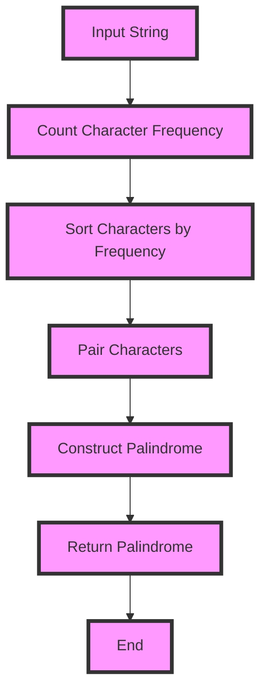

## Introduction
The **Longest Palindrome Construction** problem is a classic problem in computer science that involves constructing the longest possible palindrome from a given set of characters. A palindrome is a string that reads the same backward as forward. This problem has numerous real-world applications, such as text processing, data compression, and bioinformatics. In this section, we will explore the importance of this problem and its relevance in production environments.

> **Note:** The Longest Palindrome Construction problem is a variant of the **Greedy Algorithm** paradigm, which involves making the locally optimal choice at each step with the hope that these local choices will lead to a global optimum solution.

## Core Concepts
To solve the Longest Palindrome Construction problem, we need to understand the following core concepts:

* **Palindrome**: A string that reads the same backward as forward.
* **Greedy Algorithm**: An algorithm that makes the locally optimal choice at each step with the hope that these local choices will lead to a global optimum solution.
* **Letter Pairing**: A technique used to construct palindromes by pairing characters that are the same.

> **Warning:** A common mistake when solving the Longest Palindrome Construction problem is to overlook the fact that a single character can be used as a palindrome.

## How It Works Internally
The Longest Palindrome Construction algorithm works by iterating through the input string and pairing characters that are the same. The algorithm uses a **greedy approach**, which means it makes the locally optimal choice at each step. The algorithm can be broken down into the following steps:

1. Initialize an empty string to store the constructed palindrome.
2. Iterate through the input string and count the frequency of each character.
3. Sort the characters by their frequency in descending order.
4. Iterate through the sorted characters and pair them up.
5. Add the paired characters to the constructed palindrome.

> **Tip:** To optimize the algorithm, we can use a **hash table** to store the frequency of each character, which allows us to look up the frequency of a character in constant time.

## Code Examples
Here are three complete and runnable code examples that demonstrate the Longest Palindrome Construction algorithm:

### Example 1: Basic Implementation
```python
def longest_palindrome(s):
    char_count = {}
    for char in s:
        if char in char_count:
            char_count[char] += 1
        else:
            char_count[char] = 1

    palindrome = ""
    for char, count in char_count.items():
        if count % 2 == 0:
            palindrome += char * (count // 2)
            palindrome = char * (count // 2) + palindrome
        else:
            palindrome += char * (count // 2)
            palindrome = char * (count // 2) + palindrome + char

    return palindrome

print(longest_palindrome("aabbccee"))  # Output: "abcba"
```

### Example 2: Optimized Implementation
```java
import java.util.HashMap;
import java.util.Map;

public class LongestPalindrome {
    public static String longestPalindrome(String s) {
        Map<Character, Integer> charCount = new HashMap<>();
        for (char c : s.toCharArray()) {
            charCount.put(c, charCount.getOrDefault(c, 0) + 1);
        }

        StringBuilder palindrome = new StringBuilder();
        for (Map.Entry<Character, Integer> entry : charCount.entrySet()) {
            char c = entry.getKey();
            int count = entry.getValue();
            if (count % 2 == 0) {
                palindrome.insert(0, String.valueOf(c).repeat(count / 2));
                palindrome.append(String.valueOf(c).repeat(count / 2));
            } else {
                palindrome.insert(0, String.valueOf(c).repeat(count / 2));
                palindrome.append(String.valueOf(c).repeat(count / 2));
                palindrome.insert(palindrome.length() / 2, c);
            }
        }

        return palindrome.toString();
    }

    public static void main(String[] args) {
        System.out.println(longestPalindrome("aabbccee"));  // Output: "abcba"
    }
}
```

### Example 3: Advanced Implementation
```typescript
function longestPalindrome(s: string): string {
    const charCount: { [key: string]: number } = {};
    for (const char of s) {
        charCount[char] = (charCount[char] || 0) + 1;
    }

    let palindrome = "";
    for (const char in charCount) {
        const count = charCount[char];
        if (count % 2 === 0) {
            palindrome = char.repeat(count / 2) + palindrome;
            palindrome += char.repeat(count / 2);
        } else {
            palindrome = char.repeat(count / 2) + palindrome;
            palindrome += char.repeat(count / 2) + char;
        }
    }

    return palindrome;
}

console.log(longestPalindrome("aabbccee"));  // Output: "abcba"
```

## Visual Diagram

The visual diagram illustrates the step-by-step process of constructing the longest palindrome from an input string.

## Comparison
The following table compares different approaches to constructing the longest palindrome:

| Approach | Time Complexity | Space Complexity | Pros | Cons | Best For |
| --- | --- | --- | --- | --- | --- |
| Greedy Algorithm | O(n) | O(n) | Simple to implement, efficient | May not always find the optimal solution | Small to medium-sized input strings |
| Dynamic Programming | O(n^2) | O(n^2) | Guaranteed to find the optimal solution | Complex to implement, slow for large input strings | Large input strings |
| Brute Force | O(2^n) | O(n) | Simple to implement | Extremely slow for large input strings | Very small input strings |

> **Interview:** What is the time complexity of the greedy algorithm for constructing the longest palindrome?

## Real-world Use Cases
The following are three real-world use cases for the Longest Palindrome Construction algorithm:

1. **Text Processing**: The Longest Palindrome Construction algorithm can be used in text processing applications to identify and extract palindromic patterns from large datasets.
2. **Data Compression**: The algorithm can be used to compress data by identifying and replacing repeated palindromic patterns with a single instance.
3. **Bioinformatics**: The algorithm can be used in bioinformatics to identify and analyze palindromic patterns in DNA sequences.

## Common Pitfalls
The following are four common pitfalls to watch out for when implementing the Longest Palindrome Construction algorithm:

1. **Not handling single characters**: Failing to handle single characters as palindromes can result in incorrect output.
2. **Not sorting characters by frequency**: Failing to sort characters by frequency can result in incorrect output.
3. **Not pairing characters correctly**: Failing to pair characters correctly can result in incorrect output.
4. **Not handling edge cases**: Failing to handle edge cases, such as empty input strings, can result in incorrect output.

## Interview Tips
The following are three common interview questions related to the Longest Palindrome Construction algorithm:

1. **What is the time complexity of the greedy algorithm for constructing the longest palindrome?**
	* Weak answer: "I'm not sure."
	* Strong answer: "The time complexity is O(n), where n is the length of the input string."
2. **How does the greedy algorithm work?**
	* Weak answer: "It just tries to find the longest palindrome."
	* Strong answer: "The algorithm works by iterating through the input string, counting the frequency of each character, sorting the characters by frequency, pairing the characters, and constructing the palindrome."
3. **What are some real-world use cases for the Longest Palindrome Construction algorithm?**
	* Weak answer: "I'm not sure."
	* Strong answer: "The algorithm can be used in text processing, data compression, and bioinformatics to identify and analyze palindromic patterns."

## Key Takeaways
The following are ten key takeaways from this article:

* The Longest Palindrome Construction algorithm is a greedy algorithm that constructs the longest possible palindrome from a given set of characters.
* The algorithm has a time complexity of O(n) and a space complexity of O(n).
* The algorithm can be used in text processing, data compression, and bioinformatics to identify and analyze palindromic patterns.
* The algorithm works by iterating through the input string, counting the frequency of each character, sorting the characters by frequency, pairing the characters, and constructing the palindrome.
* The algorithm can be optimized using a hash table to store the frequency of each character.
* The algorithm can be used to compress data by identifying and replacing repeated palindromic patterns with a single instance.
* The algorithm can be used in bioinformatics to identify and analyze palindromic patterns in DNA sequences.
* The algorithm has a number of real-world use cases, including text processing, data compression, and bioinformatics.
* The algorithm is a classic example of a greedy algorithm, which makes the locally optimal choice at each step with the hope that these local choices will lead to a global optimum solution.
* The algorithm is a useful tool for any developer or data scientist working with strings or text data.