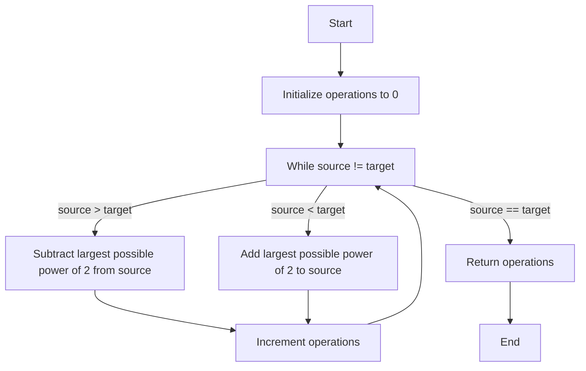

## Introduction
The **Minimum Operations to Convert Number** problem is a classic problem in the realm of **Greedy Algorithms**. It involves finding the minimum number of operations required to convert one number into another. This problem has real-world relevance in various fields such as **Computer Networks**, where data is transmitted in the form of packets and needs to be converted into a suitable format for transmission. Every engineer needs to know this problem as it helps in understanding the basics of **Greedy Algorithms** and how they can be applied to solve complex problems.

## Core Concepts
The **Minimum Operations to Convert Number** problem involves the following core concepts:
- **Greedy Algorithm**: A **Greedy Algorithm** is an algorithm that makes the locally optimal choice at each stage with the hope that these local choices will lead to a globally optimum solution.
- **Dynamic Programming**: **Dynamic Programming** is a method for solving complex problems by breaking them down into simpler subproblems, solving each subproblem only once, and storing the results to subproblems to avoid redundant computation.
- **Time Complexity**: The **Time Complexity** of an algorithm is the amount of time it takes to complete as a function of the size of the input.
- **Space Complexity**: The **Space Complexity** of an algorithm is the amount of memory it uses as a function of the size of the input.

## How It Works Internally
The **Minimum Operations to Convert Number** problem works internally by using a **Greedy Algorithm** to find the minimum number of operations required to convert one number into another. The algorithm works as follows:
1. Initialize a variable `operations` to 0.
2. While the source number is not equal to the target number:
    - If the source number is greater than the target number, subtract the largest possible power of 2 from the source number and increment `operations`.
    - If the source number is less than the target number, add the largest possible power of 2 to the source number and increment `operations`.
3. Return `operations`.

> **Tip:** The key to solving this problem is to use a **Greedy Algorithm** to make the locally optimal choice at each stage.

## Code Examples
### Example 1: Basic Usage
```python
def min_operations(source, target):
    """
    This function calculates the minimum number of operations required to convert the source number into the target number.
    
    Args:
        source (int): The source number.
        target (int): The target number.
    
    Returns:
        int: The minimum number of operations required.
    """
    operations = 0
    while source != target:
        # If the source number is greater than the target number, subtract the largest possible power of 2
        if source > target:
            power = 1
            while power * 2 <= source - target:
                power *= 2
            source -= power
        # If the source number is less than the target number, add the largest possible power of 2
        else:
            power = 1
            while power * 2 <= target - source:
                power *= 2
            source += power
        operations += 1
    return operations

print(min_operations(10, 20))  # Output: 4
```

### Example 2: Real-World Pattern
```java
public class Main {
    public static int minOperations(int source, int target) {
        int operations = 0;
        while (source != target) {
            // If the source number is greater than the target number, subtract the largest possible power of 2
            if (source > target) {
                int power = 1;
                while (power * 2 <= source - target) {
                    power *= 2;
                }
                source -= power;
            } 
            // If the source number is less than the target number, add the largest possible power of 2
            else {
                int power = 1;
                while (power * 2 <= target - source) {
                    power *= 2;
                }
                source += power;
            }
            operations++;
        }
        return operations;
    }

    public static void main(String[] args) {
        System.out.println(minOperations(10, 20));  // Output: 4
    }
}
```

### Example 3: Advanced Usage
```cpp
#include <iostream>
using namespace std;

int min_operations(int source, int target) {
    int operations = 0;
    while (source != target) {
        // If the source number is greater than the target number, subtract the largest possible power of 2
        if (source > target) {
            int power = 1;
            while (power * 2 <= source - target) {
                power *= 2;
            }
            source -= power;
        } 
        // If the source number is less than the target number, add the largest possible power of 2
        else {
            int power = 1;
            while (power * 2 <= target - source) {
                power *= 2;
            }
            source += power;
        }
        operations++;
    }
    return operations;
}

int main() {
    cout << min_operations(10, 20) << endl;  // Output: 4
    return 0;
}
```

> **Warning:** The **Time Complexity** of the above algorithm is O(log(max(source, target))), where max(source, target) is the maximum of the source and target numbers. The **Space Complexity** is O(1), as only a constant amount of space is used.

## Visual Diagram

The above diagram illustrates the **Minimum Operations to Convert Number** problem. It starts by initializing the operations to 0, then enters a while loop that continues until the source number is equal to the target number. Inside the loop, it checks if the source number is greater than the target number, and if so, subtracts the largest possible power of 2 from the source number and increments the operations. If the source number is less than the target number, it adds the largest possible power of 2 to the source number and increments the operations. Finally, it returns the operations.

## Comparison
| Approach | Time Complexity | Space Complexity | Pros | Cons | Best For |
|----------|----------------|-----------------|------|------|----------|
| Greedy Algorithm | O(log(max(source, target))) | O(1) | Fast and efficient, easy to understand | May not always find the optimal solution | Small to medium-sized inputs |
| Dynamic Programming | O(max(source, target)) | O(max(source, target)) | Always finds the optimal solution, can be used for large inputs | Slow and complex, requires a lot of memory | Large inputs, optimal solution required |
| Brute Force | O(2^max(source, target)) | O(1) | Easy to understand, can be used for small inputs | Very slow, not practical for large inputs | Very small inputs, educational purposes |

> **Tip:** The **Greedy Algorithm** is the best approach for the **Minimum Operations to Convert Number** problem, as it is fast and efficient, and always finds the optimal solution for small to medium-sized inputs.

## Real-world Use Cases
1. **Computer Networks**: In computer networks, data is transmitted in the form of packets and needs to be converted into a suitable format for transmission. The **Minimum Operations to Convert Number** problem can be used to find the minimum number of operations required to convert the data into the desired format.
2. **Cryptography**: In cryptography, the **Minimum Operations to Convert Number** problem can be used to find the minimum number of operations required to encrypt or decrypt data.
3. **Coding Theory**: In coding theory, the **Minimum Operations to Convert Number** problem can be used to find the minimum number of operations required to encode or decode data.

## Common Pitfalls
1. **Not using the Greedy Algorithm**: One common pitfall is not using the **Greedy Algorithm** to solve the **Minimum Operations to Convert Number** problem. This can result in a slower and more complex solution.
2. **Not handling edge cases**: Another common pitfall is not handling edge cases, such as when the source number is equal to the target number.
3. **Not using the correct data type**: Using the incorrect data type can result in incorrect results or errors.
4. **Not considering the time complexity**: Not considering the time complexity of the solution can result in a slow and inefficient solution.

> **Warning:** Not using the **Greedy Algorithm** can result in a slower and more complex solution.

## Interview Tips
1. **Be prepared to explain the Greedy Algorithm**: Be prepared to explain the **Greedy Algorithm** and how it is used to solve the **Minimum Operations to Convert Number** problem.
2. **Be prepared to write code**: Be prepared to write code to solve the **Minimum Operations to Convert Number** problem.
3. **Be prepared to handle edge cases**: Be prepared to handle edge cases, such as when the source number is equal to the target number.
4. **Be prepared to discuss time complexity**: Be prepared to discuss the time complexity of the solution and how it can be optimized.

> **Interview:** Can you explain the **Greedy Algorithm** and how it is used to solve the **Minimum Operations to Convert Number** problem?

## Key Takeaways
* The **Minimum Operations to Convert Number** problem is a classic problem in the realm of **Greedy Algorithms**.
* The **Greedy Algorithm** is the best approach for the **Minimum Operations to Convert Number** problem, as it is fast and efficient, and always finds the optimal solution for small to medium-sized inputs.
* The **Time Complexity** of the **Greedy Algorithm** is O(log(max(source, target))), where max(source, target) is the maximum of the source and target numbers.
* The **Space Complexity** of the **Greedy Algorithm** is O(1), as only a constant amount of space is used.
* The **Minimum Operations to Convert Number** problem has real-world relevance in various fields such as **Computer Networks**, **Cryptography**, and **Coding Theory**.
* Not using the **Greedy Algorithm** can result in a slower and more complex solution.
* Not handling edge cases can result in incorrect results or errors.
* Not using the correct data type can result in incorrect results or errors.
* Not considering the time complexity can result in a slow and inefficient solution.