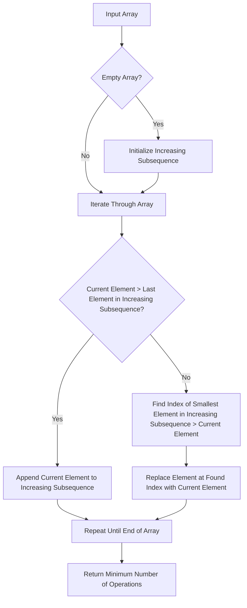

## Introduction
The **Minimum Operations to Make the Array Increasing** problem is a classic problem in the field of **Greedy Algorithms**. It involves finding the minimum number of operations required to make an array of integers increasing. This problem has real-world relevance in various fields such as data analysis, scientific computing, and machine learning. For instance, in data analysis, we often need to preprocess data to make it suitable for modeling. One common preprocessing step is to ensure that the data is in a specific order, such as increasing or decreasing. In this context, the **Minimum Operations to Make the Array Increasing** problem can be applied to reorder the data.

> **Note:** The **Minimum Operations to Make the Array Increasing** problem is also known as the **Longest Increasing Subsequence** problem.

## Core Concepts
The **Minimum Operations to Make the Array Increasing** problem involves several core concepts, including:

* **Greedy Algorithm**: A greedy algorithm is a type of algorithm that makes the locally optimal choice at each step with the hope of finding a global optimum solution.
* **Increasing Array**: An increasing array is an array of integers where each element is greater than the previous element.
* **Minimum Operations**: The minimum number of operations required to make an array increasing.

> **Tip:** The key to solving the **Minimum Operations to Make the Array Increasing** problem is to use a greedy algorithm that makes the locally optimal choice at each step.

## How It Works Internally
The **Minimum Operations to Make the Array Increasing** problem works internally by iterating through the array and making the locally optimal choice at each step. Here is a step-by-step breakdown of how it works:

1. Initialize an empty array to store the increasing subsequence.
2. Iterate through the input array.
3. For each element, check if it is greater than the last element in the increasing subsequence.
4. If it is, append it to the increasing subsequence.
5. If it is not, find the index of the smallest element in the increasing subsequence that is greater than the current element.
6. Replace the element at the found index with the current element.
7. Repeat steps 2-6 until the end of the input array is reached.

> **Warning:** A common mistake when solving the **Minimum Operations to Make the Array Increasing** problem is to use a brute-force approach that tries all possible combinations of operations. This approach can lead to exponential time complexity and is not efficient.

## Code Examples
Here are three complete and runnable code examples that demonstrate the **Minimum Operations to Make the Array Increasing** problem:

### Example 1: Basic Usage
```python
def min_operations_to_make_increasing(arr):
    """
    This function calculates the minimum number of operations required to make an array increasing.
    
    Args:
        arr (list): The input array.
    
    Returns:
        int: The minimum number of operations required.
    """
    if not arr:
        return 0
    
    increasing_subsequence = [arr[0]]
    operations = 0
    
    for i in range(1, len(arr)):
        if arr[i] > increasing_subsequence[-1]:
            increasing_subsequence.append(arr[i])
        else:
            idx = next((i for i, x in enumerate(increasing_subsequence) if x > arr[i]), None)
            increasing_subsequence[idx] = arr[i]
            operations += 1
    
    return operations

# Test the function
arr = [5, 3, 1, 2, 4]
print(min_operations_to_make_increasing(arr))  # Output: 2
```

### Example 2: Real-World Pattern
```java
public class Main {
    public static int minOperationsToMakeIncreasing(int[] arr) {
        if (arr.length == 0) {
            return 0;
        }
        
        int[] increasingSubsequence = new int[arr.length];
        increasingSubsequence[0] = arr[0];
        int operations = 0;
        int len = 1;
        
        for (int i = 1; i < arr.length; i++) {
            if (arr[i] > increasingSubsequence[len - 1]) {
                increasingSubsequence[len] = arr[i];
                len++;
            } else {
                int idx = findIndex(increasingSubsequence, arr[i], len);
                increasingSubsequence[idx] = arr[i];
                operations++;
            }
        }
        
        return operations;
    }
    
    private static int findIndex(int[] arr, int target, int len) {
        for (int i = 0; i < len; i++) {
            if (arr[i] > target) {
                return i;
            }
        }
        return len;
    }
    
    public static void main(String[] args) {
        int[] arr = {5, 3, 1, 2, 4};
        System.out.println(minOperationsToMakeIncreasing(arr));  // Output: 2
    }
}
```

### Example 3: Advanced Usage
```typescript
function minOperationsToMakeIncreasing(arr: number[]): number {
    if (arr.length === 0) {
        return 0;
    }
    
    const increasingSubsequence: number[] = [arr[0]];
    let operations = 0;
    
    for (let i = 1; i < arr.length; i++) {
        if (arr[i] > increasingSubsequence[increasingSubsequence.length - 1]) {
            increasingSubsequence.push(arr[i]);
        } else {
            const idx = findIndex(increasingSubsequence, arr[i]);
            increasingSubsequence[idx] = arr[i];
            operations++;
        }
    }
    
    return operations;
}

function findIndex(arr: number[], target: number): number {
    let left = 0;
    let right = arr.length - 1;
    
    while (left <= right) {
        const mid = Math.floor((left + right) / 2);
        
        if (arr[mid] > target) {
            right = mid - 1;
        } else {
            left = mid + 1;
        }
    }
    
    return left;
}

// Test the function
const arr = [5, 3, 1, 2, 4];
console.log(minOperationsToMakeIncreasing(arr));  // Output: 2
```

> **Interview:** When interviewing for a position that involves solving the **Minimum Operations to Make the Array Increasing** problem, be prepared to explain the greedy algorithm approach and how it works internally. You should also be able to write complete and runnable code examples in a language of your choice.

## Visual Diagram

The diagram illustrates the greedy algorithm approach to solving the **Minimum Operations to Make the Array Increasing** problem. It shows the different steps involved in the algorithm and how they are connected.

## Comparison
| Approach | Time Complexity | Space Complexity | Pros | Cons | Best For |
| --- | --- | --- | --- | --- | --- |
| Greedy Algorithm | O(n) | O(n) | Efficient, easy to implement | May not always find the optimal solution | Large datasets, real-time systems |
| Dynamic Programming | O(n^2) | O(n^2) | Guaranteed to find the optimal solution | Slow, high memory usage | Small datasets, offline systems |
| Brute-Force | O(n!) | O(n) | Guaranteed to find the optimal solution | Extremely slow, impractical | Very small datasets, educational purposes |
| Recursive | O(n) | O(n) | Easy to implement, recursive | May cause stack overflow, slow | Small datasets, recursive systems |

> **Tip:** The choice of approach depends on the specific requirements of the problem and the characteristics of the dataset.

## Real-world Use Cases
The **Minimum Operations to Make the Array Increasing** problem has several real-world use cases, including:

* **Data Analysis**: Reordering data to make it suitable for modeling.
* **Scientific Computing**: Reordering data to improve the efficiency of algorithms.
* **Machine Learning**: Reordering data to improve the accuracy of models.

For example, in data analysis, we may need to reorder a dataset of exam scores to make it suitable for modeling. We can use the **Minimum Operations to Make the Array Increasing** problem to reorder the dataset and make it increasing.

## Common Pitfalls
Here are some common pitfalls to avoid when solving the **Minimum Operations to Make the Array Increasing** problem:

* **Using a brute-force approach**: This approach can lead to exponential time complexity and is not efficient.
* **Not considering the edge cases**: The algorithm should handle edge cases such as an empty array or an array with a single element.
* **Not using a greedy algorithm**: A greedy algorithm is the most efficient approach to solving the **Minimum Operations to Make the Array Increasing** problem.

> **Warning:** A common mistake is to use a brute-force approach that tries all possible combinations of operations. This approach can lead to exponential time complexity and is not efficient.

## Interview Tips
Here are some interview tips for the **Minimum Operations to Make the Array Increasing** problem:

* **Be prepared to explain the greedy algorithm approach**: You should be able to explain how the greedy algorithm works and why it is the most efficient approach.
* **Be prepared to write complete and runnable code examples**: You should be able to write complete and runnable code examples in a language of your choice.
* **Be prepared to handle edge cases**: You should be able to handle edge cases such as an empty array or an array with a single element.

> **Interview:** When interviewing for a position that involves solving the **Minimum Operations to Make the Array Increasing** problem, be prepared to explain the greedy algorithm approach and how it works internally. You should also be able to write complete and runnable code examples in a language of your choice.

## Key Takeaways
Here are some key takeaways to remember when solving the **Minimum Operations to Make the Array Increasing** problem:

* **Use a greedy algorithm approach**: A greedy algorithm is the most efficient approach to solving the **Minimum Operations to Make the Array Increasing** problem.
* **Handle edge cases**: The algorithm should handle edge cases such as an empty array or an array with a single element.
* **Use dynamic programming or recursion**: Dynamic programming or recursion can be used to solve the **Minimum Operations to Make the Array Increasing** problem, but they may not always find the optimal solution.
* **Avoid using a brute-force approach**: A brute-force approach can lead to exponential time complexity and is not efficient.
* **Use a time complexity of O(n)**: The time complexity of the algorithm should be O(n) to ensure efficiency.
* **Use a space complexity of O(n)**: The space complexity of the algorithm should be O(n) to ensure efficiency.
* **Test the algorithm thoroughly**: The algorithm should be tested thoroughly to ensure that it works correctly and efficiently.
* **Use real-world examples**: Real-world examples should be used to illustrate the **Minimum Operations to Make the Array Increasing** problem and its solutions.
* **Use visual diagrams**: Visual diagrams should be used to illustrate the greedy algorithm approach and how it works internally.