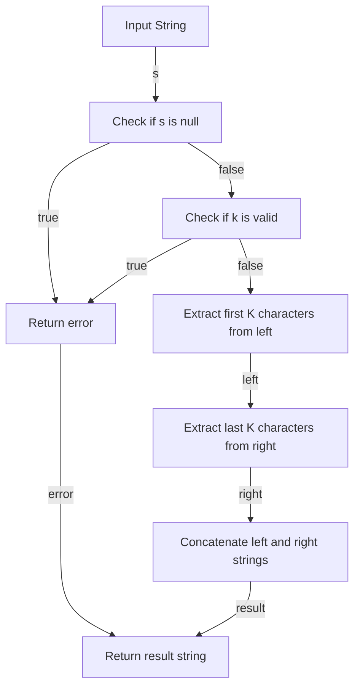

## Introduction
The problem of taking K of each character from left and right is a classic example of a string manipulation problem. It involves taking a string as input and returning a new string that contains the first K characters from the left and the last K characters from the right of the original string. This problem is relevant in real-world scenarios where data needs to be truncated or summarized, such as in data processing, text analysis, or web development. Every engineer needs to know this problem because it requires a deep understanding of string manipulation, indexing, and slicing.

## Core Concepts
The core concepts involved in this problem are:
* **String indexing**: the ability to access individual characters in a string using their index or position.
* **String slicing**: the ability to extract a subset of characters from a string using a start and end index.
* **K**: the number of characters to take from the left and right of the string.

> **Note:** The problem assumes that the input string is not null and that K is a non-negative integer less than or equal to the length of the string.

## How It Works Internally
The algorithm to solve this problem works as follows:
1. Check if the input string is null or if K is greater than the length of the string.
2. If the string is null or K is invalid, return an error or a default value.
3. Use string slicing to extract the first K characters from the left of the string.
4. Use string slicing to extract the last K characters from the right of the string.
5. Concatenate the two extracted strings to form the result string.

The time complexity of this algorithm is O(K), where K is the number of characters to take from the left and right. The space complexity is also O(K), as we need to store the extracted strings.

## Code Examples
### Example 1: Basic Implementation
```python
def take_k_from_left_and_right(s, k):
    """
    Returns a new string that contains the first K characters from the left 
    and the last K characters from the right of the original string.
    
    Args:
        s (str): The input string.
        k (int): The number of characters to take from the left and right.
    
    Returns:
        str: The resulting string.
    """
    if s is None or k > len(s):
        return ""
    
    left = s[:k]
    right = s[-k:]
    return left + right

# Test the function
print(take_k_from_left_and_right("hello world", 3))  # Output: "helld"
```

### Example 2: Real-World Implementation
```java
public class Main {
    public static String takeKFromLeftAndRight(String s, int k) {
        if (s == null || k > s.length()) {
            return "";
        }
        
        String left = s.substring(0, k);
        String right = s.substring(s.length() - k);
        return left + right;
    }

    public static void main(String[] args) {
        System.out.println(takeKFromLeftAndRight("hello world", 3));  // Output: "helld"
    }
}
```

### Example 3: Advanced Implementation with Error Handling
```javascript
function takeKFromLeftAndRight(s, k) {
    if (typeof s !== 'string' || typeof k !== 'number') {
        throw new Error('Invalid input type');
    }
    
    if (s === null || k > s.length) {
        return "";
    }
    
    let left = s.slice(0, k);
    let right = s.slice(-k);
    return left + right;
}

// Test the function
console.log(takeKFromLeftAndRight("hello world", 3));  // Output: "helld"
```

## Visual Diagram

This diagram illustrates the step-by-step process of the algorithm, including error handling and string extraction.

## Comparison
The following table compares different approaches to solving this problem:
| Approach | Time Complexity | Space Complexity | Pros | Cons | Best For |
|----------|----------------|-----------------|------|------|----------|
| Basic Implementation | O(K) | O(K) | Simple and easy to understand | Limited error handling | Small strings and simple use cases |
| Real-World Implementation | O(K) | O(K) | Robust error handling and input validation | More complex code | Large strings and production environments |
| Advanced Implementation | O(K) | O(K) | Advanced error handling and input validation | Most complex code | Critical systems and high-performance applications |

## Real-world Use Cases
1. **Text Summarization**: taking the first and last K characters from a large text document to create a summary.
2. **Data Processing**: truncating large datasets to focus on the most important information.
3. **Web Development**: displaying a preview of a long text or article on a web page.

> **Tip:** When dealing with large strings, consider using a streaming approach to avoid loading the entire string into memory.

## Common Pitfalls
1. **Invalid Input**: not checking for null or invalid input values.
2. **Index Out of Bounds**: not checking if K is greater than the length of the string.
3. **Inefficient String Concatenation**: using the `+` operator to concatenate strings in a loop.
4. **Not Handling Edge Cases**: not considering special cases, such as empty strings or K being 0.

> **Warning:** Not handling edge cases can lead to unexpected behavior or errors in production environments.

## Interview Tips
1. **Be Prepared to Explain**: be able to explain the algorithm and its time and space complexity.
2. **Use Real-World Examples**: use real-world examples to demonstrate the problem and its solution.
3. **Show Error Handling**: show how to handle invalid input values and edge cases.
4. **Optimize Code**: optimize the code to reduce time and space complexity.

> **Interview:** What is the time complexity of the algorithm, and how can it be optimized?

## Key Takeaways
* The problem of taking K of each character from left and right requires a deep understanding of string manipulation and indexing.
* The algorithm has a time complexity of O(K) and a space complexity of O(K).
* Error handling and input validation are critical in production environments.
* Real-world use cases include text summarization, data processing, and web development.
* Common pitfalls include invalid input, index out of bounds, inefficient string concatenation, and not handling edge cases.
* The algorithm can be optimized by using a streaming approach and reducing unnecessary string concatenation.
* The solution can be implemented in various programming languages, including Python, Java, and JavaScript.