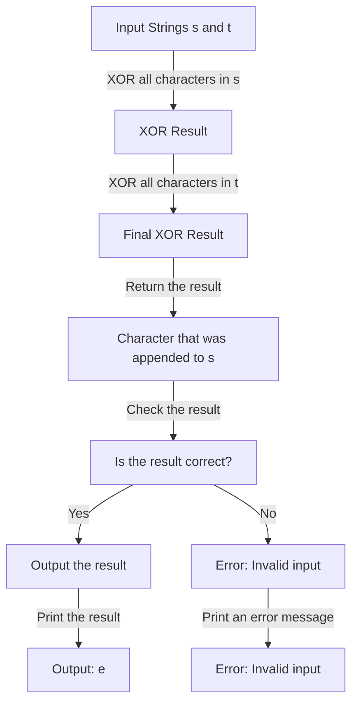

## Introduction
The **Find the Difference** problem is a classic example of using bit manipulation to solve a string-related problem. Given two strings, `s` and `t`, where `t` is generated by appending a character to `s` and then shuffling the string, the goal is to find the character that was appended to `s`. This problem is relevant in real-world scenarios where data is transmitted over a network and a single character is added to the data stream, and we need to identify the added character. Every engineer should know this technique as it demonstrates the power of bit manipulation in solving seemingly complex problems.

## Core Concepts
The core concept behind this problem is the use of the **XOR** (exclusive OR) operation. The XOR operation has the following properties:
- `a ^ a = 0` (any number XOR itself is 0)
- `a ^ 0 = a` (any number XOR 0 is the number itself)
- `a ^ b = b ^ a` (XOR is commutative)
- `(a ^ b) ^ c = a ^ (b ^ c)` (XOR is associative)

These properties make XOR an ideal operation for finding the difference between two sets of data.

## How It Works Internally
The algorithm works by XORing all the characters in the string `s` and then XORing all the characters in the string `t`. The result of the XOR operation will be the character that was appended to `s`. Here's a step-by-step breakdown:
1. Initialize a variable `result` to 0.
2. Iterate over each character in `s` and XOR it with `result`.
3. Iterate over each character in `t` and XOR it with `result`.
4. The final value of `result` will be the character that was appended to `s`.

The time complexity of this algorithm is **O(n + m)**, where `n` and `m` are the lengths of the strings `s` and `t`, respectively. The space complexity is **O(1)**, as we only need a single variable to store the result.

## Code Examples
### Example 1: Basic Usage
```python
def find_difference(s: str, t: str) -> str:
    """
    Find the character that was appended to s.
    
    Args:
    s (str): The original string.
    t (str): The string with an extra character.
    
    Returns:
    str: The character that was appended to s.
    """
    result = 0
    # XOR all characters in s
    for char in s:
        result ^= ord(char)
    # XOR all characters in t
    for char in t:
        result ^= ord(char)
    # Return the character that was appended to s
    return chr(result)

# Test the function
s = "abcd"
t = "dcbae"
print(find_difference(s, t))  # Output: e
```

### Example 2: Real-World Pattern
```java
public class Main {
    public static char findDifference(String s, String t) {
        int result = 0;
        // XOR all characters in s
        for (char c : s.toCharArray()) {
            result ^= c;
        }
        // XOR all characters in t
        for (char c : t.toCharArray()) {
            result ^= c;
        }
        // Return the character that was appended to s
        return (char) result;
    }

    public static void main(String[] args) {
        String s = "abcd";
        String t = "dcbae";
        System.out.println(findDifference(s, t));  // Output: e
    }
}
```

### Example 3: Advanced Usage
```typescript
function findDifference(s: string, t: string): string {
    let result = 0;
    // XOR all characters in s
    for (let i = 0; i < s.length; i++) {
        result ^= s.charCodeAt(i);
    }
    // XOR all characters in t
    for (let i = 0; i < t.length; i++) {
        result ^= t.charCodeAt(i);
    }
    // Return the character that was appended to s
    return String.fromCharCode(result);
}

// Test the function
const s = "abcd";
const t = "dcbae";
console.log(findDifference(s, t));  // Output: e
```

> **Tip:** The XOR operation can be used to find the difference between two sets of data, not just strings.

## Visual Diagram

The diagram illustrates the step-by-step process of finding the difference between two strings using the XOR operation.

## Comparison
| Approach | Time Complexity | Space Complexity | Pros | Cons | Best For |
|----------|----------------|-----------------|------|------|----------|
| XOR | O(n + m) | O(1) | Fast, efficient | Limited to finding a single difference | Finding a single difference between two strings |
| Hash Table | O(n + m) | O(n + m) | Can find multiple differences | Slow, memory-intensive | Finding multiple differences between two strings |
| Sorting | O(n log n + m log m) | O(n + m) | Can find multiple differences | Slow, memory-intensive | Finding multiple differences between two strings |
| Brute Force | O(n \* m) | O(1) | Simple, easy to implement | Slow, inefficient | Small input sizes |

> **Warning:** The XOR approach assumes that the input strings are valid and that the difference is a single character. If the input strings are invalid or the difference is multiple characters, the XOR approach may not work correctly.

## Real-world Use Cases
1. **Data transmission**: When data is transmitted over a network, a single character may be added to the data stream to indicate the end of the transmission. The XOR operation can be used to find the character that was added.
2. **Error detection**: The XOR operation can be used to detect errors in data transmission by calculating the XOR of the transmitted data and comparing it to the expected XOR value.
3. **Cryptography**: The XOR operation is used in some cryptographic algorithms, such as the XOR cipher, to encrypt and decrypt data.

## Common Pitfalls
1. **Invalid input**: The XOR operation assumes that the input strings are valid and that the difference is a single character. If the input strings are invalid or the difference is multiple characters, the XOR operation may not work correctly.
2. **Overflow**: If the input strings are very large, the XOR operation may overflow, resulting in incorrect results.
3. **Type mismatch**: The XOR operation may not work correctly if the input strings are not of the same type (e.g., one string is a byte array and the other is a character array).

> **Interview:** When asked to find the difference between two strings, the interviewer may be looking for the XOR operation. Be sure to explain the time and space complexity of the algorithm and provide examples of how it works.

## Interview Tips
1. **Clarify the problem**: Make sure you understand the problem correctly and ask clarifying questions if necessary.
2. **Explain the algorithm**: Explain the XOR operation and how it works, including the time and space complexity.
3. **Provide examples**: Provide examples of how the XOR operation works, including edge cases.

> **Note:** The XOR operation is a common technique used in many algorithms, including data transmission, error detection, and cryptography.

## Key Takeaways
* The XOR operation can be used to find the difference between two sets of data.
* The time complexity of the XOR operation is **O(n + m)**, where `n` and `m` are the lengths of the input strings.
* The space complexity of the XOR operation is **O(1)**, as only a single variable is needed to store the result.
* The XOR operation assumes that the input strings are valid and that the difference is a single character.
* The XOR operation may not work correctly if the input strings are invalid or the difference is multiple characters.
* The XOR operation is a common technique used in many algorithms, including data transmission, error detection, and cryptography.