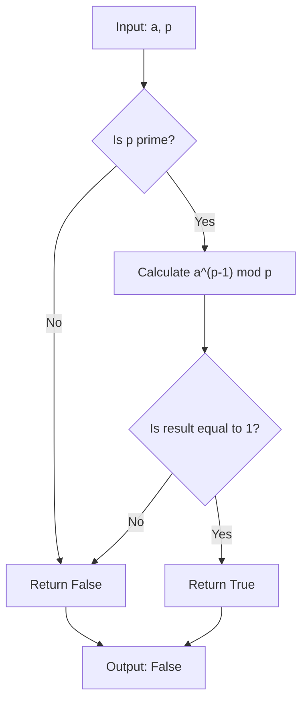

## Introduction
Fermat's Little Theorem is a fundamental concept in number theory that has numerous applications in cryptography, coding theory, and primality testing. In this study note, we will delve into the world of Fermat's Little Theorem, exploring its definition, core concepts, and internal workings. We will also examine its applications in real-world scenarios, common pitfalls to avoid, and provide tips for tackling interview questions related to this topic. **Fermat's Little Theorem** states that if p is a prime number, then for any integer a not divisible by p, we have that a^(p-1) ≡ 1 (mod p). This theorem has far-reaching implications in various fields, including cryptography, where it is used to develop secure encryption algorithms.

> **Note:** Fermat's Little Theorem is often confused with Fermat's Last Theorem, which is a different mathematical concept altogether. While Fermat's Last Theorem deals with the solutions to the equation a^n + b^n = c^n, Fermat's Little Theorem is concerned with the properties of prime numbers.

## Core Concepts
To understand Fermat's Little Theorem, we need to grasp the following core concepts:
* **Prime numbers**: A prime number is a positive integer greater than 1 that has no positive integer divisors other than 1 and itself.
* **Modular arithmetic**: Modular arithmetic is a system of arithmetic that "wraps around" after reaching a certain value, called the modulus. For example, in modulo 5 arithmetic, the numbers 6 and 1 are considered equal because 6 ≡ 1 (mod 5).
* **Congruence**: Two integers a and b are said to be congruent modulo n if their difference (a - b) is an integer multiple of n. This is denoted as a ≡ b (mod n).

> **Warning:** When working with modular arithmetic, it's essential to remember that the usual rules of arithmetic do not always apply. For example, in modulo 5 arithmetic, the equation 2x ≡ 4 (mod 5) has multiple solutions, whereas in standard arithmetic, the equation 2x = 4 has only one solution.

## How It Works Internally
Fermat's Little Theorem can be proved using the following steps:
1. **List all possible remainders**: When dividing a by p, we can get p-1 possible remainders, namely 1, 2, ..., p-1.
2. **Consider the product of all remainders**: The product of all these remainders is equal to (p-1)!.
3. **Apply modular arithmetic**: Using modular arithmetic, we can show that a^(p-1) ≡ (p-1)! (mod p).
4. **Simplify the expression**: Since (p-1)! is a multiple of p, we can simplify the expression to a^(p-1) ≡ 1 (mod p).

> **Tip:** To understand the proof of Fermat's Little Theorem, it's essential to have a solid grasp of modular arithmetic and the properties of prime numbers.

## Code Examples
Here are three code examples to illustrate the concept of Fermat's Little Theorem:
### Example 1: Basic Usage
```python
def fermats_little_theorem(a, p):
    """
    Returns True if a^(p-1) ≡ 1 (mod p), False otherwise.
    """
    result = pow(a, p-1, p)
    return result == 1

# Test the function
print(fermats_little_theorem(2, 5))  # True
print(fermats_little_theorem(3, 5))  # True
print(fermats_little_theorem(4, 5))  # False
```
### Example 2: Real-World Pattern
```python
import random

def is_prime(n, k=5):
    """
    Returns True if n is probably prime, False otherwise.
    """
    if n < 2:
        return False
    for _ in range(k):
        a = random.randint(1, n-1)
        if pow(a, n-1, n) != 1:
            return False
    return True

# Test the function
print(is_prime(5))  # True
print(is_prime(6))  # False
```
### Example 3: Advanced Usage
```python
def mod_inverse(a, p):
    """
    Returns the modular inverse of a modulo p.
    """
    def extended_gcd(a, b):
        if a == 0:
            return b, 0, 1
        else:
            gcd, x, y = extended_gcd(b % a, a)
            return gcd, y - (b // a) * x, x

    gcd, x, _ = extended_gcd(a, p)
    if gcd != 1:
        return None
    else:
        return x % p

# Test the function
print(mod_inverse(2, 5))  # 3
print(mod_inverse(3, 5))  # 2
```
## Visual Diagram

The diagram illustrates the basic steps involved in testing whether a given number p is prime using Fermat's Little Theorem.

## Comparison
| Approach | Time Complexity | Space Complexity | Pros | Cons |
| --- | --- | --- | --- | --- |
| Trial Division | O(√n) | O(1) | Simple to implement | Slow for large numbers |
| Fermat's Little Theorem | O(k \* log^3 n) | O(1) | Fast and efficient | May return false positives |
| Miller-Rabin Primality Test | O(k \* log^4 n) | O(1) | Highly accurate | Slow for large numbers |
| AKS Primality Test | O(log^12 n) | O(1) | Guaranteed to return correct result | Extremely slow |

## Real-world Use Cases
1. **Cryptography**: Fermat's Little Theorem is used in various cryptographic algorithms, such as RSA and Diffie-Hellman key exchange.
2. **Coding Theory**: Fermat's Little Theorem is used in error-correcting codes, such as Reed-Solomon codes.
3. **Random Number Generation**: Fermat's Little Theorem can be used to generate random numbers, which is essential in various applications, including simulations and modeling.

> **Interview:** What is the time complexity of the Fermat's Little Theorem primality test? How does it compare to other primality tests?

## Common Pitfalls
1. **Incorrect implementation**: A common mistake is to implement the Fermat's Little Theorem test incorrectly, which can lead to false positives or false negatives.
2. **Insufficient number of iterations**: Another mistake is to use an insufficient number of iterations in the Fermat's Little Theorem test, which can also lead to false positives or false negatives.
3. **Using a small modulus**: Using a small modulus can lead to false positives, as the test may not be able to distinguish between prime and composite numbers.
4. **Not handling edge cases**: Failing to handle edge cases, such as input values of 0 or 1, can lead to incorrect results.

## Interview Tips
1. **Be prepared to explain the concept**: Be prepared to explain the concept of Fermat's Little Theorem and how it works.
2. **Understand the time complexity**: Understand the time complexity of the Fermat's Little Theorem test and how it compares to other primality tests.
3. **Be familiar with common pitfalls**: Be familiar with common pitfalls, such as incorrect implementation and insufficient number of iterations.

## Key Takeaways
* Fermat's Little Theorem states that if p is a prime number, then for any integer a not divisible by p, we have that a^(p-1) ≡ 1 (mod p).
* The time complexity of the Fermat's Little Theorem test is O(k \* log^3 n).
* The Fermat's Little Theorem test may return false positives, but it is fast and efficient.
* The Miller-Rabin primality test is more accurate than the Fermat's Little Theorem test, but it is slower.
* The AKS primality test is guaranteed to return the correct result, but it is extremely slow.
* Fermat's Little Theorem has numerous applications in cryptography, coding theory, and random number generation.