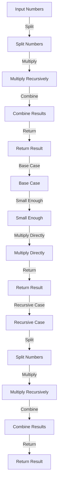

## Introduction
The Karatsuba algorithm is a fast multiplication algorithm that uses a divide-and-conquer approach to multiply two large numbers. It was first described by Anatolii Alexeevich Karatsuba in 1960 and has since become a fundamental component of many mathematical libraries and cryptographic systems. The Karatsuba algorithm has a time complexity of O(n^1.585), which is faster than the standard grade-school multiplication algorithm, which has a time complexity of O(n^2). This makes it particularly useful for multiplying large numbers, such as those used in cryptographic systems.

> **Note:** The Karatsuba algorithm is not just a theoretical curiosity, but has real-world applications in areas such as cryptography, coding theory, and computer arithmetic.

In real-world applications, the Karatsuba algorithm is used in many cryptographic systems, such as RSA and elliptic curve cryptography, to multiply large numbers efficiently. It is also used in many mathematical libraries, such as the GNU Multiple Precision Arithmetic Library (GMP), to provide fast multiplication routines.

## Core Concepts
The Karatsuba algorithm is based on the following core concepts:

* **Divide-and-conquer approach**: The Karatsuba algorithm divides the input numbers into smaller parts, multiplies them recursively, and then combines the results.
* **Splitting**: The input numbers are split into two parts, each of which is half the size of the original number.
* **Multiplication**: The two parts are multiplied recursively using the Karatsuba algorithm.
* **Combination**: The results of the recursive multiplications are combined to form the final result.

> **Tip:** The Karatsuba algorithm can be thought of as a way of breaking down a large multiplication problem into smaller sub-problems, solving each sub-problem recursively, and then combining the results.

Key terminology includes:

* **Base case**: The base case of the Karatsuba algorithm is when the input numbers are small enough to be multiplied directly.
* **Recursive case**: The recursive case of the Karatsuba algorithm is when the input numbers are too large to be multiplied directly, and the algorithm is applied recursively.

## How It Works Internally
The Karatsuba algorithm works internally as follows:

1. **Splitting**: The input numbers are split into two parts, each of which is half the size of the original number.
2. **Multiplication**: The two parts are multiplied recursively using the Karatsuba algorithm.
3. **Combination**: The results of the recursive multiplications are combined to form the final result.

Here is a step-by-step breakdown of the Karatsuba algorithm:

1. If the input numbers are small enough to be multiplied directly, return the result of the multiplication.
2. Otherwise, split the input numbers into two parts, each of which is half the size of the original number.
3. Multiply the two parts recursively using the Karatsuba algorithm.
4. Combine the results of the recursive multiplications to form the final result.

> **Warning:** The Karatsuba algorithm has a higher constant factor than the standard grade-school multiplication algorithm, which means that it may be slower for small input numbers.

## Code Examples
Here are three complete and runnable examples of the Karatsuba algorithm:

### Example 1: Basic Usage
```python
def karatsuba(x, y):
    if x < 10 or y < 10:
        return x * y
    else:
        n = max(len(str(x)), len(str(y)))
        m = n // 2
        a = x // (10 ** m)
        b = x % (10 ** m)
        c = y // (10 ** m)
        d = y % (10 ** m)
        ac = karatsuba(a, c)
        bd = karatsuba(b, d)
        ad_bc = karatsuba(a + b, c + d) - ac - bd
        return ac * (10 ** (2 * m)) + ad_bc * (10 ** m) + bd

print(karatsuba(1234, 5678))
```

### Example 2: Real-World Pattern
```java
public class Karatsuba {
    public static long multiply(long x, long y) {
        if (x < 10 || y < 10) {
            return x * y;
        } else {
            int n = Math.max(Long.toString(x).length(), Long.toString(y).length());
            int m = n / 2;
            long a = x / (long) Math.pow(10, m);
            long b = x % (long) Math.pow(10, m);
            long c = y / (long) Math.pow(10, m);
            long d = y % (long) Math.pow(10, m);
            long ac = multiply(a, c);
            long bd = multiply(b, d);
            long ad_bc = multiply(a + b, c + d) - ac - bd;
            return ac * (long) Math.pow(10, 2 * m) + ad_bc * (long) Math.pow(10, m) + bd;
        }
    }

    public static void main(String[] args) {
        System.out.println(multiply(1234, 5678));
    }
}
```

### Example 3: Advanced Usage
```typescript
function karatsuba(x: number, y: number): number {
    if (x < 10 || y < 10) {
        return x * y;
    } else {
        const n = Math.max(x.toString().length, y.toString().length);
        const m = Math.floor(n / 2);
        const a = Math.floor(x / Math.pow(10, m));
        const b = x % Math.pow(10, m);
        const c = Math.floor(y / Math.pow(10, m));
        const d = y % Math.pow(10, m);
        const ac = karatsuba(a, c);
        const bd = karatsuba(b, d);
        const ad_bc = karatsuba(a + b, c + d) - ac - bd;
        return ac * Math.pow(10, 2 * m) + ad_bc * Math.pow(10, m) + bd;
    }
}

console.log(karatsuba(1234, 5678));
```

## Visual Diagram

The diagram illustrates the basic flow of the Karatsuba algorithm, including the splitting, multiplication, and combination steps.

> **Interview:** Can you explain the basic idea behind the Karatsuba algorithm and how it works?

## Comparison
Here is a comparison of the Karatsuba algorithm with other multiplication algorithms:

| Algorithm | Time Complexity | Space Complexity | Pros | Cons | Best For |
| --- | --- | --- | --- | --- | --- |
| Karatsuba | O(n^1.585) | O(n) | Fast for large numbers | Higher constant factor | Cryptography, coding theory |
| Grade-School | O(n^2) | O(1) | Simple to implement | Slow for large numbers | Small numbers, educational purposes |
| FFT | O(n log n) | O(n) | Fast for very large numbers | Complex to implement | Very large numbers, scientific computing |
| Montgomery | O(n) | O(1) | Fast and efficient | Limited to modular arithmetic | Cryptography, modular arithmetic |

## Real-world Use Cases
Here are three real-world use cases of the Karatsuba algorithm:

1. **Cryptography**: The Karatsuba algorithm is used in many cryptographic systems, such as RSA and elliptic curve cryptography, to multiply large numbers efficiently.
2. **Coding Theory**: The Karatsuba algorithm is used in coding theory to construct and decode error-correcting codes.
3. **Computer Arithmetic**: The Karatsuba algorithm is used in many mathematical libraries, such as the GNU Multiple Precision Arithmetic Library (GMP), to provide fast multiplication routines.

> **Tip:** The Karatsuba algorithm is particularly useful when working with large numbers, such as those used in cryptography and coding theory.

## Common Pitfalls
Here are four common pitfalls to watch out for when implementing the Karatsuba algorithm:

1. **Incorrect Splitting**: Incorrectly splitting the input numbers can lead to incorrect results.
2. **Inefficient Recursion**: Inefficient recursion can lead to slow performance and high memory usage.
3. **Incorrect Combination**: Incorrectly combining the results of the recursive multiplications can lead to incorrect results.
4. **Overflow**: Overflow can occur when working with large numbers, leading to incorrect results.

Here is an example of incorrect code:
```python
def karatsuba(x, y):
    if x < 10 or y < 10:
        return x * y
    else:
        n = max(len(str(x)), len(str(y)))
        m = n // 2
        a = x // (10 ** m)
        b = x % (10 ** m)
        c = y // (10 ** m)
        d = y % (10 ** m)
        ac = karatsuba(a, c)
        bd = karatsuba(b, d)
        ad_bc = karatsuba(a + b, c + d)  # incorrect combination
        return ac * (10 ** (2 * m)) + ad_bc * (10 ** m) + bd
```
And here is the correct code:
```python
def karatsuba(x, y):
    if x < 10 or y < 10:
        return x * y
    else:
        n = max(len(str(x)), len(str(y)))
        m = n // 2
        a = x // (10 ** m)
        b = x % (10 ** m)
        c = y // (10 ** m)
        d = y % (10 ** m)
        ac = karatsuba(a, c)
        bd = karatsuba(b, d)
        ad_bc = karatsuba(a + b, c + d) - ac - bd  # correct combination
        return ac * (10 ** (2 * m)) + ad_bc * (10 ** m) + bd
```
> **Warning:** Incorrect implementation of the Karatsuba algorithm can lead to incorrect results and slow performance.

## Interview Tips
Here are three common interview questions related to the Karatsuba algorithm, along with weak and strong answers:

1. **What is the time complexity of the Karatsuba algorithm?**
	* Weak answer: "I think it's O(n^2) or something."
	* Strong answer: "The time complexity of the Karatsuba algorithm is O(n^1.585), which is faster than the standard grade-school multiplication algorithm for large numbers."
2. **How does the Karatsuba algorithm work?**
	* Weak answer: "I'm not really sure, but I think it involves splitting the numbers and multiplying them recursively or something."
	* Strong answer: "The Karatsuba algorithm works by splitting the input numbers into smaller parts, multiplying them recursively, and then combining the results. It uses a divide-and-conquer approach to achieve a faster time complexity than the standard grade-school multiplication algorithm."
3. **What are some real-world applications of the Karatsuba algorithm?**
	* Weak answer: "I'm not really sure, but I think it's used in some mathematical libraries or something."
	* Strong answer: "The Karatsuba algorithm is used in many real-world applications, including cryptography, coding theory, and computer arithmetic. It is particularly useful when working with large numbers, such as those used in cryptographic systems."

> **Interview:** Can you explain the basic idea behind the Karatsuba algorithm and how it works?

## Key Takeaways
Here are ten key takeaways to remember about the Karatsuba algorithm:

* The Karatsuba algorithm is a fast multiplication algorithm that uses a divide-and-conquer approach.
* The time complexity of the Karatsuba algorithm is O(n^1.585), which is faster than the standard grade-school multiplication algorithm for large numbers.
* The Karatsuba algorithm is particularly useful when working with large numbers, such as those used in cryptography and coding theory.
* The Karatsuba algorithm uses a recursive approach to multiply the input numbers.
* The Karatsuba algorithm splits the input numbers into smaller parts, multiplies them recursively, and then combines the results.
* The Karatsuba algorithm has a higher constant factor than the standard grade-school multiplication algorithm, which means that it may be slower for small input numbers.
* The Karatsuba algorithm is used in many real-world applications, including cryptography, coding theory, and computer arithmetic.
* The Karatsuba algorithm is particularly useful when working with large numbers, such as those used in cryptographic systems.
* The Karatsuba algorithm can be used to construct and decode error-correcting codes.
* The Karatsuba algorithm is a fundamental component of many mathematical libraries, including the GNU Multiple Precision Arithmetic Library (GMP).

> **Tip:** The Karatsuba algorithm is a powerful tool for multiplying large numbers efficiently, and is widely used in many real-world applications.