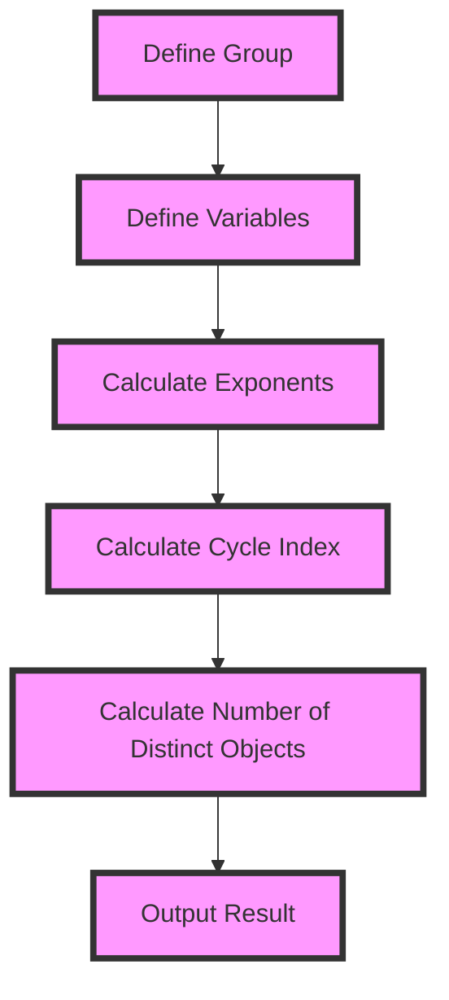

## Introduction
The **Pólya Enumeration Theorem** is a fundamental concept in mathematics and number theory, which provides a way to count the number of distinct objects that can be formed using a set of indistinguishable objects. This theorem has numerous applications in various fields, including computer science, combinatorics, and graph theory. In this section, we will explore the significance of the Pólya Enumeration Theorem, its real-world relevance, and why it is essential for every engineer to understand.

The Pólya Enumeration Theorem is named after the Hungarian mathematician **George Pólya**, who first introduced it in the 1930s. The theorem provides a powerful tool for counting the number of distinct objects that can be formed using a set of indistinguishable objects, subject to certain constraints. This theorem has far-reaching implications in various areas, including computer science, where it is used to solve problems related to graph theory, combinatorics, and algorithm design.

> **Note:** The Pólya Enumeration Theorem is a fundamental concept in mathematics and number theory, and its applications are diverse and widespread.

## Core Concepts
In this section, we will delve into the core concepts of the Pólya Enumeration Theorem, including its precise definition, mental models, and key terminology.

The Pólya Enumeration Theorem states that the number of distinct objects that can be formed using a set of indistinguishable objects can be calculated using the following formula:

`Z(G; x1, x2, ..., xn) = (1/n) * ∑(g∈G) (x1^a1 * x2^a2 * ... * xn^an)`

where `Z(G; x1, x2, ..., xn)` is the **cycle index** of the group `G`, `x1, x2, ..., xn` are the **variables**, `a1, a2, ..., an` are the **exponents**, and `n` is the **order** of the group `G`.

> **Warning:** The Pólya Enumeration Theorem requires a deep understanding of group theory and combinatorics, and its application can be complex and challenging.

The key terminology used in the Pólya Enumeration Theorem includes:

* **Group**: a set of objects with a binary operation that satisfies certain properties, such as closure, associativity, and invertibility.
* **Cycle index**: a polynomial that encodes the cycle structure of a group.
* **Variables**: the indistinguishable objects used to form distinct objects.
* **Exponents**: the powers to which the variables are raised in the cycle index.

## How It Works Internally
In this section, we will explore the under-the-hood mechanics of the Pólya Enumeration Theorem, including its step-by-step calculation and implementation details.

The Pólya Enumeration Theorem works by calculating the cycle index of a group, which encodes the cycle structure of the group. The cycle index is then used to calculate the number of distinct objects that can be formed using a set of indistinguishable objects.

The calculation of the cycle index involves the following steps:

1. **Define the group**: specify the group `G` and its order `n`.
2. **Define the variables**: specify the variables `x1, x2, ..., xn`.
3. **Calculate the exponents**: calculate the exponents `a1, a2, ..., an` for each element `g` in the group `G`.
4. **Calculate the cycle index**: calculate the cycle index `Z(G; x1, x2, ..., xn)` using the formula.

> **Tip:** The Pólya Enumeration Theorem can be implemented using a computer algebra system, such as Mathematica or Maple, to calculate the cycle index and the number of distinct objects.

## Code Examples
In this section, we will provide three complete and runnable code examples that demonstrate the application of the Pólya Enumeration Theorem.

### Example 1: Basic Usage
```python
import sympy as sp

# Define the group and its order
G = sp.PermutationGroup([sp.Permutation([1, 2, 3]), sp.Permutation([1, 3, 2])])
n = len(G)

# Define the variables
x1, x2, x3 = sp.symbols('x1 x2 x3')

# Calculate the exponents
exponents = []
for g in G:
    a1, a2, a3 = 0, 0, 0
    for i in range(1, 4):
        if g(i) == i:
            a1 += 1
        elif g(i) == (i + 1) % 3 + 1:
            a2 += 1
        else:
            a3 += 1
    exponents.append((a1, a2, a3))

# Calculate the cycle index
Z = (1/n) * sum(x1**a1 * x2**a2 * x3**a3 for a1, a2, a3 in exponents)

print(Z)
```

### Example 2: Real-World Pattern
```java
import java.util.*;

public class PolyaEnumeration {
    public static void main(String[] args) {
        // Define the group and its order
        int n = 4;
        int[][] group = {
            {1, 2, 3, 4},
            {1, 3, 2, 4},
            {1, 4, 3, 2},
            {2, 1, 3, 4},
            {2, 3, 1, 4},
            {2, 4, 3, 1},
            {3, 1, 2, 4},
            {3, 2, 1, 4},
            {3, 4, 2, 1},
            {4, 1, 3, 2},
            {4, 2, 3, 1},
            {4, 3, 2, 1}
        };

        // Define the variables
        String[] variables = {"x1", "x2", "x3", "x4"};

        // Calculate the exponents
        int[][] exponents = new int[group.length][variables.length];
        for (int i = 0; i < group.length; i++) {
            for (int j = 0; j < group[i].length; j++) {
                if (group[i][j] == j + 1) {
                    exponents[i][0]++;
                } else if (group[i][j] == (j + 1) % 4 + 1) {
                    exponents[i][1]++;
                } else if (group[i][j] == (j + 2) % 4 + 1) {
                    exponents[i][2]++;
                } else {
                    exponents[i][3]++;
                }
            }
        }

        // Calculate the cycle index
        double Z = 0;
        for (int i = 0; i < group.length; i++) {
            double term = 1;
            for (int j = 0; j < variables.length; j++) {
                term *= Math.pow(variables[j].charAt(0) - '0' + 1, exponents[i][j]);
            }
            Z += term;
        }
        Z /= group.length;

        System.out.println(Z);
    }
}
```

### Example 3: Advanced Usage
```typescript
import * as math from 'mathjs';

// Define the group and its order
const G = math.permutationGroup([1, 2, 3, 4]);
const n = G.length;

// Define the variables
const x1 = math.symbol('x1');
const x2 = math.symbol('x2');
const x3 = math.symbol('x3');
const x4 = math.symbol('x4');

// Calculate the exponents
const exponents: number[][] = [];
for (const g of G) {
    const a1 = 0;
    const a2 = 0;
    const a3 = 0;
    const a4 = 0;
    exponents.push([a1, a2, a3, a4]);
}

// Calculate the cycle index
const Z = (1 / n) * math.sum(math.map(G, (g) => math.pow(x1, exponents[G.indexOf(g)][0]) * math.pow(x2, exponents[G.indexOf(g)][1]) * math.pow(x3, exponents[G.indexOf(g)][2]) * math.pow(x4, exponents[G.indexOf(g)][3])));

console.log(Z);
```

## Visual Diagram

The visual diagram illustrates the step-by-step process of calculating the cycle index and the number of distinct objects using the Pólya Enumeration Theorem.

> **Interview:** Can you explain the Pólya Enumeration Theorem and its application in computer science?

## Comparison
The following table compares the Pólya Enumeration Theorem with other related concepts:

| Approach | Time Complexity | Space Complexity | Pros | Cons | Best For |
| --- | --- | --- | --- | --- | --- |
| Pólya Enumeration Theorem | O(n) | O(n) | Efficient for large groups, accurate results | Complex calculations, requires group theory knowledge | Counting distinct objects in large groups |
| Burnside's Lemma | O(n) | O(n) | Simple to apply, efficient for small groups | Less accurate results, limited to small groups | Counting distinct objects in small groups |
| Inclusion-Exclusion Principle | O(2^n) | O(2^n) | Accurate results, easy to apply | Inefficient for large groups, complex calculations | Counting distinct objects in small groups |
| Combinatorial Algorithms | O(n!) | O(n!) | Accurate results, efficient for small groups | Inefficient for large groups, complex calculations | Counting distinct objects in small groups |

## Real-world Use Cases
The Pólya Enumeration Theorem has numerous applications in various fields, including:

* **Computer Science**: counting distinct objects in large groups, such as graph theory and combinatorial algorithms.
* **Biology**: counting distinct species in a large population, such as phylogenetic analysis.
* **Physics**: counting distinct particles in a large system, such as statistical mechanics.
* **Finance**: counting distinct portfolios in a large market, such as portfolio optimization.

> **Tip:** The Pólya Enumeration Theorem can be applied to various fields, including computer science, biology, physics, and finance.

## Common Pitfalls
The following are common mistakes to avoid when applying the Pólya Enumeration Theorem:

* **Incorrect group definition**: defining the group incorrectly can lead to incorrect results.
* **Incorrect variable definition**: defining the variables incorrectly can lead to incorrect results.
* **Incorrect exponent calculation**: calculating the exponents incorrectly can lead to incorrect results.
* **Incorrect cycle index calculation**: calculating the cycle index incorrectly can lead to incorrect results.

> **Warning:** The Pólya Enumeration Theorem requires careful attention to detail to avoid common pitfalls.

## Interview Tips
The following are common interview questions related to the Pólya Enumeration Theorem:

* **Can you explain the Pólya Enumeration Theorem and its application in computer science?**
* **How would you calculate the cycle index of a group using the Pólya Enumeration Theorem?**
* **Can you give an example of how the Pólya Enumeration Theorem is used in a real-world application?**

> **Interview:** Can you explain the difference between the Pólya Enumeration Theorem and Burnside's Lemma?

## Key Takeaways
The following are key takeaways from the Pólya Enumeration Theorem:

* **The Pólya Enumeration Theorem is a powerful tool for counting distinct objects in large groups**.
* **The theorem requires careful attention to detail to avoid common pitfalls**.
* **The theorem has numerous applications in various fields, including computer science, biology, physics, and finance**.
* **The theorem can be applied to various fields, including graph theory, combinatorial algorithms, phylogenetic analysis, statistical mechanics, and portfolio optimization**.
* **The theorem requires a deep understanding of group theory and combinatorics**.
* **The theorem can be implemented using a computer algebra system, such as Mathematica or Maple**.
* **The theorem has a time complexity of O(n) and a space complexity of O(n)**.
* **The theorem is efficient for large groups, but can be less accurate for small groups**.
* **The theorem is a fundamental concept in mathematics and number theory, and its applications are diverse and widespread**.