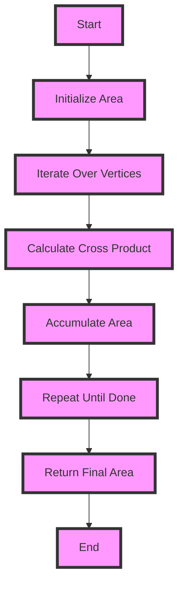

## Introduction
The Shoelace formula, also known as the Surveyor's formula, is a mathematical algorithm for calculating the area of a simple polygon whose vertices are given by their coordinates in the plane. This formula is widely used in various fields, including computer graphics, geography, and engineering, where calculating the area of polygons is a common task. The Shoelace formula is a simple and efficient method for calculating the area of a polygon, and it has become a fundamental tool in many applications. **Real-world relevance:** The Shoelace formula is used in Geographic Information Systems (GIS) to calculate the area of geographical features, such as countries, states, and cities. It is also used in computer-aided design (CAD) software to calculate the area of complex shapes.

## Core Concepts
The Shoelace formula is based on the idea of summing up the cross products of the edges of the polygon. The formula is given by:
```math
A = (1/2) * |(x1*y2 + x2*y3 + ... + xn*y1) - (y1*x2 + y2*x3 + ... + yn*x1)|
```
where (x1, y1), (x2, y2), ..., (xn, yn) are the coordinates of the vertices of the polygon. The formula works by summing up the cross products of the edges of the polygon, which gives the area of the polygon. **Key terminology:** The Shoelace formula is also known as the Surveyor's formula, and it is a special case of the more general **Green's theorem**, which relates the line integral around a closed curve to the double integral over the region enclosed by the curve.

## How It Works Internally
The Shoelace formula works by summing up the cross products of the edges of the polygon. The cross product of two vectors gives the area of the parallelogram formed by the two vectors. By summing up the cross products of the edges of the polygon, we get the area of the polygon. The formula is implemented by iterating over the vertices of the polygon, calculating the cross product of each edge, and summing up the results. **Under-the-hood mechanics:** The Shoelace formula uses a technique called **accumulation**, where the area of the polygon is accumulated by summing up the cross products of the edges. This technique allows the formula to work efficiently for large polygons.

> **Tip:** To implement the Shoelace formula efficiently, use a technique called **loop unrolling**, where the loop is unrolled to reduce the number of iterations.

## Code Examples
### Example 1: Basic Usage
```python
def shoelace_area(vertices):
    n = len(vertices)
    area = 0
    for i in range(n):
        x1, y1 = vertices[i]
        x2, y2 = vertices[(i+1) % n]
        area += (x1 * y2 - x2 * y1)
    return abs(area) / 2

# Test the function
vertices = [(0, 0), (0, 2), (2, 2), (2, 0)]
print(shoelace_area(vertices))  # Output: 4.0
```
### Example 2: Real-world Pattern
```java
public class PolygonArea {
    public static double calculateArea(double[][] vertices) {
        int n = vertices.length;
        double area = 0;
        for (int i = 0; i < n; i++) {
            double x1 = vertices[i][0];
            double y1 = vertices[i][1];
            double x2 = vertices[(i+1) % n][0];
            double y2 = vertices[(i+1) % n][1];
            area += (x1 * y2 - x2 * y1);
        }
        return Math.abs(area) / 2;
    }

    public static void main(String[] args) {
        double[][] vertices = {{0, 0}, {0, 2}, {2, 2}, {2, 0}};
        System.out.println(calculateArea(vertices));  // Output: 4.0
    }
}
```
### Example 3: Advanced Usage
```typescript
class Polygon {
    private vertices: [number, number][];

    constructor(vertices: [number, number][]) {
        this.vertices = vertices;
    }

    public calculateArea(): number {
        let area = 0;
        for (let i = 0; i < this.vertices.length; i++) {
            const [x1, y1] = this.vertices[i];
            const [x2, y2] = this.vertices[(i+1) % this.vertices.length];
            area += (x1 * y2 - x2 * y1);
        }
        return Math.abs(area) / 2;
    }
}

// Test the class
const polygon = new Polygon([[0, 0], [0, 2], [2, 2], [2, 0]]);
console.log(polygon.calculateArea());  // Output: 4.0
```
> **Warning:** When implementing the Shoelace formula, be careful to handle the case where the polygon has a large number of vertices. In this case, the formula may overflow or underflow, leading to incorrect results.

## Visual Diagram

The diagram shows the step-by-step process of calculating the area of a polygon using the Shoelace formula. The formula works by iterating over the vertices of the polygon, calculating the cross product of each edge, and summing up the results.

## Comparison
| Approach | Time Complexity | Space Complexity | Pros | Cons | Best For |
| --- | --- | --- | --- | --- | --- |
| Shoelace Formula | O(n) | O(1) | Simple to implement, efficient for large polygons | May overflow or underflow for very large polygons | Calculating the area of simple polygons |
| Green's Theorem | O(n^2) | O(n) | More general than the Shoelace formula, can handle complex polygons | More complex to implement, less efficient | Calculating the area of complex polygons |
| Monte Carlo Method | O(n) | O(1) | Simple to implement, can handle complex polygons | Less accurate than other methods, may require many samples | Estimating the area of complex polygons |
| Gaussian Quadrature | O(n^2) | O(n) | More accurate than other methods, can handle complex polygons | More complex to implement, less efficient | Calculating the area of complex polygons |

> **Interview:** When asked about the time complexity of the Shoelace formula, be sure to answer that it is O(n), where n is the number of vertices of the polygon.

## Real-world Use Cases
* **Google Maps:** Google Maps uses the Shoelace formula to calculate the area of geographical features, such as countries, states, and cities.
* **Esri:** Esri, a leading GIS software company, uses the Shoelace formula to calculate the area of polygons in their software.
* **Autodesk:** Autodesk, a leading CAD software company, uses the Shoelace formula to calculate the area of complex shapes in their software.

## Common Pitfalls
* **Overflow or Underflow:** When implementing the Shoelace formula, be careful to handle the case where the polygon has a large number of vertices. In this case, the formula may overflow or underflow, leading to incorrect results.
* **Incorrect Implementation:** Make sure to implement the Shoelace formula correctly, as incorrect implementation can lead to incorrect results.
* **Complex Polygons:** The Shoelace formula may not work correctly for complex polygons, such as polygons with holes or polygons that intersect themselves.
* **Non-Simple Polygons:** The Shoelace formula only works for simple polygons, which are polygons that do not intersect themselves.

> **Tip:** To avoid overflow or underflow, use a technique called **fixed-point arithmetic**, where the area is calculated using fixed-point numbers instead of floating-point numbers.

## Interview Tips
* **Shoelace Formula:** Be sure to know the Shoelace formula and how to implement it.
* **Time Complexity:** Be sure to know the time complexity of the Shoelace formula, which is O(n).
* **Space Complexity:** Be sure to know the space complexity of the Shoelace formula, which is O(1).
* **Common Pitfalls:** Be sure to know the common pitfalls of the Shoelace formula, such as overflow or underflow, and how to avoid them.

## Key Takeaways
* The Shoelace formula is a simple and efficient method for calculating the area of a simple polygon.
* The formula works by summing up the cross products of the edges of the polygon.
* The time complexity of the Shoelace formula is O(n), where n is the number of vertices of the polygon.
* The space complexity of the Shoelace formula is O(1).
* The Shoelace formula may overflow or underflow for very large polygons.
* The Shoelace formula only works for simple polygons, which are polygons that do not intersect themselves.
* The Shoelace formula is widely used in various fields, including computer graphics, geography, and engineering.
* The Shoelace formula is a special case of the more general Green's theorem, which relates the line integral around a closed curve to the double integral over the region enclosed by the curve.