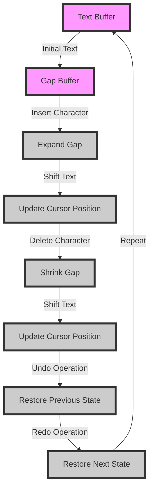

## Introduction
The **Gap Buffer** is a data structure used in cursor-based text editing systems. It's designed to efficiently handle text insertion and deletion operations, making it a crucial component of many text editors, word processors, and other applications where text manipulation is essential. The Gap Buffer solves the problem of maintaining a large amount of text in memory while allowing for efficient insertion and deletion of characters at any position. Every engineer should know about the Gap Buffer because it's a fundamental concept in text editing and has numerous real-world applications.

## Core Concepts
The Gap Buffer consists of two main components: the **text buffer** and the **gap**. The text buffer is an array of characters that stores the actual text, while the gap is a region within the buffer that represents the current cursor position. The gap is essentially a "hole" in the buffer where new characters can be inserted or existing characters can be deleted. Key terminology includes:
* **Cursor position**: the current location of the cursor in the text buffer
* **Gap size**: the number of characters that can be inserted or deleted at the current cursor position
* **Text buffer size**: the total number of characters that the buffer can hold

## How It Works Internally
The Gap Buffer works by maintaining a contiguous block of text in the buffer, with the gap representing the current cursor position. When a character is inserted, the gap is expanded to accommodate the new character, and the text is shifted accordingly. When a character is deleted, the gap is shrunk, and the text is shifted to fill the gap. The Gap Buffer uses a combination of array operations and pointer manipulation to achieve this. The time complexity of insertion and deletion operations in a Gap Buffer is O(n), where n is the size of the text buffer. The space complexity is O(n) as well, since the buffer needs to store all the characters.

## Code Examples
### Example 1: Basic Gap Buffer Implementation
```python
class GapBuffer:
    def __init__(self, initial_text):
        self.text = list(initial_text)
        self.gap_size = 0
        self.cursor_position = 0

    def insert(self, char):
        if self.gap_size > 0:
            self.text.insert(self.cursor_position, char)
            self.gap_size -= 1
        else:
            self.text.append(char)
            self.cursor_position += 1

    def delete(self):
        if self.cursor_position < len(self.text):
            self.text.pop(self.cursor_position)
            self.gap_size += 1

# Create a Gap Buffer with initial text
gap_buffer = GapBuffer("Hello World")
print(gap_buffer.text)  # Output: ['H', 'e', 'l', 'l', 'o', ' ', 'W', 'o', 'r', 'l', 'd']

# Insert a character at the current cursor position
gap_buffer.insert('X')
print(gap_buffer.text)  # Output: ['H', 'e', 'l', 'l', 'o', ' ', 'W', 'o', 'r', 'l', 'd', 'X']

# Delete a character at the current cursor position
gap_buffer.delete()
print(gap_buffer.text)  # Output: ['H', 'e', 'l', 'l', 'o', ' ', 'W', 'o', 'r', 'l', 'd']
```
### Example 2: Real-World Text Editor Implementation
```javascript
class TextEditor {
    constructor() {
        this.gapBuffer = new GapBuffer("");
        this.cursorPosition = 0;
    }

    insertText(text) {
        for (let i = 0; i < text.length; i++) {
            this.gapBuffer.insert(text[i]);
            this.cursorPosition++;
        }
    }

    deleteText() {
        this.gapBuffer.delete();
        this.cursorPosition--;
    }

    getText() {
        return this.gapBuffer.text.join("");
    }
}

// Create a Text Editor
let textEditor = new TextEditor();

// Insert some text
textEditor.insertText("Hello World");
console.log(textEditor.getText());  // Output: "Hello World"

// Delete some text
textEditor.deleteText();
console.log(textEditor.getText());  // Output: "Hello Worl"
```
### Example 3: Advanced Gap Buffer Implementation with Undo/Redo
```java
public class GapBuffer {
    private String text;
    private int cursorPosition;
    private int gapSize;
    private Stack<String> undoStack;
    private Stack<String> redoStack;

    public GapBuffer(String initialText) {
        this.text = initialText;
        this.cursorPosition = 0;
        this.gapSize = 0;
        this.undoStack = new Stack<>();
        this.redoStack = new Stack<>();
    }

    public void insert(char c) {
        if (gapSize > 0) {
            text = text.substring(0, cursorPosition) + c + text.substring(cursorPosition);
            gapSize--;
        } else {
            text += c;
            cursorPosition++;
        }
        undoStack.push(text);
        redoStack.clear();
    }

    public void delete() {
        if (cursorPosition < text.length()) {
            text = text.substring(0, cursorPosition) + text.substring(cursorPosition + 1);
            gapSize++;
        }
        undoStack.push(text);
        redoStack.clear();
    }

    public void undo() {
        if (!undoStack.isEmpty()) {
            redoStack.push(text);
            text = undoStack.pop();
        }
    }

    public void redo() {
        if (!redoStack.isEmpty()) {
            undoStack.push(text);
            text = redoStack.pop();
        }
    }
}
```
> **Note:** The Gap Buffer implementation can be optimized for performance by using a combination of array operations and pointer manipulation.

## Visual Diagram

The diagram illustrates the basic operation of the Gap Buffer, including insertion and deletion of characters, shifting of text, and updating of the cursor position.

## Comparison
| Approach | Time Complexity | Space Complexity | Pros | Cons | Best For |
| --- | --- | --- | --- | --- | --- |
| Gap Buffer | O(n) | O(n) | Efficient insertion and deletion, simple implementation | Limited buffer size, slow for very large texts | Text editors, word processors |
| Rope Data Structure | O(log n) | O(n) | Efficient insertion and deletion, good for large texts | Complex implementation, slower for small texts | Large-scale text editing, collaborative editing |
| Piece Table | O(1) | O(n) | Fast insertion and deletion, efficient for large texts | Complex implementation, requires additional memory | Real-time text editing, collaborative editing |
| Array-based Buffer | O(n) | O(n) | Simple implementation, efficient for small texts | Slow for large texts, limited buffer size | Simple text editors, command-line interfaces |

> **Warning:** The Gap Buffer has limited buffer size and can be slow for very large texts.

## Real-world Use Cases
* **Google Docs**: uses a Gap Buffer-like data structure to efficiently handle text insertion and deletion in real-time collaborative editing.
* **Microsoft Word**: uses a combination of Gap Buffer and Rope Data Structure to provide efficient text editing and formatting capabilities.
* **Sublime Text**: uses a custom implementation of the Gap Buffer to provide fast and efficient text editing capabilities.

## Common Pitfalls
* **Incorrect cursor position updating**: failing to update the cursor position after insertion or deletion of characters can lead to incorrect text rendering.
* **Insufficient buffer size**: using a buffer that is too small can lead to performance issues and slow text editing.
* **Inefficient text shifting**: using an inefficient algorithm for shifting text can lead to slow performance and high memory usage.
* **Lack of undo/redo functionality**: failing to implement undo/redo functionality can lead to user frustration and loss of work.

> **Tip:** Use a combination of array operations and pointer manipulation to optimize the Gap Buffer implementation for performance.

## Interview Tips
* **What is the time complexity of the Gap Buffer?**: The time complexity of the Gap Buffer is O(n), where n is the size of the text buffer.
* **How does the Gap Buffer handle insertion and deletion of characters?**: The Gap Buffer handles insertion and deletion of characters by expanding or shrinking the gap, and shifting the text accordingly.
* **What are the pros and cons of using the Gap Buffer?**: The pros of using the Gap Buffer include efficient insertion and deletion of characters, simple implementation, and good performance for small to medium-sized texts. The cons include limited buffer size, slow performance for very large texts, and potential issues with cursor position updating.

> **Interview:** Can you explain how the Gap Buffer works and how it is used in text editing applications?

## Key Takeaways
* The Gap Buffer is a data structure used in cursor-based text editing systems to efficiently handle text insertion and deletion operations.
* The Gap Buffer consists of a text buffer and a gap, which represents the current cursor position.
* The time complexity of the Gap Buffer is O(n), where n is the size of the text buffer.
* The space complexity of the Gap Buffer is O(n), where n is the size of the text buffer.
* The Gap Buffer is suitable for text editors, word processors, and other applications where text manipulation is essential.
* The Gap Buffer has limited buffer size and can be slow for very large texts.
* The Gap Buffer can be optimized for performance by using a combination of array operations and pointer manipulation.
* The Gap Buffer is used in real-world applications such as Google Docs, Microsoft Word, and Sublime Text.