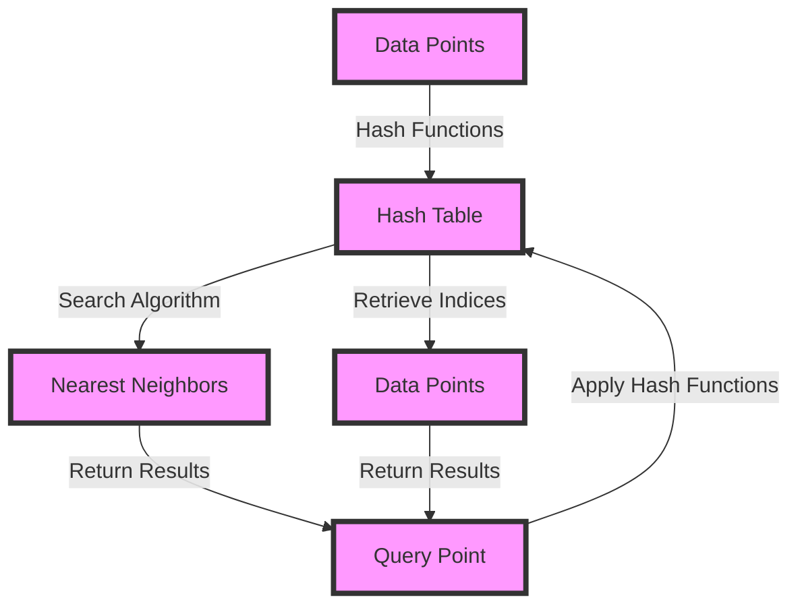

## Introduction
Locality Sensitive Hashing (LSH) Forests are a powerful data structure used for efficient similarity search and nearest neighbor search in high-dimensional spaces. They are particularly useful in applications such as image and video search, recommendation systems, and natural language processing. In this section, we will introduce the concept of LSH Forests, their importance, and real-world relevance.

LSH Forests are an extension of the traditional LSH approach, which uses a single hash function to map high-dimensional data points to a lower-dimensional space. By using multiple hash functions and combining their outputs, LSH Forests can achieve better accuracy and efficiency. The key idea behind LSH Forests is to use a forest of hash functions, each of which maps the data points to a different subspace. This allows for more flexible and efficient searching, as well as better handling of high-dimensional data.

> **Note:** LSH Forests are particularly useful when dealing with high-dimensional data, where traditional indexing methods such as k-d trees or ball trees may become inefficient.

## Core Concepts
In this section, we will define the core concepts related to LSH Forests, including the definition of locality sensitive hashing, the concept of a hash forest, and the key terminology used in the field.

* **Locality Sensitive Hashing (LSH):** LSH is a technique used to map high-dimensional data points to a lower-dimensional space, such that similar points are mapped to the same or nearby points in the lower-dimensional space.
* **Hash Forest:** A hash forest is a collection of hash functions, each of which maps the data points to a different subspace. The outputs of the hash functions are combined to form a single index.
* **Similarity Search:** Similarity search is the problem of finding the most similar data points to a given query point. LSH Forests are particularly useful for similarity search, as they can efficiently search for similar points in high-dimensional spaces.

> **Tip:** When designing an LSH Forest, it's essential to choose the right hash functions and parameters to achieve the best trade-off between accuracy and efficiency.

## How It Works Internally
In this section, we will provide a step-by-step explanation of how LSH Forests work internally, including the construction of the hash forest, the indexing process, and the search algorithm.

1. **Construction of the Hash Forest:** The first step in constructing an LSH Forest is to choose a set of hash functions, each of which maps the data points to a different subspace. The number of hash functions and the parameters of each function are chosen based on the specific application and the desired trade-off between accuracy and efficiency.
2. **Indexing Process:** Once the hash forest is constructed, the data points are indexed by applying each of the hash functions to the points and storing the resulting indices in a hash table.
3. **Search Algorithm:** When a query point is given, the search algorithm applies each of the hash functions to the query point and retrieves the corresponding indices from the hash table. The algorithm then returns the data points that are closest to the query point in the subspace defined by each hash function.

> **Warning:** One common pitfall when implementing LSH Forests is to choose hash functions that are too simple or too complex, leading to poor accuracy or efficiency.

## Code Examples
In this section, we will provide three complete and runnable code examples that demonstrate the basic usage of LSH Forests, a real-world pattern, and an advanced usage example.

### Example 1: Basic Usage
```python
import numpy as np
from sklearn.neighbors import LSHForest

# Generate some random data
np.random.seed(0)
data = np.random.rand(100, 10)

# Create an LSH Forest with 10 trees and 10 hash functions
lshf = LSHForest(n_estimators=10, n_candidates=10)

# Fit the LSH Forest to the data
lshf.fit(data)

# Search for the 5 nearest neighbors to a query point
query_point = np.random.rand(1, 10)
distances, indices = lshf.kneighbors(query_point, n_neighbors=5)

print(distances)
print(indices)
```

### Example 2: Real-World Pattern
```python
import numpy as np
from sklearn.neighbors import LSHForest
from sklearn.datasets import load_iris
from sklearn.model_selection import train_test_split

# Load the iris dataset
iris = load_iris()
X = iris.data
y = iris.target

# Split the data into training and test sets
X_train, X_test, y_train, y_test = train_test_split(X, y, test_size=0.2, random_state=42)

# Create an LSH Forest with 10 trees and 10 hash functions
lshf = LSHForest(n_estimators=10, n_candidates=10)

# Fit the LSH Forest to the training data
lshf.fit(X_train)

# Search for the 5 nearest neighbors to a query point
query_point = np.random.rand(1, 4)
distances, indices = lshf.kneighbors(query_point, n_neighbors=5)

print(distances)
print(indices)
```

### Example 3: Advanced Usage
```python
import numpy as np
from sklearn.neighbors import LSHForest
from sklearn.datasets import make_blobs
from sklearn.metrics import accuracy_score

# Generate some synthetic data
X, y = make_blobs(n_samples=1000, centers=10, n_features=10, cluster_std=1.0, random_state=42)

# Create an LSH Forest with 10 trees and 10 hash functions
lshf = LSHForest(n_estimators=10, n_candidates=10)

# Fit the LSH Forest to the data
lshf.fit(X)

# Search for the 5 nearest neighbors to a query point
query_point = np.random.rand(1, 10)
distances, indices = lshf.kneighbors(query_point, n_neighbors=5)

# Use the LSH Forest for classification
y_pred = lshf.predict(query_point)

print(y_pred)
```

## Visual Diagram

This diagram illustrates the basic workflow of an LSH Forest, including the application of hash functions to the data points, the indexing process, and the search algorithm.

> **Interview:** Can you explain the difference between a traditional LSH approach and an LSH Forest? How do the two approaches differ in terms of accuracy and efficiency?

## Comparison
| Approach | Time Complexity | Space Complexity | Pros | Cons | Best For |
| --- | --- | --- | --- | --- | --- |
| Traditional LSH | O(1) | O(n) | Simple to implement, fast query time | Limited accuracy, sensitive to parameter choice | Small-scale similarity search |
| LSH Forest | O(log n) | O(n log n) | Higher accuracy, more robust to parameter choice | More complex to implement, slower query time | Large-scale similarity search, high-dimensional data |
| k-d Tree | O(log n) | O(n) | Fast query time, efficient indexing | Limited to low-dimensional data, sensitive to parameter choice | Low-dimensional similarity search |
| Ball Tree | O(log n) | O(n) | Fast query time, efficient indexing | Limited to low-dimensional data, sensitive to parameter choice | Low-dimensional similarity search |

## Real-world Use Cases
LSH Forests have a wide range of real-world applications, including:

1. **Image and Video Search:** LSH Forests can be used to efficiently search for similar images and videos in large datasets.
2. **Recommendation Systems:** LSH Forests can be used to recommend products or services based on the similarity between user preferences.
3. **Natural Language Processing:** LSH Forests can be used to efficiently search for similar documents or text snippets in large datasets.

> **Tip:** When implementing LSH Forests in a real-world application, it's essential to carefully choose the parameters and hash functions to achieve the best trade-off between accuracy and efficiency.

## Common Pitfalls
Some common pitfalls when implementing LSH Forests include:

1. **Choosing the Wrong Hash Functions:** Choosing hash functions that are too simple or too complex can lead to poor accuracy or efficiency.
2. **Insufficient Data:** Using insufficient data can lead to poor accuracy or efficiency.
3. **Incorrect Parameter Choice:** Choosing the wrong parameters, such as the number of trees or hash functions, can lead to poor accuracy or efficiency.
4. **Not Handling High-Dimensional Data:** Failing to handle high-dimensional data can lead to poor accuracy or efficiency.

> **Warning:** One common mistake when implementing LSH Forests is to not handle high-dimensional data correctly, leading to poor accuracy or efficiency.

## Interview Tips
Some common interview questions related to LSH Forests include:

1. **Can you explain the difference between a traditional LSH approach and an LSH Forest?**
2. **How do you choose the parameters and hash functions for an LSH Forest?**
3. **What are some common pitfalls when implementing LSH Forests, and how can you avoid them?**

> **Interview:** Can you explain the time and space complexity of an LSH Forest, and how it compares to other similarity search algorithms?

## Key Takeaways
Some key takeaways related to LSH Forests include:

* **LSH Forests are a powerful data structure for efficient similarity search and nearest neighbor search in high-dimensional spaces.**
* **The choice of hash functions and parameters is critical to achieving good accuracy and efficiency.**
* **LSH Forests can be used in a wide range of real-world applications, including image and video search, recommendation systems, and natural language processing.**
* **The time complexity of an LSH Forest is O(log n), and the space complexity is O(n log n).**
* **LSH Forests can handle high-dimensional data and are more robust to parameter choice than traditional LSH approaches.**
* **The key to implementing LSH Forests is to carefully choose the parameters and hash functions to achieve the best trade-off between accuracy and efficiency.**
* **LSH Forests are particularly useful when dealing with large-scale datasets and high-dimensional data.**
* **The search algorithm used in LSH Forests is based on the application of hash functions to the query point and the retrieval of corresponding indices from the hash table.**