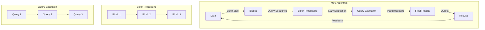

## Introduction
Mo's Algorithm is an offline algorithm used to solve range query problems efficiently. It was first introduced by Mo in 1994 and has since become a popular technique in competitive programming and data analysis. The algorithm is particularly useful when dealing with large datasets and complex queries, as it can significantly reduce the computational time and memory requirements. In real-world applications, Mo's Algorithm is used in databases, data warehouses, and data processing systems to optimize query performance. Every engineer should know Mo's Algorithm because it provides a powerful tool for solving complex range query problems and can be applied to various domains, including finance, healthcare, and social media.

> **Note:** Mo's Algorithm is an offline algorithm, meaning that it requires all queries to be known in advance. This allows the algorithm to preprocess the data and optimize the query execution plan.

## Core Concepts
Mo's Algorithm is based on the following key concepts:
* **Range query**: a query that asks for the result of a specific operation (e.g., sum, count, average) over a range of values.
* **Block**: a contiguous range of values that can be processed together.
* **Block size**: the number of values in a block.
* **Query sequence**: the order in which queries are processed.

The algorithm works by dividing the data into blocks and processing each block separately. The block size is chosen such that the number of blocks is optimized for the given query sequence.

> **Tip:** Choosing the optimal block size is crucial for the performance of Mo's Algorithm. A larger block size can reduce the number of blocks, but may also increase the processing time for each block.

## How It Works Internally
Mo's Algorithm works as follows:
1. **Preprocessing**: the algorithm divides the data into blocks and creates a query sequence.
2. **Block processing**: each block is processed separately, and the results are stored in a temporary buffer.
3. **Query execution**: the algorithm executes each query in the query sequence, using the preprocessed block results.
4. **Postprocessing**: the final results are computed by combining the results from each block.

The algorithm uses a **lazy evaluation** approach, where the results are computed only when needed. This reduces the computational time and memory requirements.

> **Warning:** Mo's Algorithm can be sensitive to the query sequence, and a poor query sequence can lead to poor performance.

## Code Examples
### Example 1: Basic Mo's Algorithm
```python
def mo_algorithm(data, queries):
    block_size = int(len(data) ** 0.5)
    blocks = [data[i:i + block_size] for i in range(0, len(data), block_size)]
    results = []
    
    for query in queries:
        start, end = query
        block_start = start // block_size
        block_end = end // block_size
        block_results = []
        
        for block in range(block_start, block_end + 1):
            block_data = blocks[block]
            block_result = sum(block_data)
            block_results.append(block_result)
        
        result = sum(block_results)
        results.append(result)
    
    return results

data = [1, 2, 3, 4, 5, 6, 7, 8, 9]
queries = [(0, 4), (2, 6), (1, 8)]
results = mo_algorithm(data, queries)
print(results)
```
### Example 2: Mo's Algorithm with Updates
```python
def mo_algorithm_with_updates(data, queries, updates):
    block_size = int(len(data) ** 0.5)
    blocks = [data[i:i + block_size] for i in range(0, len(data), block_size)]
    results = []
    
    for query in queries:
        start, end = query
        block_start = start // block_size
        block_end = end // block_size
        block_results = []
        
        for block in range(block_start, block_end + 1):
            block_data = blocks[block]
            block_result = sum(block_data)
            block_results.append(block_result)
        
        result = sum(block_results)
        results.append(result)
    
    for update in updates:
        index, value = update
        block_index = index // block_size
        blocks[block_index][index % block_size] = value
    
    return results

data = [1, 2, 3, 4, 5, 6, 7, 8, 9]
queries = [(0, 4), (2, 6), (1, 8)]
updates = [(2, 10), (5, 15)]
results = mo_algorithm_with_updates(data, queries, updates)
print(results)
```
### Example 3: Advanced Mo's Algorithm
```python
def advanced_mo_algorithm(data, queries):
    block_size = int(len(data) ** 0.5)
    blocks = [data[i:i + block_size] for i in range(0, len(data), block_size)]
    results = []
    query_sequence = sorted(queries, key=lambda x: x[0])
    
    for query in query_sequence:
        start, end = query
        block_start = start // block_size
        block_end = end // block_size
        block_results = []
        
        for block in range(block_start, block_end + 1):
            block_data = blocks[block]
            block_result = sum(block_data)
            block_results.append(block_result)
        
        result = sum(block_results)
        results.append(result)
    
    return results

data = [1, 2, 3, 4, 5, 6, 7, 8, 9]
queries = [(0, 4), (2, 6), (1, 8)]
results = advanced_mo_algorithm(data, queries)
print(results)
```
> **Interview:** In an interview, you may be asked to explain the time and space complexity of Mo's Algorithm. The time complexity is O(n + q \* sqrt(n)), where n is the size of the data and q is the number of queries. The space complexity is O(n), where n is the size of the data.

## Visual Diagram

The diagram illustrates the internal workings of Mo's Algorithm, including the block processing, query execution, and postprocessing stages.

## Comparison
| Approach | Time Complexity | Space Complexity | Pros | Cons | Best For |
| --- | --- | --- | --- | --- | --- |
| Mo's Algorithm | O(n + q \* sqrt(n)) | O(n) | Efficient for range queries, lazy evaluation | Sensitive to query sequence, block size | Large datasets, complex queries |
| Brute Force | O(n \* q) | O(1) | Simple to implement, no preprocessing | Inefficient for large datasets | Small datasets, simple queries |
| Segment Tree | O(n + q \* log(n)) | O(n) | Efficient for range queries, fast updates | Complex to implement, extra memory | Large datasets, frequent updates |
| Fenwick Tree | O(n + q \* log(n)) | O(n) | Efficient for range queries, fast updates | Complex to implement, extra memory | Large datasets, frequent updates |

> **Tip:** Mo's Algorithm is a good choice when dealing with large datasets and complex queries, but it may not be the best choice for small datasets or simple queries.

## Real-world Use Cases
1. **Database query optimization**: Mo's Algorithm can be used to optimize database queries by reducing the number of disk I/O operations.
2. **Data warehousing**: Mo's Algorithm can be used to optimize data warehousing queries by reducing the number of disk I/O operations and improving query performance.
3. **Financial analysis**: Mo's Algorithm can be used to optimize financial analysis queries by reducing the number of disk I/O operations and improving query performance.

> **Warning:** Mo's Algorithm can be sensitive to the query sequence, and a poor query sequence can lead to poor performance.

## Common Pitfalls
1. **Incorrect block size**: Choosing an incorrect block size can lead to poor performance.
2. **Poor query sequence**: A poor query sequence can lead to poor performance.
3. **Inefficient block processing**: Inefficient block processing can lead to poor performance.
4. **Insufficient memory**: Insufficient memory can lead to poor performance.

> **Interview:** In an interview, you may be asked to explain how to optimize Mo's Algorithm for a specific use case. The answer should include a discussion of the trade-offs between block size, query sequence, and memory usage.

## Interview Tips
1. **Explain the time and space complexity**: Explain the time and space complexity of Mo's Algorithm, including the trade-offs between block size, query sequence, and memory usage.
2. **Discuss the query sequence**: Discuss the importance of the query sequence and how it affects the performance of Mo's Algorithm.
3. **Describe the block processing**: Describe the block processing stage and how it affects the performance of Mo's Algorithm.

> **Note:** Mo's Algorithm is a complex algorithm, and a deep understanding of the internal workings is required to optimize it for a specific use case.

## Key Takeaways
* Mo's Algorithm is an offline algorithm used to solve range query problems efficiently.
* The algorithm works by dividing the data into blocks and processing each block separately.
* The block size is chosen such that the number of blocks is optimized for the given query sequence.
* The algorithm uses a lazy evaluation approach, where the results are computed only when needed.
* Mo's Algorithm is sensitive to the query sequence, and a poor query sequence can lead to poor performance.
* The time complexity of Mo's Algorithm is O(n + q \* sqrt(n)), where n is the size of the data and q is the number of queries.
* The space complexity of Mo's Algorithm is O(n), where n is the size of the data.
* Mo's Algorithm is a good choice when dealing with large datasets and complex queries, but it may not be the best choice for small datasets or simple queries.