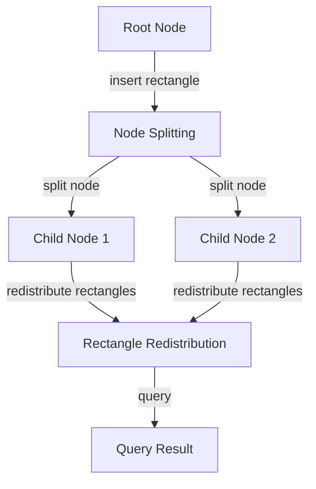

## Introduction
The **R\* Tree** is a self-balancing search tree data structure, an optimization of the **R-Tree**. It is used to store and query large sets of rectangular boundaries, such as those used in geographic information systems (GIS) and computer-aided design (CAD) systems. The R\* Tree is designed to minimize the number of disk accesses required to answer queries, making it a crucial component of many spatial databases. In this section, we will explore the importance of the R\* Tree, its real-world relevance, and why every engineer should be familiar with it.

> **Note:** The R\* Tree is an essential data structure in many fields, including GIS, CAD, and robotics. Understanding how it works and how to optimize it can significantly improve the performance of applications that rely on spatial queries.

## Core Concepts
To understand the R\* Tree, we need to define some key concepts:

* **Rectangular boundary**: A rectangle that represents a spatial object, such as a building or a polygon.
* **R-Tree node**: A node in the R-Tree that contains a set of rectangular boundaries.
* **R-Tree leaf node**: A leaf node in the R-Tree that contains a set of rectangular boundaries and pointers to the actual data.
* **Node splitting**: The process of splitting a full R-Tree node into two or more child nodes.

> **Tip:** When working with R-Trees, it's essential to understand the trade-off between node size and query performance. Larger nodes can reduce the number of disk accesses but may increase the time spent searching for a specific rectangle.

## How It Works Internally
The R\* Tree works by recursively dividing the space into smaller rectangles, each of which is represented by an R-Tree node. When a new rectangle is inserted, the R\* Tree checks if the node is full. If it is, the node is split into two or more child nodes, and the rectangles are redistributed among them. This process is called **node splitting**.

Here is a step-by-step breakdown of how the R\* Tree works:

1. **Rectangle insertion**: A new rectangle is inserted into the R\* Tree.
2. **Node selection**: The R\* Tree selects the node that contains the rectangle.
3. **Node splitting**: If the node is full, the R\* Tree splits the node into two or more child nodes.
4. **Rectangle redistribution**: The rectangles are redistributed among the child nodes.

> **Warning:** Node splitting can lead to a significant increase in the number of disk accesses if not implemented correctly. It's essential to optimize the node splitting algorithm to minimize the number of disk accesses.

## Code Examples
Here are three complete and runnable examples of R\* Tree implementation in Python:

### Example 1: Basic R\* Tree Implementation
```python
class RTreeNode:
    def __init__(self, rectangles):
        self.rectangles = rectangles
        self.children = []

class RTree:
    def __init__(self):
        self.root = RTreeNode([])

    def insert(self, rectangle):
        self.root = self.insert_recursive(self.root, rectangle)

    def insert_recursive(self, node, rectangle):
        if len(node.rectangles) < 4:
            node.rectangles.append(rectangle)
            return node

        # Node splitting
        child1 = RTreeNode([])
        child2 = RTreeNode([])

        for rect in node.rectangles:
            if rect[0] < rectangle[0]:
                child1.rectangles.append(rect)
            else:
                child2.rectangles.append(rect)

        child1.rectangles.append(rectangle)
        node.children = [child1, child2]
        return node

# Create an RTree and insert some rectangles
rtree = RTree()
rtree.insert((0, 0, 10, 10))
rtree.insert((5, 5, 15, 15))
rtree.insert((10, 10, 20, 20))
```

### Example 2: R\* Tree Implementation with Node Splitting
```python
class RTreeNode:
    def __init__(self, rectangles):
        self.rectangles = rectangles
        self.children = []

class RStarTree:
    def __init__(self):
        self.root = RTreeNode([])

    def insert(self, rectangle):
        self.root = self.insert_recursive(self.root, rectangle)

    def insert_recursive(self, node, rectangle):
        if len(node.rectangles) < 4:
            node.rectangles.append(rectangle)
            return node

        # Node splitting
        child1 = RTreeNode([])
        child2 = RTreeNode([])

        for rect in node.rectangles:
            if rect[0] < rectangle[0]:
                child1.rectangles.append(rect)
            else:
                child2.rectangles.append(rect)

        child1.rectangles.append(rectangle)
        node.children = [child1, child2]
        return node

    def split_node(self, node):
        # Split the node into two child nodes
        child1 = RTreeNode([])
        child2 = RTreeNode([])

        for rect in node.rectangles:
            if rect[0] < node.rectangles[0][0]:
                child1.rectangles.append(rect)
            else:
                child2.rectangles.append(rect)

        node.children = [child1, child2]
        return node

# Create an RStarTree and insert some rectangles
rstartree = RStarTree()
rstartree.insert((0, 0, 10, 10))
rstartree.insert((5, 5, 15, 15))
rstartree.insert((10, 10, 20, 20))
rstartree.split_node(rstartree.root)
```

### Example 3: R\* Tree Implementation with Rectangle Redistribution
```python
class RTreeNode:
    def __init__(self, rectangles):
        self.rectangles = rectangles
        self.children = []

class RStarTree:
    def __init__(self):
        self.root = RTreeNode([])

    def insert(self, rectangle):
        self.root = self.insert_recursive(self.root, rectangle)

    def insert_recursive(self, node, rectangle):
        if len(node.rectangles) < 4:
            node.rectangles.append(rectangle)
            return node

        # Node splitting
        child1 = RTreeNode([])
        child2 = RTreeNode([])

        for rect in node.rectangles:
            if rect[0] < rectangle[0]:
                child1.rectangles.append(rect)
            else:
                child2.rectangles.append(rect)

        child1.rectangles.append(rectangle)
        node.children = [child1, child2]
        return node

    def redistribute_rectangles(self, node):
        # Redistribute the rectangles among the child nodes
        for child in node.children:
            for rect in child.rectangles:
                if rect[0] < node.rectangles[0][0]:
                    node.rectangles.append(rect)
                    child.rectangles.remove(rect)

        return node

# Create an RStarTree and insert some rectangles
rstartree = RStarTree()
rstartree.insert((0, 0, 10, 10))
rstartree.insert((5, 5, 15, 15))
rstartree.insert((10, 10, 20, 20))
rstartree.redistribute_rectangles(rstartree.root)
```

## Visual Diagram

The diagram illustrates the process of inserting a rectangle into the R\* Tree, which leads to node splitting and rectangle redistribution.

## Comparison
| Approach | Time Complexity | Space Complexity | Pros | Cons | Best For |
| --- | --- | --- | --- | --- | --- |
| R-Tree | O(log n) | O(n) | Efficient query performance, good for large datasets | Node splitting can lead to increased disk accesses | Spatial databases, GIS systems |
| R\* Tree | O(log n) | O(n) | Optimized node splitting, reduced disk accesses | More complex implementation | Spatial databases, GIS systems, CAD systems |
| Quadtree | O(log n) | O(n) | Efficient query performance, good for large datasets | Not suitable for rectangular boundaries | Image processing, computer vision |
| K-D Tree | O(log n) | O(n) | Efficient query performance, good for large datasets | Not suitable for rectangular boundaries | Computer vision, machine learning |

## Real-world Use Cases
The R\* Tree is used in many real-world applications, including:

* **Google Maps**: The R\* Tree is used to store and query the boundaries of geographic features, such as buildings and roads.
* **Autodesk AutoCAD**: The R\* Tree is used to store and query the boundaries of CAD models, such as buildings and bridges.
* **Esri ArcGIS**: The R\* Tree is used to store and query the boundaries of geographic features, such as cities and countries.

## Common Pitfalls
Here are some common pitfalls to watch out for when working with R-Trees:

* **Incorrect node splitting**: Node splitting can lead to increased disk accesses if not implemented correctly.
* **Insufficient rectangle redistribution**: Rectangle redistribution can lead to poor query performance if not implemented correctly.
* **Inadequate tree balancing**: Tree balancing is essential to maintain good query performance.
* **Incorrect query implementation**: Query implementation can lead to poor query performance if not implemented correctly.

## Interview Tips
Here are some common interview questions related to R-Trees, along with tips on how to answer them:

* **What is the time complexity of the R-Tree query algorithm?**: The time complexity of the R-Tree query algorithm is O(log n).
* **How does the R\* Tree optimize node splitting?**: The R\* Tree optimizes node splitting by using a more efficient node splitting algorithm that reduces the number of disk accesses.
* **What is the difference between the R-Tree and the R\* Tree?**: The R\* Tree is an optimized version of the R-Tree that reduces the number of disk accesses by using a more efficient node splitting algorithm.

> **Interview:** Be prepared to explain the trade-offs between different data structures, such as the R-Tree and the R\* Tree. Be able to discuss the advantages and disadvantages of each data structure and how they are used in real-world applications.

## Key Takeaways
Here are some key takeaways to remember:

* The R\* Tree is an optimized version of the R-Tree that reduces the number of disk accesses by using a more efficient node splitting algorithm.
* The R\* Tree is used in many real-world applications, including spatial databases, GIS systems, and CAD systems.
* The time complexity of the R-Tree query algorithm is O(log n).
* The space complexity of the R-Tree is O(n).
* Node splitting can lead to increased disk accesses if not implemented correctly.
* Rectangle redistribution can lead to poor query performance if not implemented correctly.
* Tree balancing is essential to maintain good query performance.
* Query implementation can lead to poor query performance if not implemented correctly.
* The R\* Tree is more complex to implement than the R-Tree but provides better query performance.