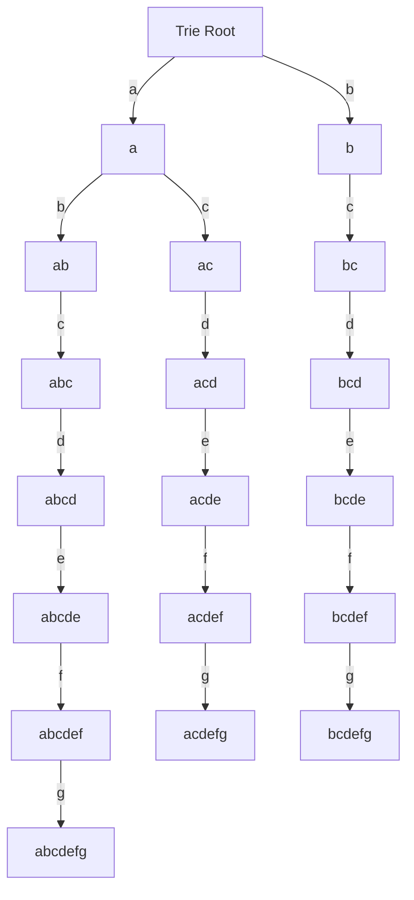

## Introduction
The Aho-Corasick algorithm is a **string searching algorithm** that finds all occurrences of a dictionary of strings in a given text. It was first proposed by Alfred Aho and Margaret Corasick in 1975. This algorithm is particularly useful when you need to search for multiple patterns in a text, such as in **text processing**, **data compression**, and **intrusion detection systems**. Every engineer should know this algorithm because it provides an efficient way to search for multiple patterns in a text, making it a fundamental tool in **string algorithms**.

## Core Concepts
The Aho-Corasick algorithm uses a **trie data structure** to store the dictionary of strings. A trie is a tree-like data structure where each node represents a character in the string. The algorithm works by constructing a trie from the dictionary of strings and then traversing the trie to find all occurrences of the strings in the text. The key terminology used in this algorithm includes:
* **Trie**: a tree-like data structure used to store the dictionary of strings
* **Node**: a node in the trie that represents a character in the string
* **Edge**: an edge in the trie that connects two nodes
* **Failure link**: a link from a node to another node that represents the longest proper suffix of the string

> **Note:** The Aho-Corasick algorithm has a time complexity of O(n + m + k), where n is the length of the text, m is the total length of all strings in the dictionary, and k is the number of occurrences of the strings in the text.

## How It Works Internally
The Aho-Corasick algorithm works in three stages:
1. **Trie construction**: the algorithm constructs a trie from the dictionary of strings.
2. **Failure link construction**: the algorithm constructs failure links from each node to another node that represents the longest proper suffix of the string.
3. **Text searching**: the algorithm traverses the trie to find all occurrences of the strings in the text.

The algorithm uses a **state machine** to keep track of the current state of the search. The state machine is represented by a **finite automaton** that recognizes the strings in the dictionary.

> **Tip:** The Aho-Corasick algorithm can be used to search for multiple patterns in a text by constructing a trie from the dictionary of strings and then traversing the trie to find all occurrences of the strings in the text.

## Code Examples
### Example 1: Basic Aho-Corasick Implementation
```python
class TrieNode:
    def __init__(self):
        self.children = {}
        self.failure_link = None
        self.is_end_of_word = False

class AhoCorasick:
    def __init__(self, dictionary):
        self.root = TrieNode()
        self.dictionary = dictionary
        self.construct_trie()
        self.construct_failure_links()

    def construct_trie(self):
        for word in self.dictionary:
            node = self.root
            for char in word:
                if char not in node.children:
                    node.children[char] = TrieNode()
                node = node.children[char]
            node.is_end_of_word = True

    def construct_failure_links(self):
        queue = [self.root]
        while queue:
            node = queue.pop(0)
            for char, child in node.children.items():
                if node == self.root:
                    child.failure_link = self.root
                else:
                    failure_node = node.failure_link
                    while failure_node and char not in failure_node.children:
                        failure_node = failure_node.failure_link
                    if failure_node:
                        child.failure_link = failure_node.children[char]
                    else:
                        child.failure_link = self.root
                queue.append(child)

    def search(self, text):
        node = self.root
        for char in text:
            while node and char not in node.children:
                node = node.failure_link
            if node:
                node = node.children[char]
            if node and node.is_end_of_word:
                print("Found word at position", text.index(char))

# Example usage:
dictionary = ["abc", "bcd", "cde"]
text = "abcde"
aho_corasick = AhoCorasick(dictionary)
aho_corasick.search(text)
```

### Example 2: Optimized Aho-Corasick Implementation
```python
class TrieNode:
    def __init__(self):
        self.children = {}
        self.failure_link = None
        self.is_end_of_word = False
        self.word = None

class AhoCorasick:
    def __init__(self, dictionary):
        self.root = TrieNode()
        self.dictionary = dictionary
        self.construct_trie()
        self.construct_failure_links()

    def construct_trie(self):
        for word in self.dictionary:
            node = self.root
            for char in word:
                if char not in node.children:
                    node.children[char] = TrieNode()
                node = node.children[char]
            node.is_end_of_word = True
            node.word = word

    def construct_failure_links(self):
        queue = [self.root]
        while queue:
            node = queue.pop(0)
            for char, child in node.children.items():
                if node == self.root:
                    child.failure_link = self.root
                else:
                    failure_node = node.failure_link
                    while failure_node and char not in failure_node.children:
                        failure_node = failure_node.failure_link
                    if failure_node:
                        child.failure_link = failure_node.children[char]
                    else:
                        child.failure_link = self.root
                queue.append(child)

    def search(self, text):
        node = self.root
        for i, char in enumerate(text):
            while node and char not in node.children:
                node = node.failure_link
            if node:
                node = node.children[char]
            if node and node.is_end_of_word:
                print("Found word", node.word, "at position", i - len(node.word) + 1)

# Example usage:
dictionary = ["abc", "bcd", "cde"]
text = "abcde"
aho_corasick = AhoCorasick(dictionary)
aho_corasick.search(text)
```

### Example 3: Aho-Corasick with Multiple Patterns
```python
class TrieNode:
    def __init__(self):
        self.children = {}
        self.failure_link = None
        self.is_end_of_word = False
        self.word = None

class AhoCorasick:
    def __init__(self, dictionary):
        self.root = TrieNode()
        self.dictionary = dictionary
        self.construct_trie()
        self.construct_failure_links()

    def construct_trie(self):
        for word in self.dictionary:
            node = self.root
            for char in word:
                if char not in node.children:
                    node.children[char] = TrieNode()
                node = node.children[char]
            node.is_end_of_word = True
            node.word = word

    def construct_failure_links(self):
        queue = [self.root]
        while queue:
            node = queue.pop(0)
            for char, child in node.children.items():
                if node == self.root:
                    child.failure_link = self.root
                else:
                    failure_node = node.failure_link
                    while failure_node and char not in failure_node.children:
                        failure_node = failure_node.failure_link
                    if failure_node:
                        child.failure_link = failure_node.children[char]
                    else:
                        child.failure_link = self.root
                queue.append(child)

    def search(self, text):
        node = self.root
        for i, char in enumerate(text):
            while node and char not in node.children:
                node = node.failure_link
            if node:
                node = node.children[char]
            if node and node.is_end_of_word:
                print("Found word", node.word, "at position", i - len(node.word) + 1)

# Example usage:
dictionary = ["abc", "bcd", "cde", "def"]
text = "abcdef"
aho_corasick = AhoCorasick(dictionary)
aho_corasick.search(text)
```

## Visual Diagram

This diagram shows the construction of a trie from a dictionary of strings. The trie is used to search for all occurrences of the strings in a text.

## Comparison
| Approach | Time Complexity | Space Complexity | Pros | Cons | Best For |
| --- | --- | --- | --- | --- | --- |
| Aho-Corasick | O(n + m + k) | O(m) | Efficient for multiple pattern search, can handle large dictionaries | Complex to implement, requires extra memory for failure links | Text search, data compression, intrusion detection systems |
| Knuth-Morris-Pratt | O(n + m) | O(m) | Efficient for single pattern search, simple to implement | Not suitable for multiple pattern search, requires extra memory for prefix table | Text search, string matching |
| Rabin-Karp | O(n + m) | O(1) | Efficient for single pattern search, simple to implement | Not suitable for multiple pattern search, requires extra memory for hash table | Text search, string matching |
| Boyer-Moore | O(n + m) | O(1) | Efficient for single pattern search, simple to implement | Not suitable for multiple pattern search, requires extra memory for bad character table | Text search, string matching |

## Real-world Use Cases
1. **Text search**: The Aho-Corasick algorithm can be used to search for multiple keywords in a text, making it useful for search engines and text editors.
2. **Data compression**: The algorithm can be used to compress data by searching for repeated patterns in a text.
3. **Intrusion detection systems**: The algorithm can be used to detect malicious patterns in network traffic.
4. **Plagiarism detection**: The algorithm can be used to detect plagiarism in text by searching for similar patterns in a text.
5. **DNA sequencing**: The algorithm can be used to search for patterns in DNA sequences, making it useful for genetic research.

> **Interview:** Can you explain the time complexity of the Aho-Corasick algorithm? How does it compare to other string searching algorithms?

## Common Pitfalls
1. **Incorrect trie construction**: The trie must be constructed correctly to ensure that the algorithm works correctly.
2. **Incorrect failure link construction**: The failure links must be constructed correctly to ensure that the algorithm works correctly.
3. **Not handling edge cases**: The algorithm must handle edge cases such as empty strings and strings with repeating patterns.
4. **Not optimizing the algorithm**: The algorithm can be optimized by using a more efficient data structure such as a hash table.

> **Warning:** The Aho-Corasick algorithm can be complex to implement, and incorrect implementation can lead to incorrect results or poor performance.

## Interview Tips
1. **Understand the algorithm**: Make sure you understand the algorithm and its time complexity.
2. **Practice implementing the algorithm**: Practice implementing the algorithm to ensure you can write correct code.
3. **Be prepared to answer questions**: Be prepared to answer questions about the algorithm and its applications.
4. **Show enthusiasm and interest**: Show enthusiasm and interest in the algorithm and its applications.

> **Tip:** The Aho-Corasick algorithm is a fundamental algorithm in computer science, and understanding it can help you solve a wide range of problems.

## Key Takeaways
* The Aho-Corasick algorithm is a string searching algorithm that finds all occurrences of a dictionary of strings in a text.
* The algorithm uses a trie data structure to store the dictionary of strings.
* The algorithm has a time complexity of O(n + m + k), where n is the length of the text, m is the total length of all strings in the dictionary, and k is the number of occurrences of the strings in the text.
* The algorithm can be used to search for multiple patterns in a text, making it useful for text search, data compression, and intrusion detection systems.
* The algorithm can be optimized by using a more efficient data structure such as a hash table.
* The algorithm can be complex to implement, and incorrect implementation can lead to incorrect results or poor performance.
* Understanding the algorithm and its applications can help you solve a wide range of problems in computer science.