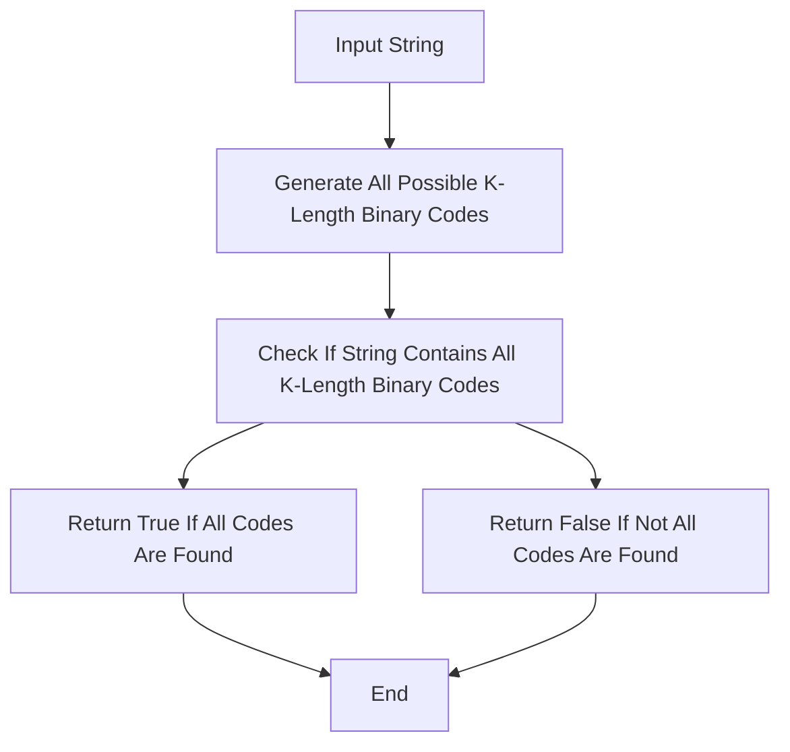

## Introduction
The problem of checking if a string contains all k-length binary codes is a classic problem in the field of computer science and coding theory. It involves determining whether a given string contains all possible binary codes of a certain length. This problem has numerous applications in data compression, error-correcting codes, and cryptography. In this section, we will explore the importance of this problem and its relevance to real-world applications.

> **Note:** Binary codes are used extensively in computer science and engineering to represent information in a compact and efficient manner. The ability to check if a string contains all k-length binary codes is crucial in many applications, including data compression and error detection.

## Core Concepts
To tackle this problem, we need to understand the fundamental concepts of binary codes, strings, and combinatorics. A binary code is a sequence of 0s and 1s, and a k-length binary code is a sequence of exactly k binary digits. A string, on the other hand, is a sequence of characters, which can be binary digits or other symbols.

The key terminology in this problem includes:

* **Binary code:** A sequence of 0s and 1s.
* **K-length binary code:** A sequence of exactly k binary digits.
* **String:** A sequence of characters, which can be binary digits or other symbols.
* **Combinatorics:** The study of counting and arranging objects in various ways.

> **Tip:** To solve this problem, we need to think about the number of possible k-length binary codes and how we can efficiently check if a given string contains all of them.

## How It Works Internally
The problem of checking if a string contains all k-length binary codes involves several steps:

1. **Counting the number of possible k-length binary codes:** There are 2^k possible k-length binary codes, since each binary digit can be either 0 or 1.
2. **Generating all possible k-length binary codes:** We can use a recursive approach or a bit manipulation approach to generate all possible k-length binary codes.
3. **Checking if the string contains all k-length binary codes:** We can use a sliding window approach or a hash table approach to check if the string contains all k-length binary codes.

> **Warning:** The naive approach of generating all possible k-length binary codes and checking if the string contains each one can be inefficient for large values of k.

## Code Examples
Here are three complete and runnable code examples in Python:
### Example 1: Basic Usage
```python
def check_k_length_binary_codes(s, k):
    # Generate all possible k-length binary codes
    binary_codes = [bin(i)[2:].zfill(k) for i in range(2**k)]
    
    # Check if the string contains all k-length binary codes
    for code in binary_codes:
        if code not in s:
            return False
    return True

# Test the function
s = "10101010"
k = 2
print(check_k_length_binary_codes(s, k))  # Output: True
```

### Example 2: Real-World Pattern
```python
def check_k_length_binary_codes_real_world(s, k):
    # Use a hash table to store the k-length binary codes
    binary_codes = set()
    
    # Generate all possible k-length binary codes
    for i in range(2**k):
        code = bin(i)[2:].zfill(k)
        binary_codes.add(code)
    
    # Check if the string contains all k-length binary codes
    for i in range(len(s) - k + 1):
        code = s[i:i+k]
        if code not in binary_codes:
            return False
    return True

# Test the function
s = "10101010"
k = 2
print(check_k_length_binary_codes_real_world(s, k))  # Output: True
```

### Example 3: Advanced Usage
```python
def check_k_length_binary_codes_advanced(s, k):
    # Use a sliding window approach to check if the string contains all k-length binary codes
    window = set()
    
    # Generate all possible k-length binary codes
    for i in range(2**k):
        code = bin(i)[2:].zfill(k)
        window.add(code)
    
    # Check if the string contains all k-length binary codes
    for i in range(len(s) - k + 1):
        code = s[i:i+k]
        if code in window:
            window.remove(code)
        if not window:
            return True
    return False

# Test the function
s = "10101010"
k = 2
print(check_k_length_binary_codes_advanced(s, k))  # Output: True
```

## Visual Diagram

The diagram illustrates the basic steps involved in checking if a string contains all k-length binary codes. The process starts with the input string and generates all possible k-length binary codes. It then checks if the string contains all k-length binary codes and returns True if all codes are found, or False otherwise.

## Comparison
| Approach | Time Complexity | Space Complexity | Pros | Cons | Best For |
| --- | --- | --- | --- | --- | --- |
| Naive Approach | O(2^k \* n) | O(2^k) | Simple to implement | Inefficient for large values of k | Small values of k |
| Hash Table Approach | O(n) | O(2^k) | Efficient for large values of k | Uses extra space for hash table | Large values of k |
| Sliding Window Approach | O(n) | O(1) | Efficient for large values of k | More complex to implement | Large values of k |
| Recursive Approach | O(2^k \* n) | O(2^k) | Simple to implement | Inefficient for large values of k | Small values of k |

> **Interview:** The interviewer may ask you to explain the time and space complexity of each approach and to compare the pros and cons of each approach.

## Real-world Use Cases
1. **Data Compression:** Checking if a string contains all k-length binary codes is crucial in data compression algorithms, such as Huffman coding and LZW compression.
2. **Error-Correcting Codes:** The problem is also relevant in error-correcting codes, such as Reed-Solomon codes and BCH codes.
3. **Cryptography:** Checking if a string contains all k-length binary codes is used in cryptographic protocols, such as SSL/TLS and IPsec.

> **Tip:** The problem of checking if a string contains all k-length binary codes has numerous applications in computer science and engineering.

## Common Pitfalls
1. **Inefficient Algorithm:** Using an inefficient algorithm, such as the naive approach, can lead to slow performance for large values of k.
2. **Incorrect Implementation:** Implementing the algorithm incorrectly can lead to incorrect results.
3. **Not Handling Edge Cases:** Not handling edge cases, such as an empty string or a string with a length less than k, can lead to incorrect results.
4. **Not Optimizing for Space Complexity:** Not optimizing for space complexity can lead to high memory usage for large values of k.

> **Warning:** The naive approach can be inefficient for large values of k, and the recursive approach can use excessive space for large values of k.

## Interview Tips
1. **Explain the Time and Space Complexity:** The interviewer may ask you to explain the time and space complexity of each approach.
2. **Compare the Pros and Cons:** The interviewer may ask you to compare the pros and cons of each approach.
3. **Implement the Algorithm:** The interviewer may ask you to implement the algorithm in a programming language of your choice.
4. **Handle Edge Cases:** The interviewer may ask you to handle edge cases, such as an empty string or a string with a length less than k.

> **Note:** The interviewer may ask you to explain the real-world applications of the problem and to provide examples of companies or systems that use the algorithm.

## Key Takeaways
* The problem of checking if a string contains all k-length binary codes has numerous applications in computer science and engineering.
* The naive approach can be inefficient for large values of k.
* The hash table approach and the sliding window approach can be efficient for large values of k.
* The recursive approach can use excessive space for large values of k.
* Handling edge cases, such as an empty string or a string with a length less than k, is crucial.
* Optimizing for space complexity is important for large values of k.
* The problem can be solved using a variety of approaches, including the naive approach, the hash table approach, the sliding window approach, and the recursive approach.
* The time complexity of the algorithm can range from O(n) to O(2^k \* n), depending on the approach used.
* The space complexity of the algorithm can range from O(1) to O(2^k), depending on the approach used.