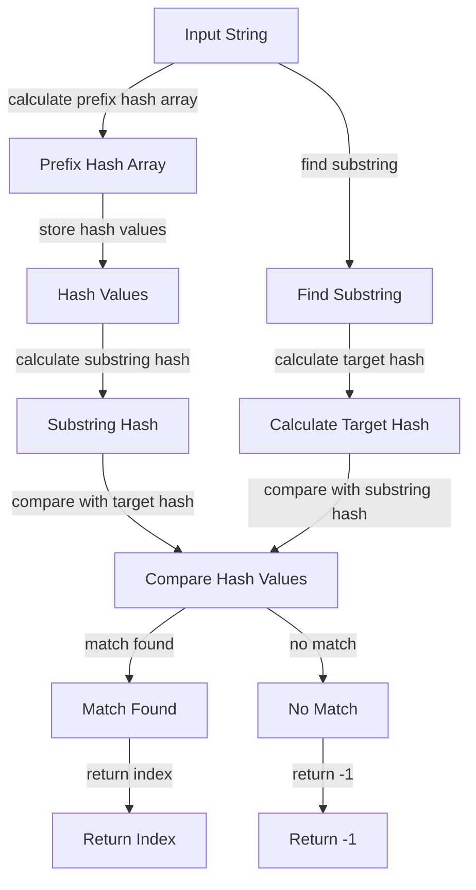

## Introduction
The **Prefix Hash Array** is a data structure that enables **O(1)** substring hashing, making it a crucial component in various string algorithms. It is particularly useful in problems that require frequent substring matching, such as text search, plagiarism detection, and data compression. In real-world applications, prefix hash arrays are used in web search engines like Google, where they help to quickly identify relevant search results. Every engineer should understand how to implement and utilize prefix hash arrays, as they can significantly improve the performance of string-based systems.

> **Note:** The prefix hash array is an essential data structure in computer science, and its applications extend beyond string algorithms to other areas like data mining and machine learning.

## Core Concepts
A prefix hash array is a data structure that stores the hash values of all prefixes of a given string. The **hash function** used to calculate these values is typically a **rolling hash function**, which allows for efficient computation of hash values for substrings. The key terminology associated with prefix hash arrays includes:
* **Prefix**: a substring that starts at the beginning of the original string.
* **Hash value**: a numerical representation of a string, calculated using a hash function.
* **Rolling hash function**: a hash function that can efficiently compute the hash value of a substring by utilizing the hash value of its parent string.

> **Tip:** When implementing a prefix hash array, it is essential to choose a suitable hash function that minimizes collisions and ensures efficient computation of hash values.

## How It Works Internally
The prefix hash array works by storing the hash values of all prefixes of a given string in an array. The process of creating a prefix hash array involves the following steps:
1. Initialize an array to store the hash values of prefixes.
2. Calculate the hash value of the empty string (usually 0).
3. Iterate through the input string, calculating the hash value of each prefix using a rolling hash function.
4. Store the calculated hash values in the prefix hash array.

The time complexity of creating a prefix hash array is **O(n)**, where **n** is the length of the input string. The space complexity is also **O(n)**, as we need to store the hash values of all prefixes.

> **Warning:** When using a prefix hash array, it is crucial to handle collisions (i.e., when two different prefixes have the same hash value) to ensure accurate results.

## Code Examples
### Example 1: Basic Prefix Hash Array Implementation
```python
def calculate_prefix_hash_array(input_string):
    """
    Calculate the prefix hash array for a given input string.
    
    Args:
    input_string (str): The input string for which to calculate the prefix hash array.
    
    Returns:
    list: The prefix hash array containing the hash values of all prefixes.
    """
    prefix_hash_array = [0] * (len(input_string) + 1)
    for i in range(1, len(input_string) + 1):
        # Calculate the hash value of the current prefix using a simple hash function
        prefix_hash_array[i] = prefix_hash_array[i - 1] * 31 + ord(input_string[i - 1])
    return prefix_hash_array

input_string = "example"
prefix_hash_array = calculate_prefix_hash_array(input_string)
print(prefix_hash_array)
```

### Example 2: Using a Prefix Hash Array for Substring Matching
```python
def find_substring(input_string, target_string):
    """
    Find all occurrences of a target string in a given input string using a prefix hash array.
    
    Args:
    input_string (str): The input string in which to search for the target string.
    target_string (str): The target string to search for.
    
    Returns:
    list: A list of indices where the target string is found in the input string.
    """
    prefix_hash_array = calculate_prefix_hash_array(input_string)
    target_hash = calculate_prefix_hash_array(target_string)[-1]
    occurrences = []
    for i in range(len(input_string) - len(target_string) + 1):
        # Calculate the hash value of the current substring using the prefix hash array
        substring_hash = prefix_hash_array[i + len(target_string)] - prefix_hash_array[i] * (31 ** len(target_string))
        if substring_hash == target_hash:
            occurrences.append(i)
    return occurrences

input_string = "exampleexample"
target_string = "example"
occurrences = find_substring(input_string, target_string)
print(occurrences)
```

### Example 3: Advanced Prefix Hash Array Implementation with Collision Handling
```java
public class PrefixHashArray {
    private int[] prefixHashArray;
    private int prime;

    public PrefixHashArray(String inputString, int prime) {
        this.prefixHashArray = new int[inputString.length() + 1];
        this.prime = prime;
        calculatePrefixHashArray(inputString);
    }

    private void calculatePrefixHashArray(String inputString) {
        for (int i = 1; i <= inputString.length(); i++) {
            // Calculate the hash value of the current prefix using a rolling hash function
            prefixHashArray[i] = (int) ((prefixHashArray[i - 1] * 31 + inputString.charAt(i - 1)) % prime);
        }
    }

    public int findSubstring(String targetString) {
        int targetHash = calculateTargetHash(targetString);
        for (int i = 0; i <= prefixHashArray.length - targetString.length(); i++) {
            // Calculate the hash value of the current substring using the prefix hash array
            int substringHash = calculateSubstringHash(i, targetString.length());
            if (substringHash == targetHash) {
                return i;
            }
        }
        return -1;
    }

    private int calculateTargetHash(String targetString) {
        int targetHash = 0;
        for (int i = 0; i < targetString.length(); i++) {
            targetHash = (int) ((targetHash * 31 + targetString.charAt(i)) % prime);
        }
        return targetHash;
    }

    private int calculateSubstringHash(int startIndex, int length) {
        int substringHash = prefixHashArray[startIndex + length] - (int) ((prefixHashArray[startIndex] * pow(31, length)) % prime);
        if (substringHash < 0) {
            substringHash += prime;
        }
        return substringHash;
    }

    private int pow(int base, int exponent) {
        int result = 1;
        for (int i = 0; i < exponent; i++) {
            result = (int) ((result * base) % prime);
        }
        return result;
    }

    public static void main(String[] args) {
        String inputString = "exampleexample";
        String targetString = "example";
        PrefixHashArray prefixHashArray = new PrefixHashArray(inputString, 101);
        int occurrence = prefixHashArray.findSubstring(targetString);
        System.out.println(occurrence);
    }
}
```

## Visual Diagram

The diagram illustrates the process of creating a prefix hash array and using it to find a substring in the input string. It shows the key steps involved in calculating the prefix hash array, storing the hash values, calculating the substring hash, comparing it with the target hash, and returning the index of the match.

> **Interview:** When asked about prefix hash arrays in an interview, be prepared to explain the concept, its applications, and how it works internally. The interviewer may also ask you to write code to implement a prefix hash array or use it to solve a specific problem.

## Comparison
| Approach | Time Complexity | Space Complexity | Pros | Cons | Best For |
| --- | --- | --- | --- | --- | --- |
| Prefix Hash Array | O(n) | O(n) | Efficient substring matching, easy to implement | Requires extra space to store hash values | String algorithms, text search |
| Suffix Tree | O(n) | O(n) | Efficient substring matching, allows for multiple substring searches | Complex to implement, requires extra space | String algorithms, text search |
| Rabin-Karp Algorithm | O(n+m) | O(1) | Efficient substring matching, simple to implement | May have false positives due to hash collisions | String algorithms, text search |
| Knuth-Morris-Pratt Algorithm | O(n+m) | O(1) | Efficient substring matching, simple to implement | Requires extra space to store prefix table | String algorithms, text search |

## Real-world Use Cases
1. **Google Search**: Google uses prefix hash arrays to quickly identify relevant search results. By storing the hash values of all prefixes of a document, Google can efficiently match search queries with the document content.
2. **Plagiarism Detection**: Plagiarism detection tools like Turnitin use prefix hash arrays to identify duplicated content. By comparing the hash values of substrings in a document with a database of known content, Turnitin can detect plagiarism.
3. **Data Compression**: Data compression algorithms like LZ77 use prefix hash arrays to find repeated patterns in data. By storing the hash values of all prefixes of a data stream, LZ77 can efficiently identify repeated substrings and compress the data.

> **Tip:** When implementing a prefix hash array in a real-world application, consider using a suitable hash function that minimizes collisions and ensures efficient computation of hash values.

## Common Pitfalls
1. **Insufficient collision handling**: Failing to handle collisions can lead to incorrect results. Use a suitable hash function and implement collision handling mechanisms to ensure accurate results.
2. **Inefficient hash function**: Using an inefficient hash function can lead to slow performance. Choose a hash function that is optimized for the specific use case and input data.
3. **Incorrect prefix hash array calculation**: Incorrectly calculating the prefix hash array can lead to incorrect results. Verify the calculation of the prefix hash array and ensure that it is correct.
4. **Inadequate space allocation**: Failing to allocate sufficient space for the prefix hash array can lead to errors. Ensure that sufficient space is allocated to store the hash values of all prefixes.

> **Warning:** When using a prefix hash array, it is crucial to handle collisions and ensure accurate results. Failing to do so can lead to incorrect results and decreased performance.

## Interview Tips
1. **Understand the concept**: Make sure you understand the concept of prefix hash arrays, their applications, and how they work internally.
2. **Be prepared to write code**: Be prepared to write code to implement a prefix hash array or use it to solve a specific problem.
3. **Practice problem-solving**: Practice solving problems that involve prefix hash arrays to improve your problem-solving skills.
4. **Review common pitfalls**: Review common pitfalls and be prepared to discuss how to avoid them.

> **Note:** When answering interview questions about prefix hash arrays, be sure to provide clear and concise explanations, and demonstrate your problem-solving skills by writing code or providing examples.

## Key Takeaways
* **Prefix hash arrays enable O(1) substring hashing**: Prefix hash arrays allow for efficient substring matching by storing the hash values of all prefixes of a string.
* **Choose a suitable hash function**: Choose a hash function that minimizes collisions and ensures efficient computation of hash values.
* **Handle collisions**: Handle collisions to ensure accurate results.
* **Prefix hash arrays have various applications**: Prefix hash arrays have applications in string algorithms, text search, plagiarism detection, and data compression.
* **Practice problem-solving**: Practice solving problems that involve prefix hash arrays to improve your problem-solving skills.
* **Review common pitfalls**: Review common pitfalls and be prepared to discuss how to avoid them.
* **Time complexity is O(n)**: The time complexity of creating a prefix hash array is O(n), where n is the length of the input string.
* **Space complexity is O(n)**: The space complexity of a prefix hash array is O(n), where n is the length of the input string.
* **Prefix hash arrays are useful in real-world applications**: Prefix hash arrays are used in real-world applications like Google Search, plagiarism detection, and data compression.