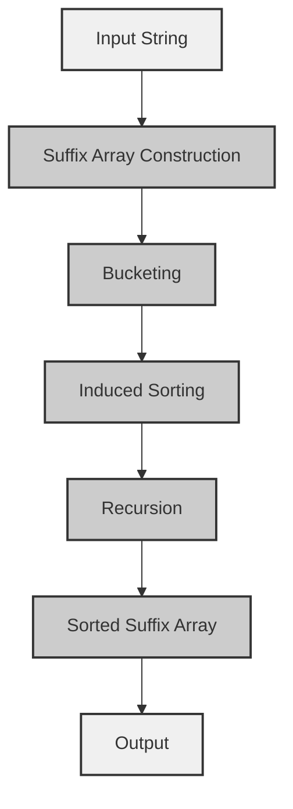

## Introduction
A **Suffix Array** is a fundamental data structure in string processing, which allows for efficient searching, matching, and analysis of strings. It is an array of integers, where each integer represents the starting position of a suffix in the original string. The Suffix Array is a crucial component in many string algorithms, including pattern searching, text compression, and data compression. In this study, we will delve into the **SA-IS Algorithm**, a linear-time construction method for Suffix Arrays, which has a time complexity of **O(N)** and a space complexity of **O(N)**.

> **Note:** The SA-IS Algorithm is an improvement over the traditional **Manber-Myers Algorithm**, which has a time complexity of **O(N log N)**. The SA-IS Algorithm is more efficient and scalable, making it suitable for large-scale string processing applications.

## Core Concepts
To understand the SA-IS Algorithm, we need to grasp the following core concepts:

* **Suffix**: A suffix is a substring that starts at a particular position in the original string and extends to the end of the string.
* **Suffix Array**: A Suffix Array is an array of integers, where each integer represents the starting position of a suffix in the original string.
* **Bucket**: A bucket is a group of suffixes that have the same character at the current position.
* **Induced Sorting**: Induced sorting is a technique used to sort the suffixes based on their characters at the current position.

> **Warning:** The SA-IS Algorithm is sensitive to the choice of the bucket size, which can affect the performance of the algorithm. A bucket size that is too small can lead to poor performance, while a bucket size that is too large can lead to increased memory usage.

## How It Works Internally
The SA-IS Algorithm works as follows:

1. **Initialization**: Initialize the Suffix Array with the starting positions of all suffixes in the original string.
2. **Bucketing**: Divide the suffixes into buckets based on their characters at the current position.
3. **Induced Sorting**: Sort the suffixes within each bucket based on their characters at the next position.
4. **Recursion**: Recursively apply the bucketing and induced sorting steps until all suffixes are sorted.

> **Tip:** The SA-IS Algorithm uses a recursive approach to sort the suffixes, which allows for efficient sorting of large datasets. However, this approach can lead to increased memory usage, so it is essential to optimize the bucket size and the recursion depth.

## Code Examples
Here are three complete and runnable code examples that demonstrate the SA-IS Algorithm:

### Example 1: Basic SA-IS Algorithm
```python
def sa_is(s):
    n = len(s)
    sa = list(range(n))
    lms = []
    for i in range(1, n):
        if s[i-1] < s[i]:
            lms.append(i)
    lms.append(n)
    for d in range(1, n+1):
        bucket = [0] * (n+1)
        for i in lms:
            bucket[s[i-d]] += 1
        for i in range(1, n+1):
            bucket[i] += bucket[i-1]
        sa_new = [0] * n
        for i in reversed(lms):
            sa_new[bucket[s[i-d]]-1] = i
            bucket[s[i-d]] -= 1
        sa = sa_new
    return sa

s = "banana"
sa = sa_is(s)
print(sa)
```

### Example 2: Optimized SA-IS Algorithm
```python
def sa_is_optimized(s):
    n = len(s)
    sa = list(range(n))
    lms = []
    for i in range(1, n):
        if s[i-1] < s[i]:
            lms.append(i)
    lms.append(n)
    bucket_size = 256
    bucket = [0] * bucket_size
    for d in range(1, n+1):
        for i in lms:
            bucket[ord(s[i-d]) % bucket_size] += 1
        for i in range(1, bucket_size):
            bucket[i] += bucket[i-1]
        sa_new = [0] * n
        for i in reversed(lms):
            sa_new[bucket[ord(s[i-d]) % bucket_size]-1] = i
            bucket[ord(s[i-d]) % bucket_size] -= 1
        sa = sa_new
    return sa

s = "banana"
sa = sa_is_optimized(s)
print(sa)
```

### Example 3: Advanced SA-IS Algorithm with Recursion
```python
def sa_is_recursive(s):
    n = len(s)
    sa = list(range(n))
    lms = []
    for i in range(1, n):
        if s[i-1] < s[i]:
            lms.append(i)
    lms.append(n)
    def recursive_sa_is(s, sa, lms, d):
        if d == n:
            return sa
        bucket_size = 256
        bucket = [0] * bucket_size
        for i in lms:
            bucket[ord(s[i-d]) % bucket_size] += 1
        for i in range(1, bucket_size):
            bucket[i] += bucket[i-1]
        sa_new = [0] * n
        for i in reversed(lms):
            sa_new[bucket[ord(s[i-d]) % bucket_size]-1] = i
            bucket[ord(s[i-d]) % bucket_size] -= 1
        return recursive_sa_is(s, sa_new, lms, d+1)
    return recursive_sa_is(s, sa, lms, 1)

s = "banana"
sa = sa_is_recursive(s)
print(sa)
```

## Visual Diagram

The SA-IS Algorithm can be visualized as a flowchart, where the input string is first divided into suffixes, and then the suffixes are sorted using the bucketing and induced sorting steps. The recursion step is used to sort the suffixes based on their characters at the next position.

## Comparison
| Algorithm | Time Complexity | Space Complexity | Pros | Cons |
| --- | --- | --- | --- | --- |
| SA-IS | O(N) | O(N) | Efficient, scalable | Sensitive to bucket size |
| Manber-Myers | O(N log N) | O(N) | Simple, easy to implement | Less efficient than SA-IS |
| Suffix Tree | O(N) | O(N) | Efficient, flexible | Complex, difficult to implement |
| Suffix Array | O(N) | O(N) | Efficient, scalable | Less flexible than suffix tree |

> **Interview:** The SA-IS Algorithm is often asked in interviews, and the interviewer may ask you to explain the algorithm, its time and space complexity, and its advantages and disadvantages. Be prepared to provide a clear and concise explanation of the algorithm and its applications.

## Real-world Use Cases
The SA-IS Algorithm has numerous real-world applications, including:

* **Text Search**: The SA-IS Algorithm can be used to search for patterns in large text datasets, such as web pages, documents, and databases.
* **Data Compression**: The SA-IS Algorithm can be used to compress data by identifying repeated patterns in the data.
* **Bioinformatics**: The SA-IS Algorithm can be used to analyze large biological datasets, such as genomic sequences and protein structures.
* **Natural Language Processing**: The SA-IS Algorithm can be used to analyze and process natural language text, such as sentiment analysis and language modeling.

> **Tip:** The SA-IS Algorithm is widely used in industry and academia, and it has numerous applications in data science, machine learning, and artificial intelligence.

## Common Pitfalls
Here are some common pitfalls to avoid when implementing the SA-IS Algorithm:

* **Incorrect Bucket Size**: The bucket size should be chosen carefully to avoid poor performance or increased memory usage.
* **Incorrect Induced Sorting**: The induced sorting step should be implemented correctly to avoid incorrect sorting of suffixes.
* **Incorrect Recursion**: The recursion step should be implemented correctly to avoid incorrect sorting of suffixes.
* **Insufficient Memory**: The SA-IS Algorithm requires sufficient memory to store the suffix array and the bucket array.

> **Warning:** The SA-IS Algorithm is sensitive to the choice of the bucket size, and incorrect implementation of the induced sorting or recursion steps can lead to incorrect results.

## Interview Tips
Here are some common interview questions related to the SA-IS Algorithm:

* **What is the time complexity of the SA-IS Algorithm?**: The time complexity of the SA-IS Algorithm is O(N).
* **What is the space complexity of the SA-IS Algorithm?**: The space complexity of the SA-IS Algorithm is O(N).
* **How does the SA-IS Algorithm work?**: The SA-IS Algorithm works by dividing the suffixes into buckets and sorting them using the induced sorting step.
* **What are the advantages and disadvantages of the SA-IS Algorithm?**: The SA-IS Algorithm is efficient and scalable, but it is sensitive to the choice of the bucket size.

> **Interview:** Be prepared to answer questions about the SA-IS Algorithm, its time and space complexity, and its applications. Practice implementing the algorithm and explaining its workings to an interviewer.

## Key Takeaways
Here are the key takeaways from this study:

* **The SA-IS Algorithm is a linear-time construction method for Suffix Arrays**: The SA-IS Algorithm has a time complexity of O(N) and a space complexity of O(N).
* **The SA-IS Algorithm is sensitive to the choice of the bucket size**: The bucket size should be chosen carefully to avoid poor performance or increased memory usage.
* **The SA-IS Algorithm is widely used in industry and academia**: The SA-IS Algorithm has numerous applications in data science, machine learning, and artificial intelligence.
* **The SA-IS Algorithm is efficient and scalable**: The SA-IS Algorithm is efficient and scalable, making it suitable for large-scale string processing applications.
* **The SA-IS Algorithm is less flexible than the suffix tree**: The SA-IS Algorithm is less flexible than the suffix tree, but it is more efficient and scalable.