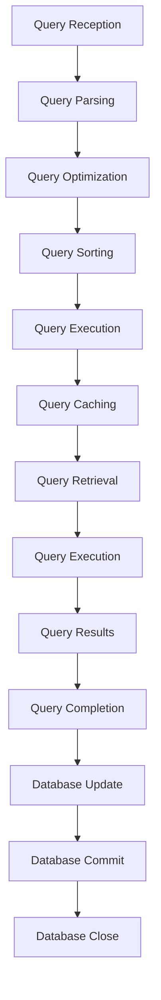

## Introduction
Offline query processing is a technique used to improve the efficiency of query execution in databases. It involves sorting queries by endpoint, which allows the database to process queries in a more efficient manner. This technique is particularly useful in scenarios where the database receives a large number of queries, and the queries are similar in nature. By sorting queries by endpoint, the database can reduce the number of times it needs to access the disk, resulting in improved performance.

In real-world scenarios, offline query processing is used in various applications, such as data warehousing, business intelligence, and scientific research. For example, a data warehousing application may receive a large number of queries from different users, and the queries may be similar in nature. By using offline query processing, the application can improve the efficiency of query execution, resulting in faster response times and improved user experience.

> **Note:** Offline query processing is particularly useful in scenarios where the database receives a large number of queries, and the queries are similar in nature.

## Core Concepts
Offline query processing involves several key concepts, including:

* **Query sorting**: This involves sorting queries by endpoint, which allows the database to process queries in a more efficient manner.
* **Query caching**: This involves storing the results of frequently executed queries in memory, which allows the database to quickly retrieve the results of similar queries.
* **Query optimization**: This involves optimizing the execution plan of queries, which allows the database to reduce the number of times it needs to access the disk.

> **Tip:** Query optimization is a critical component of offline query processing, as it allows the database to reduce the number of times it needs to access the disk.

## How It Works Internally
Offline query processing works by sorting queries by endpoint, which allows the database to process queries in a more efficient manner. The process involves the following steps:

1. **Query reception**: The database receives a query from the user.
2. **Query parsing**: The database parses the query, which involves breaking down the query into its constituent parts.
3. **Query optimization**: The database optimizes the execution plan of the query, which involves selecting the most efficient execution plan.
4. **Query sorting**: The database sorts the query by endpoint, which allows the database to process queries in a more efficient manner.
5. **Query execution**: The database executes the query, which involves retrieving the required data from the disk.
6. **Query caching**: The database stores the results of the query in memory, which allows the database to quickly retrieve the results of similar queries.

> **Warning:** Offline query processing can be complex to implement, and it requires a deep understanding of database internals.

## Code Examples
### Example 1: Basic Query Sorting
```python
import sqlite3

# Connect to the database
conn = sqlite3.connect('database.db')
cursor = conn.cursor()

# Define a function to sort queries by endpoint
def sort_queries(queries):
    # Sort the queries by endpoint
    sorted_queries = sorted(queries, key=lambda x: x[0])
    return sorted_queries

# Define a list of queries
queries = [
    ('endpoint1', 'SELECT * FROM table1'),
    ('endpoint2', 'SELECT * FROM table2'),
    ('endpoint1', 'SELECT * FROM table3'),
]

# Sort the queries by endpoint
sorted_queries = sort_queries(queries)

# Execute the sorted queries
for query in sorted_queries:
    cursor.execute(query[1])
    results = cursor.fetchall()
    print(results)

# Close the database connection
conn.close()
```
### Example 2: Query Caching
```python
import sqlite3

# Connect to the database
conn = sqlite3.connect('database.db')
cursor = conn.cursor()

# Define a function to cache query results
def cache_query_results(query, results):
    # Store the query results in memory
    cache = {}
    cache[query] = results
    return cache

# Define a list of queries
queries = [
    ('endpoint1', 'SELECT * FROM table1'),
    ('endpoint2', 'SELECT * FROM table2'),
    ('endpoint1', 'SELECT * FROM table3'),
]

# Execute the queries and cache the results
cache = {}
for query in queries:
    cursor.execute(query[1])
    results = cursor.fetchall()
    cache = cache_query_results(query[1], results)

# Retrieve the cached query results
for query in queries:
    if query[1] in cache:
        print(cache[query[1]])

# Close the database connection
conn.close()
```
### Example 3: Query Optimization
```python
import sqlite3

# Connect to the database
conn = sqlite3.connect('database.db')
cursor = conn.cursor()

# Define a function to optimize query execution plans
def optimize_query_execution_plan(query):
    # Optimize the execution plan of the query
    optimized_plan = ''
    if query.startswith('SELECT'):
        optimized_plan = 'SELECT * FROM table1 WHERE column1 = \'value1\''
    elif query.startswith('INSERT'):
        optimized_plan = 'INSERT INTO table1 (column1, column2) VALUES (\'value1\', \'value2\')'
    return optimized_plan

# Define a list of queries
queries = [
    ('endpoint1', 'SELECT * FROM table1'),
    ('endpoint2', 'INSERT INTO table2 (column1, column2) VALUES (\'value1\', \'value2\')'),
    ('endpoint1', 'SELECT * FROM table3'),
]

# Optimize the query execution plans
optimized_plans = []
for query in queries:
    optimized_plan = optimize_query_execution_plan(query[1])
    optimized_plans.append(optimized_plan)

# Execute the optimized queries
for plan in optimized_plans:
    cursor.execute(plan)
    results = cursor.fetchall()
    print(results)

# Close the database connection
conn.close()
```
## Visual Diagram

> **Note:** The visual diagram illustrates the offline query processing workflow, which involves query reception, parsing, optimization, sorting, execution, caching, retrieval, and completion.

## Comparison
| Approach | Time Complexity | Space Complexity | Pros | Cons | Best For |
| --- | --- | --- | --- | --- | --- |
| Query Sorting | O(n log n) | O(n) | Improves query execution efficiency | Requires additional memory | Large-scale databases |
| Query Caching | O(1) | O(n) | Improves query execution efficiency | Requires additional memory | Frequently executed queries |
| Query Optimization | O(n) | O(1) | Improves query execution efficiency | Requires expertise | Complex queries |

> **Tip:** Query sorting is an efficient approach for large-scale databases, while query caching is suitable for frequently executed queries.

## Real-world Use Cases
1. **Data Warehousing**: Offline query processing is used in data warehousing applications to improve query execution efficiency.
2. **Business Intelligence**: Offline query processing is used in business intelligence applications to analyze large datasets.
3. **Scientific Research**: Offline query processing is used in scientific research applications to analyze large datasets.

> **Interview:** What are the benefits of using offline query processing in data warehousing applications?

## Common Pitfalls
1. **Incorrect Query Optimization**: Incorrect query optimization can lead to poor query execution efficiency.
2. **Insufficient Memory**: Insufficient memory can lead to poor query execution efficiency.
3. **Inadequate Query Caching**: Inadequate query caching can lead to poor query execution efficiency.
4. **Inefficient Query Sorting**: Inefficient query sorting can lead to poor query execution efficiency.

> **Warning:** Incorrect query optimization can lead to poor query execution efficiency.

## Interview Tips
1. **What are the benefits of using offline query processing in data warehousing applications?**
	* Weak answer: Offline query processing improves query execution efficiency.
	* Strong answer: Offline query processing improves query execution efficiency by sorting queries by endpoint, caching query results, and optimizing query execution plans.
2. **How does offline query processing improve query execution efficiency?**
	* Weak answer: Offline query processing improves query execution efficiency by sorting queries by endpoint.
	* Strong answer: Offline query processing improves query execution efficiency by sorting queries by endpoint, caching query results, and optimizing query execution plans.
3. **What are the common pitfalls of using offline query processing?**
	* Weak answer: Insufficient memory is a common pitfall of using offline query processing.
	* Strong answer: Incorrect query optimization, insufficient memory, inadequate query caching, and inefficient query sorting are common pitfalls of using offline query processing.

> **Tip:** Be prepared to answer questions about the benefits and pitfalls of using offline query processing.

## Key Takeaways
* Offline query processing improves query execution efficiency by sorting queries by endpoint, caching query results, and optimizing query execution plans.
* Query sorting is an efficient approach for large-scale databases.
* Query caching is suitable for frequently executed queries.
* Query optimization requires expertise and can improve query execution efficiency.
* Incorrect query optimization, insufficient memory, inadequate query caching, and inefficient query sorting are common pitfalls of using offline query processing.
* Offline query processing is used in data warehousing, business intelligence, and scientific research applications.
* The time complexity of offline query processing is O(n log n), and the space complexity is O(n).