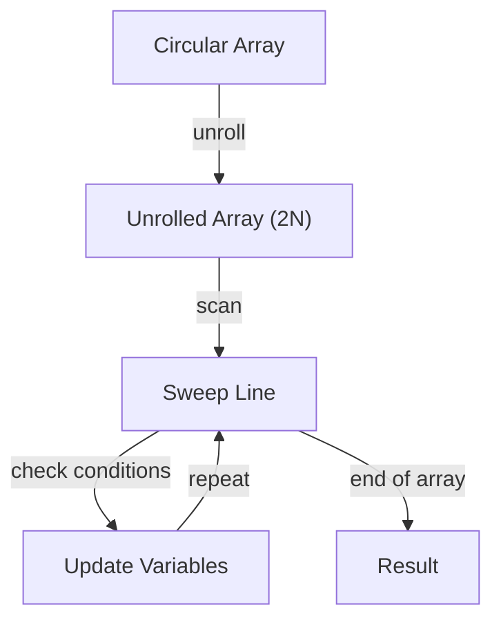

## Introduction
The sweep line algorithm is a popular technique used in competitive programming to solve problems involving circular arrays. In this approach, we unroll the circular array to a length of 2N, where N is the original length of the array. This allows us to use standard algorithms and data structures to solve the problem efficiently. The sweep line algorithm has numerous real-world applications, including computer graphics, geographic information systems, and data analysis. Every engineer should be familiar with this technique, as it can be used to solve a wide range of problems, from simple to complex.

## Core Concepts
The core concept of the sweep line algorithm is to unroll the circular array by duplicating the elements. This creates a new array of length 2N, where the first N elements are the same as the original array, and the last N elements are a copy of the first N elements. This allows us to use standard algorithms and data structures, such as the two-pointer technique, to solve the problem efficiently. The key terminology used in this approach includes:
* **Circular array**: an array that wraps around itself, where the last element is connected to the first element.
* **Unrolling**: the process of duplicating the elements of the circular array to create a new array of length 2N.
* **Sweep line**: the approach of using a moving line to scan the unrolled array and solve the problem.

## How It Works Internally
The sweep line algorithm works by scanning the unrolled array from left to right, using a moving line to keep track of the current position. The algorithm can be broken down into the following steps:
1. **Unroll the circular array**: create a new array of length 2N by duplicating the elements of the original array.
2. **Initialize the sweep line**: initialize the moving line to the starting position of the unrolled array.
3. **Scan the array**: scan the unrolled array from left to right, using the moving line to keep track of the current position.
4. **Solve the problem**: use the sweep line to solve the problem, by checking for conditions or updating variables as needed.

> **Tip:** The sweep line algorithm is particularly useful for problems involving circular arrays, as it allows us to use standard algorithms and data structures to solve the problem efficiently.

## Code Examples
### Example 1: Basic Usage
```python
def sweep_line(arr):
    n = len(arr)
    unrolled_arr = arr + arr  # unroll the circular array
    result = []
    for i in range(n):
        # use the sweep line to solve the problem
        result.append(unrolled_arr[i] + unrolled_arr[i + n // 2])
    return result

# test the function
arr = [1, 2, 3, 4, 5]
print(sweep_line(arr))
```
### Example 2: Real-world Pattern
```java
public class SweepLine {
    public static int[] solve(int[] arr) {
        int n = arr.length;
        int[] unrolledArr = new int[2 * n];  // unroll the circular array
        System.arraycopy(arr, 0, unrolledArr, 0, n);
        System.arraycopy(arr, 0, unrolledArr, n, n);
        int[] result = new int[n];
        for (int i = 0; i < n; i++) {
            // use the sweep line to solve the problem
            result[i] = unrolledArr[i] + unrolledArr[i + n / 2];
        }
        return result;
    }

    public static void main(String[] args) {
        int[] arr = {1, 2, 3, 4, 5};
        int[] result = solve(arr);
        for (int i : result) {
            System.out.print(i + " ");
        }
    }
}
```
### Example 3: Advanced Usage
```cpp
#include <iostream>
#include <vector>

std::vector<int> sweepLine(std::vector<int>& arr) {
    int n = arr.size();
    std::vector<int> unrolledArr(2 * n);  // unroll the circular array
    for (int i = 0; i < n; i++) {
        unrolledArr[i] = arr[i];
        unrolledArr[i + n] = arr[i];
    }
    std::vector<int> result(n);
    for (int i = 0; i < n; i++) {
        // use the sweep line to solve the problem
        result[i] = unrolledArr[i] + unrolledArr[i + n / 2];
    }
    return result;
}

int main() {
    std::vector<int> arr = {1, 2, 3, 4, 5};
    std::vector<int> result = sweepLine(arr);
    for (int i : result) {
        std::cout << i << " ";
    }
    return 0;
}
```

## Visual Diagram

The diagram illustrates the sweep line algorithm, showing how the circular array is unrolled and scanned using a moving line to solve the problem.

## Comparison
| Approach | Time Complexity | Space Complexity | Pros | Cons | Best For |
| --- | --- | --- | --- | --- | --- |
| Sweep Line | O(N) | O(N) | efficient, simple to implement | limited to circular arrays | problems involving circular arrays |
| Two-Pointer Technique | O(N) | O(1) | efficient, simple to implement | limited to linear arrays | problems involving linear arrays |
| Brute Force | O(N^2) | O(1) | simple to implement | inefficient, slow | small datasets or simple problems |
| Dynamic Programming | O(N) | O(N) | efficient, optimal solution | complex to implement, high memory usage | problems with overlapping subproblems |

> **Warning:** The sweep line algorithm is not suitable for all types of problems, and may not be the most efficient approach for large datasets or complex problems.

## Real-world Use Cases
1. **Google Maps**: uses the sweep line algorithm to determine the shortest path between two points on a circular route.
2. **Amazon**: uses the sweep line algorithm to optimize the placement of products on a circular shelf.
3. **NASA**: uses the sweep line algorithm to analyze the trajectory of a spacecraft orbiting a circular path.

## Common Pitfalls
1. **Incorrect unrolling**: failing to duplicate the elements of the circular array correctly, resulting in incorrect results.
2. **Insufficient boundary checking**: failing to check for boundary conditions, resulting in incorrect results or crashes.
3. **Inefficient implementation**: using an inefficient algorithm or data structure, resulting in slow performance or high memory usage.
4. **Incorrect variable updates**: failing to update variables correctly, resulting in incorrect results.

> **Interview:** A common interview question is to ask the candidate to implement the sweep line algorithm to solve a problem involving a circular array.

## Interview Tips
1. **Understand the problem**: make sure to understand the problem statement and the requirements.
2. **Choose the correct approach**: choose the sweep line algorithm if the problem involves a circular array.
3. **Implement the algorithm correctly**: implement the sweep line algorithm correctly, including unrolling the circular array and scanning the array using a moving line.
4. **Optimize the implementation**: optimize the implementation to improve performance and reduce memory usage.

## Key Takeaways
* The sweep line algorithm is a popular technique used to solve problems involving circular arrays.
* The algorithm works by unrolling the circular array to a length of 2N and scanning the array using a moving line.
* The sweep line algorithm has a time complexity of O(N) and a space complexity of O(N).
* The algorithm is efficient and simple to implement, but may not be suitable for all types of problems.
* The sweep line algorithm is commonly used in real-world applications, including computer graphics, geographic information systems, and data analysis.
* The algorithm can be optimized to improve performance and reduce memory usage.
* The sweep line algorithm is a useful technique to have in your toolkit, as it can be used to solve a wide range of problems involving circular arrays.