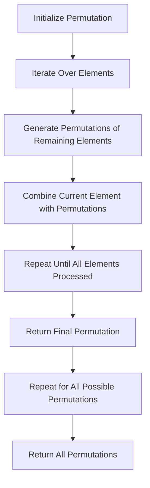

## Introduction
The O(N!) constraints mapping, typically N <= 10-11, is a fundamental concept in combinatorial mathematics and computer science. It refers to the process of generating all possible permutations of a set of N elements, where the order of the elements matters. This concept has numerous real-world applications, including cryptography, coding theory, and optimization problems. Every engineer needs to understand this concept to tackle complex problems in various domains, such as **competitive programming**, **algorithm design**, and **data analysis**.

> **Note:** The O(N!) notation represents the time complexity of generating all permutations of a set of N elements, which grows factorially with the size of the input.

## Core Concepts
To grasp the O(N!) constraints mapping, it's essential to understand the following core concepts:
* **Permutations**: A permutation is an arrangement of objects in a specific order. For example, the set {1, 2, 3} has 6 permutations: {1, 2, 3}, {1, 3, 2}, {2, 1, 3}, {2, 3, 1}, {3, 1, 2}, and {3, 2, 1}.
* **Factorial**: The factorial of a non-negative integer N, denoted by N!, is the product of all positive integers less than or equal to N. For example, 5! = 5 * 4 * 3 * 2 * 1 = 120.
* **Constraints mapping**: Constraints mapping refers to the process of mapping a set of constraints to a permutation of elements. In the context of O(N!) constraints mapping, the constraints are typically defined by the problem domain, such as generating all possible permutations of a set of elements.

> **Tip:** To calculate the number of permutations of a set of N elements, use the formula N!. For example, the number of permutations of a set of 5 elements is 5! = 120.

## How It Works Internally
The O(N!) constraints mapping works by generating all possible permutations of a set of N elements. The process can be broken down into the following steps:
1. Initialize an empty permutation.
2. Iterate over the set of N elements.
3. For each element, recursively generate all possible permutations of the remaining elements.
4. Combine the current element with each permutation of the remaining elements to form a new permutation.
5. Repeat steps 3-4 until all elements have been processed.

> **Warning:** The O(N!) constraints mapping has an exponential time complexity, which can lead to performance issues for large values of N. Therefore, it's essential to optimize the implementation and use efficient algorithms to generate permutations.

## Code Examples
Here are three complete and runnable code examples in Python to demonstrate the O(N!) constraints mapping:
### Example 1: Basic Permutation Generation
```python
import itertools

def generate_permutations(elements):
    """Generate all permutations of a set of elements."""
    return list(itertools.permutations(elements))

# Example usage:
elements = [1, 2, 3]
permutations = generate_permutations(elements)
print(permutations)
```
### Example 2: Real-World Pattern - Generating All Possible Passwords
```python
import itertools
import string

def generate_passwords(length):
    """Generate all possible passwords of a given length."""
    characters = string.ascii_letters + string.digits + string.punctuation
    return [''.join(p) for p in itertools.product(characters, repeat=length)]

# Example usage:
length = 3
passwords = generate_passwords(length)
print(passwords)
```
### Example 3: Advanced Usage - Generating Permutations with Constraints
```python
import itertools

def generate_permutations_with_constraints(elements, constraints):
    """Generate all permutations of a set of elements with constraints."""
    permutations = list(itertools.permutations(elements))
    valid_permutations = []
    for p in permutations:
        if all(constraint(p) for constraint in constraints):
            valid_permutations.append(p)
    return valid_permutations

# Example usage:
elements = [1, 2, 3]
constraints = [lambda p: p[0] < p[1], lambda p: p[1] < p[2]]
permutations = generate_permutations_with_constraints(elements, constraints)
print(permutations)
```
## Visual Diagram

The diagram illustrates the O(N!) constraints mapping process, which involves initializing a permutation, iterating over the elements, generating permutations of the remaining elements, combining the current element with permutations, and repeating the process until all elements have been processed.

## Comparison
The following table compares different approaches to generating permutations:
| Approach | Time Complexity | Space Complexity | Pros | Cons | Best For |
| --- | --- | --- | --- | --- | --- |
| Recursive Generation | O(N!) | O(N) | Simple to implement, easy to understand | Exponential time complexity | Small inputs, educational purposes |
| Iterative Generation | O(N!) | O(N) | Efficient, flexible | More complex to implement | Large inputs, performance-critical applications |
| Heap's Algorithm | O(N!) | O(1) | In-place generation, minimal memory usage | Complex to understand, limited applicability | Specialized use cases, memory-constrained environments |
| Johnson-Trencher Algorithm | O(N!) | O(N) | Fast, efficient | Limited applicability, complex implementation | Large inputs, performance-critical applications |

## Real-world Use Cases
The O(N!) constraints mapping has numerous real-world applications, including:
* **Cryptography**: Generating all possible permutations of a set of elements is essential in cryptographic protocols, such as encryption and decryption.
* **Coding Theory**: Permutations are used in error-correcting codes, such as Reed-Solomon codes, to detect and correct errors.
* **Optimization Problems**: The O(N!) constraints mapping is used in optimization problems, such as the traveling salesman problem, to find the shortest possible route.

> **Interview:** Can you explain the time complexity of generating all permutations of a set of N elements? What are some real-world applications of the O(N!) constraints mapping?

## Common Pitfalls
When working with the O(N!) constraints mapping, engineers often make the following mistakes:
* **Incorrect implementation**: Implementing the permutation generation algorithm incorrectly can lead to incorrect results or performance issues.
* **Inefficient algorithms**: Using inefficient algorithms to generate permutations can result in exponential time complexity and performance issues.
* **Insufficient testing**: Failing to test the permutation generation algorithm thoroughly can lead to bugs and errors.
* **Lack of optimization**: Failing to optimize the permutation generation algorithm can result in performance issues and slow execution times.

> **Tip:** To avoid common pitfalls, use established libraries and frameworks to generate permutations, and optimize the implementation for performance-critical applications.

## Interview Tips
Here are some common interview questions related to the O(N!) constraints mapping:
* **What is the time complexity of generating all permutations of a set of N elements?**
	+ Weak answer: "It's exponential, but I'm not sure what the exact time complexity is."
	+ Strong answer: "The time complexity is O(N!), which grows factorially with the size of the input."
* **Can you explain the difference between recursive and iterative permutation generation?**
	+ Weak answer: "Recursive generation is slower and more memory-intensive, while iterative generation is faster and more efficient."
	+ Strong answer: "Recursive generation uses a recursive function call to generate permutations, while iterative generation uses a loop to generate permutations. Recursive generation can be simpler to implement but may have performance issues for large inputs, while iterative generation is more efficient and flexible."
* **How would you optimize the permutation generation algorithm for a performance-critical application?**
	+ Weak answer: "I would use a faster algorithm or optimize the implementation for performance."
	+ Strong answer: "I would use a combination of techniques, such as memoization, caching, and parallel processing, to optimize the permutation generation algorithm for performance. Additionally, I would consider using established libraries and frameworks to generate permutations, and optimize the implementation for the specific use case and requirements."

## Key Takeaways
Here are the key takeaways from this topic:
* The O(N!) constraints mapping is a fundamental concept in combinatorial mathematics and computer science.
* The time complexity of generating all permutations of a set of N elements is O(N!), which grows factorially with the size of the input.
* Recursive and iterative permutation generation algorithms have different trade-offs in terms of simplicity, efficiency, and performance.
* Optimization techniques, such as memoization, caching, and parallel processing, can be used to improve the performance of permutation generation algorithms.
* Established libraries and frameworks can be used to generate permutations and optimize the implementation for performance-critical applications.
* The O(N!) constraints mapping has numerous real-world applications, including cryptography, coding theory, and optimization problems.
* Engineers should be aware of common pitfalls, such as incorrect implementation, inefficient algorithms, insufficient testing, and lack of optimization, when working with the O(N!) constraints mapping.