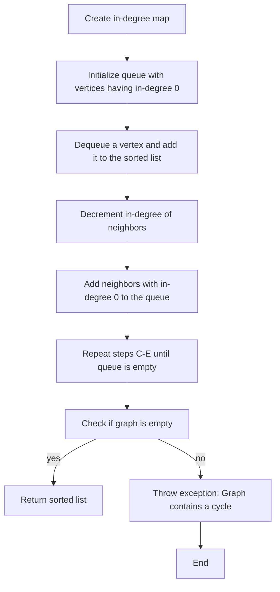

## Introduction
**Kahn's Topological Sort** is a popular algorithm used to perform a topological sort on a directed acyclic graph (DAG). It is a crucial concept in computer science, as it has numerous applications in scheduling, data processing, and compiler design. The algorithm is named after Arthur Kahn, who first introduced it in the 1960s. In this study note, we will delve into the complexity analysis of Kahn's Topological Sort with cycle detection, exploring its internal mechanics, code examples, and real-world use cases.

> **Note:** Topological sorting is a linear ordering of vertices in a DAG such that for every directed edge `u -> v`, vertex `u` comes before `v` in the ordering.

## Core Concepts
To understand Kahn's Topological Sort, we need to grasp the following core concepts:
* **Directed Acyclic Graph (DAG):** A graph with directed edges and no cycles.
* **Topological Sort:** A linear ordering of vertices in a DAG that satisfies the edge constraints.
* **In-degree:** The number of edges entering a vertex.
* **Out-degree:** The number of edges leaving a vertex.

> **Tip:** To visualize a DAG, imagine a graph with arrows representing the edges. A topological sort is like arranging the vertices in a line such that the arrows always point from left to right.

## How It Works Internally
Kahn's Topological Sort works by iteratively selecting vertices with an in-degree of 0 and removing them from the graph. The algorithm consists of the following steps:
1. Initialize an empty list to store the sorted vertices.
2. Create a queue to store vertices with an in-degree of 0.
3. While the queue is not empty, dequeue a vertex and add it to the sorted list.
4. For each neighbor of the dequeued vertex, decrement its in-degree by 1.
5. If the in-degree of a neighbor becomes 0, add it to the queue.
6. Repeat steps 3-5 until the queue is empty.
7. If the graph is not empty after the algorithm finishes, it means there is a cycle, and a topological sort is not possible.

> **Warning:** If the graph contains a cycle, the algorithm will not terminate. To detect cycles, we can keep track of the number of visited vertices and compare it to the total number of vertices.

## Code Examples
### Example 1: Basic Usage
```python
from collections import defaultdict, deque

def kahn_topological_sort(graph):
    in_degree = defaultdict(int)
    for vertex in graph:
        for neighbor in graph[vertex]:
            in_degree[neighbor] += 1
    
    queue = deque([vertex for vertex in graph if in_degree[vertex] == 0])
    sorted_vertices = []
    
    while queue:
        vertex = queue.popleft()
        sorted_vertices.append(vertex)
        
        for neighbor in graph[vertex]:
            in_degree[neighbor] -= 1
            if in_degree[neighbor] == 0:
                queue.append(neighbor)
    
    if len(sorted_vertices) != len(graph):
        raise ValueError("Graph contains a cycle")
    
    return sorted_vertices

# Example usage:
graph = {
    'A': ['B', 'C'],
    'B': ['D'],
    'C': ['D'],
    'D': []
}

print(kahn_topological_sort(graph))  # Output: ['A', 'C', 'B', 'D']
```

### Example 2: Real-World Pattern
```java
import java.util.*;

public class KahnTopologicalSort {
    public static List<String> topologicalSort(Map<String, List<String>> graph) {
        Map<String, Integer> inDegree = new HashMap<>();
        for (String vertex : graph.keySet()) {
            inDegree.put(vertex, 0);
        }
        
        for (String vertex : graph.keySet()) {
            for (String neighbor : graph.get(vertex)) {
                inDegree.put(neighbor, inDegree.get(neighbor) + 1);
            }
        }
        
        Queue<String> queue = new LinkedList<>();
        for (String vertex : graph.keySet()) {
            if (inDegree.get(vertex) == 0) {
                queue.add(vertex);
            }
        }
        
        List<String> sortedVertices = new ArrayList<>();
        
        while (!queue.isEmpty()) {
            String vertex = queue.poll();
            sortedVertices.add(vertex);
            
            for (String neighbor : graph.get(vertex)) {
                inDegree.put(neighbor, inDegree.get(neighbor) - 1);
                if (inDegree.get(neighbor) == 0) {
                    queue.add(neighbor);
                }
            }
        }
        
        if (sortedVertices.size() != graph.size()) {
            throw new RuntimeException("Graph contains a cycle");
        }
        
        return sortedVertices;
    }

    public static void main(String[] args) {
        Map<String, List<String>> graph = new HashMap<>();
        graph.put("A", Arrays.asList("B", "C"));
        graph.put("B", Arrays.asList("D"));
        graph.put("C", Arrays.asList("D"));
        graph.put("D", Arrays.asList());
        
        System.out.println(topologicalSort(graph));  // Output: [A, C, B, D]
    }
}
```

### Example 3: Advanced Usage with Cycle Detection
```cpp
#include <iostream>
#include <queue>
#include <unordered_map>
#include <vector>

std::vector<std::string> kahnTopologicalSort(const std::unordered_map<std::string, std::vector<std::string>>& graph) {
    std::unordered_map<std::string, int> inDegree;
    for (const auto& vertex : graph) {
        inDegree[vertex.first] = 0;
    }
    
    for (const auto& vertex : graph) {
        for (const auto& neighbor : vertex.second) {
            inDegree[neighbor]++;
        }
    }
    
    std::queue<std::string> queue;
    for (const auto& vertex : graph) {
        if (inDegree[vertex.first] == 0) {
            queue.push(vertex.first);
        }
    }
    
    std::vector<std::string> sortedVertices;
    
    while (!queue.empty()) {
        std::string vertex = queue.front();
        queue.pop();
        sortedVertices.push_back(vertex);
        
        for (const auto& neighbor : graph.at(vertex)) {
            inDegree[neighbor]--;
            if (inDegree[neighbor] == 0) {
                queue.push(neighbor);
            }
        }
    }
    
    if (sortedVertices.size() != graph.size()) {
        throw std::runtime_error("Graph contains a cycle");
    }
    
    return sortedVertices;
}

int main() {
    std::unordered_map<std::string, std::vector<std::string>> graph = {
        {"A", {"B", "C"}},
        {"B", {"D"}},
        {"C", {"D"}},
        {"D", {}}
    };
    
    try {
        std::vector<std::string> sortedVertices = kahnTopologicalSort(graph);
        for (const auto& vertex : sortedVertices) {
            std::cout << vertex << " ";
        }
        std::cout << std::endl;
    } catch (const std::exception& e) {
        std::cerr << e.what() << std::endl;
    }
    
    return 0;
}
```

## Visual Diagram

The diagram illustrates the step-by-step process of Kahn's Topological Sort with cycle detection. It starts by creating an in-degree map and initializing a queue with vertices having an in-degree of 0. The algorithm then dequeues a vertex, adds it to the sorted list, and decrements the in-degree of its neighbors. If a neighbor's in-degree becomes 0, it is added to the queue. The process repeats until the queue is empty. Finally, the algorithm checks if the graph is empty. If it is, the sorted list is returned; otherwise, an exception is thrown indicating that the graph contains a cycle.

## Comparison
| Approach | Time Complexity | Space Complexity | Pros | Cons | Best For |
| --- | --- | --- | --- | --- | --- |
| Kahn's Topological Sort | O(V + E) | O(V + E) | Efficient, simple to implement | May not work for graphs with cycles | DAGs, scheduling, data processing |
| DFS Topological Sort | O(V + E) | O(V + E) | Can handle graphs with cycles, more flexible | More complex to implement, may have higher overhead | Graphs with cycles, compiler design |
| Tarjan's Strongly Connected Components | O(V + E) | O(V + E) | Can handle graphs with cycles, finds strongly connected components | More complex to implement, may have higher overhead | Graphs with cycles, network analysis |
| Floyd-Warshall Algorithm | O(V^3) | O(V^2) | Can handle graphs with negative weight edges, finds shortest paths | More complex to implement, may have higher overhead | Graphs with negative weight edges, network analysis |

## Real-world Use Cases
1. **Scheduling:** Kahn's Topological Sort is used in scheduling algorithms to order tasks based on their dependencies. For example, in a manufacturing process, tasks may have dependencies on each other, and a topological sort can be used to schedule the tasks in a valid order.
2. **Data Processing:** Topological sorting is used in data processing pipelines to order data processing tasks based on their dependencies. For example, in a data warehouse, data processing tasks may have dependencies on each other, and a topological sort can be used to schedule the tasks in a valid order.
3. **Compiler Design:** Topological sorting is used in compiler design to order the compilation of modules based on their dependencies. For example, in a compiler, modules may have dependencies on each other, and a topological sort can be used to schedule the compilation of the modules in a valid order.

> **Interview:** When asked about topological sorting, be prepared to explain the concept, provide examples, and discuss the trade-offs between different approaches.

## Common Pitfalls
1. **Not checking for cycles:** Failing to check for cycles in the graph can lead to incorrect results or infinite loops.
2. **Not handling negative weight edges:** Failing to handle negative weight edges can lead to incorrect results or infinite loops.
3. **Not using a suitable data structure:** Using an unsuitable data structure, such as a linked list, can lead to inefficient performance.
4. **Not considering the graph's structure:** Failing to consider the graph's structure, such as its connectivity or sparsity, can lead to inefficient performance.

## Interview Tips
1. **Be prepared to explain the concept:** Be prepared to explain the concept of topological sorting, including its definition, applications, and trade-offs between different approaches.
2. **Provide examples:** Be prepared to provide examples of topological sorting, including its use in scheduling, data processing, and compiler design.
3. **Discuss the trade-offs:** Be prepared to discuss the trade-offs between different approaches to topological sorting, including their time and space complexity, and their suitability for different use cases.
4. **Be prepared to write code:** Be prepared to write code to implement topological sorting, including its use in a real-world scenario.

## Key Takeaways
* **Kahn's Topological Sort:** A popular algorithm for topological sorting, with a time complexity of O(V + E) and a space complexity of O(V + E).
* **Cycle detection:** An important aspect of topological sorting, as it can lead to incorrect results or infinite loops if not handled properly.
* **Data structures:** The choice of data structure can significantly impact the performance of topological sorting algorithms.
* **Graph structure:** The structure of the graph, including its connectivity and sparsity, can significantly impact the performance of topological sorting algorithms.
* **Trade-offs:** Different approaches to topological sorting have different trade-offs, including their time and space complexity, and their suitability for different use cases.
* **Real-world applications:** Topological sorting has numerous real-world applications, including scheduling, data processing, and compiler design.
* **Interview preparation:** Be prepared to explain the concept of topological sorting, provide examples, and discuss the trade-offs between different approaches.
* **Common pitfalls:** Be aware of common pitfalls, including not checking for cycles, not handling negative weight edges, and not using a suitable data structure.