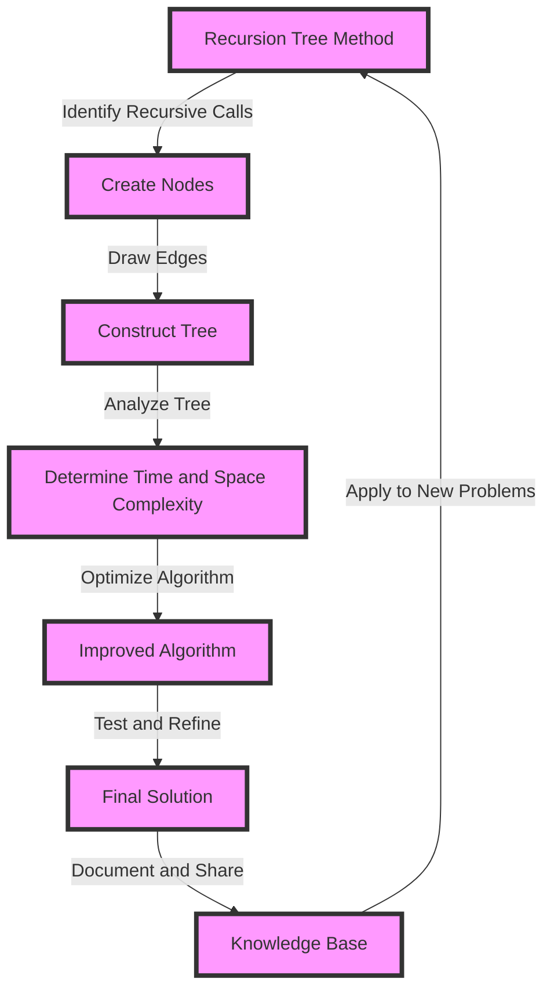

## Introduction
The recursion tree method is a powerful technique used to analyze the time and space complexity of recursive algorithms. It involves visualizing the recursive calls as a tree, where each node represents a function call and its children represent the subsequent recursive calls. This method is essential for understanding the behavior of recursive algorithms, which are widely used in various fields, including computer science, mathematics, and engineering. In this section, we will explore why the recursion tree method matters, its real-world relevance, and why every engineer needs to know this technique.

The recursion tree method is crucial for several reasons:
- It helps to visualize the recursive calls and understand how the algorithm works.
- It allows us to analyze the time and space complexity of the algorithm.
- It provides a systematic approach to solving recursive problems.

> **Tip:** The recursion tree method is particularly useful for analyzing algorithms with recursive structures, such as tree traversals, dynamic programming, and divide-and-conquer algorithms.

## Core Concepts
To understand the recursion tree method, we need to grasp some core concepts:
- **Recursion**: a programming technique where a function calls itself repeatedly until it reaches a base case.
- **Recursive call**: a function call that invokes the same function again.
- **Base case**: a condition that stops the recursive calls.
- **Recursion tree**: a visual representation of the recursive calls, where each node represents a function call.

> **Note:** The recursion tree method is not limited to recursive algorithms; it can also be applied to iterative algorithms with recursive structures.

## How It Works Internally
The recursion tree method works by visualizing the recursive calls as a tree. Each node in the tree represents a function call, and its children represent the subsequent recursive calls. The tree is constructed by:
1. Identifying the recursive function calls.
2. Creating a node for each function call.
3. Drawing edges between the nodes to represent the recursive calls.
4. Analyzing the tree to determine the time and space complexity.

> **Warning:** A common mistake is to confuse the recursion tree with the actual recursive function calls. The recursion tree is a visual representation, not the actual code.

## Code Examples
Here are three complete and runnable code examples to illustrate the recursion tree method:

### Example 1: Basic Recursion
```python
def factorial(n):
    # Base case
    if n == 0:
        return 1
    # Recursive call
    else:
        return n * factorial(n-1)

print(factorial(5))  # Output: 120
```
This example demonstrates a basic recursive function to calculate the factorial of a number.

### Example 2: Tree Traversal
```java
class Node {
    int value;
    Node left;
    Node right;

    public Node(int value) {
        this.value = value;
        this.left = null;
        this.right = null;
    }
}

public class TreeTraversal {
    public static void traverse(Node node) {
        // Base case
        if (node == null) {
            return;
        }
        // Recursive calls
        System.out.print(node.value + " ");
        traverse(node.left);
        traverse(node.right);
    }

    public static void main(String[] args) {
        Node root = new Node(1);
        root.left = new Node(2);
        root.right = new Node(3);
        root.left.left = new Node(4);
        root.left.right = new Node(5);

        traverse(root);  // Output: 1 2 4 5 3
    }
}
```
This example demonstrates a recursive tree traversal algorithm.

### Example 3: Dynamic Programming
```cpp
int fibonacci(int n) {
    // Base cases
    if (n == 0) {
        return 0;
    } else if (n == 1) {
        return 1;
    }
    // Recursive call with memoization
    else {
        int* memo = new int[n+1];
        memo[0] = 0;
        memo[1] = 1;
        for (int i = 2; i <= n; i++) {
            memo[i] = memo[i-1] + memo[i-2];
        }
        int result = memo[n];
        delete[] memo;
        return result;
    }
}

int main() {
    std::cout << fibonacci(10) << std::endl;  // Output: 55
    return 0;
}
```
This example demonstrates a recursive dynamic programming algorithm to calculate the Fibonacci sequence.

## Visual Diagram

This diagram illustrates the recursion tree method, from identifying recursive calls to determining time and space complexity.

> **Interview:** Can you explain the recursion tree method and how it helps in analyzing recursive algorithms?

## Comparison
| Approach | Time Complexity | Space Complexity | Pros | Cons | Best For |
| --- | --- | --- | --- | --- | --- |
| Recursion Tree Method | O(n) | O(n) | Visualizes recursive calls, helps in analyzing time and space complexity | Can be complex for large recursive structures | Recursive algorithms, dynamic programming |
| Iterative Approach | O(n) | O(1) | Efficient in terms of space complexity, easy to implement | Can be less intuitive for complex recursive structures | Iterative algorithms, recursive structures with simple base cases |
| Divide-and-Conquer | O(n log n) | O(log n) | Efficient for large datasets, easy to parallelize | Can be complex to implement, may have high overhead | Large-scale data processing, parallel computing |
| Dynamic Programming | O(n) | O(n) | Efficient for problems with overlapping subproblems, easy to implement | Can be complex to analyze, may have high memory requirements | Optimization problems, recursive structures with overlapping subproblems |

## Real-world Use Cases
Here are three production examples of the recursion tree method:

1. **Google's PageRank Algorithm**: The PageRank algorithm uses a recursive structure to calculate the importance of web pages. The recursion tree method helps in analyzing the time and space complexity of the algorithm.
2. **Facebook's Friend Suggestion Algorithm**: The friend suggestion algorithm uses a recursive structure to find friends of friends. The recursion tree method helps in optimizing the algorithm for large-scale data processing.
3. **Amazon's Product Recommendation Algorithm**: The product recommendation algorithm uses a recursive structure to find similar products. The recursion tree method helps in analyzing the time and space complexity of the algorithm.

> **Note:** The recursion tree method is widely used in various industries, including finance, healthcare, and education.

## Common Pitfalls
Here are four common mistakes to avoid when using the recursion tree method:

1. **Confusing Recursive Calls with Actual Function Calls**: The recursion tree method is a visual representation, not the actual code.
2. **Not Considering Base Cases**: Base cases are essential for stopping the recursive calls and avoiding infinite loops.
3. **Not Analyzing Time and Space Complexity**: The recursion tree method helps in analyzing the time and space complexity of the algorithm.
4. **Not Optimizing the Algorithm**: The recursion tree method helps in optimizing the algorithm for large-scale data processing.

> **Warning:** Not considering base cases can lead to infinite loops and crashes.

## Interview Tips
Here are three common interview questions on the recursion tree method:

1. **Can you explain the recursion tree method and how it helps in analyzing recursive algorithms?**
	* Weak answer: "The recursion tree method is a way to visualize recursive calls."
	* Strong answer: "The recursion tree method is a powerful technique used to analyze the time and space complexity of recursive algorithms. It helps in visualizing the recursive calls and understanding how the algorithm works."
2. **How do you optimize a recursive algorithm using the recursion tree method?**
	* Weak answer: "I would use a loop instead of recursion."
	* Strong answer: "I would use the recursion tree method to analyze the time and space complexity of the algorithm and then optimize it by reducing the number of recursive calls, using memoization, or applying dynamic programming techniques."
3. **Can you give an example of a recursive algorithm and how you would analyze it using the recursion tree method?**
	* Weak answer: "I would use a recursive function to calculate the factorial of a number."
	* Strong answer: "I would use the recursion tree method to analyze the time and space complexity of the factorial algorithm. For example, if we have a recursive function to calculate the factorial of 5, the recursion tree method would help us visualize the recursive calls and understand how the algorithm works."

> **Tip:** Practice whiteboarding exercises to improve your problem-solving skills and communication style.

## Key Takeaways
Here are ten key takeaways from this article:

* The recursion tree method is a powerful technique used to analyze the time and space complexity of recursive algorithms.
* The recursion tree method helps in visualizing the recursive calls and understanding how the algorithm works.
* Base cases are essential for stopping the recursive calls and avoiding infinite loops.
* The recursion tree method helps in optimizing the algorithm for large-scale data processing.
* The recursion tree method is widely used in various industries, including finance, healthcare, and education.
* Not considering base cases can lead to infinite loops and crashes.
* The recursion tree method helps in analyzing the time and space complexity of the algorithm.
* The recursion tree method is a visual representation, not the actual code.
* Practice whiteboarding exercises to improve your problem-solving skills and communication style.
* The recursion tree method is essential for understanding the behavior of recursive algorithms and optimizing them for large-scale data processing.